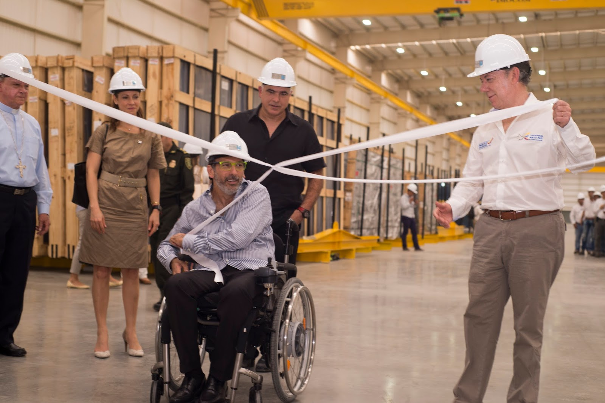
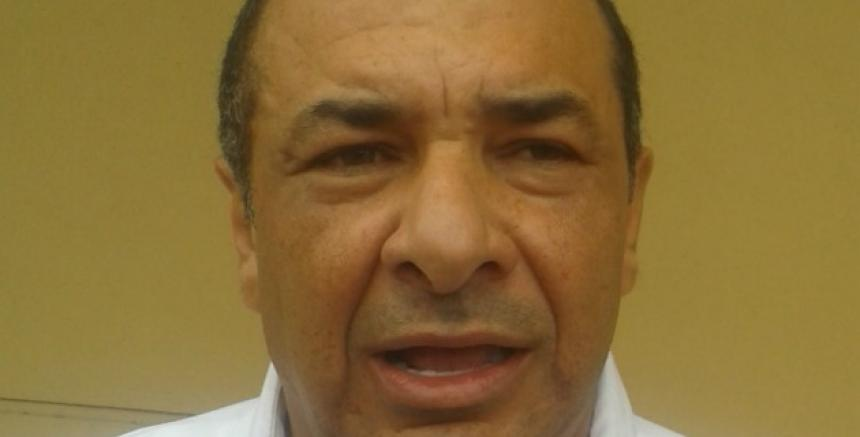
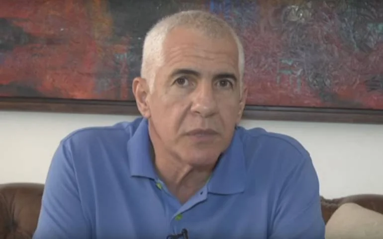
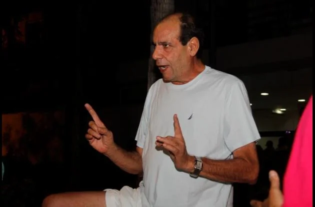

*   **_Dos pesos pesados entrarían a disputarse el alumbrado público: Hilsaca y "Yuyo" Daes de Barranquilla._**
*   **_William Murra, el "Monito" Villalba, Jairo Ghysais y William Arabia temen que le quiten la teta del alumbrado público._**

\[caption id="attachment\_5932" align="aligncenter" width="853"\] **Yuyo Daes**, fue uno de los aliados de **Juan Manuel Santos** en la Costa Caribe. Su empresa hace parte de la concesión de alumbrado público de Barranquilla. Cortesía.\[/caption\] Con la convocatoria para adjudicar una consultoría especializada (proceso CM-003-2018) que realizará los **estudios previos para seleccionar la mejor alternativa**, cuyo valor es  **$611 millones**, oficialmente comenzó la puja para quedarse con el apetitoso contrato de concesión del alumbrado público de Cartagena que actualmente disfrutan los William: **William Arabia**, como concesionario, y **William Murra** como interventor. Pero también está José "el Monito" Villalba (SOS, empresa de vigilancia) y Jairo Ghysais, de la Bomba de El Amparo. **Es una teta que vienen chupando desde hace casi 20 años**, mientras los cartageneros debemos padecer un mal servicio. En la pelea por la concesión podrían entrar **Alfonso Hilsaca** y su combo bravo, por un lado; y por el otro, William Vélez (financista de Germán Vargas), los Hermanos Daes (_Yuyo_ y Cristian) y los testaferros de **Alejandro Char**, quienes tienen la concesión del alumbrado público de Barranquilla adjudicado por el mismo alcalde Alejandro Char a través de la empresa mixta **Barranquilla Capital de Luz S. A. S**. **La historia oculta** \[caption id="attachment\_5933" align="aligncenter" width="801"\] **William Arabia,** ingeniero eléctrico**, y "el Monito" Villalba**, se han quedado con la mayoría de las acciones de Iluminemos. Cortesía.\[/caption\] En el gobierno del alcalde **Nicolás Curi Vergara** (1999), el distrito de Cartagena le adjudicó el contrato de concesión a la **Unión Temporal I.S.M S.A y Electroconstrucción**, que posteriormente se transformó legalmente como **Iluminemos**. En ese entonces, la Contraloría General de la República (CGR) inició una investigación  contra la administración de Curi por favorecimiento ilícito a la unión temporal que finalmente se llevó el millonario contrato. **Ese hecho fue cierto.** Tengo en mi poder un expediente privado (85 folios) , incluso con un **acuerdo (original) a mano alzada,** de los porcentajes que cada una de las partes intervinientes recibirían del contrato de concesión a través de terceras personas que legalmente aparecerían ante el Distrito, y de cómo se concibió su interventoría. También el **modus operandi de la forma de pago** que los socios de los concesionarios debían hacerle a los socios ocultos. Esto es, mediante contratos ficticios de suministro de gasolina, por ejemplo. Este modus operandi se realiza actualmente. **¡A oídos de la fiscalía!** Existe una pelea interna de socios ocultos del contrato de concesión del alumbrado público, porque, al parecer, **Arabia, Ghysais y "el monito" se saltaron a uno de los socios originales** y no le han pagado el 10{704a511f2c7b1715a9b99b10d413e010ac861c4f21e3acd81b5c5da7f8883ef6} que le correspondía por su participación en el mismo. El socio burlado, hizo el estudio técnico (consultoría), lo cual facilitó que los futuros concesionarios se ganaran la licitación.   Ghysais traicionó a otro socio oculto con el 20{704a511f2c7b1715a9b99b10d413e010ac861c4f21e3acd81b5c5da7f8883ef6}. Esta historia la desarrollaremos con base en el expediente que reposa en mi poder. **En la historia oculta** de la primera concesión del alumbrado público aparecen nombres como William Montes Medina (exsenador conservador), Javier Curi Osorio (concejal liberal), José **"el monito"** Villalba (dueño de la Bomba del Amparo), William Arabia, William Murra y otros actores de menor relevancia en el cocinado contractual pero de suma importancia para la consecución de la concesión. **La puja de hoy** \[caption id="attachment\_5934" align="aligncenter" width="770"\] Las empresas de **Alfonso Hilsaca** podrían entrar en la puja por el alumbrado público de Cartagena. Tiene 38 concesiones, y una más no le caería mal. algunos están tentando a Hilsaca para que se meta en el negocio. ¿Qué decidirá? Foto cortesía Caracol.\[/caption\] De acuerdo a la experiencia que se tiene en estas clases de licitaciones, se seguirá la misma ruta de 1999, año en el cual le entregaron el contrato a **Iluminemos**. **Fue la única concesión que Alfonso Hilsaca no se ganó en Bolívar**, pues no le interesó y no participó directamente. Sus cuentas no le dieron y lo consideró un mal negocio, cosa distinta a los contratos de concesión que tiene en más de 20 municipios de Bolívar, los cuales se los han prorrogados fácilmente. Si las empresas de los Hilsaca quieren participar en esta contienda que ya se anunció con la contratación de la consultoría, se las tendrán que ver con los empresarios de Barranquilla que desde hace rato están interesados en el alumbrado público de Cartagena, puesto que **había la intención de firmar un convenio interadministrativo con la empresa mixta Alumbrado Público de Barranquilla S.A.S**. Si los de Barranquilla se quedan con el negocio de Cartagena, tanto Murra como Arabia se quedarían **sin la teta** que vienen disfrutando. Al respecto, William Murra puso el grito en el cielo, y le advirtió a la alcaldesa encargada, **Yolanda Wong** y al secretario de Planeación, **Iván Castro**, lo siguiente:

> _"Es importante recordarles que para el mes de marzo pasado, **nosotros alertamos** al alcalde del momento para dejarle conocer que la Secretaría General y la Unidad de Contratación **estuvieron calladamente haciendo gestión para suscribir un convenio interadministrativo** con la sociedad de economía mixta de Barranquilla pero la suscripción (del contrato) se demoró porque Planeación Distrital no se prestó para quitarle recursos a otros asuntos de interés y transferirlos a la Secretaría General para que pudiese firmar el convenio." (Lo subrayado es del periodista)._

\[caption id="attachment\_5936" align="aligncenter" width="630"\] **William Murra** es un fogoso integrante de ACIEM y, al mismo tiempo, contratista estatal. Presentó sendas cartas a la alcaldesa encargada, Yolanda Wong, y al secretario de Planeación Distrital. Le preocupa que el Distrito haga convenio con **Barranquilla Capital Luz.**\[/caption\] Pero el temor de Murra es que lo dejen por fuera, porque no ha dicho **_esta boca es mía_** para que los actuales concesionarios presten un buen servicio. El único que puede dar la pelea para que el contrato se quede en Cartagena es la firma de los hijos de **Alfonso Hilsaca, AGM Desarrollos S.A.S**. Las 38 concesiones de los Hilsaca suman la bicoca de $1.5 billones. En este sentido, tanto Arabia, "el Monito" Villalba como Murra tendrían que aliarse con Hilsaca para hacerle frente a los poderosos de Barranquilla. Es decir, ya no estamos como hace 20 años donde el negocio era incipiente y podían crear fácilmente una película para quedarse con el contrato de concesión como en 1999 cuando el consorcio ISM S.A. y Electroconstrucción Ltda., ganó el contrato de concesión por 20 años para el manejo del alumbrado público, y después entró Iluminemos que actualmente tiene el servicio. Expliquemos contextualmente la situación política de aquel momento. En esa época William Montes tenía poder político, porque era el varón electoral del partido conservador, esposo de la hija mimada de Curi (Martha) y el primer aliado de la Gata llevado por **José Manuel Barraza Salcedo**, el cacique conservador de la época. Aunque la **_Gata_** se resintió porque Montes no apoyó a su hijo **Héctor Julio Alfonso**, cabeza de lista del partido conservador de Bolívar a la Cámara de Representantes, las relaciones las compusieron posteriormente. William Montes prefirió hacer alianza con **Pedrito Pereira**. La condena contra Montes por paramilitarismo, le hubiese agravado la situación a **Héctor Julio Alfonso** si hubiese sido su fórmula, en ese entonces, a la cámara. Hoy, Alfonso se encuentra haciendo como _gato bocarriba_ para demostrar que es inocente del delito de concierto para delinquir (paramilitar) por el cual la Corte Suprema de Justicia lo mantiene encarcelado. Regresemos a lo que sucede hoy. Si Hilsaca entra en la puja tendría que enfrentarse a  pesos pesados como **Barranquilla Capital de Luz S. A. S**., integrada por Eléctricas de Medellín Ingeniera y Servicios S.A.S; Alutrafic LED S.A.S; Mega Proyectos de Iluminaciones de Colombia S.A.S.; Iluminación de Villavicencio S.A.S. y Celsa S.A.S. **¿Quienes están detrás de estas empresas?** El financiador de Germán vargas, William Vélez, Cristian y _Yuyo_ Daes (archicontratista de Barranquilla y Atlántico), pero también el grupo económico de los Char, específicamente de Alejandro Char. Estos empresarios desplazaron al también poderoso y pionero del negocio, **Remberto Merlano**, ingeniero eléctrico, dueño de la firma Diselecsa. **¿Qué le conviene a los cartageneros?** **Cartagena necesita un alumbrado público con tecnología de punta**, bombillos LED, consuman menos energía, sea amigable con el medioambiente y contribuya a combatir la inseguridad ciudadana que es muy complicada por estos años. La ciudadanía paga unos impuestos especialmente para alumbrado público y necesita ser retribuida con un excelente servicio. Por esta razón, el artículo 351 de la ley 1819, dice:

> _"Los municipios y distritos deberán realizar un **estudio técnico** de referencia de determinación de costos de la prestación del servicio alumbrado público, de conformidad con la metodología para la determinación de costos por el Ministerio de Minas y Energía, o la entidad que delegue el Ministerio"_.

Ese artículo fue desarrollado por el decreto 943 del 30 de mayo de 2018. El cubrimiento periodístico a la adjudicación del contrato de concesión, **lo haremos desde la perspectiva de la función de control social establecido por el artículo 12 de ese decreto**. Se inició el proceso precontractual mediante el cual el distrito de Cartagena adjudicará una "_consultoría especializada para realizar los análisis, técnicos, legales y financieros para la determinación y estructuración de la alternativa más favorable para la prestación de servicio de alumbrado público en el distrito de Cartagena de Indias"_, hecho que mantiene exaltado a William Murra, actual interventor del alumbrado público, y probablemente también al concesionario William Arabia y "el Monito" Villalba, condueños de Iluminemos. A todas estas uno se pregunta, ¿cuál es el papel de William Montes en el nuevo proceso? La pregunta es válida porque el poder específico en la alcaldía lo tienen los conservadores, gozan del apoyo de la secretaria general del partido y tienen vicepresidenta. Los William están aferrados a la teta del alumbrado público, p**ero podrían quedar como _terneros huérfanos_ si los pesos pesados de Barranquilla se quedan con el negocio de Cartagena. Los peces grandes se comen a los pequeños.** Es la ley darwiniana**.**