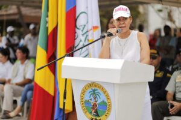

\[caption id="attachment\_6258" align="aligncenter" width="1037"\] **Se fue Yolanda Wong del Distrito, mi Chinita hermosa**, y nos dejó la cloaca de Edurbe. ¡Goodbye!\[/caption\] **¡Adiós, Yolanda!** Se fue la secretaria del Interior del distrito de Cartagena y exalcaldesa encargada, **Yolanda Wong Baldiris.** En la tarde del 25 de septiembre de 2018, la popular y simpática **«China»** se fue al edificio Portus del barrio Manga y recogió sus motetes personales, después de reunirse a puerta cerrada con Pedrito Pereira Caballero . **El alcalde (e)** le había pedido la renuncia. ¡Se va! Y se fue Yolanda Wong. Ella dirá que se va para España a un mes sabático para concluir sus estudios de posgrado. También dirá que se tomará un descanso y —si la Procuraduría y la Fiscalía la dejan— será candidata a la gobernación de Bolívar y un hueso duro de roer para Hernando Padauí y demás candidatos. Mientras eso sucedía, ayer **causó un revuelo político la publicación del primer informe de investigación** en el nuevo portal periodístico **voxpopuli.digital** (está en construcción) sobre la contratación de Edurbe: [El cuarteto de la tramoya de Edurbe Cartagena: Juancho García, Javier Cáceres, Toño Diaz y Yolanda Wong (I)](/articulos/mi-ciudad/cartagena/el-cuarteto-de-la-tramoya-de-edurbe-cartagena-juancho-garcia-javier-caceres-tono-diaz-y-yolanda-wong-i/ "El cuarteto de la tramoya de Edurbe Cartagena: Juancho García, Javier Cáceres, Toño Diaz y Yolanda Wong (I)") El artículo (puedes leerlo también en [luciotorres.co](/articulos/) ) se hizo viral en las redes sociales. El comentario en los pasillos era si Yolanda Wong se iba o se quedaba. A las 5 p.m. se regó la noticia de que Pedrito Caballero le había aceptado la renuncia. La querida **«China»** pretendía estar hasta el 25 de octubre, fecha en la cual no quedaría inhabilitada para poder aspirar, pero su retiro se adelantó por los nuevos hechos que salieron a la luz pública. En la secretaría del Interior fue nombrado José Carlos Puello Rubio y como secretaria de despacho Karen Fernández en reemplazo de Viviana Malo Lecompte. También salió Gabriela Bustamante, de Talento Humano. Con la salida de Wong, vendrá una cascada de renuncias. Detrás vendrán Bernardo Pardo, gerente general de Edurbe y otros funcionarios de esta empresa que irónicamente había sido creada para el mantenimiento de caños y lagunas de Bolívar, y que hoy está sumida en una **devastadora crisis político-administrativa.** Una fuente de entero crédito le dijo a este reportero que Pedrito Pereira —de conformidad con el primer principio de su administración, **la eficiencia y transparencia de la gestión administrativa**— su deber es sanear de inmediato una de las cloacas del aparato administrativo de Cartagena, **Edurbe**. Si bien es cierto que los procesos contractuales que están en la etapa de ejecución no se podrían cambiar unilateralmente, **sí se puede ejercer una estricta supervisión e interventoría especial** de todos los contratos dudosos que firmaron **Carlos Bula Dumar** y **Bernardo Pardo Ramos**, quienes llegaron a esa entidad con el beneplácito de dos senadores condenados por la **Corte Suprema de Justicia** —uno por corrupto (se robó la plata de Telecartagena) y otro por concierto para delinquir (se unió a los paramilitares para elegirse senador)—: **Juan García Romero y Javier Cáceres Leal**. Pese a pagar cárcel, siguen vigentes en el poder público de la ciudad y del departamento. **¿Cómo unos ex presidiarios manejan una entidad de tanta responsabilidad?** Es el reflejo de la moralidad pública que impera en la sociedad cartagenera de la cual no somos ajeno. **Contratos de dudosa ortografía** \[caption id="attachment\_6260" align="aligncenter" width="933"\] **Bernardo Pardo Ramos**, le dice papá a **Javier Cáceres Leal**. De hecho, es su papá político, ya que llegó a ese cargo gracias al expresidente del senado, y a la bendición de Juancho García, y Sergio Londoño, no tuvo «los cojones» para no nombrarlo. Cortesía Edurbe.\[/caption\] Pero no solo son los contratos dudosos que ha firmado Edurbe. No. Son 22 convenios interadministrativos del Distrito—Edurbe que merecen ser investigados por el periodista. El cuento es este: el distrito se despoja de su facultad de contratar y se la delega a **Edurbe con el propósito de crear una tramoya legal para burlarse de la ley 80/94** que regula la contratación pública y obliga al Estado para que los procesos sean transparentes, participativos, objetivos y económicos. Al trasladar la contratación a Edurbe, que es una entidad de derecho privado y no público, el paso de la licitación pública se obvia, y se conviene directamente con el ente ejecutor y éste, a su vez, contrata con los ejecutores de las obras. No obstante, el hecho de que una entidad estatal de derecho privado ejecute sus obras para cumplir con su misión comercial e industrial, no significa que tenga **patente de corso** para hacer lo que le dé la gana. Debe hacerse un proceso basado en los mismos principios que rigen para la contratación pública, aunque los mecanismos sean distintos. También **se debe descartar la estigmatización de los convenios interadministrativos**, ya que éstos manejados transparentemente **hacen de la administración publica una acción eficiente y eficaz**. En otras palabras, **Edurbe está obligada a que sus contratos sean adjudicados con transparencia,** participación democrática, objetividad en la selección de la propuesta y economía. De manera que los contratos no pueden ser onerosos para el Distrito ni para la misma Edurbe. Esto es, que si la empresa obtiene el 5{704a511f2c7b1715a9b99b10d413e010ac861c4f21e3acd81b5c5da7f8883ef6} del valor de los convenios, como está reglado, deben ser destinados para el funcionamiento de la infraestructura administrativa de la entidad y no tendría ningún problema financiero ni tampoco administrativo. **La causa de su debacle es la política administrativa que cada alcalde de turno implanta a través de las fichas que colocan en su administración instrumentalizando a Edurbe para sus fechorías y evasión de la ley de contratación pública**. Esta situación ha conllevado a que los últimos gerentes de Edurbe han tenido problemas con la Contraloría, la Fiscalía y la Procuraduría. Por ejemplo, **Augusto Mainero, Ramón Exposito, Carlos Bula Dumar y Bernardo Pardo Ramos** no se salvarán de tener que desfilar por la Fiscalía, la Procuraduría y la Contraloría, una vez salgan de la gerencia de Edurbe, la cual está cantada para los próximos días, **apenas se realice la reunión de la junta directiva** que estará presidida por el alcalde Pedrito Pereira Caballero que tiene el 84{704a511f2c7b1715a9b99b10d413e010ac861c4f21e3acd81b5c5da7f8883ef6} de la representatividad. **Una oportunidad para Edurbe** Todos los alcaldes, sin excepción, usaron a Edurbe para el desangre. **Judith Pinedo y Dionisio Vélez** fueron los más aprovechados. Entre 2008 y 2011, el Distrito firmó 142  convenios interadministrativos para la ejecución de 337 obras por valor superior a los $119.548 millones. Pero proporcionalmente, **Yolanda Wong batió el récord, porque en los 4 meses de su administración, el monto llegó a más de $71 mil millones.** Es decir, que si se queda un mes más, podría haberse elevado a más de $100 mil millones, ya que los contratos firmados por Edurbe tienen un **período de ejecución**, cuyos rangos son 30, 45, 60, 90 y 120 días. ¿Por qué? porque debían ser ejecutados y pagados antes del 31 de diciembre de 2018. Y para esto se inventaron la modalidad de pago por porcentaje de ejecución. Quiere decir que si antes del 31 de diciembre de 2018 ejecutan las obras, se le paga de inmediato. Aparentemente esta modalidad premia la eficiencia, pero sin _**hilar tan delgadito**_, se podrá encontrar que lo hicieron con su hecho pensado: **quedarse con todo el dinero antes del cierre del año fiscal colombiano.** **La Empresa de desarrollo urbano de Bolívar SA (EDURBE SA) es una sociedad de tipo industrial y comercial del Estado con activos que podrían tener un avalúo comercial de $300 mil millones** —según sus balances financieros— y podría captar recursos tres o cuatro veces más que sus activos, esto es, $1.2 billones, tal como lo hacen la empresas similares de Medellín, Bogotá o Cali, cuyos dividendos representarían un ingreso de libre destinación que Cartagena necesita para superar las necesidades sociales apremiantes. O sea, que Edurbe en vez de ser una entidad que desangre el presupuesto distrital, podría ser la «_**joya de la corona»**_ de la economía cartagenera y de fuente consistente para la inversión pública y el robustecimiento presupuestal. **Edurbe es una cloaca**.¿Quién lo duda? Pedrito Pereira podría crear los cimientos para que la empresa sea la «**joya de la corona» y no una cloaca**, pero no a la manera como ha sido Cartagena para los gobernantes «cachacos» que en realidad han gobernado durante este período de inestabilidad, período inaugurado con la elección de un hombre popular y **querendón** como **Campo Elías Terán**, pero incapaz e inocente en las lides políticas y administrativas. **Pedrito Pereria tiene la «sartén por el mango» para que efectivamente Edurbe pase de ser una cloaca abierta a ser la «joya de la Corona».** Pero para que inicie este proceso, debe colocar como gerente general en Edurbe a alguien capaz que obre con autonomía, eficiencia y transparencia. **Si yo estuviera en el lugar de Pedrito Pereira,** **haría de la crisis de Edurbe una oportunidad para que este sueño se haga realidad**. ¿Qué se necesita? ¡Independencia y cojones! Dos principios que le faltan a nuestros gobernantes.