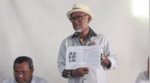
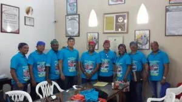

\[caption id="attachment\_6275" align="aligncenter" width="1131"\] **Pedro Herrera, Dellys Puerta y Gabriel Carrasquilla Vega** (atrás), serían los protagonistas de un acuerdo que reuniría una fuerza de 7 directivos para hacer mayoría. El MOIR, de Medardo Hernández, se quedaría por fuera.\[/caption\] **«La dictadura sindical»** del Movimiento Independiente y Revolucionario—**MOIR,** una forma de **socialimperialismo sindical**, ¡no va más! Los escrutinios electorales dados a conocer en la noche del miércoles 26 de septiembre de 2018 —5 días después de las elecciones de junta directiva del **Sindicato Único de Educadores de Bolívar—SUDEB,** filial de FECODE— no solo confirmaron los pronósticos sino que nadie sospechó que la derrota iba a ser estruendosa. La cabeza de playa de la «dictadura», **Medardo Hernández Baldiris,** fue relegado al tercer lugar y duplicado en votación por Pedro Herrera Céspedes, incluso, le ganó **Gabriel Carrasquilla Vega** de la Unidad Democrática. Como se demoraron tanto para los escrutinios —pareciéndose a las elecciones de la antigua Unión Soviética de la época estalinista— los docentes de base y las demás fuerzas políticas temieron un **chocorazo electoral**, propio de las dictaduras de izquierda o de derecha. Con el fin de exigir transparencia, las bases sindicales tenían previsto realizar hoy un mitin, ya que se enteraron que **Medardo Hernández se resistía a aceptar los resultados de su derrota** y había pedido que fueran confirmados por el Tribunal de Garantía Electoral donde Tribuna Magisterial del Moir tiene mayoría y es presidido por **Alfonso Arce**, un docente que ya debería estar retirado del magisterio para disfrutar su **triple pensión**. **Medardo, «como gato bocarriba»** **¿Puede Medardo Hernández, actual presidente del SUDEB, armar un chocorazo?** Aunque muchos docentes lo creen, no hay ninguna posibilidad que lo haga si se sigue la ruta democrática de las elecciones. Una vez conocido los escrutinios, el siguiente paso es definir los cargos según el cociente que cada plancha recibió. Por ejemplo, la plancha liderada por Pedro Herrera obtuvo la máxima votación (1.617 votos), y según el cociente electoral saca tres. El SUDEB quedó conformado por 13 directivos, del cual los contrarios del MOIR tienen la mayoría calificada que son 7. Es más, Tribuna Magisterial pierde la fiscalía, porque ésta quedará en manos de **Gabriel Carrasquilla**, segundo en votación. Hernández Baldiris **busca 36 votos en Turbaco** que, según él, no le aparecen en su cuenta. Por esta razón quiere ganar tiempo antes que el **Tribunal de Garantía Electoral** haga la declaración oficial de los resultados. Si le aparecen esos votos, por arte de magia sería fiscal. Pero los resultados fueron presentados ayer por Alfonso Arce en reunión de directivos. **Lo curioso es que en las elecciones del 2013**, cuando Tribuna Magisterial (MOIR) dominaba con amplia mayoría, los resultados los presentaron en menos de 24 horas. En esta oportunidad han pasado 5 días «mamando gallo» para preparar un posible _**chocorazo,**_ del cual teme la mayoría magisterial. Dicho de otro modo, el **socialimperialismo sindical** fue derrotado estruendosamente. Se quedaron sin el pan y sin el queso. No tendrán presidencia ni fiscalía, tampoco le darán la tesorería con más de **$2.600 millones anuales** en sus arcas, las cuales manejaba Medardo Hernández a sus anchas panchas. **También se le acabará la teta de la Cooperativa del Magisterio—COACEDED ($169 mil  millones en activos corrientes**, según el último balance firmado por su representante legal, **Álvaro Jiménez Pérez**, y su revisor fiscal, **Felix García Diz**). Esto le ha servido al MOIR como mecanismo de **clientelismo electoral** y tráfico de influencia para otorgar créditos a los maestros. Con esas dos protuberantes tetas (SUDEB Y COACEDED) **el socialimperialismo sindical** se mantenía, y se daba el lujo de rotarse los cargos directivos periódicamente, cada 14 años. Por ejemplo, **Medardo Hernández** reemplazó a **Luis Carlos Fuentes,** quien se pensionó, y éste había reemplazado a **Luis Alberto Mendoza**, (aliado del exdirector de Comfamiliar, **Felipe Mendoza**) quien se hizo elegir presidente de la CUT. En ese entonces, el MOIR controlaba al Sudeb y a la Cut, entonces eran tres tetas carnudas de la cual chupaban, así como la loba amamantaba a Rómulo y Remo. \[caption id="attachment\_6276" align="aligncenter" width="732"\] El presidente del Sudeb, Medardo Hernández, **todavía no lo puede creer**. De los 15 mil profesores, solo le votaron 839. **Luis Alberto Mendoza**, quien aparece sentado, tampoco lo cree.\[/caption\] Dentro del sindicalismo magisterial, es histórico este resultado electoral. S**e acabó un período imperial del MOIR de más de 35 años.** Sus lideres se han envejecido atornillados en sus cargos en medio de la hojarasca del poder sindical sin haber formado las generaciones venideras del liderazgo social. Así como se envejecieron biológicamente, también envejecieron sus ideas, sus métodos sindicales y sus posturas. **Luis Carlos Fuentes**, el eterno presidente del SUDEB, se pensionó en su ley sin volver a percibir el olor a tiza. **Arnulfo Arce** se quería hacerse reelegir para disfrutar su tripleta cuando cumpliera 70 años. Debió pensionarse el año pasado y no lo ha hecho. **Medardo Hernández Baldiris,** como si fuera el general del Otoño del Patriarca**, quedó sin pelo y con una barba de chivo blancuzca que revela su vejez**. ¡Se acabó! El imperio terminó. ¡Regresarán a trabajar! No hay nada que hacer. **No habrá chocorazo**, como temen los docentes noveles, los primíparos, que nunca habían asistido a una jornada electoral democrática como la que sucedió el pasado 21 de septiembre de 2018. Es una fecha histórica para el magisterio, porque se libera de una dictadura burocrática que ya había perdido el horizonte de la lucha magisterial. \[caption id="attachment\_6278" align="aligncenter" width="808"\] La directiva del Sudeb disfrazada para celebrar las fiestas de la independencia. La mayoría fue reelegida.\[/caption\] **Si yo fuera Medardo Hernández, renunciaría a la directiva del SUDEB**. Por dignidad, y, sobre todo, porque los viejos debemos darle paso a los nuevos, y no se entiende la vejez desde el punto de vista biológico sino (es lo más importante) la juventud de las ideas, de la mente y del espíritu. «**_Medardo Hernández, tu puedes ayudar a formar a una nueva generación; para hacerlo, debes dotarte de nuevas ideas»_**, le podría decir su consejero espiritual, si es que lo tiene. Emancipación Magisterial, de Pedro Herrera, una escisión de Unidad Democrática, alcanzó la mayor votación de todas las planchas. Saca tres directivos de los 13. S**i bien el Moir logró 6 con sus aliados, no le alcanzará para hacer mayoría**. Los otros son del Polo Social Unido; Colectivo Magisterial; Renovación Magisterial y Sindical y Nueva Alternativa Magisterial. La suerte está echada para el Moir y Medardo Hernández. **Vendrá un nuevo ciclo en la historia del SUDEB**, sindicato que desde su creación en 1935, ha librado grandes batallas por los derechos de los maestros del país. Recordaremos a líderes como **Olguita Villegas** o **Fermín Berrío** (cuando era ADEMBOL) que en los años 70 libraron duras tareas sindicales a favor de los maestros cuando **«las gallinas de arriba le echaban flores a las de abajo»**, cuando el maestro era un apóstol de la docencia y asistía a clases pese a que no le pagaban. Su gran responsabilidad era con los hijos de obreros, campesinos y empobrecidos del país que solo podían ir a la escuela pública. Era la época en que sus hijos eran estudiantes de la escuela pública. Hoy, los docentes matriculan a sus hijos en colegios privados para clase media. Sin embargo, si Pedro Herrera, de Emancipación Magisterial, hace acuerdo con Medardo Hernández, todo volverá a lo mismo. ¿Por qué? **Emancipación Magisterial**, que tiene tres directivos, sí se une al MOIR, que tiene 6, harían mayoría absoluta, y los otros 4 serían convidados de piedra. Pero Pedro Herrera y Emancipación Magisterial  perderían la gran oportunidad de su vida de transformar el sindicalismo y renovar su dirección. **¿Qué puede más, la gloria de trascender a la historia o hundirse por pequeños privilegios materiales que son líquidos y efímeros?** Las bases magisteriales considerarían un **acuerdo Herrera—Hernández** un salto al vacío del magisterio bolivarense y un asalto a la voluntad de transformación que se expresó el pasado 21 de septiembre de 2018. **Si, la suerte está echada.** Pedro Herrera tiene el bastón de mando, tiene la presidencia. En sus manos y en las de ANUAR FAJARDO y JUANA FRANCO, sus compañeros de plancha elegidos, quedará el futuro del SUDEB. **Avanzan o retroceden. No hay punto medio.** O se alían al sindicato del pasado o se transforman y renuevan la dirección de uno de los sindicatos de mayor historia, no solo de Bolívar, sino del país. Pedro Herrera no podría ser inferior al mandato de la base magisterial: ¡cambio!

!function(e,t,n,s){var i="InfogramEmbeds",o=e.getElementsByTagName(t)\[0\],d=/^http:/.test(e.location)?"http:":"https:";if(/^\\/{2}/.test(s)&&(s=d+s),window\[i\]&&window\[i\].initialized)window\[i\].process&&window\[i\].process();else if(!e.getElementById(n)){var a=e.createElement(t);a.async=1,a.id=n,a.src=s,o.parentNode.insertBefore(a,o)}}(document,"script","infogram-async","/articulos/js/dist/embed-loader-min.js");

[SUDEB](https://infogram.com/3420ca15-7953-481a-8c0c-10cb761e0bda) [Infogram](https://infogram.com)