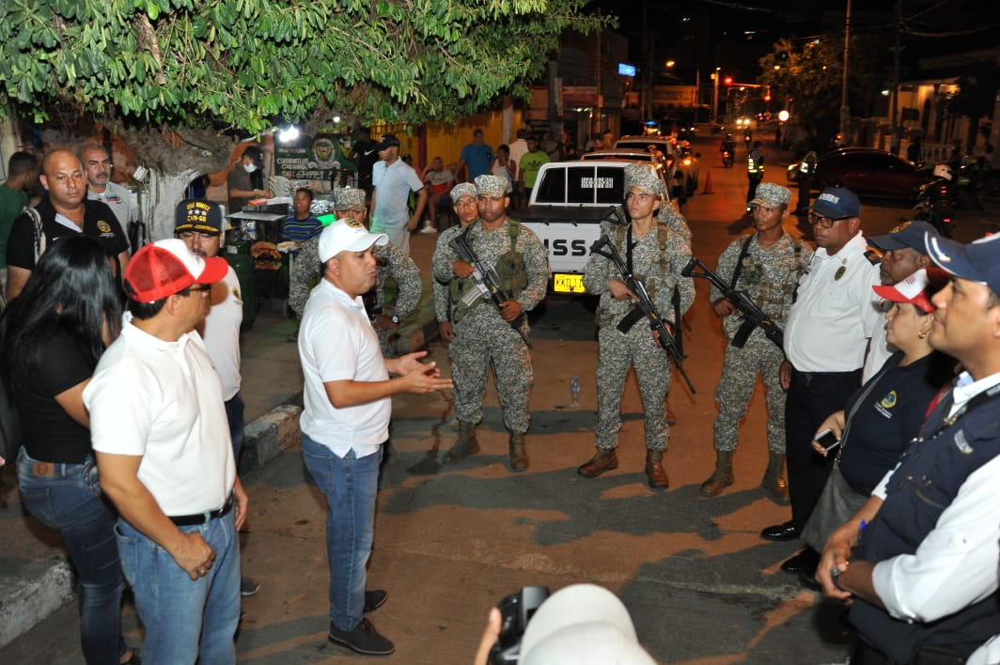
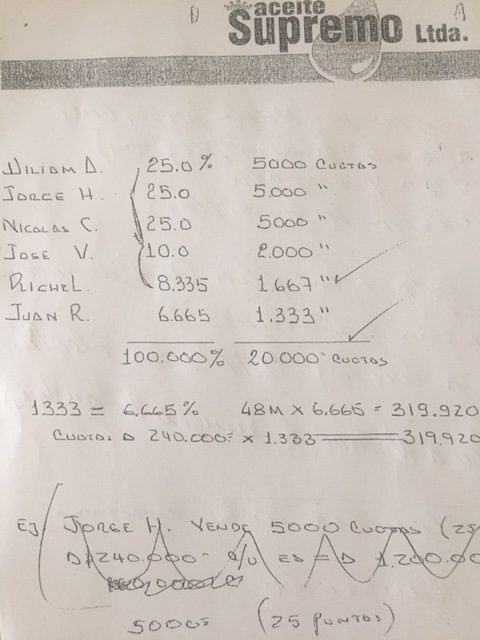
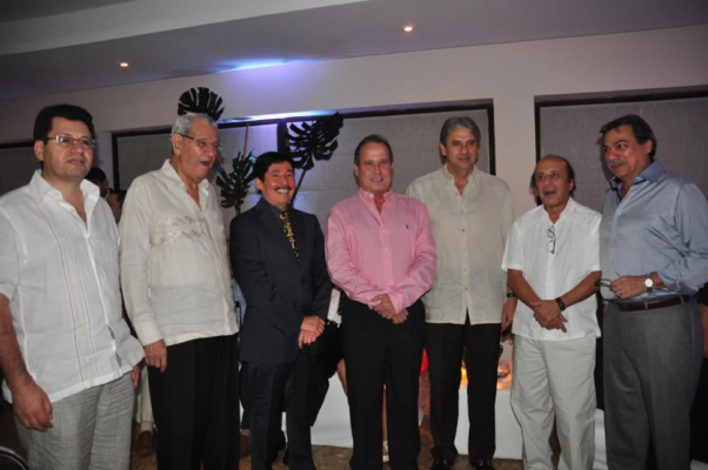

*Pedrito Pereira patrullando los barrios más allá de las murallas. El caso del alumbrado público se lo ha dejado al Jefe de Jurídica, Jorge Camilo Carrillo. Cortesía prensa alcaldía de Cartagena. *

El fraude del alumbrado público comenzó con **Jorge Carrillo Castro** —asesinado por orden de **«Juancho Dique»** uno de los jefes de los _**escuadrones de la muerte**_ y padre del actual jefe de Jurídica del Distrito de Cartagena de Indias, **Jorge Camilo Carrillo**— había sido designado por los Curi para llevar a cabo el fraude de la concesión del alumbrado público. **El 16 de octubre de 1998** fue nombrado por Curi como alcalde (e) y el 27 del mismo mes firmó el contrato de concesión No 9-1333889 con **Guillermo**  ****«el Gordo**» Molina Roa,** quien representó la unión temporal ISMSA y Electroconstrucciones Ltda.

Carrillo Castro, fue dirigente de la Juventud Comunista (JUCO) hasta 1981. Fue un líder estudiantil de gran capacidad. Perteneció a la generación de **_Jesús Santrich, Simón Trinidad, Pepe Antequera y Martín Caballero_**, quienes fueron lideres de la Juco. Cuando se graduó de Derecho y Ciencias Políticas acompañó a Panizza en la campaña por la alcaldía de Cartagena. Después ingresó a las filas de David Turbay, quien lo hizo nombrar en el Resguardo de Rentas de Bolívar. Y luego se convirtió en un hombre de confianza de Nicolás Curi.

Carrillo fue capturado por la Fiscalía con medida de aseguramiento por el caso del contrato de concesión del alumbrado. Pero su defensa logró que se la revocaran. Las pruebas que hoy publico no las conocían las autoridades de aquel momento. Todo lo que argumento en estas entregas son hechos inéditos. El secretario General de Curi también tenía su participación en la composición accionaria de la Concesión. La persona de confianza que Carrillo tenía era la contadora **Marisol Elles Mestre.**

**El mismo Carrillo había trazado a mano alzada** en una hoja que tenía el membrete de Aceite Supremo en liquidación **la composición accionaria de los verdaderos concesionarios**: **William Arabia** puso a su esposa **Claudia Torres Espinosa** (apoyado por **William Montes Medina**) con el 25%, **Jorge Luis Hoyos** (Electroconstrucciones) 25%, **Nicolás Curi** 25%, **José «el Monito» Villalba Beltrán 10%**, **Ritchel** 8.335% y **Juan Rodriguez** (**Javier Gómez**) 6.665%. En su totalidad **eran 20 mil acciones repartidas entre los reales dueños de la concesión a través de sus testaferros**. La mayoría de los que firmaron hicieron contratos ficticios. Los Curi y sus testaferros tenían aproximadamente el 45% de las acciones de la concesión.

Hoy, en la época de Iluminamos S.A. ESP, la composición accionaria es incierta. Pero pudimos establecer que estaba así hasta hace tres meses:  **William Arabia 25%**, **José Villalba** 55% y **Jairo Ghisays** 20%. El control de la empresa lo tiene Arabia y Villalba, quienes abrieron a Ghisays. Los Curi y **Javier Gómez** (un arquitecto que ayudó a diseñar el proyecto junto con su hermano **Francisco Gómez**) fueron descabezados por sus testaferros mediante un entramado de contratos ficticios de cesión de acciones. Lo curioso es que ninguno de esos contratos fueron reportados a la DIAN.

*William Arabia haciendo una selfi con su esposa Claudia Torres Espinosa, quien aparece dueña del 25% de las acciones de Iluminamos S.A. ESP. Archivo particular.*

Supuestamente los Curi habían hecho contacto con **Comunsa**, una firma española que iba a poner el capital para emprender la parte precontractual, contractual y de ejecución de la concesión. Con ese dinero se debía ****«**arreglar»** a los concejales, pero los españoles se echaron para atrás. Ante esta situación crítica, **Javier Curi** debió recurrir a su tío **Fuad Curi (QEPD)**, quien se encargó de buscar a **William Arabia**, amigo de los Montes, a los señores de **Electroconstrucciones** y a **Alfonso Hilsaca**. Por orden de Nicolás Curi,  también entró **Jairo Ghisays Ganem** (dueño de la **Bomba del Ámparo de Cartagena**), ya que era su amigo y le tenía una deuda por concepto de gasolina suministrada durante las campañas electorales. Ghisays recibió un pequeño porcentaje de las acciones por la deuda y otra como testaferro de Nicolás Curi. Posteriormente se apoderó de la totalidad de las acciones (20%) que los Curi le cedieron mediante un contrato simulado. 

En 1998, **William Murra Babún**, gerente de Proelectrica S.A. en ese entonces, comenzó a interesarse en la licitación del alumbrado público. Pero al enterarse que **Javier Curi**, hijo de **Nicolás Curi**, y el secretario General de la alcaldía de Cartagena, **Jorge Carrillo**, eran los cerebros de la concesión, Murra Babún comenzó a torpedear el proceso precontractual. Una fuente que estaba en ese momento allí me informó que Murra recibió la visita de un emisario de Nicolás Curi, y cuando llegó donde el alcalde, éste ni corto ni perezoso, con su lenguaje coloquial, le dijo:

> **«¡**Oye, Murra, quédate quieto, que el contrato de interventoría es para ti!**»** 

**Y Murra Babún se quedó quieto.** Y desde aquel 16 de octubre de 1998 hasta hoy, viene chupando una teta que se ha hecho más jugosa, salvo en los dos últimos años, donde el recaudo bajó un poco debido a la crisis de Electricaribe. Pero aún así, el interventor recibe la bicoca del 5% del recaudo.

**La muerte de Jorge Carrillo fue uno de los crímenes más sonados a comienzo del siglo XXI en Cartagena**. La acción fue ejecutada por **_los escuadrones de la muerte_** (**«**paramilitares**»**), los cuales eran financiados por empresarios y políticos de Cartagena y Bolívar. Carrillo fue secretario General durante la segunda alcaldía de **Nicolás Curi (1998 – 2000)**. Era un abogado brillante y ambicioso, un hombre que en sus tiempos de juventud fue militante de izquierda. El asesinato cometido por los **«escuadrones de la muerte»** fue supuestamente  porque estaba al servicio de las Farc. _**Juancho Dique**_ lo admitió en una de las audiencias de Justicia y Paz. El día que mataron a Carrillo no estaba con Nicolás Curi, o de lo contrario, también hubiese recibido su parte, según el postulado paramilitar. Ante esta hecho, Curi debió arreglar su situación con los jefes paramilitares y contó con la mediación de **William Montes Medina**, su yerno, el hijo mimado de la **«Gata»** , quien tenía nexos con el **«**Mono**»** Salvatore Mancuso.

*Aquí aparece José Villalba B. cuando fue condecorado por el congreso de la República por su empresa SOS. Aparece en compañía de varios personajes, entre ellos, el magangueleño Jaime Amín Hernández, Alto Consejero para la Política del presidente Duque.*

Como en 2002 la concesión no estaba dando lo esperado, se produjo un hecho muy particular. Ante esto, uno de los que puso parte del capital para que adjudicaran el contrato, quería su dinero en forma inmediata. Era **Alfonso Hilsaca Eljadue**, quien debió apretar a los concesionarios para que le devolvieran su capital. Uno de los accionistas, **Villalba Beltrán**, le **compró las acciones a Hilsaca como a Guillermo Molina**, quien había hecho negocio en Barranquilla con el padre **Bernardo Hoyos**. Quizás fue uno de los peores negocios que el **«Turco»**  hizo en su vida empresarial al retirarse de la sociedad. Pero esa pérdida la supo capitalizar posteriormente al convertirse en un verdadero _**zar del alumbrado público**_, ya que se expandió por Bolívar, y otras regiones del país y en el exterior.

En aquella época de oro de los Curi, diseñaron cuatro concesiones: **Alumbrado público**, **sistematización** y **facturación del Transito Distrital**, **amoblamiento urbano** y los **megacolegios**. De las cuatro, los megacolegios no lo pudieron ejecutar, ya que Nicolás Curi debió retirarse de la alcaldía de Cartagena por acción popular y de la Contraloría General de la República. Uno de los que impulsó la salida de Curi fue **Vicente Blel**, senador de la República de ese entonces.

**En el fraude del alumbrado público, los Curi se quedaron sin el queso.** Sus testaferros se les voltearon. Y se les ha convertido en un problema, porque se quedaron con el pecado pero sin el género. La sistematización y facturación del Tránsito Distrital se lo entregaron a un socio de **Gabriel Antonio García Romero**, **Gerardo Rumie Sosa**. El amoblamiento urbano se lo adjudicaron a una empresa de Gabriel Antonio García Romero, contratos que están vigentes hasta hoy.

#### Esta historia, nunca antes revelada, está sustentada por un expediente de más de 85 folios. Se puede demostrar desde el origen del fraude, su desarrollo y su consolidación. La licitación solo fue un _**parampampam**_, donde arreglaron a los concejales de la época, aquietaron a los veedores y le resolvieron la situación a los posibles rivales. El **fraude en la concesión del alumbrado público fue una verdadera _repartija_**.

### La historia nos da sorpresa.

Casi 20 años después, uno de los descendientes de los cerebros de la concesión del alumbrado público de Cartagena, **Jorge Camilo Carrillo, jefe de  Jurídica de Pedrito Pereira, alcalde (e)**, fue quien proyectó la solicitud de acompañamiento al procurador **Fernando Carrillo** con el fin de simplificar la **«adopción de alternativas técnicas y financieras para garantizar el alumbrado público»** .

**Jorge Camilo Carrillo es primo hermano del exconcejal Zaith Adechine**, quien es sobrino de Jorge Carrillo padre. Jorge Camilo será el cerebro de una de estas dos alternativas: **prórroga o abrir una licitación para adjudicar el contrato de concesión del alumbrado público.** Y esto sería 20 años después de que su padre realizara a mano alzada el boceto de cómo quedaría la composición accionaria de los verdaderos dueños de la concesión y se consolidara el fraude en la concesión del alumbrado público. ¿Seguirá las huellas de su padre? ¿Romperá la maldición que pudo llevar a Carrillo a una trágica muerte? **Uno atrae lo que es, lo que piensa y lo que hace.** Los hijos no pueden pagar lo que hacen sus padres, y viceversa. No se puede juzgar a _priori_. Pero la historia nos da sorpresas, y esta es una de ellas.

Solo faltaría que **Pedrito Pereira** lo nombrara alcalde (e) para que firme el contrato de la prórroga o de la licitación, como lo hizo hace 20 años su padre, Jorge Carrillo Castro, **cuando Nicolás Curi lo nombró alcalde encargado** para pasar a la historia como el que le concedió ese privilegio al **«**Gordo**»** Molina y a todos sus representados: **Nicolás Curi, Javier Curi, William Arabia, José Villalba, Jairo Ghisays.** De esta manera se protocolizó un contrato de **«yo con yo»** .

> **Nota al Margen:** En próximas entregas le revelaré cómo mensualmente Electroconstrucciones le pagaba a los socios reales de la concesión. Curi le llamaba a esto la **"menstruación"**. Cómo Villalba se hizo socio mayoritario sin que registrara sus movimientos a la DIAN. Y cómo es la verdadera historia de la interventoría. 85 folios tengo con pelos y señales de todo lo que se cuenta en estas historias.

TE PUEDE INTERESAR:

/articulos/2018/07/alumbrado-publico-de-cartagena-una-bomba-secreta/

/articulos/por-la-oscuridad-del-alumbrado-publico-de-cartagena-de-indias-pereira-pide-luz-al-procurador-ii/