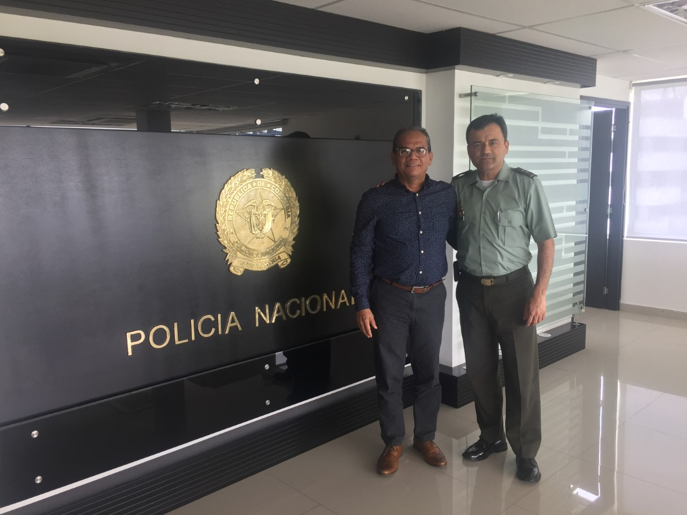

\[caption id="attachment\_6379" align="aligncenter" width="330"\] Así vestía la «Madame» era la vedette de la fiesta de la cárcel San Diego que atraía las miradas lascivas, no solo del director de Distriseguridad, sino de un montón de funcionarios. Cortesía.\[/caption\] **Un vestido rojo de carmesí ceñido a su tallado cuerpo**. Un escote de punta de pechos vomitados. Sus torneados muslos se podían ver cuando se sentaba y cruzaba sus piernas gracias al tablón del vestido, mientras las lascivas miradas de los machos la seguían. En medio de ese festejo singular, **el director de Distriseguridad, Victor Arango**, «inocentemente» cayó en la tentación de tomarse una selfi con **Liliana Campos Puello**. la santa diabla de la fiesta. Esto precipitó la salida de Arango en el día de hoy, ya que representa la degradación moral de la **_Cartagena del Despeluque._** **¿Una selfi puede hacer renunciar al director de Distriseguridad?** ¿«Y es tan grave eso»? pregunta con voz inocente un funcionario que no menciono su nombre. Arango, nacido en Puerto Boyacá, con 20 años de servicios en la Armada Nacional y un año en Distriseguridad, dijo:

> «_Presento renuncia a mi cargo de director de Distriseguridad. Lo hago en consideración a mi fmilia, a mi esposa Yaneth, a mis hijos Santiago y Maria Sofía, pero también en consideración con todos los cartageneros. Considero que es innecesario someter a Cartagena a un desgaste adicional por una fotografía que fue tomada **sin mala fe, sin dolo** en días pasados. Respaldo cualquier acción para proteger los derechos de niños y niñas…_».

Así se refirió esta mañana a la entrada de la alcaldía de Cartagena cuando le iba a presentar su carta de renuncia al alcalde Pereira.  El director de Distriseguridad, **Victor Hugo Arango, cayó en tentación**, y se fue. ¿Porqué tanta alharaca? El comandante de la policía Metropolitana de Cartagena, en una entevista que nos concedió y que puedes escuchar en la nota [«La seguridad ciudadana se agrava por la crisis humanitaria de Cartagena»](/articulos/uncategorized/la-seguridad-ciudadana-se-agrava-por-la-crisis-humanitaria-de-cartagena-general-poveda/), el general Poveda se refirió a la crisis moral que vive no solo Cartagena sino todo el país. El general Luis Poveda dijo:

> _«Estamos en una sociedad trastornada, violenta, que reclama justicia, pero la justicia también tiene sus problemas estructurales. (…) Hay muchos beneficios para el delincuente. Vivimos una crisis de valores, porque los delincuentes gozan de muchos beneficios. No respetan a las autoridades.»_

\[caption id="attachment\_6321" align="aligncenter" width="1280"\] Entrevista con el General Poveda\[/caption\] Mientras nuestros policías y el CTI capturan a proxenetas, traficantes del sexo, y violadores de menores de edad, como el capitán de la Armada Nacional, **Raúl Danilo Romero Pabón**, un representante de la autoridad y de la seguridad ciudadana se toma la foto con la «Madame», quien ha sido calificada por la Fiscalía **como la mayor proxeneta de Cartagena**. **¿Dónde están los valores sociales y morales?** ¿Dónde está la sindérisis moral de un servidor público que se vanagloria con la foto de la presunta proxeneta, como si fuera la «vedette» de la fiesta? **¿Qué ejemplo le está dando Victor Hugo Arango a sus hijos**, a la ciudad, a la sociedad, cuando pocos días antes las autoridades capturaron a abusadores de niños en redadas de la Policía? Victor Hugo Arango no era un ciudadano común y corriente. Tampoco era un funcionario del montón. Era el director de Distriseguridad. Llegó al cargo nombrado por **Sergio Londoño Zureck**. ¿Quién se lo recomendó? En tanto en la ciudad vivimos una crisis de seguridad ciudadana que también es una crisis humanitaria y una crisis moral, que ha causado la relajación de los valores ciudadanos. Como dice **Enrique Santos Discépolos**, en cambalache:

> _«Los inmorales nos han igualao_ _Si uno vive en la impostura_ _Y otro roba en su ambición_ _Da lo mismo que sea cura_ _Colchonero, rey de bastos_ _Caradura o polizón»._

Desde luego, como dice el comandante de la policía Metropolitana, general Poveda, **la crisis de valores no solo es de Cartagena sino de la nación entera**. Recordemos que funcionarios de la alcaldía de Medellín se tomaron fotos con uno de los criminales más grande que ha tenido el país, **John Jairo velásquez, alias «Popeye»**, lugarteniente de **Pablo Escobar**. El mismo que expresó su apoyo al **expresidente Uribe** y al **presidente Iván Duque**. Al principio, el alcalde de Medellín, **Federico Gutiérrez**, censuró el acto y dijo que iba a retirar a las funcionarias. Pocos días después, se olvidó del caso y las contratistas siguieron trabajando como si nada. ¡Doble moral! En el caso de la foto del director de Distriseguridad con la «Madame», **no solo debería renunciar Victor Hugo Arango** sino también el propio director de la cárcel de San Diego, **Jimmy de Avila**, porque la fiesta de la Merced se convirtió en una **«recocha»** que relajó la disciplina del centro penitenciario. Es más, el restaurante Interno, de **Johana Bahamón**, que se encuentra en su interior, deberá salir de allí. Un centro penitenciario no es para ese tipo de negocios, **un capricho casi sexual de las élites cachacas**, que ahora se hace más rentable con el «show de la _Madame_», como la «santa diabla». Una cena con la _Madame,_ vestida de rojo carmesí, un escote picado hasta el fondo, que le deja ver sus hermosas tetas operadas, un vestido largo con dos tablones al frente para mostrar sus torneados muslos, ¿una fantasía erótica? ¿Una puta veterana que sabe arrancar las miradas lascivas de los machos y de algunas hembras? Como macho en celos, uno puede caer en tentación. **¿Cuánto vale esa cena, Johana Bahamón?** La Cartagena decente le debería pedir al alcalde Pedrito Pereira que es hora de acabar con ese esperpento de restaurante. Igualmente, el alcalde **Pedrito Pereira y la ciudadanía deben ponerse duros** para frenar esa «recocha» en que se ha convertido ese centro penitenciario. ¿Por qué permitió esa guachafita en la que se convirtió la fiesta de la Merced? Pueden hacer los festejos, pero dentro de las normas legales y disciplinarias. Cámaras, móviles y todo cuanto está prohibido en un centro reclusorio no se podía permitir. Las fotos y videos que existen sobre la fiesta, lo dice todo. **El vestido rojo carmesí con tetas vomitadas de la «Madame», hizo caer en tentación al director de Distriseguridad Víctor Hugo Arango**, como si fuera la santa diabla. ¡Arango no va más! Los ojos de la vicepresidenta, **Martha Lucía Ramírez**, están puestos sobre la ciudad, la cual es administrada por uno de sus copartidarios. Pedrito Pereira, aunque no lo quiera, debe responderle, ¿acaso no es la veedora nombrada por el presidente Duque? **TE PUEDE INTERESAR** [La Madame, la diosa afrodita que satisfacía los caprichos sexuales de las élites.](/articulos/2018/08/la-madame-la-diosa-afrodita-que-satisfacia-caprichos-sexuales-de-las-elites-y-no-de-mondaos/) [La Madame, una puta respetuosa.](/articulos/2018/08/la-madame-una-puta-respetuosa-con-un-servicio-de-fantasia-ii/)