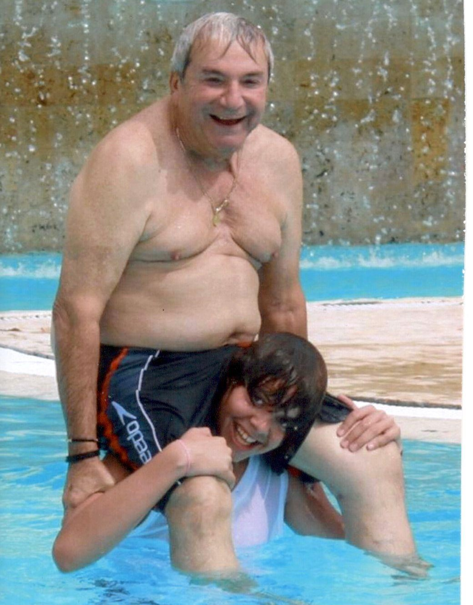
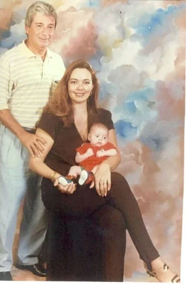
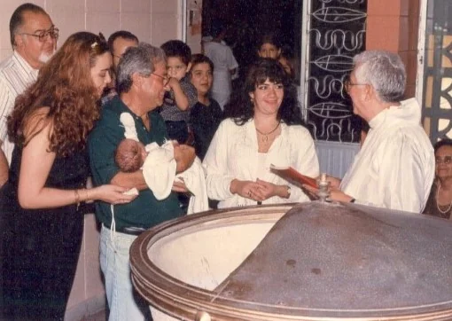
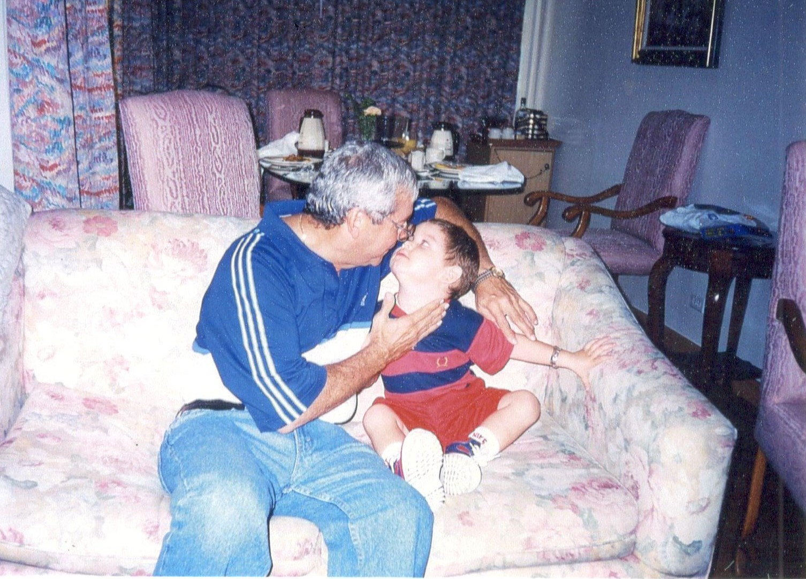

*Farid Char amaba tanto a Christian que siempre tenía tiempo para expresarselo. En la postrimería de su vida, Christian cargaba a su padre. La sonrisa de Farid, ¡felicidad pura! Foto Derecho reservado.*

El día en que cremaron el cadáver de **Farid Char Abdala** solo había transcurrido 6 horas de su muerte en la clínica **Porto Azul**. La intriga solo comienza a despejarse transcurrido un año de su inesperada muerte, ya que está apareciendo una madeja de demandas y contrademandas que **pueden dejar al descubierto los secretos oscuros de una de las familias más pudientes e influyentes** de la región Caribe y, en general, del país.

La enigmática interrogación que el periodismo de investigación se formuló en ese momento se empieza a despejar en forma de comedia jurídica: **¿Por qué lo cremaron tan rápido?**

Luego de la muerte de Farid Char y de la cremación prematura de su cadáver, se está registrando **una guerra de todos contra todos**, específicamente entre sus hijos mayores, los **Char Yidi**. Por ejemplo, la firma **Farid Char y Cía** demandó a **Maricela Char** y otros en un proceso oral **No. 20180009400** (12/10/2018) que se lleva a cabo en el **Juzgado Primero Civil del Circuito Oral** de Barranquilla. (En próxima entrega desentrañaremos el verdadero propósito de estas demandas. Y, en especial, cómo los abogados de los Char Rozo responderán a lo que se presume una estratagema de los Char Yidi para despojar de los derechos herenciales a Christian y Danielita).

Justamente en los próximos días **los abogados de Liliana Rozo Pinzón** iniciarán una batalla jurídica presentando múltiples demandas y procesos para proteger los derechos fundamentales de los hijos menores de Farid Char Abdala.

*En mayo de 1997, Farid Char sobrio, libre de la adicción, feliz al lado de dos de sus seres amados: Liliana y Christian. Ese día, Christian cumplía 30 días de nacido. Farid no solo lo bautizó sino que lo registró como su legitimo hijo. Archivo Particular.*

Entretanto, la Fiscalía se niega a resolver muchas preguntas que hace más de un año nos hicimos en una investigación periodística, después de observar cómo cremaron el cadáver: **¿Qué querían tapar con esa cremación súper rápida?** ¿Su muerte fue causada por alguna enfermedad desconocida o fue provocada en forma simulada? ¿Por qué impidieron que la familia Char Rozo (**Liliana Rozo y sus hijos Christian y Danielita**) decidieran sobre el destino final del cuerpo de su amado marido y padre? ¿Por qué **Porto Azul** entregó el cadáver a su ex esposa **Gladys Yidi** y no a **Liliana Rozo Pinzón**, su compañera permanente con quien vivía y tenía un vinculo marital desde 1987, el cual fue elevado a escritura pública en el 2008? Un año después, estos interrogantes continúan. Pero hay pistas, que si las seguimos, muchos de esos interrogantes se despejarían, poniendo al descubierto esos secretos oscuros de una familia, cuya fortuna pudo tener orígenes _**non sancto**_.

**Las relaciones maritales entre Farid Char y Liliana Rozo** datan desde 1987. Hubo un período de rompe debido a las infidelidades de Farid. Luego de sorprenderlo en compañía de otra mujer, Liliana decidió dejarlo. En este interregno, ella comenzó una nueva relación y de la cual quedó embarazada. En este estado, Farid le pidió que regresara, pero ella le dijo que estaba embarazada de otro. Farid le respondió:

> **«Vuelve conmigo y deja ese noviecito. Yo asumo la peternidad de ese bebé»**

Como **Farid Char** estaba locamente enamorado de su **«**Mona**»**, la aceptó en el estado de embarazo en que se encontraba. Desde entonces, reiniciaron unas excelentes relaciones familiares con el nacimiento de Cristian.

## Una burla olímpica

Cuando cremaron el cadáver no sospechábamos que una de las familias más ricas del país**, en forma perversa y olímpica,** pretende burlarse de la ley y de la sana convivencia familiar para no darle lo que le corresponde a los descendientes menores de **Farid Char.** Perversa, porque lo han hecho conscientemente. Olímpica, porque conocen la ley pero se burlan de ella sin ningún miramiento a sabiendas de que le espera la impunidad.

*Mayo de 1997, bautizo de Christian fue uno de los acontecimientos más felices que Farid Char tuvo en su vida. No solo estaba enamorado de la «Mona» Liliana sino que también amaba a su hijo Christian. Aquí el padre que lo bautizó en la iglesia. Archivo particular.*

**Aún estaban las cenizas calientes del cadáver de Farid,** cuando la firma **Farid Char y Cía S en C** demandó  los derechos herenciales de **Christian Char Rozo**, hijo de Farid con Liliana Rozo. Farid, como lo dijimos, no tuvo ningún reparo y asumió en forma responsable su paternidad con relación a Christian. **Farid, lo hizo conscientemente**, puesto que lo bautizó un mes después de su nacimiento (mayo de 1997) y lo registró como hijo, tal como consta en los documentos que tengo como fuente primaria. Fue el único hijo que asistió al parto para verlo nacer, tal como consta en los registros médicos. Sus dos hijos preferidos eran precisamente Christian y Danielita, a juzgar por los testimonios dados a este periodista por numerosas personas que fueron testigos de la excelente relación que mantuvo con sus hijos menores.

El registro fotográfico y de videos, a lo largo de la vida de Danielita y Christian, demuestra que **Farid jamás hubiese aceptado una palabra que pusiese en duda la paternidad legal con esos chicos, ni siquiera de Christian.** Incluso, Farid Char le grabó una hermosa canción a su hija Danielita que el próximo año cumplirá 15 años. Fue una interpretación excepcional cuando su hija cumplió 11 años celebrado junto con Christian, Farid y Liliana Rozo. **¿Cómo sería el quinceañero que Farid hubiese estado planeando para su hija, si estuviere vivo?** ¿Cómo protegería a Christian de la agresión de la familia Char Yidi? Los testigos dicen que Farid Char no hubiese permitido ninguna agresión económica ni psicológica contra sus hijos.

> (Leer: **[Un réquiem para Farid Char](./)**)

Cremaron el cadáver de Farid con su hecho pensado. Esta serie de informes periodísticos **devela no solo la conducta perversa de los Char de evadir el pago de los derechos herenciales de los hijos menores** sino que escudriña su verdadera fortuna, cuya cuarta parte le corresponde a los descendientes de **Farid Char.** El emporio **Olímpica** ocupa la quinceava (15a) posición en el escalafón 2017 de la revista Semana con las empresas más grandes y ricas del país. Y ahora por negarle los derechos a los Char Rozo, podría sobrevenir un conjunto de acciones judiciales e inspecciones judiciales, incluso, en la contabilidad de los Char Abdala con el fin de precisar su real patrimonio y fortuna.

Este periodista **solo divulga el iceberg de un mar de grandes secretos** que podrían aflorar en demandas y contrademandas que llamaría la atención de la opinión pública y marcaría la decadencia moral del emporio económico. Y conociendo como se conoce a los abogados defensores de los hijos menores de Farid (Christian y Danielita), los invitaremos para que pongan a la luz pública los verdaderos secretos escondidos detrás de los intereses **non sancto** de los Char, en tanto sus demandas y denuncias penales estarán no solo bien soportadas sino que nos abrirá un rayo de luz para iluminar el entendimiento de la sociedad. Sabemos que son profesionales idóneos, ya que están sumergidos en el mundo académico para sacar a flote la verdad verdadera que subyace en el comportamiento sospechoso de los Char.

## Funeral exprés

Cremaron el cadáver de Farid en ausencia de sus hijos menores (Christian y Daniela) y de su amada compañera, Liliana Rozo. Su cuerpo mustio fue incinerado a las volandas, como si fuera un leproso, tal como decimos en la primera entrega. **El día de los funerales (28 de junio de 2017), sus amigos quedaron con los** _**crespos hechos**_, ya que no le pudieron dar el último adiós. Ni siquiera el padre Tamayito pudo ver su cuerpo en **_cámara ardiente_**. La acción fue tan notoria que posteriormente debieron hacer un _**parampampam**_ con una misa en la Catedral Metropolitana. En el centro de la ceremonia estaba una pequeña urna con las cenizas de Farid. ¿Raro?

La muerte sospechosa de **Farid Char Abdala** podría ser uno de los enigmas de una familia élite que construyó su fortuna ligada a hechos de dudosa ortografía que todavía las autoridades colombianas ni siquiera se han detenido a investigar. **Cuando cremaron su cadáver**, probablemente había una intención más allá de disipar el dolor de su ausencia. La Fiscalía no lo hace ni lo hará, porque el titular **Néstor Humberto Martínez pertenece a la misma cuerda de los Char**; salvo que haya un cambio político de las estructuras de la justicia colombiana o que los Estados Unidos solicite en extradicción a alguno de los miembros de la familia Char, como sucedió con el caso del fallido fiscal anticorrupción, **Gustavo Moreno, quien fue nombrado en ese cargo por influencia de Enrique y Germán Vargas,** de acuerdo a algunos parlamentarios que consulté. Cosa contraria a la justicia norteamericana que le revocaron la visa a los hermanos Char por presunto lavado de activos procedentes del narcotráfico. Todavía se recuerda lo doloroso que fue para **Fuad Char Abdala** el hecho de que la justicia de Estados Unidos le impidiera visitar a su esposa **Adela Chaljub**, quien murió en un hospital de Houston donde se le trataba un cáncer. Incluso, el mismo Farid, aunque ya le habían dado la visa, tuvo temor de acompañar a sus hijos a Miami, y prefirió irse a Panamá con su hijo **Alfredo Char Yidi**, de donde regresó MUY ENFERMO, ya que el día siguiente falleció a las 7:00 de la mañana en la casa donde convivía con Liliana Rozo. Pero el parte médico de la Clínica Porto Azul, pronunciado por su director **Julián Gómez**, señala:

> _**Después de un procedimiento cerebro—cardio—vascular (Farid Char) murió a las 8:08 de la mañana en la clínica Porto Azul. No hay un diagnóstico claro en una persona que no tenía aparentemente un síntoma previo. No había un signo especial (de alguna enfermedad conocida)**_.

¿Extraño? Si, es extraño.  «No tenía aparentemente un síntoma previo» de alguna enfermedad. ¿Qué comió? ¿Donde comió? ¿Quienes estaban con él en la noche anterior? 

*   
    *Antes Farid cargaba a Cristian; un poco antes de morir, Cristian cargaba a Farid.*
    
*   
*   
*   

**La negación de la visa** norteamericana se convirtió en un **tema tabú** para los medios de comunicación del país, pero especialmente de Barranquilla. **Los Char dominan todos los medios**, con alguna excepción. El Heraldo, por ejemplo, es uno de los diarios atados por el poder de los Char que gozan de la mayoría de las acciones. Además de tener la cadena Olímpica, cuenta con una red de medios y de periodistas aduladores.

El grupo Olímpica, fundamentalmente estaba compuesto por cuatro grandes accionistas: **Fuad, Farid, Simón y Habid**. Los otros hermanos recibieron su parte, incluyendo _**Mike**_, quien es socio de la cadena Olímpica, y pudo seguirle los pasos a su hermano Farid en el mundo de la farándula. Al morir Farid, todo su patrimonio, incluyendo su participación en el emporio, debe pasar a sus descendientes.

**Los Char Hermanos liquidaban anualmente los dividendos de sus socios.** Los hijos mayores de Farid manejaban la firma que administraba las ganancias procedentes de su participación en **Char Hermanos,** las cuales liquidan anualmente, luego del ejercicio contable con corte del 31 de diciembre de cada año. Se trata de **Farid Char y Cía**.  Esta firma se modificó en un momento en que mantenían _**—**_probablemente contra su voluntad_**—**_ a Farid. Una persona allegada a la familia _**—**_que no quiso dar su nombre_**—**_ manifestó que durante el año y medio que estuvo en la residencia de los Char, situada en la Cra 59 con la calle 80, vivía prácticamente drogado con medicamentos psiquiátricos. Un año y medio después, Farid se negó a ingerir la medicina que le suministraban, y en un momento de lucidez, llamó a Liliana, y le suplicó con una voz gangoza:

> **¡Ven a buscarme! ¡Necesito irme de aquí urgentemente!**

Liliana lo fue a buscar de inmediato. Lo encontró como si sufriera una sobredosis de **Activan** o **Lorazepan**. Y desde entonces, lo cuidó hasta que sobrevino inesperadamente su muerte el 28 de junio de 2017. 

**¿Se investigó las causas de la muerte de Farid Char? ¿Por qué no le hicieron la necropsia? ¿Dónde están los dividendos recibidos de Char Hermanos por la participación que Farid tenía en esa compañía?** ¿Para dónde se fueron las ganancias recibidas el 20 de enero de 2017? **Milciades Cortés**, contador de Farid Char, deberá responder, incluso, en los estrados judiciales penales, civiles y comerciales. ¿Milciades Cortés podrá cometer el delito de perjurio para guardarle irregularmente las espaldas a sus nuevos patrones?

## Olímpica, un grupo poderoso

La organización Olímpica realmente obra como grupo económico, un _holding_ que opera un conjunto de empresas en diferentes áreas del sector financiero, comercial, industrial y de servicios. Incluso, en el aspecto político, **en el sector de infraestructura sus socios o amigos se han visto notoriamente beneficiados con contratos directa o indirectamente** por el Estado.

**Los antecedentes de la familia Char en el lavado de activo dan como para escribir un libro**. Esta fue la génesis por la cual los hermanos Char fueron vetados para ingresar a los Estados Unidos. Un caso emblemático es su relación con **Faryala Janna Arana,** quien pasó de ser un gris vendedor de mostrador a ser uno de los grandes accionistas del Junior, de la firma **Hotel Aruba Concorde** y de muchas propiedades. **¿Quién le compró esas propiedades a Faryala Janna Arana?** Una de ellas fue **Radio Olímpica Am**, supuestamente comprada por Faryala Janna a Olímpica. Cuando cayó en desgracia en los Estados Unidois, la emisora pasó a ser propiedad presuntamente de un periodista que de redactor de judiciales de **La Libertad** pasó a ser empresario de Radio.

Según las autoridades norteamericanas, **Faryala Janna** lavaba dinero del narcotráfico y era socio de los Char en la época de oro del Junior, después de conquistar la primera estrella en 1977. En 1983, Hoteles Aruba Concord, de Faryala Janna, era el principal patrocinador del Junior que trajo a jugar a muchas figuras del fútbol argentino. Era la época en que el narcotráfico dominaba el fútbol colombiano, y donde sobresalían grandes capos de la mafia, como **Pablo Escobar**, **Rodriguez Gacha**, los hermanos **Rodriguez Orejuela**. Extrañamente, **Fuad Char** se cayó para arriba, porque posteriormente fue nombrado ministro de Desarrollo Económico de Virgilio Barco, cargo que utilizó para posicionarse en el concierto nacional.

Pero no solo problemas de lavado de activos han tenido los Char. También en el campo de la mafia política. **David Char Navas**, exsenador de Cambio radical, hace un año (28 de octubre de 2017) fue capturado por el CTI por orden de la Corte Suprema de Justicia, ya que se concertó con los escuadrones de la muerte para hacerse elegir. Aparece involucrado en el asesinato de **Carlos Posada Flórez, alias 'Capulina**'.

Cuando el hoy alcalde de Barranquilla, **Alex Char,** tuvo problemas con la Contraloría General de la República (CGR), por arte de magia le resolvieron su situación jurídica. Fuad, su padre, tuvo que sacar más de $20 mil millones para que no lo inhabilitaran y pudiese presentarse en 2007 como candidato a la alcaldía que ganó con abrumadora mayoría. Con este hecho, Alex Char no solo demostró que es un **empresario fracasado** sino que se alió a los **Nule Amín y Nule Velilla** para defraudar al Estado. Los socios de Alex Char fueron condenados, pero al alcalde de Barranquilla nada le pasó.

En julio de 2006, la **Unión Temporal DIAN 2006** suscribió con la DIAN el contrato de Obra No 025-002 por $33 mil millones. Char tenía el 61% de las acciones, los Nule el 10%, Climatec el 4% y H&H Arquitectura Ltda el resto. No solo no hicieron las obras, sino también que quisieron defraudar al Estado exigiendo $50 mil millones más para terminar varias sedes de la Dian.

(¿Quieres saber más? Haz clic  aquí: **[El alcalde Char, al mismo tiempo, era contratista](/articulos/2011/01/el-alcalde-char-al-mismo-tiempo-era.html)**).

Un año y seis meses después de la muerte súbita de Farid Char Abdala **es un enigma**. ¿Qué tipo de investigación ha realizado la Fiscalía? **¿Podrán burlarse de Danielita y Christian Char Rozo?** ¿La sociedad barranquillera lo aceptará? ¿Las demandas judiciales se convertirán en una caja de Pandora que marcará la decadencia de la familia Char?

Si el jefe del vicio de Chicago, **Al Capone**, cayó en manos de la justicia por la contabilidad al evadir impuestos, los jefes del Clan Char podrían caer por una madeja de demandas y contrademandas hasta llegar a la verdad verdadera. **Voxpopuli.digital** acompañará de cerca estos procesos para que tengan luz pública, ejerciendo su papel de **contrapoder.**

**Próxima entrega:** ¿La contabilidad de los Char nunca ha dejado de ser una tienda de barrio?

## «Hija, quién te protegerá si yo no estoy»  

https://youtu.be/wsq1cv4cN8U