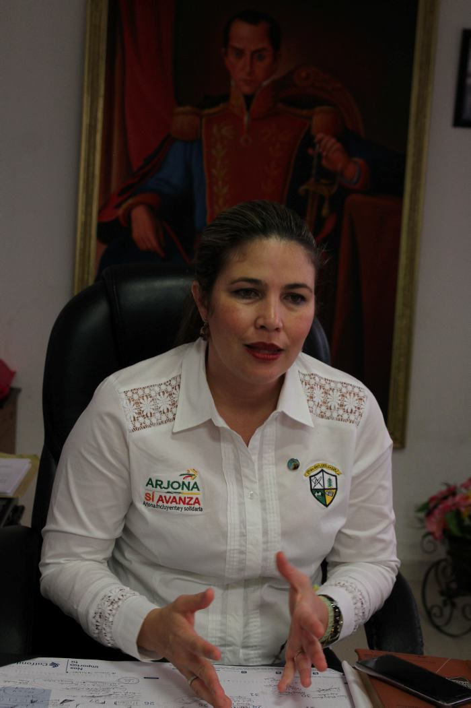

A **Esther María Jalilie García** solo le falta un poco más de un año para que finalice sin ningún problema su período como alcaldesa de **Arjona, Bolívar**. Y una de sus obras que desearía culminar, con todo su corazón, es el alcantarillado municipal, puesto que el **acueducto Arjona-Turbaco** ya está avanzado en un 90%. **Jalilie no lo duda, Arjona tendrá alcantarillado**.

**Sería un hecho histórico**, porque ningún mandatario se había propuesto semejante reto con acciones concretas: **logró $8 mil millones** para la laguna de oxidación y la construcción de redes para las aguas servidas.

Eso es tan cierto que cuando habla sobre el tema, sus ojos se iluminan:  

> _"La gran noticia para los arjoneros es el inicio de las obras del alcantarillado. Hemos iniciado la primera etapa para que Arjona tenga alcantarillado. Es una noticia trascendental en el tema que me toca como es el saneamiento básico, pero también porque estamos mejorando las condiciones para tener salud, y así se genera oportunidad de desarrollo para nuevas empresas que puedan llegar al municipio_".  
> 
> **Esther maría Jalilie García,** alcaldesa de Arjona.

*La posesión de Esther María Jalilie como alcaldesa.*

Con los $8 mil millones se asegurará la **construcción del 50% de la laguna de oxidación** y un **25% de las redes del alcantarillado**. Se espera gestionar más recursos con el gobernador de Bolívar, **Dumek Turbay Paz**, o con el gobierno nacional para ampliar a un 50% las redes con el fin de que gran parte de la población goce de saneamiento básico.

## Convivencia ciudadana

En materia de convivencia ciudadana **hace falta invertir más en los jóvenes en los diferentes municipios de Bolívar**. Aunque no se han hecho estudios concretos, se ha indicado un problema grave: la violencia juvenil. Este hecho viene aparejado con el incremento del consumo de sustancias **psicotrópicas** y alcohol. Y detrás de ello, el **microtráfico** y la **prostitución** que viene acompañado de verdaderas mafias.  

> "_En Arjona ya no se ven las peleas callejeras entre los jóvenes. Nuestra plaza principal es un escenario de convivencia. Te invitamos a que vayas cualquier día y así te darás cuenta de lo que te digo. Es un escenario propicio para desarrollar actividades culturales y sociales. El 31 de octubre fue un día espectacular con los niños alrededor de la plaza disfrutando su día"._  
> 
> **Esther maría Jalile García,** alcaldesa de Arjona.

**Esther María Jalilie** reconoce que todavía hay jóvenes que se encuentran en riesgos y siguen cometiendo actos vandálicos y otros delitos. Para estos últimos el mensaje es claro, la policía no va a parar en su **acción preventiva y coercitiva**. Espera seguir invirtiendo en **convivencia social y ciudadana** para que Arjona esté libre de pandillas juveniles y detener el consumo de sustancias alucinógenas entre la juventud.

/articulos/vox-populi-355055916/el-sueno-de-esther-alcantarillado-para-arjona