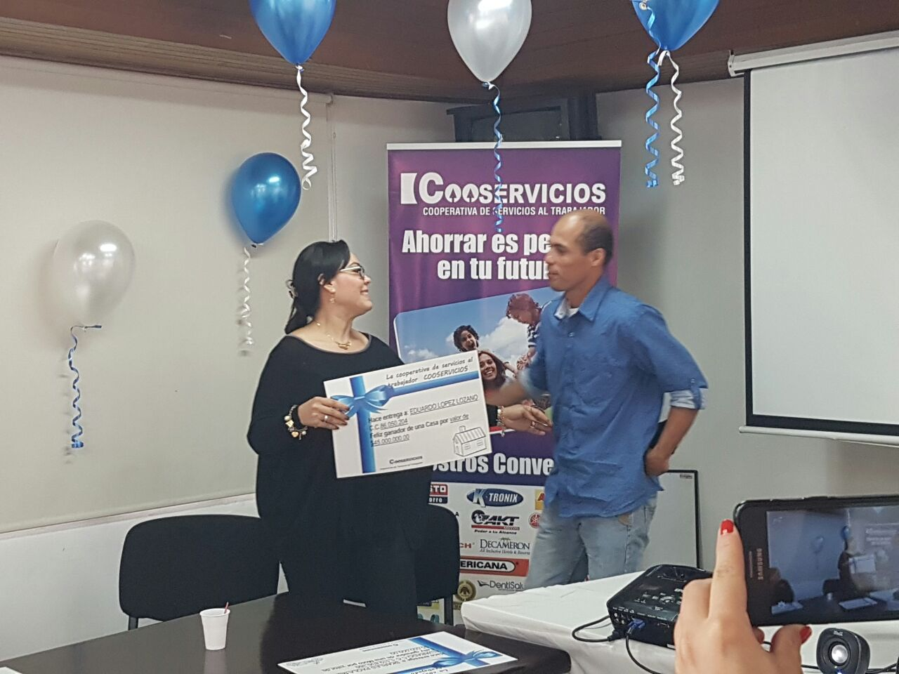

*Yasmin Ospino reyes cuando se desempeñaba como gerente de Cooservicios. La despidieron en licencia de maternidad y no se la han pagado.*

La Prosegur de los españoles, en unión con SOS del "Monito" José Villalba, aspira a recibir un multimillonario contrato con la Unidad Nacional de Protección-UNP en el presente año, pero se encuentra involucrada en casos de violación de derechos fundamentales.

La juez 12 Civil del diatrito de Cartagena, **Miledys Oliveros Osorio**, tuteló los derechos fundamentales de **Yasmin Ospino Reyes** y sus hijos menores, luego de ser despedida de su cargo como gerente de la **Cooperativa de Servicios al Trabajador de Prosegur-Cooservicios**. El problema es que la decisión adoptada por el Consejo de Administración de Cooservicios de salir de Yasmin ospino, no tuvo en cuenta que estaba de licencia de maternidad. Esta decisión, quizás sugerida por **Jorge Mora Rojas**, subgerente de personal, pone de manifiesto que Prosegur no respeta ni los derechos de un menor, ya que su madre quedó sin ingresos y no le puede dar la manutención debida.

(Puede leer: [**¿Prosegur viola los derechos humanos de sus trabajadores en Colombia?).**](/articulos/prosegur-esta-violando-los-derechos-humanos-de-sus-trabajadores-en-colombia/)

Ahora **Prosegur** se niega obstinadamente a pagarle los dineros adeudados a Yasmín Ospino, una mujer que se entregó denodamente en ese cargo al servicio de los trabajadores. Por esta razón Prosegur entraría en un desacato de las leyes colombianas.

La drástica política de recorte implementada por la empresa española Prosegur, luego de comprar la antigua **Vimarco**, la llevó a despedir a decenas de trabajadores y a liquidar a Cooservicios con **NIT No 830.505.539-5,** funcionaba como una dependencia de Prosegur en sus instalaciones. En la época que Roberto Barrios era gerente de la seccional Cartagena de Prosegur, al mismo tiempo se desempeñaba como presidente del Consejo de Administración de la Cooperativa. De igual manera a los trabajadores despedidos, se les adeuda sus aportes a la cooperativa y están en mora de pagarles.

*Los trabajadores despedidos han tenido que realizar algún tipo de protesta para que Prosegur le pague sus prestaciones sociales.*

El sindicato de trabajadores de Prosegur, **Sintraproseg**, viene realizando acciones para protestar contra esta política de recorte de personal. A principio de noviembre de 2018, por ejemplo, se tuvieron que tomar la entrada de la sede de Bogotá para exigir que se le pagara las prestaciones a Denis del Carmen Londoño Hernanández, afiliada al sindicato.

## Liquidación de Cooservicios

Con el despido de la gerente de Cooservicios, Yasmin Ospino Reyes, se inició el proceso de liquidación de esta cooperativa que en los momentos de explendor de Vimarco llegó a tener más de 6 mil afiliados, y hoy se redujo a menos de 2 mil.

El despido de **Ospino Reyes**, no solo fue irregular, sino que lo hizo estando en licencia de maternidad. Este despido le afectó el mínimo vital de ella y de sus hijos menores. Fue la razón fundamental por la cual la juez 12 Civil Municipal de Cartagena le protegió el derecho fundamental al Mínimo Vital a su hijo menor de dos años. En este sentido le ordena a Prosegur y a Cooservicios a que le paguen de inmediato los dineros adeudados, especialmente el valor de la licencia de maternidad.

Pero el problema no para allí. Yasmín hizo la denuncia ante el Ministerio del Trabajo para poner de manifiesto su problema. Igualmente tiene pruebas de un presunto acoso sexual practicado por un alto ejecutivo de la Prosegur que las autoridades deberían investigar.

**Nota al margen.** Los lectores pueden escribirle a la la Secretaria de Industria y Comercio Exterior de España, [**Xiana Margarita Mendez Bértolo**](http://www.comercio.gob.es/es-ES/Paginas/contacto.aspx). (Dele clic en el nombre).