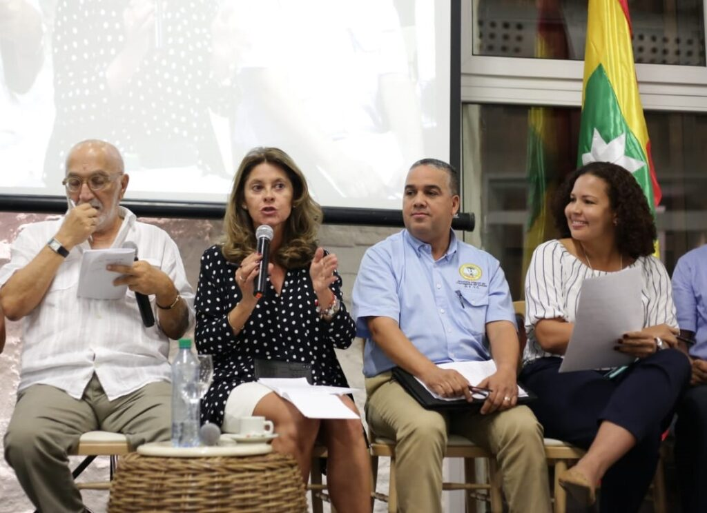

*Pedrito*

**Pedrito está picando caña**. Trabaja día y noche. El tiempo de su gobierno es breve, muy breve. Quiere resultados pronto. Lo principal, **la confianza de los cartageneros** que está en el suelo por la inestabilidad reinante. **Pedrito Pereira Caballero** quiere ser _**Pedro El Grande**_ en solo 465 días.

Pedrito está picando caña. Quiere seguir siendo un Peter Pan. Tendrá más tiempo que Manolo en el solio del Palacio de la Aduana. Pero el tiempo de Pedrito no será turbulento ni tragicómico como el de **Manolo** o el de **Quinto Guerra**. Ni tampoco tendrá dos perros doberman detrás, como la Fiscalía del cuestionable **Néstor Humberto Martínez Neira** y la Procuraduría del implacable **Fernando Carrillo Flórez**. No. En vez de doberman, Pedrito tiene una Hada Madrina: **La bella Martha Lucía**.

Si, Pedrito tiene una hada madrina: **la vicepresidente Martha Lucía Ramírez**, quien se ha dado la pela para protegerlo. Martha Lucía Ramírez, cual si fuera la _**Campanita**_ del viejo cuento de **_Piter Pan_** que nos leían nuestras abuelas, siempre viene a Cartagena a espolvorearle la magia para que le abra caminos en medio de la jungla de desconfianza que reina en la ciudadanía cartagenera.

*La hada madrina de Peter Pan, Martha Lucía Ramírez, la Campanilla de Pedrito. Aquí toma la palabra. Aparece el periodista Juan Gossaín.*

Cuando se posesionó Pedrito, dijo:

> _«No tenemos mucho tiempo, pero si mucho compromiso y decisión, para que la Alcaldía de Cartagena, recupere la normalidad institucional, el liderazgo y la capacidad de obtener resultados a través de 4 grandes propósitos:_ **_(1)_** _La eficiencia y transparencia de la gestión administrativa, (2) La seguridad y convivencia ciudadana, (3) La disminución de la pobreza, y, (4) La reactivación económic_a».
> 
> Pedrito en la posesión

(Por favor lea: [«Quiero la unidad de los cartageneros», primera declaración del alcalde](/articulos/2018/09/se-le-quemo-el-pan-en-la-boca-del-horno-a-los-gremios-y-a-blel-pedrito-pereira-nombrado-alcalde/))

## 100 días picando caña

*En los 100 días de Pedrito no descuidó a su familia pese que a que pasó 24/7 en torno al solio del Palacio de la Aduana.*

**No crean que Pedrito la ha tenido fácil.** Como diría un chofer de bus de Cartagena, de esos que lidiaba todos los días su padre **Pedro Pereira**, a sus hijos y a su mujer les puso una fotografía grande en la sala para que se acordaran que vive en esa casa. Los choferes viven la mayor de su tiempo detrás del timón. Las 24/7 Pedrito es alcalde. Se la pasa picando caña.

El poco tiempo que tiene y la urgencia de acometer las principales obras de su gobierno, hace de un Pedrito Pereira un contrarrelojero nato.

> _«_El trabajo ha sido mucho y el tiempo corto. Las necesidades de la población en general no dan espera para ser resueltas. Somos conscientes de que las cosas pueden mejorar a través de un trabajo organizado y articulado**»** .
> 
> Pedrito Pereira

## En seguridad ciudadana

Hombro a hombro con **Enver Díaz**, director de Distriseguridad, de las nuevas promesas de la gestión pública, o de **José Carlos Puello**, tiene resultados en seguridad ciudadana:

Se brindaron herramientas para ejercer mayor control en la ciudad, mediante el fortalecimiento de la Fuerza Pública con 16 camionetas, 7 automóviles, 20 motocicletas, 1 unidad móvil migratoria y 131 equipos de comunicaciones.  
  
Se desarrollaron 13 caravanas en 35 barrios, donde fueron suspendidas las actividades de 27 establecimientos de comercio por incumplimiento de normatividad. Las caravanas fueron producto de la sinergia entre la Policía Nacional, Infantería de Marina, Migración Colombia, Bomberos, Gerencia de Espacio Público, EPA Cartagena, DADIS, DATT y la Secretaria de Interior y Convivencia Ciudadana, y Distriseguridad.

**Superación de la pobreza extrema**

**Javier Posada Meola** está brillando al lado de Pedrito en el **Plan de Emergencia Social(PES).** En el poco tiempo han atendido a 5.716 cartageneros en 54 acciones. Así mismo, 1.178 personas fueron beneficiadas con trámites eficientes de identificación, 750 de ellos venezolanos.  
  
En la jornada del **Día Internacional de la Erradicación de la Pobreza, DIEP** 2018, fueron atendidos 15 mil cartageneros de las 3 localidades con servicios de salud oral, visual, ginecología, pediatría, vacunación, recreación, entrega de títulos de viviendas y la donación de libros para diferentes bibliotecas.

**Movilidad**

Aunque la movilidad en Cartagena sigue siendo crítica, con el nuevo director del DATT, **Edilberto Mendoza**, se ha avanzado bastante. Pedrito presenta sus resultados. 200 buses se sumaron a la flota de Transcaribe para robustecer el funcionamiento del sistema, dando paso a la puesta en marcha de 5 nuevas rutas pre-troncales y 5 más alimentadoras.

**Salud**

En materia de salud, **Antonio Sagbini** al frente del **DADIS**, también tiene sus resultados positivos.

Cuenta con un 70.9% de cobertura en el esquema de vacunación en sarampión y rubeola en niños de 0 a 11 meses y un 98.70% de cobertura del régimen subsidiado de salud.

**Educación**

91.458 niños, niñas y adolescentes están matriculados en instituciones educativas oficiales para cursar el año lectivo 2019. Además, 7 instituciones mejoraron los resultados de las pruebas de Estado, 40 estudiantes de la I.E Soledad Acosta de Samper fueron admitidos en la Universidad de Cartagena, siendo esta I.E. la que más estudiantes admitidos al Alma Mater.  
  
Se gestionaron $19 mil millones a través del **FONPET** para infraestructura educativa. De igual manera, $9.560 millones fueron garantizados por el Ministerio de Educación para la calidad educativa en Cartagena.  
  
Se lograron adecuaciones a 4 instituciones educativas: Islote - sede principal y Múcura, I.E. La Milagrosa y I.E. Nuestra Señora del Carmen. Paralelamente 700 alumnos del colegio Fernández Baena se reubicaron en la Universidad Antonio Nariño.

**¿Y los juegos nacionales?**  
  
La **OCAD Caribe** aprobó 3 proyectos para la adecuación de igual número de escenarios deportivos que serán sede de los Juegos Nacionales y Paranacionales 2019. Con recursos propios se destinaron $12 mil millones para la adecuación del Once de Noviembre, $3 mil millones para el estadio Argemiro Bermúdez y $6 mil millones para el estadio Jaime Morón.  
  
El 20 de diciembre de 2018 se logró la aprobación, con el apoyo de Planeación Nacional y Coldeportes, de otros tres proyectos en el Órgano Colegiado de Administración y Decisión, OCAD que son $16 mil millones para la pista de atletismo, $4.600 millones para el Coliseo de Combate, y el $2.500 millones para el Complejo de Raquetas.  
  
Además, fue inaugurado el Polideportivo La Candelaria, el cual cuenta con 1 cancha múltiple para voleibol y baloncesto. Se invirtieron 600 millones para el béisbol profesional.  
  
**En Vivienda**  
  
Destacamos la buena labor de **Erica Barrios**, siguiendo los pasos de su predecesor **William García**. Para superar el déficit habitacional, con el inicio de obras en diciembre de la primera etapa, se está construyendo el megaproyecto de la **Ciudadela de la Paz**, en el barrio el Pozón, el cual cuenta con 2.512 soluciones de vivienda. Esta iniciativa fue fortalecida con gestiones ante el Ministerio de Vivienda, quienes aportarán 600 viviendas. Se espera entregar la primera etapa en junio de 2019.  
  
Hay 500 beneficiarios con la entrega de Viviendas de Interés Prioritario (VIP) en la ciudadela Bicentenario. Se cuenta también con 600 beneficiarios de 120 mejoramientos en modalidad de condición de habitabilidad y saneamiento básico y 174 Predios han sido legalizados en el barrio El Pozón.

**Infraestructura**  
  
Anque Han sido entregadas 15 calles pavimentadas, entre las que se encuentran la ‘Y’ de Olaya, Vía Campaña, la calle de La Cuchara en El Pozón, y las adecuaciones a 6 estaciones de Policía.  
  
Eliana, fiel compañera de Pedrito en la gestión social  
  
Liderada por la gestora socia, **Eliana Bustillo**, el alumbrado navideño fue toda una realidad, adicional a eso, fueron entregados 10.000 mil regalos a niños y niñas tanto en la zona urbana como en la rural. Un logro posible gracias a aliados privados que, con su responsabilidad social, impulsaron la iniciativa denominada Sorpresa de Navidad.  
  
Igualmente, Gestión Social ha entregado 26 ayudas técnicas, celebró con 500 niños su día especial y 150 niños han descubierto la magia del cine gracias al programa “Paseo con la Primera”. Por otro lado, como ayuda a familias en situación de vulnerabilidad se entregaron 1.000 mercados.  
  
**En el área de Hacienda**  
  
$46.960 millones fueron recaudados por concepto del Impuesto Predial Unificado del 1 de octubre al 31 de diciembre, en el marco de la campaña Gangazo Tributario. Una forma de recobrar la confianza en la ciudadanía y demostrar que los impuestos han sido bien invertidos en el progreso de todos.

**Pedrito está picando caña**, y quizás la pique hasta el 31 de diciembre de 2019. Quiere convertir a su gabinete en buenos picadores de caña en la zafra cartagenera. ¿Llegará al final con su actual gabinete?

Veremos que pasará con su equipo de colaboradores, ya que es un año electoral y cualquier movimiento en el ajedrez administrativo responderá a los intereses políticos y económicos que dominan a la comarca. Mientras tanto, Pedrito quiere ser Pedro El Grande, ¡picando caña!