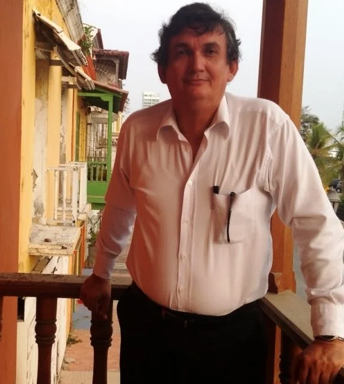
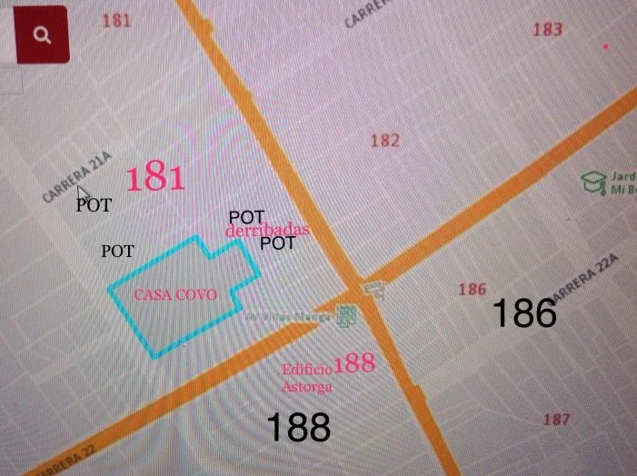

*En un amanecer frente a Casa Covo, patrimonio cultural, aplastada por la mole de cemento Astorga 414 en Manga.*

Si los Quiroz están detrás de rejas, a quienes investigué por sus construcciones ilegales, **¿por qué los constructores piratas de alto turmequé siguen edificando adefesios como _Acuarela_ y _Astorga 414_** que afectan sustantivamente el patrimonio cultural de Cartagena con la complicidad directa de la Curaduría, Planeación Distrital e IPCC? Por una sola razón: dinero. El afán de lucro determina **falsificar el contenido de sus resoluciones mediante un concierto para delinquir**.

Y de eso si sabe el director de la división de patrimonio del Instituto de Patrimonio y Cultura de Cartagena (IPCC), **Alfonso Cabrera Cruz**, quien considera que el patrimonio histórico es un buen negocio. ¡Error! La cultura y el patrimonio no deben tener el sello de «ánimo de lucro». Se desnaturaliza su razón, como lo ha desnaturalizado su actuación frente a la voracidad capitalista de ciertos constructores que no les anima ningún interés colectivo y que desprecia el patrimonio cultural e histórico de la ciudad. El mismo Cabrera contradictoriamente lo reconoció:  

> «_Si cedemos a los empresarios no existiría nuestro Centro Histórico._ **_Si ellos quieren hacer negocios acá tienen que respetar las reglas._** _No al revés, porque el patrimonio también es un buen negocio para ellos. El inversionista no es el que manda. La marca de la ciudad es su patrimonio._»
> 
>   
> [Javier Lizarzaburu](/articulos/2015/04/el-patrimonio-es-un-buen-negocio-pero.html).

¿Cómo así? ¿**Acuarela y Astorga 414** respetaron el patrimonio cultural? No. Son dos gemelos que están destruyendo el patrimonio histórico de la humanidad. Tienen el mismo patrón criminal para burlar la normatividad vigente que protege los Bienes de Interés Cultural (**BIC**) y el patrimonio histórico. En estos actos se incurriría en d**elitos como falsedad ideológica en documento público, prevaricato, concierto para delinquir**, entre otros.

Los funcionarios implicados emiten resoluciones y documentos públicos bajo el imperio de la falsedad y, a sabiendas que son falsos, lo presentan como legales. Es decir, que hay un alto grado de perversidad, por lo cual dicha conducta debe ser sancionada severamente.

(**[Resolución de acusación contra Ronald Llamas, Tamayo y Restrepo](/articulos/colombia/seccionales/fiscalia-presento-escrito-de-acusacion-en-caso-aquarela/)**)

##   
«El acuarelazo»

En **Acuarela** se identificó al posible determinador de la cascada de delitos que conlleva el concierto para delinquir. El delito de urbanización ilegal (construcciones piratas) implica la comisión de una cadena de otros delitos previos. Esta cadena se inicia desde los constructores. En el caso de Acuarela se identificaron a los empresarios de la construcción **Lucas Tamayo Giraldo y Claudio Restrepo Gutiérrez**. Pero no es el único caso. El 70% de las construcciones en Cartagena (Procuraduría, 2018) son ilegales. En tanto en 2017 la Superintendencia de Notariado y Registro identificó 47 licencias falsas en Cartagena. «»

En el gobierno de Dionisio Vélez hubo el bum de la construcción ilegal que explotó en las manos de Manuel Vicente Duque. La scretaria de Planeación de Vélez, Dolly González Espinosa, es una de las responsables de estos hechos.

En el caso de **Astorga 414** recibió licencia para ser **construido a 31 metros** de una de las reliquias de la **arquitectura morisca de Cartagena de Indias** situada en el barrio Manga: **Casa Covo**. Es una mansión edificada por el afamado arquitecto republicanista, **Alfredo Badenes.** Se la construyó a **Victor Covo**, cuya descendiente, **Raquel Covo Ochoa,** es una defensora del patrimonio cultural del barrio Manga. En este sector quedan 10 casas protegidas por ser Bienes de Interés Cultural. Tanto **Casa Covo**(1918) como **Casa Román** (1917) son legados arquitectónicos del período republicano de la ciudad.

Solo quedan 10 casas protegidas por el Plan de Ordenamiento Territorial (POT) y por la normatividad nacional. **Astorga** viola flagrantemente la **resolución No 1205 de 2006.** La norma establece que un tipo de construcción multifamiliar por fuera de las restricciones se podría parar a una distancia de 50 metros a partir del último paramento del patrimonio objeto de protección. Y de acuerdo con los límites otorgados por el instituto **_Agustin Codazzi_**, la **distancia** entre la última pared de **Casa Covo** a los predios del Astorga es de **31.44 metros**.

**Casa Covo** es la expresión del orientalismo en la llamada arquitectura republicana . Es, en fin, la nostalgia de ricos descendientes de España para evocar las vivencias de sus naciones ibéricas con una alta influencia mora. Recordemos que España estuvo bajo el **Califato de Córdoba** por más de 800 años. Por ejemplo, en Andalucía existe **La Alhambra**, una ciudad donde se reconstruyeron esas casas moriscas.

En Cartagena, **Manga fue el escenario donde apareció este tipo de arquitectura de valor cultural incalculable**. La fachada de **Casa Covo** ilustra la portada del libro de **Karen David** que rescata la **memoria morisca** de la arquitectura cartagenera en su vida republicana. Ella en su libro evoca la influencia oriental en nuestra arquitectura:

> « **_Casas moriscas_** _nos permite conocer la importancia del gusto de las clases altas en el Caribe colombiano, en especial de los personajes notables de origen español, que veían en el orientalismo una forma de perpetuar un vínculo con el gusto y la identidad de su país de origen._»
> 
> Palabras de **Gustavo Adolfo Villegas Gómez** sobre el libro de **Karen David Daccarett**. **Casas moriscas de Cartagena de Indias y Barranquilla.** El **neonazarí** en la arquitectura republicana (1918-1930).

## La génesis del crimen

Primero el dueño del proyecto adquiere las viviendas donde se va construir. Luego tramitan las licencias de demolición con los antiguos dueños, al tiempo que lo hacen con la licencia de construcción. En el caso de **Acuarela** están siendo procesados el dueño de la Promotora **Calle 47**, **Lucas Tamayo Giraldo** y el arquitecto **Claudio Restrepo Gutiérrez**. Presuntamente estos sobornaron a los funcionarios públicos encargados de expedir las respectivas licencias y realizar la vigilancia y control de las construcciones.

En el caso de **Astorga 414 es similar**. **Megaconstrucciones CAC SAS** se hace propietaria de los predios resultantes de la demolición de cuatro viviendas adquiridas de sus dueños originales. Luego llega el representante legal de **MOVICOM S.A., Carlos Segovia de la Espriella**, y tramita las licencias para la construcción del proyecto de vivienda, como en efecto lo hizo.

Aparentemente todo es legal, las licencias para demoler y para construir. Reciben las autorizaciones para las acometidas de los servicios públicos por parte de Aguas de Cartagena, Electicaribe y Surtigas; reciben empréstitos y pueden vender sobre el plano. **Un gran negocio**.

## La tramoya

El constructor oficia a las autoridades correspondientes, como Planeación, IPCC y Curaduría Urbana. Estas responden siempre afirmativamente. Movicom le ofició al IPCC si los cuatro predios con referencias catastral No 01-01-0188-0002-000, 01-01-0188-0003-000, 0188-0004-000, 0188-0006-000 se encuentran contenidas en el POT.

El mismo **Alfonso Cabrera Cruz, del IPCC** dice que los predios **con referencia catastral** No **01-01-0188-0002-000, 01-01-0188-0003-000, 0188-0004-000, 0188-0006-000** no se encuentran en el área de influencia de ningún **BICN**, según lo normado en el decreto 0977 de 2011.

Sin embargo, si Cabrera l**legara al escenario con un metro de maestro de obras para verificar los límites de las referencias catastrales,** se hubiera dado cuenta que las matriculas inmobiliarias de los predios no correspondían a la manzana donde realmente están. Lo que hace Cabrera es verificar sobre el papel que efectivamente son predios no sujetos a ninguna restricción. **Aquí se materializa el delito de falsificación ideológica en documento público**.

## De Cabrera a Llamas

Con el concepto de Cabrera, el constructor llega donde el Curador No 1, Ronald LLamas, a quien le solicita la licencia de demolición y construcción. Y el funcionario, _**en menos de lo que canta un gallo**_, expide las resoluciones No 0523 y No 0524 de 2015. El proceso tiene como fecha Radicación el 13-Junio-2015 , y la resolución se la entregan el 20 de noviembre de 2015. O sea, 5 meses después. Es rápido en comparación con otras solicitudes que se hacen por la vía legal. Hasta aquí, todo parece legal.

Pero Llamas en forma dolosa redacta los considerandos de las **resoluciones No 0523 y No 0524** de noviembre de 2015 con datos falsos. ¿Por qué? Las matriculas inmobiliarias y las referencias catastral no corresponden con las direcciones físicas de los inmuebles englobados en el área de construcción del barrio Manga. Pero en la parte resolutiva anota las direcciones reales. En este sentido se configura la falsedad con un barniz de legalidad, ya que la parte resolutiva es real. En el caso de **Astorga 414 el área** donde se construyó es contigua a Casa Covo, pero en el papel aparece en otro lugar.

En términos concretos, **es una burda falsificación**. Tanto Cabrera como Llamas, con un solo metro de maestro de obra, repito, podía verificar la información que le suministraba el constructor. Si lo hice yo para verificar la información de las resoluciones, ¿por qué no lo hicieron ellos? Lo mismo que pasó con Acuarela. Son 27 pisos construidos al lado de **Casa Covo**, patrimonio arquitectónico distrital y nacional.

Con **Astorga 414** **Rafael Cabrera del IPCC** y **Ronald Llamas Bustos,** de la Curaduría Urbana No 1, quedarían encartados. Si hay justicia, Llamas volvería a la cárcel y Cabrera a pagar por todos los conceptos falsos emitidos en el período 2013 a 2017. La investigación periodística que hicimos puso al descubierto el modelo de delitos que se registró con el escándalo del edificio de los Quiróz. Los 21 muertos dejado por la tragedia del _**Portal Blas de Lezo II**_ fueron olvidados. Los verdaderos responsables no están presos.

([Toda la verdad sobre la tragedia del Portal Blas de Lezo: un concierto delincuencial público-privado](./)).

./

El director de fiscalía **Francisco López** sigue callado, aunque sabe lo que está pasando con este _**acuarelazo**_ de **Astorga 414**. ¿Qué dice **Carmen Vásquez**, ministra de Cultura? Si los Quiroz están presos, ¿por qué los peces gordos siguen libres? Los cerebros de estos delitos son de alto turmequé, y siguen sobornando a funcionarios prevaricadores.

_**Próxima entrega:** Al oído de Francisco López, los sobornos de Astorga 414_