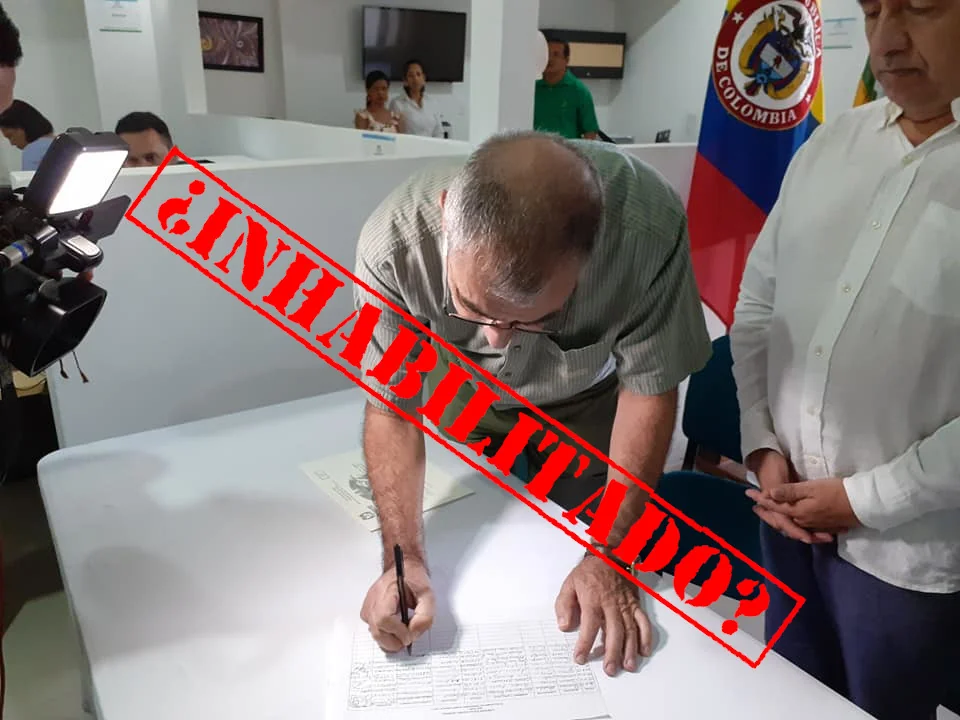

*¡Dau está inhabilitado! Si hay justicia, también caerá. Tomado de Facebook.*

No hay peor ciego que aquel que no quiere ver. Lo dijimos oportunamente, **William _Turco_ Dau es un tractor de mentiras.** Engañó a Cartagena. ¡Dau está inhabilitado! Lo peor, existen evidencias de que su elección _**fue un fraude masivo**_. Además, su **mitomanía patológica** lo hace incompetente para ejercer el cargo de alcalde de Cartagena.

Con su corporación **Cartagena Honesta**, que solo él manejaba, irrumpió en la veeduría cívica. Utilizó a los afrodescendientes de Punta Canoa, y otras poblaciones adyacentes, contra Aguas de Cartagena, Aguas de Barcelona y el Banco Mundial. Y poco después, aparece como accionista de Acuacar y un cargo con firmas **financistas internacionales** que tienen negocios con el Fondo Monetario Internacional y el Banco Mundial.

## ¡Advertencia!

Como Dau le paga a un grupo de **matones digitales** para que ataquen y calumnien a todo aquel que se atreva a denunciarlo, **le pido al CTI y a la fiscalía -dentro de la denuncia que instauré- que se le haga un seguimiento a los perfiles falsos desde donde se hacen estos ataques.**

Quien escribe es un periodista anticorrupción. No soy activista anticorrupción. La gran diferencia entre uno y el otro, **es que los periodistas debemos basarnos en la veracidad y no en la especulación**.

## La pregunta clave

Para saber si el _Turco_ Dau está inhabilitado, formularemos esta pregunta: **¿Un accionista de Aguas de Cartagena, entidad pública del Distrito de derecho privado, está inhabilitado para inscribirse como alcalde de esta ciudad?**

Llamemos la atención sobre varios elementos que integran la pregunta problemática. Así despejaremos la duda razonable de este ejercicio jurisprudencial.

El primer elemento que vemos es el hecho de **ser accionista**. Según la Real Academia de la Lengua (RAE), un accionista es una persona física o jurídica que posee acciones de una empresa. Dichas acciones **conllevan derechos económicos y de gestión sobre la sociedad**.

Fijense en la frase subrayada. Hay dos conceptos que quiero destacar: **"derecho económico"** y **"gestión sobre la sociedad"**. El primero se refiere a un interés particular que el financista tiene con su inversión. En este caso es obtener dividendos económicos. El segundo concepto, ejecutó la gestión para recibir esa utilidad. Es decir, se configura el _**animus**_ económico.

Este razonamiento es diferente al caso del senador Antana Mockus, quien el Consejo de Estado le mantuvo su investidura. Si bien es cierto que era presidente de la fundación Visionarios, no ejercía el papel de representante legal ni tampoco intervino en los contratos.

## El Turco inversionista

¿A quién le gusta el dinero? A todos y todas. Pero el **Turco** Dau le gusta demasiado el dinero que cae en la **codicia**. Escrito está que **la madre de la corrupción es el amor al dinero**. El _Turco_ Dau pudo vender el movimiento de los afros **al recibir a cambio acciones de Aguas de Cartagena** y otros dividendos que lo llevó a obtener un empleo en Nueva York. (Este tema se lo dejo para otra entrega).

En el caso concreto de la inhabilidad del **_Turco_ Dau** está probado -y él lo aceptó en entrevista a El Universal y otros medios- que es accionista de Aguas de Cartagena y recibe dividendos. Según documentos de la Contraloría Distrital, como accionista recibió dividendos económicos en los últimos 5 años, incluso en 2019.

Un inversionista gestiona para hacer valer sus derechos económicos producto de la inversión hecha. Esos derechos se traducen en beneficios financieros. En este aspecto se materializa su gestión.

## Turco Dau inhabilitado

¿Está inhabilitado el Turco Dau para posesionarse como alcalde? Para probar su inhabilidad, debemos remitirnos a las reglas creadas por la jurisprudencia del Consejo de Estado y saber si la conducta del _**Turco**_ Dau encaja en ellas.

En el ejercicio jurídico seguiremos la **metodología jurisprudencial** sin ninguna interpretación subjetiva. En este sentido, la Sala Electoral del Consejo de Estado **creó una metodología para interpretar la inhabilidad establecida** por el artículo 95 de la ley 136 de 1994, modificada por la ley 617 de 2000.

Empecemos por lo que dice 95 de la ley 136 de 1994. **Inhabilidades para ser alcalde.** **"No podrá ser inscrito como candidato, ni elegido, ni designado alcalde municipal o distrital**:

_5\. Durante el año anterior a su inscripción haya **intervenido en la celebración** de contratos con entidades públicas en interés propio, o en el de terceros o haya celebrado por sí, o por interpuesta persona, **contrato de cualquier naturaleza** con entidades u organismos del sector central o descentralizado de cualquier nivel administrativo que deba ejecutarse o cumplirse en el respectivo municipio._

La ley señalada comporta varios elementos materiales para establecer la inhabilidad del **_Turco_ Dau**. La jurisprudencia del Consejo de Estado la señala taxativamente.

## Los 4 elementos de la inhabilidad

Si queremos verificar la inhabilidad del _Turco_ Dau, debemos remitirnos a los 4 elementos materiales identificados por el Consejo de Estado. Y luego cotejarlos con la conducta material del susodicho.

**(I) Elemento material:** _participar en trámites negociales ante autoridades públicas públicas en interés particular o de terceros_ o celebrar contrato de cualquier naturaleza. E**l Turco Dau tiene acciones en Aguas de Cartagena. Es decir, tiene un contrato vigente como inversionista. Recibe anualmente, por esta participación, dividendos económicos.**

**(II) Elemento temporal**: _que dicha conducta prohibida se materialice en los 12 meses anteriores a su elección_. **El Pequeño Malandrín recibe desde hace 20 años rentabilidad por sus acciones, incluso en 2019, según la Contraloría Distrital.** Se inscribió el 26 de julio de 2019.

**(III) Elemento espacial:** que la situación haya acaecido en la circunscripción electoral. **El _Turco_ Dau tiene sus acciones en Aguas de Cartagena, una empresa de economía mixta por acciones que presta los servicios al Distrito de Cartagena. La composición accionaria de esta empresa de servicios públicos está dividida en 50% del Distrito, 45.1% Agbar y 4.9 accionistas como Dau.**

(IV) **Modal:** _que se configure el propósito, es decir, que sea para beneficio propio y de terceros._ **El _Turco_ Dau, dado a su cerebro adictivo y a su cultura financiera, es adicto -además de otras cosas- al dinero. Tiene un contrato como accionista y recibe un ingreso residual de Aguas de Cartagena. Sus acciones trabajan para él y recibe anualmente un dinero por ellas**.

Especialmente, respecto a la **_gestión de negocios_**, el Consejo de Estado estableció que se materializa cuando se **demuestra que el inscrito o el elegido intervino personal y activamente en diligencias o actuaciones tendientes a obtener cualquier interés o beneficio**. Las acciones son en sí mismas actuaciones personales del individuo. El capital es el resultado de un esfuerzo o una gestión individual.  

Te puede interesar: [El top-secret de la victoria de Dau. ¿El uribismo fue artífice de un Gran Fraude al Electorado? (I)](/articulos/el-top-secret-de-la-victoria-de-dau-el-uribismo-fue-artifice-de-un-gran-fraude-al-electorado-i/)

[Un buitre de corto vuelo. Dau, alcalde electo. Derrotadas las maquinarias](/articulos/dau-un-buitre-de-corto-vuelo-alcalde-de-cartagena/)

[¿Un alcalde adicto, bufón o psiquiátrico? El top secret de la victoria de Dau(II)](/articulos/un-alcalde-adicto-bufon-o-psiquiatrico/)

## Caso concreto

Cuando un inversionista invierte en una empresa mixta (50% del Distrito y 50% privado) como **Aguas de Cartagena**, es una gestión producto de su esfuerzo personal. Las acciones se constituyen en capital de trabajo para obtener un interés particular, esto es, dividendos de capital.

El financista Dau tiene unas acciones en Aguas de Cartagena y según documentos divulgados por la **Contraloría Distrital recibió dividendos en los últimos años, incluso en 2018 y 2019.**

Dau dijo a El Universal que hace 20 años adquirió las acciones. Y prometió que las cederá antes de su posesión como alcalde. Esta declaración se constituye en sí en una **confesión pública de su engaño y fraude al electorado cartagenero.** Pero también en una clara manifestación de su gestión para obtener un interés particular de recursos oficiales.

## El Pequeño Malandrín

Dau se inscribió como candidato a la alcaldía, escondió su condición de accionista de Aguas de Cartagena. Mientras tanto despotricaba contra personas que no se les había demostrado de ser corrupta con el fin de obtener un dividendo electoral. ¿Como se llama eso que hizo Dau? ¡Corrupción! Si, corrupción en acción pura. ¿Quién es el malandrín?

En estos momentos **Aguas de Cartagena** tiene un **contrato vigente con el Distrito** producto de la prórroga ilegal suscrita por **Dionisio Vélez Trujillo** que benefició a Dau como accionista. Este año se están invirtiendo **$90 mil millones**. Este dinero es del Distrito que debe ser aportado por Aguas de Cartagena de los $250 mil millones cuando se dio la prorroga.

**Al Pequeño Malandrín se le está cayendo la estantería.** Su careta se le está descorriendo. Lo pusimos al descubierto antes de las elecciones, pero sus matones digitales desataron un ataque contra mí y mis familiares. Mis redes sociales de internet fueron bloqueadas antes de las elecciones. Recibí amenazas de muerte que denuncié ante la Fiscalía.

¿Está inhabilitado el Turco Dau? No hay duda, su inhabilidad es como la de Yolanda Wong, puya al ojo. 

**Próxima entrega:** _¿cómo vendió Dau el movimiento de los afros de Punta Canoa sobre el emisario submarino? ¿Recibió a cambio acciones de Agua de Cartagena y empleo en Nueva York?_