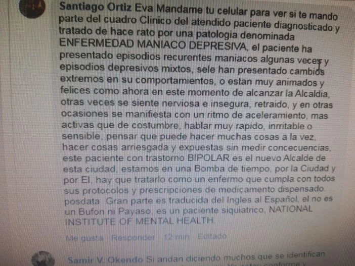

*William Dau dio la banda en el bando. Sus movimientos eran como los de una persona drogada y con trastornos mentales. Cortesía Facebook.*

¿Un alcalde adicto? ¿Bufón? ¿Psiquiátrico? William Dau Chamat, está metido en un berenjenal. Su conducta pública es errática. Imprecisa. Sus movimientos físicos son como los de un enajenado mental. **En el bando de la independencia de Cartagena fue el hazme reír, un bufón**. Pero la ciudad no sabe que sus antiguos amigos de Castillogrande lo consideran un adicto a las drogas... y de los duros. Podría presentar un cuadro clínico psiquiátrico. ¿Cuál será su patología?

## ¿Un alcalde adicto?

*Mariamulata, exalcaldesa, es vale de Dau. Ella iba a ser la gerente de Cartagena. Cortesía.*

Así como le sucede a algunos adictos que deben meterse un pase de **_perico_** o de _**mariacachafa**_ antes de tener relaciones sexuales, **¿Dau Chamat tendrá que drogarse para comenzar a despachar en el palacio de la Aduana?** ¿Como será su comportamiento cuando sea sometido por situaciones estresantes que todo gobernante debe pasar? **¿Le dará todo el poder a Mónica Fadul?** ¿Como enfrentará su mitomanía, sus mentiras que cree él y se las hace creer a los demás?

Si las respuestas son afirmativas, sería una bomba de tiempo que en cualquier momento puede explotar. ¿Acaso no ha explotado con sus reculadas y comportamientos erráticos o con sus movimientos dudosos de un enajenado mental?

## Queremos la verdad

La ciudadanía cartagenera debe saber la verdad, antes que el "Tractor" se posesione o le den la credencial de alcalde. ¡Imagínate un alcalde adicto! Peor que un tractor loco, sin conductor, lleno de gasolina por las calles de Cartagena embistiendo a su paso a las personas. Sin prejuicios, debemos abordar este delicado caso, porque se refiere al **derecho fundamental de la libre personalidad y de la intimidad de una persona.** Los periodistas honestos y profesionales solemos estar sometidos a un dilema crucial: **publicar o no publicar**.

Como docente y defensor de los derechos humanos tengo claro que la constitución y la ley ampara el **_libre desarrollo de la personalidad_**. Cualquier ciudadano o ciudadana puede meterse su dosis personal de _mariacachafa_ o de _perico_. Puede drogarse hasta matarse, si quiere. El individuo es libre. Escrito está en la constitución nacional en su artículo 28. Aunque tenía los testimonios y evidencias de la supuesta adicción y enajenación mental de Dau mucho antes de las elecciones, no quise publicar debido al respeto reverencial que tengo de la libertad individual.

No obstante, Dau pasó de ser un ciudadano corriente a **ser alcalde electo de Cartagena**. El primero de enero de 2020 se posesionará como alcalde titular de todos y todas que cohabitamos la ciudad. Un espacio lleno de gentes necesitadas, angustiadas y asqueadas por tanta corrupción de nuestros mandatarios.

La jurisprudencia constitucional y administrativa indica que como servidor público, **Dau debe someterse al escrutinio público**. Cualquier duda debe resolverla él o las autoridades competentes.

## Certificado de la Eps

El "Tractor" -remoquete con que se autocalifica- en su posesión deberá presentar un certificado de su EPS donde nos indique que no solo es apto física y mentalmente para vivir en sociedad sino que es capaz de ejercer el primer cargo del Distrito de Cartagena. También su ARL. **Si él no lo publica, la EPS deberá hacerlo por mandato judicial.**

Así como al difunto **Campo Elías Terán Dix** se le exigió que publicara la historia clínica cuando en la **clínica Medihelp** le diagnosticaron cáncer metastásico en los pulmones, de la misma manera debe suceder con William Dau Chamat. **Terán escondió, al principio, la verdadera enfermedad que padecía.** Se le dijo a los cartageneros que tenía un cuadro isquémico, pero en realidad lo que padecía era un cáncer de pulmones que había hecho metástasis al tallo del cerebro.

Los niveles de estrés que debe soportar un gobernante son altos.Y en una ciudad caótica y problemática como Cartagena, llega a una situación de desesperación. Estos altos niveles puede conducir a un estrés crónico y desatar las enfermedades subyacentes. **El estrés crónico causa enfermedades físicas y mentales** si el individuo no tiene inteligencia emocional, inteligencia que en Dau es escasa.

TE PUEDE INTERESAR:

*   [El top-secret de la victoria de Dau. ¿El uribismo fue artífice de un Gran Fraude al Electorado? (I)](/articulos/el-top-secret-de-la-victoria-de-dau-el-uribismo-fue-artifice-de-un-gran-fraude-al-electorado-i/)
*   [¿Peor el remedio que la enfermedad? Dau lo demostrará](/articulos/dau-peor-que-la-enfermedad/)

## Dau sería más grave que caso de Campo

Pero el caso de Dau Chamat **es más grave que el de Campo Elías Terán**. Si bien una enfermedad física no podría necesariamente afectar las facultades mentales del enfermo, una patología mental o cerebral si. Lo que se trata de verificar es un presunto trastorno mental en el alcalde electo.

**Un gobernante debe estar apto mentalmente**. Si no lo está, sería incapaz de gobernar. En este caso se le declararía interdicto, pues su discapacidad mental le impide ejercer a cabalidad con el mandato popular que se le ungió el pasado 27 de octubre. Cualquier ciudadano podría entablar -y yo lo haría- un proceso de **jurisdicción voluntaria** para que se declare que no está en capacidades mentales para ejercer el mandato popular.

## inimputable

**Una persona con una patología psiquiátrica, un grave trastorno mental, en el derecho civil se le declara interdicto, tutelado, protegido.** Es decir, que como no es capaz de decidir por sí solo, se le nombra un tutelante para que en su nombre actúe desde el punto de vista jurídico ante terceros.

En el derecho penal -dicen los expertos- **cuando una persona con una severa patología psiquiátrica se le declara inimputable, no puede ser procesada.** Es decir, se le exime de cualquier conducta punible que haya incurrido.

Por ejemplo, si a William Dau Chamat se le da por venderle a los **_fondos buitres_** toda la deuda que tienen aquellos exfuncionarios del Distrito sancionados por la Contraloría General en los juicios fiscales, hecho que es ilegal, no podría ser procesado por prevaricato o falsedad, porque la ley lo eximiría en el caso de que padeciera una enfermedad psiquiátrica.

## Los testimonios

En Bocagrande me encontré en el supermercado con un amigo. Es un arquitecto muy reconocido en la ciudad. Había leído con atención la serie del **_Buitre_** que publiqué antes de las elecciones del 27 de octubre. Y esto fue lo que me dijo:

> _"William Dau es un adicto. Un adicto perdido, por lo menos, en la época de su estancia en Castillogrande y Bocagrande. Es embustero. Tu hiciste una semblanza acertada de Dau. Como alcalde, sería lo peor que Cartagena hiciera"._
> 
> Antiguo amigo de Dau  

Un prestante empresario, cuyo nombre también reservo, y que fuera amigo de William Dau, lo interrogué sobre la supuesta adicción del alcalde electo. ¿Sabe lo que me respondió?

> _"Los que conocemos a Dau sabemos que tuvo problemas con la adicción. Lo que no se si ya superó esa fuerte atracción por las drogas, pero antes era un consumidor reconocido"._

Existen otros testimonios sobre la adicción de William Dau y de su incapacidad mental para vivir en sociedad. Los he sometido al análisis riguroso, lamentablemente indican que el mandatario electo estaría presentando una discapacidad mental.

## ¿Psiquiátrico?

*Algunos médicos de la ciudad se han cruzado chaps sobre la presunta enfermedad psiquiátrica de Dau.*

**¿Un enfermo psiquiátrico puede trabajar o ser un gran empresario?** Algunos pueden trabajar y ser un gran empresario con la tutela de personas cabales. Pero también hay enfermos psiquiátricos que se han fumado las empresas de sus padres. En la historia de las empresas de Cartagena o de Medellín nos podríamos dar cuenta de ello cuando en la segunda o tercera generación de la familia hubo **alguien psiquiátrico que se fumó todo el patrimonio familiar**. En Magangué conozco el caso de una familia, cuya herencia quedó en manos de la única hija, psiquiátrica y viciosa, y se fumó todo lo que sus padres le dejaron.

**¿Cuál es la enfermedad mental que padece William Dau Chamat?** Consultado algunos profesionales del ramo han coincidido que **su conducta refleja un cuadro clínico psiquiátrico severo**. Sus movimientos físicos. Su forma de hablar. Sus acciones descabelladas. Sus reculadas. Su temeridad para atentar contra el buen nombre de los demás. Su forma de bailar. Todo, todo encuadra en un hombre azotado por la demencia o la enajenación mental de un drogadicto.

Los abogados que tienen procesos contra Dau por injuria y calumnia podrían fracasar en su intento por castigar la conducta del alcalde electo. Él simplemente se retracta y no pasa nada. Pero si recula, los abogados deberían solicitarle al juez que practique una prueba para descartar la mitomanía del demandado: **un examen psiquiátrico forense.**

## ¿Demente o alcalde adicto?

Según la OMS en el mundo hay más de 50 millones de dementes. Robinson Cuadros Cuadros, médico geriátrico, en su estudio Prevalencia de las demencias en Colombia, señala que existe un tipo de demencia que se presenta en el 10% de esta población: **Demencia Fronto Temporal.** Esta se presenta con cambios en la personalidad, cambios de humor, desinhibición y dificultades en el lenguaje.

En Cartagena el Dadis no tiene estadísticas. La mayoría son adulto mayores. William Dau es un hombre solitario. Ni mujer. Ni hijos. Ni nietos. Ni familiares o amigos de toda la vida hay en su círculo más íntimo. Pero lo más importante es saber cuál es su estado mental y qué tipo de enfermedad psiquiátrica se le ha diagnosticado. Es el punto central que el alcalde electo debe aclarar ante la opinión pública. Ya no es un ciudadano común y corriente. **Ahora su conducta debe pasar por el escrutinio de la ciudadanía, si quiere ejercer como alcalde.**

Un alcalde loco podríamos elegir. Y esto no está mal. Es que ser alcalde de Cartagena es una locura. Pero elegir a un alcalde adicto o demente es distinto. **La demencia es un trastorno mental asociado a la conducta errática, sin lógica de pensamientos, lo cual afecta al juicio y al lenguaje.** Un demente puede recular pero no se arrepiente. Un demente no tiene brújula. Carece de sentidos. En fin, un demente tiene disfunciones cognitivas severas, según dicen los psicólogos, psiquiatras y neurólogos renombrados.

¿Elegimos a un demente como alcalde? ¿Un alcalde adicto? **Espero que la EPS donde se encuentra afiliado William Dau Chamat certifique su estado de salud.** Dau dice que es pensionado del fondo buitre _**Black Stone**_, pero aún así debe estar afiliado a una EPS. Y si no está demente, ¿por qué los gremios económicos de la ciudad, los verdaderos dueños del poder, le nombraron como tutelante (gerente de Cartagena) a Mónica Fadul? Y en este punto partirá la historia de la tercera entrega del **_top secret_** de la triste victoria de William Dau. ¡Una locura!