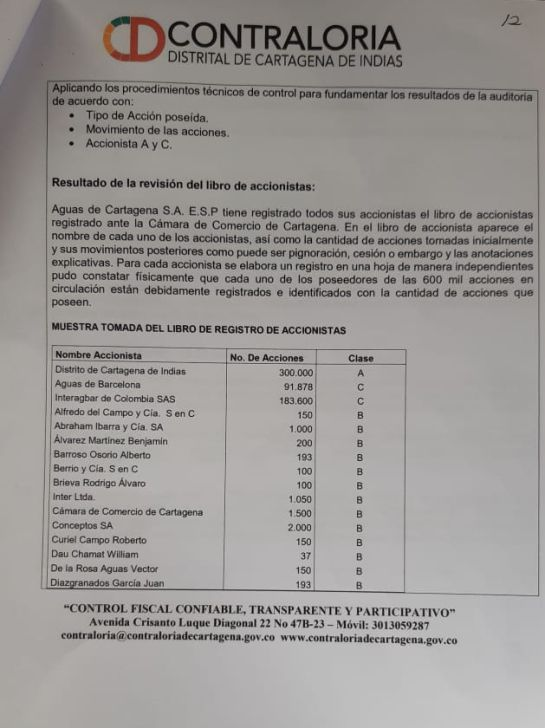

*William Dau, alcalde electo, le esperaría una nulidad. El Pequeño Malandrín busca consenso político para tener gobernalidad. Nombrará a David Múnera como secretario del Interior.*

En una salida desesperada, que los expertos podrían catalogar como populista y farisea, el alcalde electo **William Dau Chamat**, le cedió sus acciones de Acuacar (Aguas de Cartagena) a la Liga Contra el Cáncer. **Pero esta acción no lo salvaría de su evidente inhabilidad para posesionarse en el cargo.**

Lejos de ser poco importante la cesión de las acciones del alcalde electo, es la prueba reina de sus negocios con el Distrito. Y aquí estriba el núcleo que podría llevar a la nulidad la elección de Dau. En tanto, Dau sigue confeccionando su gabinete con revestimiento de populismo, le espera varias demandas de nulidad. Algunas se presentarán al termino de la vancancia judicial.

## La inhabilidad

El alcalde electo está incurso en una inhabilidad, ya que **en los 12 meses antes de las elecciones tuvo negocios con el Distrito**. Como lo demostramos en el artículo titulado **[¿Por qué el alcalde Dau está inhabilitado?](/articulos/alcalde-dau-inhabilitado/)** La inhabilidad se presenta, porque la jurisprudencia del Consejo de Estado sobre la aplicabilidad del artículo 95 de la ley 136 de 1994 y artículo 35 de la ley 617 de 2000 (régimen de inhabilidades e incompatibilidades para alcaldes), **presenta 4 elementos fácticos**.

Esos elementos son: (1) Existe un negocio entre el candidato y el Distrito. (2) El negocio se ejecuta en el ente territorial. (3) El candidato percibió un beneficio individual. (4) La transacción fue como inversionista, o sea, poseedor de acciones.

Ese hecho produjo un **daño antijurídico**: Dau sacó ventaja ilegalmente al crear un desequilibrio con los demás candidatos. Al ser inversionista de Aguas de Cartagena, pudo colocar todo el poderío de ésta al servicio de su elección. **Por solidaridad de cuerpo, los demás inversionistas apoyarían a uno de sus pares para ser alcalde**. Esto se evidenció con su viaje a Barcelona y sus reuniones con los dueños de Agbar. Además, en los próximos 4 años Aguas de Cartagena debe **invertir $250 mil millones** dentro del compromiso adquirido con la prórroga de 13 años del contrato.

## La complicidad de García

En efecto, como si fuera un acto de complicidad y contubernio, en forma rápida y poco transparente, el **gerente de Acuacar Jesús García,** emitió un oficio que lo publicó de inmediato eluniversal.com.co. De esta manera se materializa la solidaridad de cuerpo que busca proteger la elección del candidato de su afecto.

Cosa diferente fue el tratamiento que le dieron al acto de prórroga de 13 años al contrato de operación que el Distrito tiene con Aguas de Barcelona. **Jesús García** sigue callado respecto a este caso que fraguaron en contubernio y casi en la clandestinidad con **Dionisio Vélez. Vélez**, del mismo corte de Dau, es el último alcalde del sector empresarial que hizo hasta para vender con los bienes y recursos públicos de Cartagena.

El alcalde electo, Dau Chamat, dueño de esas cuestionadas acciones de Acuacar, y cuya elección fue dudosa y oscura, quiere limpiar su inhabilidad con una acción aparentemente humanista. Esta conducta calificada por muchos de hipócrita y farisaica, porque est**a torcida no la puede enderezar con acciones dadivosas. Sus acciones de Acuacar fueron adquiridas** en su "condición" de veedor anticorrupción de la misma empresa. ¿Cómo las obtuvo? Dau minimiza el acto de esta transacción. Pero tiene mucha importancia a sabiendas de que se presentaba cómo veedor. De hecho, tenía un impedimento moral y ético.

## La confesión de Dau

*Esta fue la ultima liquidación de los dividendos de los accionistas de Acuacar. William Dau aparece con 37 acciones. Las cedió, pero ya está causado el daño antijurídico, ratificado por el anuncio del gerente Jesús García sobre su cesión.*

Hace más de 20 años un sector politico (los García) lograron capitalizar el proceso de privatización de los bienes de Cartagena con un sector empresarial propio y foráneo en complicidad con el gobierno nacional. **Centenares de trabajadores quedaron en la calle y los dividendos públicos pasaron a manos privadas**. Las tarifas de los servicios públicos sufrieron un incremento inusitado empobreciendo a los sectores populares y a la clase media.

En ese contexto el alcalde Dau adquirió las acciones que hoy se la cede a la Liga Contra el Cáncer como si fuera Santa Teresa de Calcuta. Desde ese momento Dau _se cayó p'rriba_. Se inventó persecución hasta lograr un cargo en una empresa gringa del sector inversionista de los llamados "Fondos Buitres". Seguramente esto lo adquirió con la ayuda de funcionarios corruptos de Aguas de Cartagena. Dau litigó contra Aguas de Barcelona y el Banco Mundial. a nombre de las poblaciones afros de Punta Canoa, al norte de Cartagena.

Esa práctica consuetudinaria dónde se revela su mitomanía (la capacidad de mentir como si fuera verdad) "**vendió" su veeduría y con ella los intereses de muchos cartageneros** y cartageneras que tenían la esperanza que Acuacar le respondiera por los daños provocados con el emisario submarino y otros proyectos de expansión financiados por el Banco Mundial.

Existe un problema más grave aún con esas acciones. Cómo los actos corruptos salen a flote con el tiempo, 20 años después se revela que el veedor "anticorrupción" al mismo tiempo tenía accionrs. O sea, las adquirió en condición de veedor y no como un ciudadano común y corriente.

> “_**Esas acciones yo las adquirí en condición de veedor (de Aguas de Cartagena),** de activista anticorrupción porque sabía que estaban tramando algo en la constitución de esta empresa (...) y en una reunión en la que se encontraban una cantidad de personas reconocidas en la ciudad yo aporté 500 mil pesos, gran vaina, 500 mil pesos_.”
> 
> La confesión de Dau en eluniversal.com.ci

Minimizar ese hecho para esconder su gravedad nos hace recordar al personaje del _**articulito**_ que quería eliminar de la Constitución para perpetuarse en el poder. Esta posición a todas luces cínica, es propia de los mitomanos y megalómanos. Se evidencia que el Dau veedor con esa y otras transacciones vendió su veeduría y con ella la esperanza de miles de afros víctimas de Aguas de Barcelona.

Ahora el alcalde accionista se desembaraza de sus acciones en Aguas de Cartagena con el apoyo explícito de su gerente y de la junta directiva. García, puesto por los españoles, debe seguir las directrices de Agbar procedente de Barcelona. En esta ciudad, Dau fue recibido por sus colegas accionistas probablemente para acordar la continuidad del contrato leonino que se constituye en una dictadura del poder privado sobre el poder público. En otras palabras, tienen ahora a un alcalde para seguir con la **toma de Cartagena**. Un alcalde genuflexo como Dionisio Vélez, quién se enriqueció con sus cuentas **of shorts** en paraísos fiscales.

Ahora como alcalde, William Dau se podría enriquecer más con Aguas de Cartagena y las grandes contrataciones, ya que maneja muy bien el mundillo de las inversiones financieras y hasta podría tener cuentas bancarias al estilo de Dionisio Vélez. A Dau le gusta la plata más que a Dionisio. Si como veedor se hizo accionista de Acuacar ¿qué podría hacer cómo alcalde?

## El engaño

**Dau maneja el arte del engaño como un maestro**. Engañó a las comunidades afros con relación al emisario submarino. Engañó a Cartagena con una supuesta veeduría a Aguas de Cartagena. Engañó a la ciudad presentándose como activista anticorrupción. Engañó al electorado con un discurso anticorrupción sin programa de gobierno.

Los primeros anuncios sobre su gabinete confirma lo hasta aquí analizado. Está haciendo lo mismo que hizo con sus acciones. Pondrá como secretarios a ciertas personas prestantes para maquillar su engaño. Pero su administración tendrá una orientación al estilo Uribe o Santos. Le dará cuota a los corruptos de siempre con los que formará una coalición política para sacar los grandes proyectos antes de que lo inhabiliten y salga por la puerta trasera por dónde deben salir los pequeños malandrines como él.

Engañar y RECULAR es su practica. Recula cuando se siente descubierto. Engaña cuando quiere algo. Caso acciones de Cartagena. Miente sin remordimiento y con alevosia. Ataca cuando está lleno de miedo. Recula cuando lo descubren. Es un tractor lleno de químicos. Y recula...

Ceder sus acciones no lo salvaría ni Mandrake de la inhabilidad. Por el contrario, confirma el delito y todo lo que he publicado sobre el Pequeño Malandrín. ¿Por qué Dau no ha rectificado lo que hemos publicsdo? Él acusa a los demás de corrupto para esconder su propia corrupción.

Pocas veces nos hemos equivocado. El presidente del senado, conocido como El Chuzo contra la corrupción, terminó ahogado en su propio veneno al enfrentarse con este periodista anticorrupción. El destino del "Tractor" Dau podría ser, desafortunadamente para Cartagena, el mismo que Manolo Duque o Quinto Guerra. Cartagena no aprende.