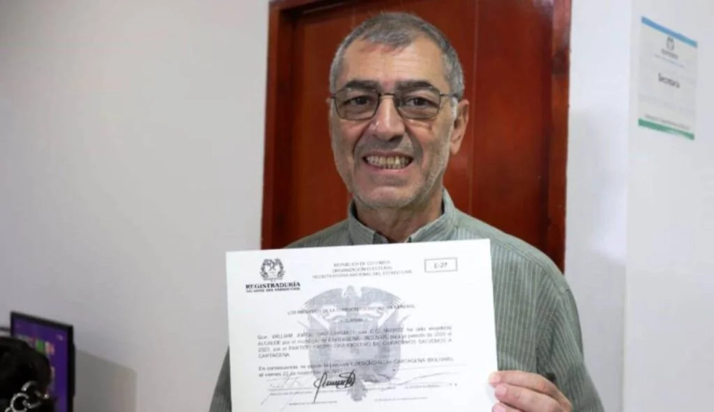

> **¿Qué es la corrupción, según la RAE?** _"El término **corrupción** suele ser utilizado para referirse a actividades ilícitas o deshonestas dentro de organizaciones públicas estatales. En ese sentido, se cataloga de corrupto a un político **que saca provecho personal de los recursos del Estado**"._

*Si hay justicia, esta credencial le duraría muy poco al Buitre Dau. Cortesía.*

**Son 4 causas que provocarían la caída del alcalde William Dau Chamat** como accionista de Aguas de Cartagena, de acuerdo con el análisis jurisprudencial del Consejo de Estado. Su caída es inminente, no solo por su evidente inhabilidad sino también porque su conducta refleja trastorno de la personalidad.

## 4 causas

En este trabajo analítico descubriremos las **[4 causas de la inhabilidad del Turco Dau](/articulos/el-turco-dau-engano-a-cartagena-esta-inhabilitado/)**. De acuerdo a la línea jurisprudencial del Consejo de Estado, la corte que resuelve las demandas de lo contencioso administrativo. Es decir, los casos de nulidad electoral, inhabilidades, incompatibilidades, entre otros litigios del orden administrativo. Seremos lo más pedagógico posible apegados a nuestra formación como defensores de los derechos humanos.

En este caso se demandaría el acto administrativo mediante el cual se le expidió a William Dau Chamat la credencial como alcalde electo, independientemente de las otras demandas.

Quiero aclarar que, además de periodista, **ejerzo la cátedra universitaria de derechos humanos**. Como docente, recibí por meritocracia (excelencia en argumentación jurisprudencial guiado por el exmagistrado de la Corte Constitucional **Alexei Julio**) una beca para estudiar en Washington derechos humanos, a lo cual decliné.

## ¡Advertencia!

**Mis publicaciones son duras y sin tabúes**, es cierto. Puede herir susceptibilidades, es cierto. Pero los que pregonan la anticorrupción (activistas anticorrupción) **deben dar ejemplo de su honestidad**.

Si esos activistas o veedores anticorrupción son más corruptos que aquellos a quienes atacan y denuncian, **merecen ser tratados con rigor**. A los que se disfrazan de anticorrupción **debemos quitarle la careta** para que queden expuestos a la luz pública. Algunos me dicen que he sido duro con Dau, es cierto. Pero William Dau se lo merece, porque tomó la bandera de la anticorrupción para engañar **a "Raquel y a todo aquel**".

Cuando ganó el **_Turc_o** Dau, le mandé un mensaje de felicitaciones y le tendí la mano, diciéndole: **"Si te sientes ofendido por mis denuncias, perdóname. Hay que doblegar los egos. Dile a tus seguidores que cesen la campaña de desprestigio contra el periodismo libre"**. Pero Dau tomó ese acto de compasión mío para afianzar su campaña injuriosa contra el periodismo serio. De la misma manera como lo hizo contra la periodista de Caracol Noticias, **Diana Calderón**, **Carlos Figueroa**, **Jhon Montaño**, **Diego Perdomo** y todo aquel que se atreva a informar con la verdad. Esto comprueba lo que dije antes de las elecciones: (Dale clic) [Dau es un peligro ambulante](/articulos/turco-dau-peligro-ambulante/), es cierto. Sus actuaciones, después de las elecciones, lo han demostrado.

## La metodología

Si uno ahonda la línea jurisprudencial de la Sala Electoral del Consejo de Estado, puede identificar con claridad 4 causas de la inhabilidad para ser alcalde. Además, en reiteradas sentencias el alto tribunal recurre a estas 4 causas para determinar la inhabilidad de los demandados.

La metodología, de la cual apelaremos en este análisis, fue aplicada en la sentencia del Consejo de Estado (11 de abril de 2019) sobre el caso del senador Antanas Mockus. El parlamentario fue confirmado en el cargo, porque no se cumplió ninguna de las 4 causas que señala la jurisprudencia del Consejo de Estado.

Mockus había sido miembro de la junta directiva de la fundación Visionarios. Es una entidad sin ánimo de lucro, por lo cual sus miembros (dice la ley) no tienen intención de recibir dividendos de sus actuaciones. Diferente es el caso de una empresa del Distrito que fue creada por acciones para obtener dividendos de sus inversionistas. Si Mockus hubiese sido representante legal, estaría incurso en inhabilidad.

## (1) Participó en trámites negociales

Diferente es el caso del Turco Dau, quien participó en trámites negociales con el Distrito de Cartagena de Indias. **Está probado que el alcalde electo William Dau Chamat es accionista** de Aguas de Cartagena, empresa mixta del Distrito. Esta empresa fue creada dentro del proceso de privatización de la década de los 90, dejando en el pavimento a miles de trabajadores del país. Suscribió un contrato de Gestión Integral de los Servicios de Acueducto y Alcantarillado con el Distrito de Cartagena.

En Bolívar se privatizaron las empresas públicas so pretexto de combatir la corrupción de los políticos. Sin embargo, está demostrado que el capital privado es tan corrupto como los políticos que han manejado el poder público. Los accionistas privados como Dau, han servido de cómplices para que a lo largo de la concesión de la prestación de los servicios públicos de agua y alcantarillado, Aguas de Barcelona se lleve miles de millones de pesos a España en detrimento de los intereses de los cartageneros.

Lo que dice el Consejo de Estado. **(I) Elemento material:** _"Participar en trámites negociales ante autoridades públicas públicas en interés particular o de terceros_ o celebrar contrato de cualquier naturaleza".

**Caso concreto:** El _Turco_ Dau tiene acciones en Aguas de Cartagena. Es decir, tiene un contrato vigente como inversionista. Invierte un dinero para recibir intereses financieros. Cada mes de mayo recibe por esta participación dividendos económicos. Al respecto, la Contraloría Distrital concluyó una auditoría donde se estableció cuánto recibió el Distrito y, por supuesto, cuánto recibió el alcalde electo.

La primicia para los periodistas es que fuentes de entero crédito de la Contraloría, revelaron que en la primera semana de diciembre se hará traslado de los resultados de esta investigación a la Procuraduría para establecer si existe conflicto de intereses, inhabilidades e incompatibilidades.

## (2) Período prohibido

Lo que dice el Consejo de Estado. **Elemento temporal**: _que dicha conducta prohibida se materialice en los 12 meses anteriores a su elección_. 

**Está probado que el Pequeño Malandrín recibe desde hace 20 años rentabilidad capitalista por sus acciones.** Incluso en el mes de mayo de 2019 ya recibió lo que le correspondía como accionista, según una auditoría de la Contraloría Distrital que oficialmente no se ha dado a conocer. 

El Turco Dau se inscribió el 26 de julio de 2019 como candidato a la alcaldía de Cartagena. En el mes de mayo de 2019 recibió los dividendos de las acciones que tiene en Aguas de Cartagena, tal como aparece en la relación que la empresa hizo dentro de la liquidación de 2019. (Véase el documento de la Contraloría).

## (3) Circunscripción electoral

Lo que dice el Consejo de Estado. **Elemento espacial:** que la conducta demandada haya acaecido en la circunscripción electoral. 

El _Turco_ Dau tiene sus acciones en Aguas de Cartagena, **una empresa de economía mixta por acciones que presta los servicios al Distrito de Cartagena.** La composición accionaria de esta empresa de servicios públicos está dividida en 50% del Distrito, 45.1% Agbar y 4.9% los pequeños accionistas. El _Turco_ Dau se encuentra en este 4.9% que tiene un representante en la junta directiva. Éste actúa en nombre de los accionistas minoritarios para responderle a sus intereses, como cuando apoyaron la **prórroga** **clandestina** **de 13 años** aprobada por Dionisio Vélez Trujillo y el representante de Dau en la junta directiva.

El contrato suscrito con Acuacar se denomina **Gisaa** (Gestión Integral de los Servicios de Acueducto y Alcantarillado) y se define como un **contrato privado**, suscrito bajo la Ley 142 de 1994 (Ley de Servicios Públicos), para la operación del sistema de agua y saneamiento básico de la ciudad.

## (4) Tipo negociable

Finalmente, la metodología de la Sala Electoral del Consejo de Estado establece una cuarta regla para determinar la inhabilidad de un demandado por violar el régimen de inhabilidades e incompatibilidades por gestión de negocios con el Estado, ya sea por sí o por terceras personas. Recordemos que los accionistas tienen su representante en la junta directiva con capacidad de decisión. Para la prórroga de los 13 años se necesitó el voto de los accionistas minoritarios.

Lo que dice el Consejo de Estado. **Modal:** _que se configure el propósito, es decir, que sea para beneficio propio y de terceros._ 

El _Turco_ Dau, dado a su cerebro adictivo y a su cultura financiera, es adicto al dinero. No escatima esfuerzo para sacarle provecho económico a cualquiera de sus actuaciones. **Tiene un contrato como accionista y recibe un ingreso residual de Aguas de Cartagena.** Ser inversionista de Aguas de Cartagena le permite disfrutar beneficios que ningún otro ciudadano de Cartagena disfruta.

Aquí se materializa el tipo modal de la gestión negociable. Como lo dijimos en la primera entrega de esta serie:

> _"Especialmente, respecto a la **gestión de negocios**, el Consejo de Estado estableció que se materializa cuando se **demuestra que el inscrito o el elegido intervino personal y activamente en diligencias o actuaciones tendientes a obtener cualquier interés o beneficio**. Las acciones son en sí mismas actuaciones personales del individuo. El capital es el resultado de un esfuerzo o una gestión individual"_.

## El fin del Pequeño Malandrín

Si hay justicia, estas 4 causas convertirían la elección de William Dau en un sueño efímero de los corruptos del sector privado y elitista. Nótese que el Pequeño Malandrín tiene su trinchera en Aguas de Cartagena, un nido de personajes siniestros que han destrozado los derechos humanos de miles de cartageneros.

(En el 2004 promovimos, a través de la Fundación Vox Populi, 35 tutelas por el derecho a la vida para obligar a Aguas de Cartagena a proteger a las familias cuyas viviendas fueron destruidas por la instalación del alcantarillado. Desataron una persecución contra mi y no recibí acciones como el veedor de marras. El Pequeño Malandrín está hecho de dinero y este periodista está hecho de moralidad pública)

Todo está dado para la caída del Pequeño Malandrín que ha resultado más malandro de lo que se sospechaba. Accionista y alcalde. Juez y parte. Anticorrupción y corrupto. Su engaño quedó al descubierto.

Dijo a algunos medios que se metió como accionista para conocer la corrupción desde adentro, ¿y por qué no lo dijo cuando se inscribió como candidato a la alcaldía? Su mitomanía es diciente que envuelve a la gente.

El mitómano se cree sus propias mentiras y pretende que los demás se la crean. Y a veces lo consiguen, como es el caso de Dau, el flamante alcalde anticorrupción. ("¡Jajajaja!", fue la risa que soltó un vecino de Bocagrande que lo conoce muy bien).

**Te puede interesar**: [El top-secret de la victoria de Dau. ¿El uribismo fue artífice de un Gran Fraude al Electorado? (I)](/articulos/el-top-secret-de-la-victoria-de-dau-el-uribismo-fue-artifice-de-un-gran-fraude-al-electorado-i/)

[Un buitre de corto vuelo. Dau, alcalde electo. Derrotadas las maquinarias](/articulos/dau-un-buitre-de-corto-vuelo-alcalde-de-cartagena/)

[¿Un alcalde adicto, bufón o psiquiátrico? El top secret de la victoria de Dau(II)](/articulos/un-alcalde-adicto-bufon-o-psiquiatrico/)