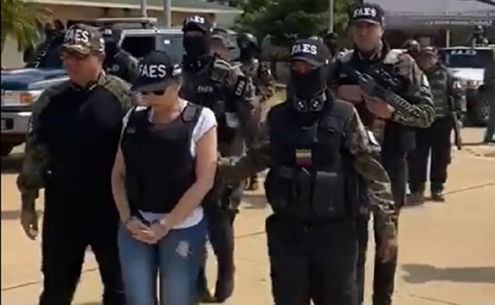
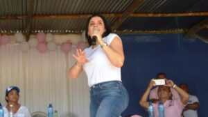

\[caption id="attachment\_11183" align="aligncenter" width="459"\] **Aida Merlano** puede representar el desmoronamiento del sistema electoral colombiano de la cloaca del poder. Cortesía.\[/caption\] **Aida Merlano está confirmando las revelaciones** hechas en los artículos publicados en [www.luciotorres.co](/articulos/) y [www.voxpopuli.digital](/articulos/) ([Confidencias de una reunión secreta: Vargas, Char y (La Gata=) Montes](./)) que hacen de las elecciones l**a cloaca del poder económico y político. Este poder está alimentado de un río de putrefacción que deslegitima la democracia** y **l**as instituciones ligadas al poder público y privado.

## Este río es la cloaca del poder

**Todas las instituciones, empezando por la Presidencia, el Congreso, las Altas Cortes, la Fiscalía,** los organismos de Control, los órganos electorales, todas están bañadas en este río. **¿Por qué el país aguanta tanta putrefacción?** ¿Por qué soportamos un Estado Matón, mafioso y a tanta delincuencia empotrada en los grandes clubes sociales, donde los poderosos se reparten el país? Ya no se trata de reformar nada ni de recuperar la respetabilidad de las instituciones. **La corrupción huele a río de cloaca.** Es reprochable, por ejemplo, la conducta de los grandes medios de comunicación de deslegitimar las declaraciones de la exsenadora Aída Merlano Rebolledo, quien es más que una mujer escaladora. **O un objeto sexual de los poderosos de Barranquilla** que, en los tiempos de victorias, la exhibían como la revelación y renovación del poder tradicional. Esa líder, fruto de la cloaca del poder, es inteligente y astuta. **Develar los secretos más profundos de este poder corrupto sería el inicio de un proceso judicial más importante que el proceso 8 mil o la parapolítica.** Callar este hecho es risible. Y es que en este **Estado Matón** y mafioso casi nadie se salva. Los representantes de izquierda en el Congreso deberían renunciar, ya a sus curules y convocar al pueblo a exigir la renuncia del presidente Duque, a convocar una **gran asamblea popular y constituyente** que corte de una vez por todas y de raíz tanta putrefacción en este Estado mafioso.

## ¿Se levantará el pueblo?

**El pueblo se debe levantar. Y si se levanta se caen los poderosos**. Pero no se levanta. No hay líderes que inspiren un cambio en profundidad. Los líderes de izquierda —si bien son valerosos por sus denuncias— a lo largo de este período han legitimado el poder.  ROBLEDO y PETRO —sin buscarlo—son la otra cara de la misma moneda de Uribe o del mismo Fajardo. Colombia Humana, Polo Democrático y Partido Verde no son alternativas de transformación, son perpetuadores de este sistema excremental. ¿Qué los diferencia? **Unos están en la oposición y otros en la cloaca del poder.** **La izquierda de todo pelambre fue asimilada por la cloaca del poder.** Beben de la misma fuente. Se benefician hipócritamente del **_estatus quo_**. Su calidad de vida se debe a que son sostenedores de la cloaca del poder. Levantar firme la voz y gritar duro para cortar de raíz esta podredumbre es el paso inicial. Que el empute se convierta en algo creador, transformador consciente de la sociedad colombiana, y no en vandalismo, lo cual justificaría que la cloaca del poder nos trate de vándalos sin serlos. **Que nos atrevamos a decir la verdad., aunque nos cueste la libertad personal o la vida**

## Sarmiento y cía. los dueños de la cloaca

Observamos que la cloaca del poder se atraganta hablando de democracia y de respetabilidad de las instituciones. ¡Doble moral! El pueblo sabe que los representantes de la cloaca del poder son _empleaduchos_ de los actores estratégicos  **Sarmiento Ángulo, Ardila Lule, Santo Domingo, Char.** Estos cacaos se benefician de las políticas estatales con las famosas **Alianzas Público Privada (APP),** a la cual no tienen acceso las comunidades organizadas y pequeños empresarios asociados. La niña bonita de los grandes poderes se le salió de las manos. Ahora es _**botín de guerra**_ **del presidente Maduro** y pasó a ser el enemigo número uno del poder. Ya sabemos que ni la Fiscalía de bolsillo, ni la Procuraduría, ni el Congreso, ni ninguna de las instituciones respetables de este país van a decir ni una palabra sobre este **_megaescándalo_**, que en países civilizados como el nuestro, ya habría producido una caída en cascada de los políticos involucrados. Los grandes medios, que están en manos de los poderosos, también callarán. Pero el pueblo esta vez no se callará. Estamos mamados de tanta corrupción. Estamos mamados que nos sigan creyendo bobos. Estamos mamados que monten a presidentes bandidos o idiotas útiles de la cloaca del poder.

## ¿La CSJ asumirá proceso matriz?

¿Quién carajo va a investigar? Nadie o casi nadie. La Fiscalía y su nuevo titular —Francisco Barbosa—no manifiesta nada diferente. Por eso desde ya llamamos al pueblo, a los medios de comunicación alternativos, a la intelectualidad orgánica que no se vende, a los jóvenes, a las mujeres, a ir al fondo de esta situación. Nuestro periodismo comprometido irá al fondo. Llegaremos a indagar más y entrevistaremos, a nuestra manera, a la mujer desterrada del establecimiento, a Aída Merlano Rebolledo.  Será un estudio de caso para construir la ruta de la cloaca del poder. Si funciona así en Barranquilla con los Char, Gerleín y Vargas, funcionará para toda Colombia. Tenemos fe de que la **Corte Suprema de Justicia (CSJ)** puede iniciar un **proceso judicial** matriz como lo fue la **_parapolítica_**. El castigo a la _**parapolítica**_ se inició cuando el Alto Tribunal les abrió investigación a los senadores **Álvaro García y Jairo Merlano y al representante Erick Morris**, oriundos del departamento de Sucre y miembros de la bancada uribista en el Congreso. El 18 de octubre de 2006 fueron detenidos, luego procesados y condenados. Más de 48 parlamentarios y gobernadores impulsores de la **_parapolítica_**  también sufrieron el rigor de la justicia. La cloaca del poder siguió intacta. Los condenados fueron reemplazados por sus familiares o amigos muy cercanos, y ahora son más poderosos que antes, porque sus financiadores están detrás.

## Los sostenedores de la cloaca

¿Quiénes sostienen la cloaca del poder? El pueblo inconsciente, sin formación política, susceptible del voto comprado. **Una Registraduría corrupta** que permite que fuerzas ajenas vendan paquetes electorales a políticos corruptos para hacer fraude electoral masivo. Así lo han hecho en Barranquilla, Cartagena y en el Caribe colombiano como en todo el país. Empresarios como Char, Gerleín y _Yuyo_ Daes, en Barranquilla. En el país, Sarmiento Ángulo, Santo Domingo, Ardila Lulle y otros. **Los líderes de oposición también sostienen la cloaca del poder.** Legitiman ese poder con su actuación en el congreso. Igualmente, los grandes medios de comunicación que construyen agendas informativas oficiales, dándole primacía a los representantes de ese poder corrupto. No basta con salir a las calles para protestar. **Es necesario crear un movimiento sin marquillas**, **ya sean de izquierda o de centro.** Un movimiento autónomo con nuevos liderazgos, nuevos experimentos políticos exitosos en las localidades y regiones.

## Las cosas claras de la cloaca

**Quedan claras varias cosas:**

*   Los políticos se hacen elegir a  punta de contratos y de compra de votos.
*   La política es el gran negocio de los poderosos que se benefician del presupuesto público.
*   Los gobernantes de turno utilizan las instituciones del Estado para perpetuarse en el poder y repartir prebendas a diestra y siniestra.
*   Las instituciones que deberían investigar a los poderosos (los dueños del poder distintos a sus _empleaduchos_) callan y engavetan las denuncias que hace la prensa y ciudadanos independientes.
*   Tenemos un Estado matón.

**Los dueños de la cloaca del poder son capaces de matar**, asesinar sin piedad cuando le disputan el poder. Asesinaron a caudillos liberales como **Rafael Uribe Uribe** (Bogotá, 1914) y **Jorge Eliécer Gaitán** (Bogotá, 1948). A **Guadalupe Salcedo** (Bogotá, 1957), líder de la guerrilla liberal que creyó en la paz. Lo mismo con P**ardo Leal, Pizarro** y miles de compatriotas, cuyo delito fue pensar y hacer diferente el poder político. Ni siquiera se salvan los que desde su interior se revelan de tanta podredumbre. Es el caso de **Álvaro Gómez Hurtado**, asesinado por la misma oligarquía **cuando se negó a ser el presidente del golpe de estado contra el presidente Ernesto Samper, según le confesó a uno de sus amigos, Eduardo Matuk**. Hoy, los dueños del poder han permitido el **asesinato de más de 500 líderes sociales**, desde la firma de los Acuerdos de Paz con las FARC. Es la tragedia repetitiva que debemos vivir. Tragedia que ponemos al desnudo en el libro **_¿Adiós a la guerra? Cinco claves para la paz_**, publicado en 2016.

## El poder de la corrupción

**La corrupción es un derivado del sistema político dominante.** La democracia está sustentada en unas e**lecciones amañadas, comprables, subastadas al mejor postor.** Una Fiscalía al servicio de delincuentes de _cuello blanco_ o de quien puede comprarla. Es instrumento para someter a los otros delincuentes que no se arrodillan a su poder. La corrupción es el modo de vida natural de estas castas políticas. Desafortunadamente las palabras del padre **Camilo Torres** —**_el que escruta elige—_** siguen siendo una verdad indiscutible. **En el 2022 tenemos una gran oportunidad de elegir a un presidente que no nazca del establecimiento político tradicional de izquierda o de derecha**. Un presidente que sea capaz de convocar a una **Asamblea Nacional Constituyente (ANC)** para transformar creativamente la institucionalidad levantada sobre la cloaca del poder. **Con una ANC construiremos un nuevo país que corrija los errores de la historia.** Como cuando nuestro mejor presidente, **el cartagenero Rafael Núñez**, **guío al país hacia una nación verdaderamente democrática.** Pero los dueños del poder sabotearon sus intenciones integracionistas y dieron al traste la transformación que se esperaba con el inicio de un siglo XX de prosperidad y paz.

## **¡Mierda en catabre!**

\[caption id="attachment\_11184" align="alignnone" width="436"\] Aida representa ese poder que ahora queda deslegitimado con sus confesiones: **La cloaca del poder**. Cortesía.\[/caption\] El caso de Aida Merlano **puede ser el inicio de un proceso que termine juzgando a los que se eligieron fraudulentamente**. Y allí caería la inmensa mayoría de senadores y representantes que eligieron Fiscal, Contralor, Defensor del Pueblo y magistrados de las altas cortes. **¡Habría mierda en catabre!** Este fenómeno judicial de Aída Merlano podría trocarse en un hecho político de gran trascendencia: la transformación creativa de Colombia.  Sabíamos que existía un sistema electoral corrupto. Probado y _recomprobado_ con la elección del presidente conservador **Misael Pastrana en 1974,** por ejemplo. Pero es la primera vez que desde sus entrañas una senadora es condenada y, al mismo tiempo, confiesa que Colombia es sostenida por la cloaca del poder. Lo que quiere decir que este congreso es ilegítimo. El presidente es ilegítimo. Las instituciones creadas por los ilegítimos son ilegítimas. Y la desgracia, todo empezó por la Costa Caribe y para más piedra, por Barranquilla, la capital del Caribe, cuna de todo lo grande, hasta de la corrupción electoral.

## Textos afines que te pueden interesar

## [¿Caerá el imperio Char-Gerleín-«Yuyo» Daes con las confesiones de Aída Merlano? (I)](/articulos/caera-el-imperio-char-gerlein-yuyo-daes-con-las-confesiones-de-aida-merlano-i/)

## [Confidencias de una reunión secreta: Vargas, Char y (La Gata=) Montes](./)

## [«Char, Vargas y Gerleín, los capos del fraude electoral», Aída Merlano](/articulos/char-vargas-y-gerlein-los-capos-del-fraude-electoral-aida-merlano/)