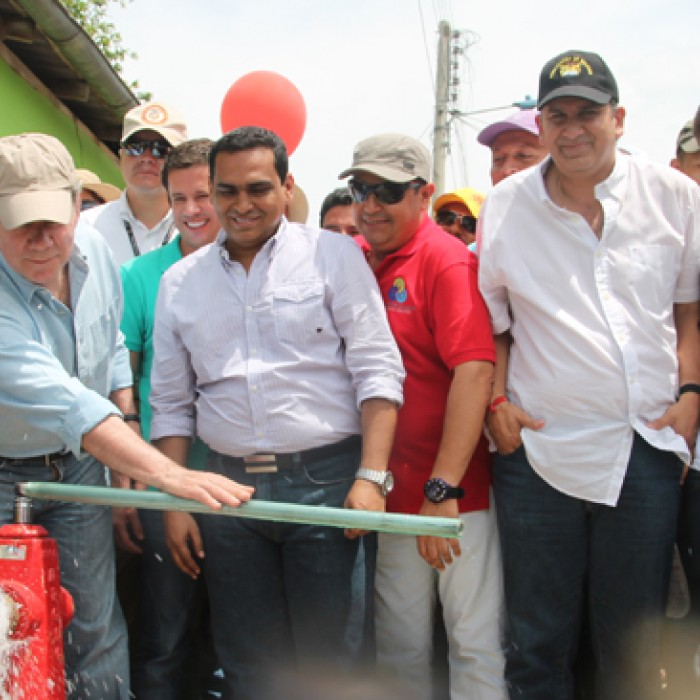

\[caption id="attachment\_11235" align="aligncenter" width="644"\] Falta gravísima la de **Pacho Vega**, exalcalde de El Carmen de Bolívar. Aquí con el presidente Juan Manuel Santos y el gobernador de Bolívar, Juan Gossaín inaugurando un acueducto fantasma. Cortesía.\[/caption\] La Procuraduría General de la Nación formuló pliego de corgos contra el exalcalde de El Carmen de Bolívar, **Francisco _Pacho_ Vega Arrauth.** La medida también cobija a  su Secretario de Planeación y supervisor del contrato, **Mario José Melo Villa**, y al exinterventor de las obras de acueducto del municipio de Caracolí, **Winston Hernández Anaya**. **La conducta fue calificada como gravísima a título de culpa gravísima**. El meollo del problema es la construcción del acueducto de Caracolí, corregimiento de El Carmen de Bolívar, cuyo análisis realizamos en 2017 e informamos en varios artículos, como [Pacho Vega, exalcalde de El Carmen, y Poldino, gerente de Sayco, por un acueducto en el aire, ¡a la cárcel!](./) También publicamos [Por un acueducto en el aire, el compositor Poldino Posteraro, presidente de Sayco, cantará en el búnker de la fiscalía.](./) En este último artículo dijimos:

> _El presidente de SAYCO, **Poldino de Jesús Posteraro Ariza**,   está emproblemado junto con el exalcalde de El Camen de Bolívar, **Francisco José Vega Arrauth**, y otros exservidores, no por una canción sino porque  desaparecieron por arte de magia el **80% de los $ 2.400 millones** en el acueducto del corregimiento de Caracolí, población que sigue sin agua, mientras la Fiscalía le pide la domiciliaria a unos y a otros lo deja en libertad con restricción._

La ODCC, de **Blanca Victoria Sabatg**, denunció el hecho ante la Procuraduría General y la Fiscalía. Ambos entes recibieron documentación suficiente para iniciar sus respectivas investigaciones.

## Los tres cargos gravísimos

Son tres cargos de la Porcuraduría contra el exalcalde. **En el primero,** le cuestionó que al parecer permitiera la ejecución del contrato LP 005 de 2014, que tenía por objeto la “construcción del acueducto de Caracolí, municipio de El Carmen de Bolívar”, sin tener la licencia ambiental requerida para la ejecución de la obra. **El segundo,** señaló que Vega Arrauth pudo incurrir en **falta disciplinaria al participar en la actividad contractual,** sin advertir los principios de economía y responsabilidad. La Procuraduría dijo que "al suscribir el negocio jurídico sin contar con los estudios previos suficientes y completos que determinaran el alcance de las obras, y en lugar en el que se realizarían, porque en el momento de la ejecución se dieron cuenta que las construcciones se estaban adelantando en predios que no pertenecían al municipio". **En el tercer cargo**, la Procuraduría consideró que Pacho Vega suscribió el contrato LP 005 de 2014, con la Asociación de Municipios del Sur de la Guajira -Asoaguas-, pese a que esta se encontraría inhabilitada, por tener vigente una sanción de incumplimiento y caducidad contractual. La falta disciplinaria fue calificada por la Procuraduría como gravísimas a título de culpa gravísima.