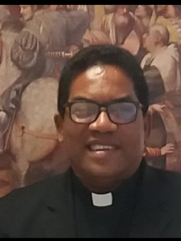

\[caption id="attachment\_11317" align="aligncenter" width="536"\] Los cómics contra la mentira de Arrázola. Cortesía\[/caption\] Ver a los pastores **Miguel Arrázola Pinedo y María Paula García Silva** acosar a su feligresía para que le paguen el diezmo, por PSE o vía virtual, en medio de la cuarentena por ocasión del coronavirus, **causó indignación no solo a gentiles y mundanos** sino también al **mundo cristiano**. ¿Por qué las organizaciones cristianas permiten que **usurpadores de la fe** sigan engañando a su feligresía? ¿**Los Arrázola le roban a Dios** robandole a su feligresía, a la que le promete prosperidad en abundancia y libre de pecados? Si la iglesia **Ríos de Vida** no remueve a sus líderes, la **Dirección de Asuntos Religiosos del Ministerio del Interior a cargo de Lorena Ríos** debe intervenirla, tal como la Superintendencia de Industria y Comercio hace con las empresas que **promueven publicidad engañosa.** Con este trabajo periodístico, abrimos el debate para sanear la practica de la fe de falsos apóstoles que simplemente son empresarios del capitalismo salvaje aplicado a la religión.

## Debate público

\[caption id="attachment\_11324" align="aligncenter" width="339"\] **Lorena Ríos**, directora de Asuntos Religiosos Minterior.\[/caption\] Este debe ser un debate público. No importa la fe que profesemos, pues, estamos en un país donde luchamos por la libertad de credo y la separación de poderes, el poder de Dios del poder del Estado. El autocontrol —de parte de las comunidades cristianas— evitaría a falsos profetas que desdicen de los preceptos bíblicos y, en especial, del **Nuevo Testamento. Así se acaban sectas que le hacen daño a la misma sociedad,** especialmente en épocas apocalípticas**.** **La iglesia Ríos de Vida** —que se ha convertido en un ríos de mentiras— tiene sus reglamentos internos y un Comité de Ética. ¿Por qué la **Asociación de Ministros del Evangelio (AMEB**) no cuestiona la conducta de los Arrázola? ¿**Por qué Lorena Ríos, directora de Asuntos Religiosos del Ministerio del Interior es tan permisiva** para ejercer vigilancia y control de estos usurpadores de la fe anidados en estas congregaciones religiosas? Consulté a diferentes ministros evangélicos y sacerdotes sobre este tipo de acoso para pagar el diezmo en tiempos de coronavirus. **Para el padre Rafael Castillo Torres es escandaloso el acoso de esta pareja de pastores.** El pastor **Ever Molina** pide misericordia para los Arrázola. El presidente del **Concilio de Iglesias Cristianas Unidas de Colombia, José Polo**, quien sin descalificar a los pastores, manifiesta que se debe aplicar el reglamento interno de cada organización.

## **La prosperidad de la fe**

La corriente de la **Teología de la Prosperidad** se centra en el diezmo y en la creencia de que Dios recompensa con bienes materiales por meritocracia. Si tú no lo mereces, aunque lo necesites, **jamás te lloverá maná del cielo**. Debes diezmar y tener fe. Y si diezma y no alcanzas a ser próspero, es porque te falta fe, te dicen. **¿Por qué no son prósperos todos los fieles de la iglesia Ríos de Vida?** ¿Por qué algunos tienen que hacer recolecta para darle los diezmos a los enriquecidos pastores que viven en **Barcelona de Indias,** donde las casas valen más de 400 mil dólares americanos? Según esa teología, cuando tú no prospera es porque no tienes fe. ¿Realmente, los Arrázola le roban a Dios? Sabemos que en **Estados Unidos** existe una lista de pastores enriquecidos—quienes se transportan en jet propio y carros de alta gama— con el trabajo de sus iglesias que en los momentos de crisis no son solidarios con el conjunto de la sociedad o la gente más menesterosa. Después del Huracán que azotó a Houston en 2017, el célebre y rico pastor **Joel Osbteen** fue duramente criticado por negarse a prestar su iglesia para albergar a los damnificados. En este país, según estudios teológicos, el 50 por ciento de pastores de la iglesia neopentecostal pertenecen a la **«Teología de la prosperidad»**, la cual surgió en los años 50 y 60. E**n América Latina** esta corriente, considerada por fuera de la sana doctrina, está propalada en forma exponencial, especialmente en Brasil y Centroamérica.  En la empobrecida **Guatemala** existe el rico e influyente pastor **_Cash_ Luna**, quien tiene la iglesia más grande de Centroamérica, y **recibe millonarias donaciones de políticos corruptos incrustados en el gobierno.** En Colombia tomó auge con el G12 de **Cesar Castellanos**, dueño de la empresa religiosa Misión Carismática Internacional (MCI), la cual tiene tentáculos en la política y en el poder económico. De aquí se desprendió el pastor **Miguel Arrázola Pinedo** al adquirir la franquicia, como si fuera un negocio de hamburguesas.

## **Escandaloso, padre Rafa**

\[caption id="attachment\_11319" align="aligncenter" width="547"\] **"Me parece escandaloso"**, dice el padre Rafael Castillo, vicario de la Pastoral Social de la Arquidiócesis de Cartagena.\[/caption\] **Al padre Rafael Castillo Torres**, vicario de la Pastoral Social de Cartagena, por ejemplo, **le resulta escandaloso** lo que aparece en el video donde la pareja de pastores acosa a la feligresía para que paguen el diezmo y las 7 maneras de pagarlo. ¿Los Arrázola le roban a Dios?:

> _«Me resulta escandaloso y contrario a la propuesta de **Jesús, quien jamás propuso el diezmar sino el compartir**. Dejo algunos puntos muy concretos para creyentes y no creyentes, y para personas de buena voluntad que en estos momentos están tratando de cuidarnos, de animarnos y de acompañarnos antes de que fregarnos»._

El vicario de la pastoral nos cita algunos conceptos teológicos que sustenta su criterio de compartir y no diezmar para que no seamos **«credulones»** y seamos más **solidarios**:

1.  El diezmo tasaba un determinado límite. El espíritu de compartir no tiene límites.
2.  El diezmo se redujo a lo económico. **El compartir lo abarca todo.**
3.  El diezmo degeneró en una **sacralización del dinero**. El compartir pretende la humanización de la economía.
4.  No existe un dinero sagrado que esté destinado a Dios y que, por eso, deba negársele a la persona. Dios no reclama para sí. (C. 7,11)
5.   **Las riquezas son para compartirlas** con los demás no para acumularlas. Las ofrendas son para beneficio de las comunidades.
6.  Mientras **la acumulación de riquezas engendra pobreza y desigualdad**, la comunidad de bienes busca la igualdad. Cuando la balanza se inclina de un lado, Dios se monta del otro

## ¿Los Arrázola le roban a Dios?

Reitero: ¿Los Arrázola le roban a Dios? Es la pregunta obligada y recurrente de cualquier cristiano. Ningún creyente honesto debe voltear la cara a un lado para no enfrentar esta situación que es usual en muchas iglesias evangélicas. \[caption id="attachment\_11320" align="alignleft" width="250"\] **Ever Molina:** «Son mercaderes de la fe»\[/caption\] En el nuevo testamento, según los expertos, se habla de ofrendas. Practicar lo contrario es robar a Dios y a los feligreses. Desde la venida de Jesús el concepto de **diezmar/ofrendar** está destinado **«a ser un gozo y una bendición»**, y no necesariamente debe ser algo material. El Ministerio del Interior considera que los diezmos y ofrendas no son obligatorios sino voluntarios. Para el pastor evangélico Ever Molina, los Arrázola le han torcido el pescuezo a la Palabra_:_

> _Hablan de la piedad, pero niegan su eficacia. Estos son mercaderes de la fe. No buscan las ovejas por su alma, la reclutan por su lana. Le han torcido el pescuezo a la Palabra, adaptando una ley para la nación judía a la iglesia cristiana y le roban las bendiciones que dios les da con astucia y mentiras. Dios tenga mi__sericordia de ellos, porque con Dios nadie juega»._

## ¿El Roscograma de la avaricia?

\[caption id="attachment\_11316" align="aligncenter" width="590"\] Los memes. Ríos de Vida o **«Ríos de Avaricia»**. Los cibernautas le han dado hasta con el bate de aluminio.\[/caption\] En el 2016 investigué el **roscograma de los Arrázola**. El artículo me lo censuró el juez Octavo Penal Municipal de Cartagena, Luis Germán Herrera vanegas. Demostré su avaricia, su desmedido amor por el dinero, raíz de todos los males (Timoteo 6:10), ya que al codiciarlo, se pierden en el camino y van directo al infierno. Y le llamé a Miguel Arrázola el **_pastor de las lucas_**, porque no es lo mismo decir «**_dame a Lucas 10, que dame 10 lucas»_**. Ellos hacen lo contrario a lo que dice la Biblia.  Lo peor es que existen **unos pendejo**s (el padre Rafa los llama _credulones_) que creen en **pastores sinvergüenzas** y religiosamente le llevan la primicia, el pacto y el diezmo en tiempos de coronavirus. Hace 3 años (marzo de 2017) la pareja de falsos profetas me amenazó de muerte. Viví días intensos en aquel momento. La fiscalía archivó sospechosamente la investigación. En 2018 me atacaron con denuncias penales y tutela y les tumbé todas esas acciones. **Los pastores quedaron en vergüenza pública**. No obstante, a finales de 2019 me volvieron a atacar con la misma tutela. Estaba incapacitado por una cirugía en la vista y no me pude defender. Presentaron un incidente de desacato y el 21 de marzo terminé de pagar una orden de arresto por haberle hecho **control social a la iglesia Ríos de Vida**, que en realidad es un **río de avaricia**.  **El mundo al revés**: Los buenos son esos pastores avaros y los periodistas que los denunciamos somos los malos de la película. 

## En vergüenzas

**¿Por qué Dios no nos libra de pastores sinvergüenzas?** En realidad, la feligresía siente en su interior la necesidad de que desde afuera le pregonen la Palabra de Dios. Pero en cada uno de nosotros habita el Espíritu Santo y podemos hacer los milagros más asombrosos. Es un problema de fe. **Los malos existen para que los buenos brillemos con la luz divina. (Te invito a ver: [Sin Goliat, David no hubiese existido](https://youtu.be/GLfMdpv__ZY)).** Los pastores del **ro****scograma** quedaron en vergüenza pública. Esto debía ser así, porque reciben lo que siembran. Siembran avaricia, acoso, persecución. Ahora reciben la desaprobación de los cristianos y el repudio exacerbado de gentiles y religiosos, de mundanos y creyentes. Nadie se escapa de la ley de Dios. Y Jesús lo dijo:

> [**Juan 4:37**](/articulos/john/4-37.htm) «Porque en este _caso_ el dicho es verdadero: **‹Uno es el que siembra y otro el que siega›»**.

**Como cristiano****, practico las enseñanzas de Jesús.** Como periodista oro diariamente por estar en el camino de la verdad (Proverbios 119). Como humano, entrego todo por mi prójimo. Me meto en problemas, sufro persecuciones, cárcel y amenazas de muerte por pregonar la verdad en la defensa de los derechos humanos, especialmente de los más débiles. Esa es mi vocación. Esa es mi obra para la humanidad. Desde los 14 años -cuando supe para qué vine a este mundo- estoy comprometido con mi prójimo. **Es el milagro que tengo para el Universo.** **Esto no es nada personal con los Arrázola.** El problema reside en que su conducta choca con la Biblia. Los apóstoles les responden a Dios, pero en la tierra deben responderle a la sociedad donde viven. Por tanto, no se escapan del control social. Si reciben dinero de la feligresía están sujeto a la vigilancia y al control social. Los Arrázola están por el mal camino, pero ellos creen que son caminos de verdad. Viven su propia desgracia. Cayeron en vergüenza. Esa es la verdad. ¿Los Arrázola le roban a Dios? Dios lo sabrá y seguramente tendrá un libro donde le tienen apuntado sus faltas.

## Ni odio ni rabia

Si bien he sufrido la persecución de los Arrázola desde marzo de 2017, en mi corazón no hay un centímetro de odio ni de rabia. No alcé un dedo contra los Arrázola. Ellos se autodestruyen con su conducta dolosa, porque hay una mano invisible que los conduce por el camino de la perdición, aunque ellos crean que es de salvación. El gerente de la **Ese de Dibulla** **me amenazó de muerte** y cayó en desgracia: siendo muy joven, murió de un infarto fulminante sin cumplir la promesa de hacerme daño. Presenté la denuncia ante la fiscalía, pero ésta no hizo absolutamente nada. ¿Cuántos me han querido matar? Aunque esto sea muy personal y los cánones del periodismo me limiten, siento un espíritu de protección que me rodea desde muy chico. He salido de grandes problemas, incluso, al borde de la muerte. Mis enemigos han sufrido. Yo nunca les he deseado el mal. Quien desea el mal al prójimo, él recibe lo que siembra. El acoso para pagar el diezmo en medio de las penurias económicas que provoca el confinamiento, la cuarentena, realmente es **un crimen de lesa humanidad que algunos pastores cometen**. Los miembros de la iglesia **Ríos de Vida deben dar el debate en su interior y relevar de sus cargos a sus líderes**. Lo pueden hacer, y lo deben hacer. Mientras la Familia Arrázola vive como reyes en el exclusivo condominio Barcelonas de Indias, desde el barrio Nariño me llama el **periodista Manuel Lambis** manifestandome que muchas familias están sin comer. Nariño está cerca de la iglesia Ríos de Vida, sus vecinos pobres, y nunca han realizado una jornada de solidaridad con esa población muy necesitada. **¿Los Arrázola le roban a Dios?**

### Te invito a leer: [Sin el traidor de Judas, Jesús no hubiera cumplido su misión](/articulos/sin-el-traidor-de-judas-jesus-no-hubiera-cumplido-su-mision/)