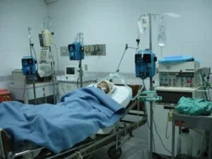

\[caption id="attachment\_11333" align="aligncenter" width="581"\] **Arnold Ricardo**, el primer muerto del **Covid—19. Dejaría a mil contaminados.**\[/caption\] El 4 de marzo, el taxista **Arnold de Jesús Ricardo Iregui** transportó a dos italianos. No sospechó que ese mismo día comenzó la cuenta regresiva de su muerte y que iba a dejar sembrado el **virus en más de mil contaminados** en Cartagena de Indias. Murió sin saber que tenía coronavirus, sin que lo atendiera un neumólogo en la Clínica Cartagena del Mar de la red hospitalaria de la Eps **Salud Total, y sin ver a sus dos hijos para celebrar sus 58 años el 20 de marzo, pues, su muerte le sobrevino el 16 de este mes**.

## Arnold, sin santos óleos

El taxista pasará a la historia no solo por ser el primer muerto de este maldito virus sino también porque murió en la soledad de una **UCI de Cartagena del Mar**. Lo enterraron clandestinamente. Nadie rezó por él. Ni un solo réquiem. Ni una sola oración. **Ni un sacerdote o pastor que le diera los santos éleos**. No tuvo un solo acompañante para darle el último adiós. Ni siquiera su hermana Liliana, portadora del maligno virus pudo verlo antes de que un horno crematorio lo redujera a cenizas. Liliana estaba confinada donde pasó junto a su hermano los últimos días de vida. **Ese día que Arnold transportó a los italianos pudo hacer más carreras y obtuvo más dinero**. Uno de sus pasajeros extranjeros tosió y se aclaró la garganta, pues, tenía carraspera. Algo normal. Probablemente fue el momento en que en el interior de su vehículo quedaron miles de virus dispersos, esperando penetrar en cualquier cuerpo vivo. Arnold estaba en primera línea y recibió el virus sin saberlo. Tampoco supo por qué le mamaron gallo en la Clínica Cartagena del Mar para que lo atendiera un neumólogo que le tratara la neumonía complicada que le habían diagnosticado. **¿Negligencia médica?** Salud Total debe responderle a la sociedad y a los familiares del paciente que se vino a constituir en la **primera víctima fatal del coronavirus en Colombia**.

## **¿Por qué mil contaminados?**

¿Realmente Cartagena y Colombia tienen el número de contaminados que el Ministerio de Salud dice haber? **La respuesta es un rotundo no**. Si la muerte del **taxista Arnold de Jesús Ricardo Iregui** ocurrió el 16 de marzo y cinco días después el gobierno admitió que fue por coronavirus ¿cuántos contaminados dejó su estela? El análisis lógico indica que podría ser más de mil. Y éstos, a su vez, ¿cuántos dejaron? ¿Con cuántos compañeros (taxistas) interactuó Arnold? ¿Y si 10 taxistas resultaren contaminados? ¿Cuántos taxistas transportaron a extranjeros contaminados? El crecimiento del virus en Cartagena sería exponencial. **Esta cifra no la vamos a conocer nunca**. ¿Por qué? A la inmensa mayoría de los potenciales contaminados jamás se le va a practicar la prueba del virus. Si no se la han hecho a las enfermeras de Salud Total, muchos menos a todos los taxistas que interrelacionaron con Arnold. ¿Cuántos cruceros y barcos llegaron entre febrero y el 8 de marzo de 2020? ¿Cuántos vuelos de Europa? ¿Cuántos extranjeros de Europa, especialmente de España, Francia e Italia llegaron a Cartagena? ¿Cuántos estuvieron en el Festival de Cine, en el Hay Festival y en los Carnavales de Barranquilla? Los extranjeros europeos y americanos que llegaron a los carnavales de Barranquilla se vinieron a Cartagena. Parece que las autoridades **no nos están hablando de la gravedad del caso**. **Esto indica que la única manera de contener el virus es la prevención**. Limitar el contacto. Duplicar las medidas higiénicas. Dicen los expertos que solo con el lavado de las manos, por los menos, 5 veces al día, reduce la contaminación en un 50%.

## **30 enfermeras de Salud Total**

\[caption id="attachment\_11337" align="aligncenter" width="586"\] **No hay suficientes UCI en Colombia** para atender el 5% de los infectados, que es la cantidad que se espera. ¿No entiendo por qué a Arnold lo mandaron a morirse a su casa?\[/caption\] A cerca de 30 enfermeras de **Salud Total** -que interactuaron con el médico y otros profesionales que atendieron al taxista- **no se les ha practicado la prueba del coronavirus**. La hermana de una enfermera de esa EPS que interactúo con el médico contaminado me llamó angustiada, porque hasta el día de hoy no la han llamado para hacerle el análisis clínico con el fin de descartar la presencia del **Covid-19.** De esas 30 enfermeras ¿cuántas están contaminadas? Para detectar la presencia del virus se deben hacer hasta tres pruebas al personal médico que está en primera línea. Existen casos que las dos primeras pruebas salen negativas para Covid—19, pero la tercera dio positivo. Por esa razón se entiende la necesidad de que las EPS e IPS le practiquen continuamente las pruebas al personal que atiende urgencia y, en especial, los que se encuentran atendiendo a los contaminados. ¿**El Dadis, de Álvaro Fortich, está vigilando que las diferentes EPS e IPS cumplan con el protocolo?** Tener familiares médicos, profesionales de la salud, enfermeras o auxiliares clínicos que están en el frente de batalla -**_primera línea de fuego_**\- contra los estragos del coronavirus, no solamente se convierten en un alto riesgo de contaminación para su familia sino también de estar cerca de la muerte. Los protocolos de protección han sido irrespetados por las mismas Eps, cuyos dueños, por ahorrar dinero, no dotan al personal de los insumos necesarios.

## **Salud deshumanizada**

El asunto es que en Colombia debido a un sistema privatizad, los mercaderes de la salud menosprecian los gastos que deben hacer para el personal médico y paramédico. Por ejemplo, profesionales y personal auxiliar de **Salud Total** -que me pidieron reservar las fuentes- denunciaron que un tapaboca **No 095** les debe durar una semana. **No es un asunto de alarma injustificada sino de alto riesgo.** El personal médico y paramédico debe prepararse para desenlaces fatales que la enfermedad puede causar a los que están en la primera línea de fuego de la atención a los afectados. En estos momentos de crisis sanitarias, el estado y los dueños de Eps e IPS deben duplicar las medidas de seguridad en el trabajo para su personal médico y clínico. Pero hasta esta semana, los empresarios de la salud han preferido economizarse en el gasto que garantizar la vida de su personal hospitalario.

## **La carrera de la muerte**

Desde que hizo la carrera de la muerte, Arnold no se imaginó jamás que portaba el coronavirus. Hacía de 20 a 30 carreras diarias. El tiempo de incubación del coronavirus dura hasta 14 días. Los primeros síntomas los vivió el 8 de marzo, tal como aparece en su historia clínica que porta Salud Total. Si hacemos un _flashback_, y retrocedemos 10 días atrás, por ejemplo, nos encontraremos a un taxista haciendo su trabajo sin ninguna medida de protección, como suele hacerlo cotidianamente. Si hacía una media de **25 carreras/día** con un promedio de tres pasajeros carrera, nos encontramos que interactúo con **75 pasajeros diarios**. Súmele la interactuación con su familia, los vecinos y compañeros de trabajo. Propongamos que sean 25 personas más. Tenemos un total de 100 personas/día que interactuaron con Arnold. Ahora multipliquemos esta cantidad por 10 días. El resultado es asombroso: **mil personas potencialmente contaminadas.** Ahora, no se trata de crear pánico. Es simplemente un ejercicio mental para que las autoridades y la sociedad extremen las medidas de protección. Pero debemos acércanos a la verdad de lo que está sucediendo.

## **La ruta de la muerte**

Veamos la ruta tomada por el taxista **Arnold de Jesús Ricardo Iregui**, quien pudo dejar más de mil contaminados. **El 4 de marzo, día primero**. Transporta a dos turistas italianos. (La fecha no está confirmada por el periodista). **El 8 de marzo**. Arnold presentó los primeros síntomas del coronavirus. Fue atendido por primera vez cuando llegó a la **urgencia de Salud Total en Santa Lucía**. Llegó a la sala acompañado de su hermana. Se sentó en una de las sillas disponibles. Duró más de una hora, porque el médico de filtro que hace el **triage o triaje lo clasificó en el nivel 4, o sea, una urgencia menor**. Su hermana, que no tenía los síntomas, pudo interactuar con el vigilante, la que tramita la documentación, y los que están sentados a su lado. No sabemos si Arnold fue atendido por un especialista, o si el médico de urgencia le recetó **acetaminofén e ibuprofeno**, que son los dos medicamentos estrellas que las EPS ordenan a los médicos recetar y que no se puede hacer para el coronavirus. Los familiares deben guardar la fórmula médica como evidencia del tratamiento recibido. **El 11 de marzo**. Arnold regresa de nuevo a la urgencia de Santa Lucía con los síntomas acentuados, según familiares del taxista. Hizo el mismo recorrido que el 8 de marzo y entró, junto a su acompañante, en contacto con cierta cantidad del personal médico.

## **Arnold es confinado**

**El 13 de marzo**. Arnold regresa a la urgencia de Salud Total de Santa Lucía. Sus condiciones de salud son críticas. Fiebre alta, dolor de garganta, tos, secreciones nasales y dificultad para respirar. Los síntomas son críticos. Queda internado en urgencia hasta cuando la oficina de referencia y contrarreferencia le consigue cama, la cual no había. El único sitio donde hallaron disponibilidad fue en la **Clínica Cartagena del Mar, de Rolando Bechara**. En esta oportunidad le tomaron dos muestras de laboratorio clínicos para saber si tenía el Covid-19, las cuales mandaron al Instituto Nacional de Salud (INS). **Las pruebas salieron negativas**. **Sábado 14 de marzo**. La clínica Cartagena del Mar decide aislar a Arnold Ricardo Iregui en una habitación de su casa junto a su hermana,  en el barrio Los Alpes, al sur de Cartagena. Los resultados clínicos de coronavirus no se conocieron ese día. **El 16 de marzo.** La noche anterior, Arnold de Jesús no había podido dormir, tampoco su hermana que lo cuidaba. La flema lo ahogaba. No podía respirar. Una ambulancia lo transportó de nuevo a la Clínica Cartagena del Mar. Los médicos no pudieron hacer nada. Arnold dejó de existir este día sin que un neumólogo lo viera.

## **Mil contaminados**

La hipótesis sugiere que los mil contaminados debemos multiplicarlos por 10, por el solo caso de Arnold. De esta historia podemos destacar varios hallazgos. Que la primera **muerte oficial del coronavirus fue por contacto**. La hipótesis indica que **fue con los italianos**. Que fallaron todos los protocolos de protección para el personal médico. Que hubo **falla en el servicio** de las autoridades del Distrito de Cartagena al permitir desembarco de cruceros y aviones sin aplicar los protocolos de protección, por ejemplo, la cuarentena. Que el transporte público es el principal vehículo de la propagación del coronavirus. Que por cada taxista portador del virus pudo provocar más de mil contaminados. Tenemos una gran ventaja con relación a Bogotá. Los expertos dicen que el virus tiene más tiempo de actividad en temperaturas inferiores a 25 grados que en medio del sol abrazador de la Costa Caribe. En nuestra temperatura, **si el virus no encuentra donde anidarse, se inactiva en tres horas**. Así sucedió en Italia, donde las zonas más afectadas son las más frías, las cuales quedan en el norte de esa península. Si alguien infectado estornuda en el interior de un taxi con aire acondicionado, **esparce miles de gotículas en su interior**. Según la OMS, solo el aire renovado y caliente del ambiente lo puede “matar” en tres horas o en varios días, a no ser que encuentre a una persona que lo reciba o toque la parte infectada y después se lleve la mano a los ojos, la boca o la nariz. \* **El final** Arnold murió sin saber que tenía **Covid-19**. Tampoco fue atendido por un neumólogo. El mejor día de su trabajo fue el inicio de una ruta trágica que lo llevó a la muerte. Ahora podrían ser más de mil contaminados con ese virus maldito. Esperemos que transcurran los 14 días desde que tuvo contacto con esas personas y los mil contaminados se reduzca a sólo el 10%. \*\*\*\*\*

*   _En nuestro caso particular, nos desinfectamos con Puerseu (**amonio cuaternario**), un producto de Amway que distribuyo como empresario independiente desde hace dos años. El amonio cuaternario ha sido efectivo para combatir los antecesores del Covid-19, como el MERS y el SARS. En España e Italia se está usando para desinfectar los focos del coronavirus hallados en ancianatos y otros establecimientos públicos, incluso, clínicas y hospitales._ 

[**Te recomiendo leer**:](/articulos/presidente-decreta-estado-de-excepcion-contra-el-coronavirus/)

## [«Presidente decreta estado de excepción contra el coronavirus»](/articulos/presidente-decreta-estado-de-excepcion-contra-el-coronavirus/)

## [Bogotá desaceleró la expansión del coronavirus](/articulos/bogota-desacelero-la-expansion-del-coronavirus/)

## [El diezmo en tiempos de coronavirus, ¿los Arrázola lo pueden cobrar? (I)](/articulos/el-diezmo-en-tiempos-de-coronavirus-los-pastores-lo-pueden-cobrar/)