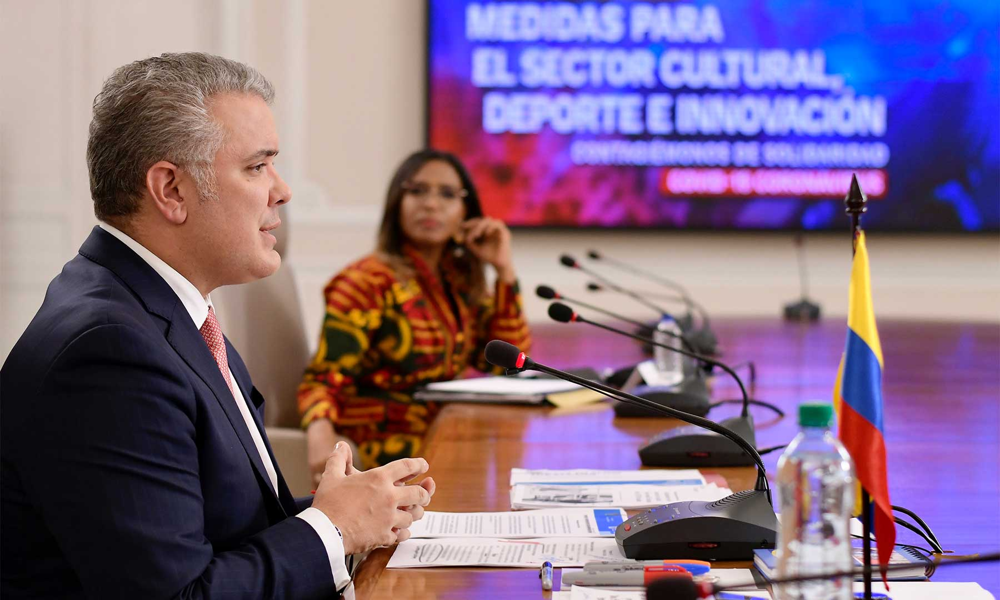

\[caption id="attachment\_11349" align="aligncenter" width="575"\] En nueva fase de mitigación frente al COVID-19, es importante acelerar pruebas y ampliar capacidad de la red de salud, explicó el Presidente Duque al intervenir en el programa de televisión ‘**Medidas para el sector cultural, deporte e innovación’. ¿Y el lujo de China?**\[/caption\] Presidente Duque ¿cuál fue **«el lujo de China» de controlar el coronavirus con el aislamiento total y una intervención sanitaria sistemática de 1.800 médicos en la provincia de Hubei, y evitó que se propagara en todo el país?** Usted no lo dijo, **China goza de una economía planificada** y a todos se le garantizó su supervivencia económica y sanitaria durante el aislamiento total. Ese fue el lujo de China. El centro de la contaminación mundial fue Wuhan, capital de la provincia de Hubei, la cual fue **intervenida por 1.800 profesionales de la salud** que contaron con el equipamiento de bioseguridad necesario para la contención de un virus que se expande con facilidad. Este fue el lujo de China. Es cierto, el lujo de China **fue no ahorrar dinero para desplegar una acción masiva contra coronavirus,** mientras sus científicos se devanaban los sesos para buscar una vacuna contra el coronavirus.

## «El lujo de China»

Cuando un gobierno es controlador no permite la libre expresión de su pueblo. Y esta es la realidad del gigante asiático. Al principio el gobierno chino escondió el virus. Pero una vez se demostró la gravedad de la infección, el Estado centralizado desplegó una acción que permitió atender debidamente a los infectados, **decretó el aislamiento y a todos se les garantizó la subsistencia.** Nos enseñó que l**a economía debía ponerse al servicio de las necesidades de la gente** y no lo contrario. No hubo miedo para decretar el aislamiento total de la población. **Destinaron los recursos necesarios para construir espacios hospitalarios de expansión en 10 días**. Esos espacios fueron dotados de los aparatos tecnológicos y médicos de punta. Y lo que es más importante, **contaron con un ejército de médicos y enfermeras** preparados para asumir altas responsabilidades médicas y clínicas para doblegar el coronavirus. Este fue el lujo de China.

## Garantizar el mínimo vital

Como una manera provocadora, antes que el presidente decretara la cuarentena total, publicamos el artículo [«Presidente decreta estado de excepción contra el coronavirus](/articulos/presidente-decreta-estado-de-excepcion-contra-el-coronavirus/)». Aquí señalamos:

> «Si fuera presidente de Colombia, para enfrentar esta crisis sanitaria ocasionada por el coronavirus, **adoptaría medidas excepcionales sin temer las consecuencias que les podría provocar a los grupos estratégicos del poder real en nuestro país, de los Luis Carlos Sarmiento, los Santo Domingo, los Ardila Lülle,** y demás cacaos. Lo haría pensando en el interés general, especialmente de las poblaciones más vulnerables».

Y también se dijo:

> «Para mitigar el impacto social de la calamidad crearemos el **Fondo Emergente de la Economía Informal (FEEI)**. Auxiliaremos a todos aquellos que viven del rebusque (10 millones) y que por el impacto de la emergencia quedarán en una situación calamitosa. Crearemos el Fondo de Contingencia Salarial para aquellos trabajadores de microempresarios y pequeña industria que quedaron cesantes por la emergencia sanitaria. **La gran empresa asumirá el coste laboral del aislamiento de sus trabajadores** con su estabilidad reforzada durante este período. Será su aporte solidario a esta calamidad pública».

## Tiempo de incubación

Los expertos dicen que el virus se refleja en una semana. **Arnold Ricardo, el taxista que murió por coronavirus se infectó el 4 de marzo**. El 8 de marzo se presentó en la urgencia de la Eps Salud Total de Santa Lucía de Cartagena. El médico de turno lo trató como una gripe común y un catarrillo. Lo mandó a Casa. Regresó el 11 de marzo, lo mandaron de nuevo para su casa. Retornó el 13, más grave. El 14 lo internan en la **Clínica Cartagena del Mar**. **El 16 de marzo murió en ese centro clínico**. Como se puede ver, pasaron 4 días para manifestarse los síntomas del coronavirus. Los expertos de la Organización Mundial de la Salud manifiestan que el patrón para presentarse los síntomas del virus es una semana, pero puede durar 14 días, y hay casos que se manifiestan en 27 días. **La DW.com publicó que Christian Drosten**, experto alemán en coronavirus del hospital Charité de Berlín, considera que este tipo de casos donde los síntomas aparecen 15 días después, son solo de relevancia limitada. De hecho, si esto es así, **un mes bastaría para un aislamiento total**. En Wuhan fue de dos meses y medio. Drosten dijo:

> _«Una fuente de error frecuente en los tiempos de incubación aparentemente muy largos se deben a una exposición temporal inadvertida»_.

## Tiempo de cuarentena

¿Cuántos días debe durar la cuarentena? En China la cuarentena duró cerca de tres meses. El 18 de marzo se dio por terminada la emergencia social. El virus apareció en Wuhan a finales de diciembre de 2019, por lo cual se denominó Covid-19. En Colombia, **el 25 de marzo fue declarada sana la dama británica de 84 años que fue internada el 8 de marzo con coronavirus en la clínica MediHelp**. En el día de hoy, 31 de marzo se le dio de alta, libre del virus, según el Instituto Nacional de Salud. (Ver [Británica curada de Coronavirus](https://es.noticias.yahoo.com/colombia-pasa-contenci%C3%B3n-mitigaci%C3%B3n-coronavirus-164633953.html). O sea, duró 17 días para su recuperación total. **Los epidemiólogos colombianos que asesoran al presidente Iván Duque deben decirle la verdad.** Y el presidente debe adoptar las medidas pertinentes sólo teniendo en consideración la sanidad pública. Duplicar la cuarentena y llegar hasta el 30 de abril podría ser una medida extrema, ¿es necesaria? Ese fue el lujo de China. Si es necesaria una cuarentena total de 30 días, **el presidente no puedo dudar en adoptar la medida**. Pero eso sí, debe garantizar a cerca de 10 millones de trabajadores informales el **mínimo vital**. Sin duda **el lujo de China** fue adoptar las medidas necesarias y, al mismo tiempo, le garantizó a la ciudadanía el mínimo vital. El coronavirus encontraría caldo de cultivo en cuerpos subalimentados y habría resultados adversos. **El hambre mata como el coronavirus**. TE INVITO A LEER:

## [«Presidente decreta estado de excepción contra el coronavirus](/articulos/presidente-decreta-estado-de-excepcion-contra-el-coronavirus/)»

## [Mil contaminados dejaría el primer muerto por coronavirus](/articulos/mil-contaminados-dejaria-taxista-muerto-por-coronavirus/ "Mil contaminados dejaría el primer muerto por coronavirus")