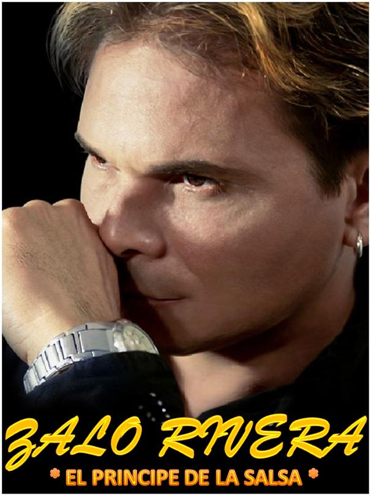

\[caption id="attachment\_11213" align="aligncenter" width="549"\] **Zalo**, el príncipe de la salsa.\[/caption\] **Murió Zalo, el príncipe de la salsa.** A las 8 de la noche de este primero de marzo dejó de cantar para siempre uno de los artistas del género salsa de mayor relieve de Bolívar y del país. Zalo Rivera, 52 años, murió luego de padecer una enfermedad catastrófica. Su velación se cumplió en funeraria Los Olivos. Las exequias fueron a las 5:00 de la tarde de este 2 de marzo. Se dió a conocer internacional desde 2009 con uno de sus éxitos, **«Lloras»**, el cual le valió el premio internacional de salsa en Mexico. En este país ocupó, en algunos momentos, los primeros lugares. A México frecuentemente se iba de giras con la **Orquesta Steven México**. De hecho siempre lo incluían en grandes presentaciones de salsa mexicana. **Gonzalo Rivera García, nacido en Magangué** y radicado desde hace 40 años en Cartagena, fue integrante de **Los inéditos** y de otras agrupaciones, hasta crear su propio grupo de salsa. A pesar de su recorrido internacional, la radio local poco le dio relevancia. No le programaban sus canciones. Diferente a México donde sus canciones son programadas por las emisoras nacionales. Se fue Zalo a cantar desde el Cielo. https://youtu.be/XCjevMRF3fA