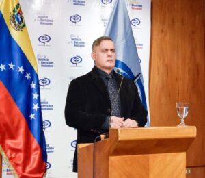

ENTREVISTA CON EL FISCAL GENERAL DE VENEZUELA, **TAREK WILLIAM SAAB** https://www.youtube.com/watch?v=AmZH75875Q8 La gente en Venezuela se pregunta ¿por qué razón no capturan a **Juan Guaidó?** El fiscal general de la República Bolivariana, **Tarek William Saab,** en entrevista directa concedida a **www.voxpopuli.digital** desde Caracas, dijo que **el hijo putativo del presidente Duque se está diluyendo**. Agregò:

> _«No es el momento de capturar a Guaidó. El proceso de judicialización no ha culminado con una medida privativa de la libertad. Este no es el momento (...) Estamos esperando que se diluya a pesar de tener el apoyo de Donald Trump y de la extrema derecha mundial con centenares de millones de dolares que le invierte.»_

Tarek William manifestó que **en los momentos de crisis se sabe quiénes son los lìderes.** El presidente Maduro cuenta con el **apoyo cívico militar**, lo cual le lleva año—luz a los gobernantes del continente. Por ejemplo, a solo 8 dìas de conocerse los primeros casos de **Covid-19**, el presidente adoptó de inmediato las medidas pertinentes para contener la expansión del virus y se le garantizó a la gente un **plan de alivio para soportar la cuarentena.** \[caption id="attachment\_11304" align="aligncenter" width="712"\] El fiscal general de Venezuela **Tarek William Saab.** Cortesía\[/caption\]

## 300 mil muertos lleva el bloqueo

A pesar de la polìtica de **bloqueo económico del gobierno de Trump,** que ha causado màs de **300 mil muertos** en 7 años en Venezuela, vamos avanzando. Cuestionó la opinión de algunos gobiernos en el sentido en que el bloqueo no incide en la crisis econòmica de Venezuela. Tarek dijo que **sí incide, porque no podemos comerciar con los países que queremos**, ya que no podemos vender nuestra principal riqueza ni comprar los medicamentos necesarios para la población más necesitada de nuestro país. Finalmente Tarek William dijo **que el tiempo político del  hijo putativo del presidente Duque se ha venido diluyendo**. Pronto le llegará el momento de privar de la libertad a este sujeto, hijo putativo del presidente Duque. La gente en Venezuela se pregunta ¿por qué razón no capturan a **Juan Guaidó**. El fiscal general de la República Bolivariana, **Tarek William Saab,** en entrevista directa concedida a www.voxpopuli.digital desde Caracas, dijo que **el hijo putativo del presidente Duque se está diluyendo**. O sea, el presidente Maduro no tiene _culillo_ sino que no es el momento político para detener al presidente a la sombra del régimen de Venezuela, **Juan Guaidó**.