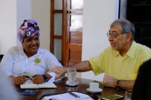

\[caption id="attachment\_11429" align="aligncenter" width="770"\] **La propaganda polítca** del alcalde Dau Chamat. Cortesía Oficina de Prensa Distrito.\[/caption\] **William Dau Chamat** quiere enriquecerse con lo más mínimo del presupuesto de todos los cartageneros. Es un alcalde de puñalada trapera. Mientras te da cátedra de anticorrupción, despedaza el escaso dinero del **Covid-19** para hacer una contratación leonina, amañada y _malándrica_. Mientras posa de pedir ayuda a los privados, se gasta el dinero de los más pobres con sus amigotes ricos.

## **Conducta malándrica**

Si el alcalde de Cartagena es **investigado disciplinaria y penalmente** por la Procuraduría General de la Nación y la Fiscalía por burlar deliberadamente el régimen de contratación pública, estaría en serios problemas. Está favoreciendo a particulares dentro de la emergencia social provocada por el Covid—19. Algunos veedores en Cartagena son excépticos porque señalan que el **procurador Fernando Carrillo** es uno de los protectores del abogado William Dau Chamat, quien —antes de posesionarse— inteligentemente le pidió ayuda para **_"hacer una buena administración contra los malandrines"_**. La ayuda la encontró con Bruce Mac Master y sus seguidores de la ANDI y Fenalco. Con este artículo iniciamos una serie donde se muestra y demuestra la premisa básica de esta investigación periodística: **la conducta _malándrica_ del alcalde Dau en su gestión pública**. Nos hace recordar la viveza del malandro del mercado de Bazurto que, luego de robarle la cartera a la víctima, grita a todo pulmón: **_“agarren al malandrin”_**, y toda la gente sale corriendo detrás del supuesto malandrín sin saber que el malandrín es él. En las próximas entregas analizaremos algunos contratos que **pondrán al descubierto la verdadera catadura de William Dau**, quien ha salido más general que Dionisio Vélez: **Veneplast**, el multimillonario contrato con la firma española **Innoquant o Moca** de _big data_ para controlar el coronavirus (no lo hicieron en España, ahora quieren hacerlo en Cartagena), y la ejecución de los **$20 mil millones** que el concejo distrital le aprobó para contener el Covid—19 y adquirir ayudas humanitarias dirigidas a los más pobres de La Heroica.

## Las Ops

El alcalde mayor incumple deliberadamente los términos del decreto **No 0091** del 29 de marzo de 2020. La iniciativa protege a los servidores públicos -vinculados a través de órdenes de prestación de servicios (OPS)- de **abusos de autoridad cobijados bajo el manto de la emergencia del Covid-19**. Atormentado por las circunstancias y por sus propias creencias, el alcalde está atropellando la **Administración Pública.** Ésta debe responder a los intereses generales bajo los **principios** de eficacia, jerarquía, descentralización, desconcentración y coordinación, con sometimiento pleno a la ley y al Derecho. Veamos el caso de las Ops del distrito de Cartagena. El Distrito puede tener más 3 mil contratos de prestación de servicios. Un porcentaje es inoficioso, es decir, corbata, según informes de auditoría realizado por la contraloría. El artículo 16 del **decreto** **No 0091, para proteger los derechos de los vinculados que sí trabajan, dice:**

> **«Actividades que cumplen los contratistas de prestación de servicios** **profesionales y de apoyo a la gestión.** La declaratoria de Emergencia Económica, Social y Ecológica y la declaratoria de Emergencia Sanitaria, así como las medidas que se adopten en desarrollo de las mismas **no constituyen causal para terminar o suspender unilateralmente los contratos de prestación de servicios profesionales y de apoyo a la gestión celebrados con el Estado»**.

Como se previó que **se podría utilizar la emergencia social del Covid-19** para que gobernadores, alcaldes y gerentes de entidades descentralizadas **abusen de su autoridad** declarando insubsistente al personal laboral o vinculado por OPS, el gobierno estableció una prohibición mediante el citado decreto.

## Cinismo y oportunismo

No obstante, en una forma cínica, antihumanitaria, oportunista e ilegal, el alcalde de Cartagena **se aprovechó de la emergencia social del Covid—19** para suspenderle el contrato a centenares de servidores públicos vinculados —desde hace más de 5 años— por OPS. Esta posición -además de ser oportunista- es de doble moral. Dau contrató OPS con personas de su círculo personal con escala salarial igual o superior a un secretario de gabinete y realiza contratos de construcción de parques o de suministro con una conocida papelería de la ciudad, como Veneplast en plena emergencia de Coronavirus. ¿Será que la población pobre de Cartagena necesita papel para solventar este período de hambre que encierra la cuarentena? Mientras tanto la mitad de la administración no funciona, porque el alcalde no ha contratado el personal necesario. La decisión de Dau contraviene el sentido humanitario que demanda la emergencia social actual, la constitución, la ley y, en especial, el decreto **No 0091** expedido el pasado 29 de marzo de 2020 por el gobierno nacional:  _«Por el cual se adoptan medidas de urgencia para garantizar la atención y la prestación de los servicios por parte de las autoridades y los particulares que cumplan funciones públicas y **se toman medidas para la protección laboral y de los contratistas de prestación de servicios de las entidades públicas**, en el marco del Estado de Emergencia Económica, Social y Ecológica»._

## Por la faja con alevosía

Pero Dau chamat se ha _pasado por la faja_ y con alevosía dicha disposición. Expidió la circular No **No 00401-2020** dirigida a sus secretarios de gabinete y directores de organismos descentralizados para no seguir contratando más OPS, incluyendo a aquellos que fueron contratados en enero por dos meses y medio, y cuyos contratos se vencen este mes de abril. La circular tiene este tenor:

> «_Me permito informarles que **quedan aplazadas hasta nueva orden**, las nuevas contrataciones en la modalidad de órdenes de Prestación de Servicios durante el tiempo que dure la emergencia, (Sic) las cuales en caso de ser necesario deben ser firmadas y autorizadas directamente por mí_».

En otras palabras, **las Ops sí van, pero con personas que él diga**. No con las personas que realmente estén haciendo una labor de apoyo a la gestión administrativa sino con los amigos del alcalde y de su séquito. Entonces tendríamos a decenas de Ops al estilo de Cynthia Amador con el fin de pagar los favores electorales. ¿Cuál es la diferencia? ¿Quién es el malandrín? ¿El concejal que reclama una Ops o el alcalde que se apropia de todo?

## **La reina de la OPS**

\[caption id="attachment\_11431" align="aligncenter" width="525"\] **La reina de la OPS, Cynthia Amador,** le donó su salario a la campaña de William Dau, ahora éste se lo devolvió con $77 millones de nosotros. ¿El malandrín es otro? Cortesía.\[/caption\] Los últimos alcaldes, luego de tomar posesión, **prometen eliminar las OPS innecesarias, pero luego las incrementan**. Un porcentaje de éstas son corbatas adjudicadas ilegalmente a políticos o personas de entera confianza del burgomaestre. Con **Dau Chamat** no sucede lo mismo. Es peor. En esta ocasión, Dau contrató en una OPS a su amiga y primera dama, **Cynthia Amador**, por la suma de $77 millones, cuyos informes de gestión hasta ahora no justifican para que se gane más de $7 millones mensuales. Este ingreso solo lo podría justificar una persona con educación posuniversitaria. Esta Ops rompió el récord que tristemente alcanzó **Dionisio Vélez**, cuyos amigos no alcanzaron la cifra de la Amador. _La primera dama_ no es profesional, tampoco es tecnóloga, ni tiene la experiencia debida para homologar la escala salarial de un profesional. No es nada personal contra Cyntia cuando ponemos este elocuente ejemplo. Ella se lo podría merecer. Pero la alcaldía no es una tienda de barrio. La reina de la OPS, Cynthia Amador, le donó su salario a la campaña de William Dau, ahora éste se lo devolvió con $77 millones de nosotros. Si el alcalde quería ayudar a su amiga debió hacerlo con su propio pecunio y no con el dinero de todos los cartageneros. El alcalde, como cualquier servidor público con capacidad de contratación, debe regirse por los principios básicos de la administración pública determinado por los intereses generales sobre los particulares. El alcalde no está para pagar favores a los amigos que le aportaron con su trabajo a su campaña electoral.

## **Una locura**

Como la mitomanía del alcalde es evidente, le dijo al diario El Universal (con cuya empresa contrató cerca de $60 millones para promover su lánguida figura con dineros del Covid—19);

> “_En estos momentos todos los recursos los tenemos destinados a superar la emergencia del coronavirus. Ahí es donde está todo nuestro esfuerzo, todo nuestro trabajo, todos nuestros recursos. Tenemos que atender a un millón de cartageneros, tenemos que alimentar a 500 mil cartageneros. Hay mucho que hacer. Entonces ponerme a contratar gente que no tenga trabajo que hacer es una locura_”.

La locura del alcalde de Cartagena está llegando a dimensiones insospechadas. Pero más que locura es la viveza propia de los malandros de frías oficinas que, mientras con la izquierda te dan la bendición, con la derecha te están metiendo la **puñalada trapera**. Asi está Cartagena. \*\*\*\*\* Si el anterior artículo te gustó, te invito a leer, comentar y compartir:

## [Candidato Dau denunciado por periodista](/articulos/2019/10/candidato-dau-denunciado-por-periodista-en-defensa-de-la-prensa/)

## [Covid—19: ¡Quédate en casa y muérete de hambre! (II)](/articulos/quedate-en-casa-y-muerete-de-hambre/ "Covid—19: ¡Quédate en casa y muérete de hambre! (II)")

## [Caicedo, ejemplo de cómo afrontar el Covid-19 en Colombia](/articulos/caicedo-ejemplo-de-como-afrontar-el-covid-19-en-colombia/ "Caicedo, ejemplo de cómo afrontar el Covid-19 en Colombia")