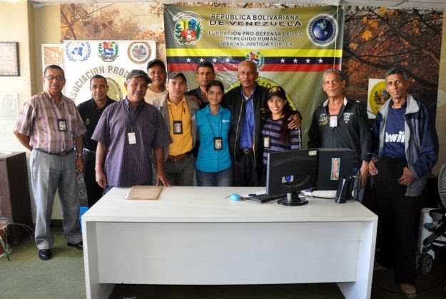

## ESCUCHE LA ENTREVISTA CON GERARDO GUERRA

https://youtu.be/yAjJE2ZUnkc La sola lectura de un expediente de un procesado en Venezuela cuesta 500 dólares. Es la denuncia que hace a [www.voxpopuli.digital](/articulos/) **Gerardo Guerra**, presidente de la [Fundación Nacional Prodefensa Derechos Humanos Libertad Justicia y Orden.](https://www.facebook.com/LjoDdhh/) La escasez, el alto costo de vida, la hiperinflación afectan la vida cotidiana de los venezolanos. También acceder a la justicia se hace más costosa. Esto viola los derechos humanos. Por ejemplo, Guerra dijo que en las notarías, la Fiscalía y en otras entidades cobran en dólares cualquier trámite que se hace. **Accesar a la justicia, cada día se hace muy difícil** y muchos detenidos deben durar más tiempos en las cárceles, porque no tienen dinero para hacer los trámites de libertad.

## ¿Derechos Humanos?

Por esa razón, **las cárceles venezolanas se han convertido en centros donde los internos no tienen la posibilidad de reformarse** y salen, en su mayoría, más descompuestos. Cada día se vuelve más crítica la situación de los derechos humanos, aseguró uno de los líderes de derechos humanos de Venezuela. \[caption id="attachment\_11354" align="aligncenter" width="593"\] Cada día se hace más difícil la defensa de los derechos humanos en Venezuela, dice Gerardo Guerra, defensor de los derechos humanos. Cortesía.\[/caption\] **Gerardo Guerra le hace un llamado al fiscal Tarek William Saab** para que averigue, **por qué se está violentando el artículo 21 de la constitución**, ya que la justicia es un negocio en la realidad. El artículo 21 dice:

> _No se permitirán discriminaciones fundadas en la raza, el sexo, el credo, la condición social o aquellas que, en general, tengan por objeto o por resultado anular o menoscabar el reconocimiento, **goce o ejercicio en condiciones de igualdad, de los derechos y libertades de toda persona**._

**«Podrán cortar las rosas, pero jamás detendrán la primavera»**, advirtió Gerardo Guerra, presidente de la Fundación Prodefensa de los Derechos Humanos, Libertad, Justicia y Orden. **Te invito a leer:**

## [¿Tiene culillo Maduro de que capturen a Guaidó? «No es el momento», fiscal Tarek William](/articulos/tiene-culillo-maduro-de-que-capturen-a-guaido-no-es-el-momento-fiscal-tarek-william/)