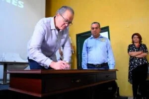

\[caption id="attachment\_11573" align="aligncenter" width="537"\] Sin control ambiental. Una patente de corso para el EPA. Cortesía.\[/caption\] ¿EPA compró patente de corso ambiental? En el gobierno anticorruptivo de **William Dau**, el Establecimiento Público Ambiental-**EPA** de Cartagena, cuyo director es el ingeniero **Javier Mouthon Bello**, pareciera que compró una **patente de corso** con la contratación, al parecer, irregular del arquitecto **Orlando Antonio Ortiz Llanos,** compañero afectivo de la **procuradora Agraria y Ambiental de Bolívar, Mayelis Chamorro Ruiz**.

## En familia

Para hablarlo de una forma coloquial, Ortiz Llanos fue contratado para que le sirviera de asesor general al director del Epa y cuidarle la espalda. ¿Mayelis Chamorro podría meter sus narices en el EPA? ¿Quién lo duda? Y ahora ¿quién vigilará al Epa? ¿Este contrato se configura como patente de corso para tener el permiso de hacer y deshacer sin ninguna vigilancia de la Procuraduría Agraria y Ambiental? ¿Se configura un conflicto de intereses? ¿Cuáles son las irregularidades que se cometieron con la contratación del arquitecto Ortiz Llanos? ¿Por qué fue un contrato tipo sastre siendo el estudio de conveniencia un canto a la bandera? ¿Por qué Ortiz Llanos no expresó sus impedimentos al momento de suscribir el contrato? Éstas y otras preguntas despejaremos en este trabajo periodísticos del gobierno anticorruptible y anticorruptivo de William Dau Chamat. Si bien Mouthon Bello tiene una de las mejores hojas de vida que director alguno del Epa haya tenido, **en este y en otros contratos se les fueron las luces**. Según su hoja de vida, Mouthon es  ingeniero civil de la Universidad de Cartagena, Magíster en Recursos Hídricos de la Universidad de los Andes, máster en Ingeniería Ambiental de la Louisiana State University, doctor en ingeniería de la University Of Guelph y ha sido becario Fullbright. ¿Necesitaba **esta patente de corso?** Además, se ha desempeñado como profesor de la Universidad de Cartagena, asesor de proyectos y fue acreedor de un premio nacional en ingeniería sanitaria ambiental.

## **En contexto**

El 10 de febrero de 2020 a **Orlando Antonio Ortiz Llanos** lo contrató el EPA por **$7.2 millones mensuales** durante 6 meses con un valor total de **$43,2 millones. El objeto del contrato: _“_**_prestación de servicios profesionales consistente en asesoría integral en la dirección General del Establecimiento Público Ambiental”._ La Ops fue aprobada por Denise Moreno. La proyectó Claudia Cristina Gueto Cabrera y la firmó Mouthon Bello. Esta Ops podría ser la patente de corso de esa entidad, puesto que se contrató al compañero afectivo de la procuradora Agraria y Ambiental de Bolívar, Mayelis Chamorro Ruiz ¿Quién vigilará al EPA? ¡Sorpresa! **Ortiz Llanos**, arquitecto, tiene vínculos afectivos y maritales con Chamorro Ruiz. Según fuentes de entero crédito, los dos viven en Cielo Mar, zona norte de Cartagena. Esta situación nos propone un hallazgo significativo cuando se despeje la siguiente pregunta: ¿**Hay conflictos de intereses?** Este contrato tipo sastre, al parecer, sin el lleno de requisitos legales, se hizo con estudios que se adaptaron a las limitaciones del futuro contratista y no lo contrario. Fue un contrato a la medida. El estudio de conveniencia fue acomodado y no se hizo según las necesidades del contratante, es decir, del EPA.

## **Preguntas curiosas**

\[caption id="attachment\_11574" align="aligncenter" width="428"\] En el momento en que fue nombrado Javier Mouthon por William Dau. Tomado del video de Facebook.\[/caption\] Antes de contarles la historia del (haz clic para verlo) [CONTRATO No 30/20](/wp-content/uploads/2020/04/E.P-Ctto-030-EPA-2020-7.2-MM.pdf) del EPA, queremos formularnos varias preguntas curiosas: ¿Por qué muchos contratistas y funcionarios de Dau tienen relación de una u otra forma con el Ministerio Público? ¿Carrusel de la contratación de la Procuraduría con el Distrito? ¿Por qué la Procuraduría está callada frente a los innumerables contratos abusivos de la administración distrital? Son preguntas curiosas, como todas las que hacemos en voxpopuli.digital. En esta oportunidad desmenuzaremos la susodicha Ops de Ortiz Llanos, la cual es groseramente ilegal como la famosa Ops de Cynthia Amador. La diferencia es que ésta no es profesional. **Nota curiosa.** El director del EPA, Javier Mouthon Bello, para justificar la necesidad de contratar a Ortiz Llanos, se dirigió así mismo la certificación de que en esa entidad carece del personal para atender los asuntos que requiere.  Es decir, firmó el formato de Requisición Prestación de Servicios Profesionales en la dirección general dirigido a él mismo. ¿Todo por la patente de corso?

## **Un estudio espurio**

El 27 de enero de 2020 el director del EPA ordenó el **estudio de conveniencia** para contratar la asesoría de un profesional de la arquitectura. Entre otras cosas se dijo: **_“VENTAJAS DE LA CONTRATACIÓN._** _Con la contratación de personas que acrediten idoneidad y experiencia en temática **financiera** se garantiza un asesoramiento integral en la Dirección General del EPA”._ Lo expuesto por el EPA corresponde a una necesidad bastante escueta de contratar una persona sin especificar si es natural o jurídica que asesore a la dirección **financieramente**. En este estudio (ver) presenta 5 falencias que lo invalidan. **(1)** Observamos que no tiene nada que ver con el perfil de **arquitecto urbanista** para lo cual se realizó dicho estudio. **(2)** No justifica la contratación. **(3)** No esboza el objeto para el cual se contrata. **(4)** No detalla las actividades a realizar. **(5)** No expone la insuficiencia de personal de planta con la idoneidad requerida para desarrollar las obligaciones contratadas.

## **Otra falencia**

El estudio previo tuvo otra falencia. Se estableció el plazo del contrato de “s_eis (6) meses desde el cumplimiento de los requisitos de perfeccionamiento y ejecución, sin exceder el 31 de diciembre de 2020”._ Si en el estudio no se determinó las obligaciones a ejecutar, ¿cómo se estableció el tiempo en que se ejecutarán tales actividades de conformidad con las necesidades de la entidad?  Esta situación nos propone que se vulneraron los **principios de eficiencia, eficacia y economía**. Ahora bien. Vayamos a otro criterio del estudio. Requisitos para acreditar la idoneidad:

*   **_Formación._** _Título Profesional en Ingenierías y/o arquitectura, con tarjeta profesional vigente, con título de maestría en planeación territorial o afines_
*   _Siete (7) años de experiencia relacionada con temática administrativa, de ordenamiento territorial.”_

El EPA **parece haber diseñado a la medida del contratista,** **Orlando Antonio Ortiz Llanos,** **la formación y experiencia requerida** dentro de los requisitos para acreditar idoneidad. No se encuentra soportado en documentos previos al contrato porque se requiere un profesional en arquitectura con maestría en planeación territorial con experiencia relacionada de 7 años en temática administrativa de ordenamiento territorial para desarrollar las obligaciones específicas de su contrato.

## **A la medida patente de corso**

Según los estudios previos, las actividades que debe desarrollar el arquitecto Ortiz Llanos son las siguientes:

1.  Brindar asesoría integral al Director General del Establecimiento Público Ambiental de Cartagena, en materia de fortalecimiento institucional para el desarrollo ambiental urbano. 2. Asesorar y apoyar al director general del Establecimiento Público Ambiental de Cartagena en la formulación de planes, programas y proyectos que requiera la entidad en el cumplimiento de sus funciones.
2.  Prestar asesoría y acompañamiento en el marco del fortalecimiento institucional a la Dirección general del Establecimiento Público Ambiental de Cartagena.
3.  Emitir conceptos técnicos con relación directa con el objeto contractual cuando sean solicitados, así como la revisión y verificación de los que le sean encomendados por la Dirección General del Establecimiento Publico Ambiental de Cartagena le asigne.
4.  Asistir, acompañar y apoyar al director general del establecimiento Publico Ambiental en lo relacionado a proyectos estratégicos de impacto urbano – ambiental y que involucren organizaciones y/o dependencias del orden distrital, departamental, regional, nacional e internacional.
5.  Las demás que el Director General del Establecimiento Publico Ambiental de Cartagena le asigne.

Las obligaciones **1 y 3 son las mismas**. El urbanismo requerido en solo 2 de las 6 obligaciones específicas no ameritan los años de experiencia descritos. **Aquí se configura lo que se llama contrato tipo sastre. ¿Es producto de la patente de corso?**

## **Las debilidades**

Es evidente que en este proceso no establecen antecedentes de contrataciones similares, o bien las realizadas con el mismo contratista. Podemos citar los contratos No 24 de 2016, No 241 de 2016, No 333 de 2016, No 057 de 2017, No 194 de 2017, No 331 de 2017, No 014 de 2018 y No 219 de 2018. No se hizo un análisis comparativo con otros de obligaciones parecidas, que permitan establecer si el valor del contrato corresponde a los precios del mercado. O si el proceso de contratación satisface las necesidades de la entidad en cuanto a su misión, objetivos y metas. **No existe una reflexión de la entidad** que permita dilucidar la conveniencia desde la perspectiva legal, comercial, financiera, organizacional, técnica y de análisis de riesgo. Por ley, la entidad debe dejar constancia en los documentos del proceso, de conformidad con lo establecido en el Art. 15 del **Decreto 1510 de 2013**. El contrato fue una caja de irregularidades a la luz de la ley de contratación. La sastre de este contrato fue Claudia Cristina Gueto Cabrera. Lo firmó Mouthon ¿Tendrá consecuencias disciplinarias y penales? Esto es tarea de los organismos de control. Este es un botón de muestra del gobierno del Tractor. Si el Covid-19 puso en evidencia su incapacidad, incompetencia y negligencia, también se le quitó su careta de incorruptible y anticorruptivo. **Y la Procuraduría de Fernando Carrillo muda**. **Próxima entrega:** ¿Conflicto de intereses? El marido de la Procuradora Ambiental en su juramento no se declaró impedido. **Te puede interesar:**

### [¿Quién es el ladrón? Sobrecostos de Dau: Gel antiséptico 300%; Mascarillas 200%](/articulos/quien-es-el-ladron-sobrecostos-de-dau-gel-antiseptico-300-mascarilla-a-19-5-mil-200/ "¿Quién es el ladrón? Sobrecostos de Dau: Gel antiséptico 300%; Mascarillas 200%")

### [Pumarejo, Rey Momo del Carnaval de la Contratación: $44 mil millones en imagen](/articulos/pumarejo-rey-momo-del-carnaval-de-la-contratacion-44-mil-millones-en-imagen/ "Pumarejo, Rey Momo del Carnaval de la Contratación: $44 mil millones en imagen")