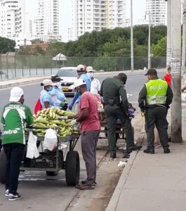
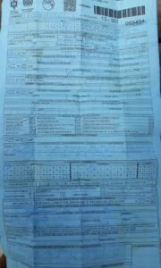
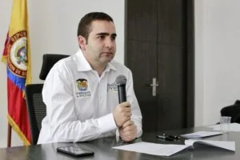

\[caption id="attachment\_11370" align="aligncenter" width="447"\] **El comparendo de Duque y Dau**. Aquí se observa cuando en la avenida El Lago, a la altura del mercado de Bazurto de Cartagena, la policía en compañía de Espacio Público y la Secretaría del Interior detienen a un grupo de carretilleros para imponer un comparendo y decomisar su plante. ¡Quédate en casa para estos trabajadores era condenarlos a padecer hambre. **Cortesía Bonifacio Bony Ávila**.\[/caption\] **¡Quédate en casa... y muérete de hambre!** La realidad es que en Colombia 10 millones de trabajadores informales están **_cruzando el Niágara en bicicleta_**. Lo más grave, son víctimas de medidas punitivas y coercitivas cuando salen a las calles a sobrevivir. **Alcira Ramírez, 45 años**, tenía una venta de minutos de celulares en una esquina de la avenida El Consulado a la altura del barrio España de Cartagena. En un día bueno se podía ganar $30 mil y llevarle el pan de cada día a sus dos hijas. ¿Quién le puede ayudar ahora en estos días de cuarentena que no recibe nada? Si sale, corre el riesgo de que le pongan un comparendo y se la lleven a la estación de policía, como le ha sucedido a miles de _trabajadores independientes_.

## Los pendejos de la cuarentena

**Juan Medina es un vendedor en carretilla, tiene su mujer y tres chicos**. Salía todos los días del mercado de Bazurto a rebuscarse la vida con su carreta llena de bastimentos, frutas y verduras frescas a vender por los barrios populares de la ciudad. Salió hoy, porque sus hijos no tenían qué comer. La policía lo capturó en la avenida El Lago. Había violado el decreto de la cuarentena. Le pusieron un comparendo de un salario mínimo que ahora no sabe cómo pagarlo. Tenía que trabajar. No tenía dinero y sus hijos lloraban de hambre. ¡_Quédate en casa!_, significaba para él sacrificar a sus adorados hijos. Sí, porque para Juan Medina la consigna _**quédate en casa**_ es sinónimo de hambre. Sin duda, no se está diciendo que debamos salir y violemos las normas. Lo que se plantea en estas historias es que el gobierno central le debe **garantizar el mínimo vital a estos trabajadores de la economía informal**. Así podíamos contar **10 millones de historias que colombianos y extranjeros venezolanos** viven a diario por la cuarentena del Coronavirus. Son los que viven del rebusque, del _pagadiario_, de la sobrevivencia, dueños de sus propios negocios, trabajadores independientes que **con su fuerza de trabajo forjan el desarrollo de la mitad de nuestra nación.**  Según un estudio que hizo la Universidad del Rosario de Bogotá (2017), **solo 7,8 de los 22 millones de trabajadores ocupados están vinculados al Sistema de Seguridad Social**, lo que supone que la informalidad laboral llega al 65 %. Se olvidaron de los **minuteros**, restauranteros, **mototaxitas**, taxistas, **bicitaxistas**, teatreros, **cantadores**, músicos, **zapateros**, embetunadores, **carretilleros**, cocheros, **braceros**, rebuscadores, **vendedores ambulantes** y estacionarios, **periodistas independientes**, artesanos, **litigantes sin sueldos**, putas, **carperos**, masajistas, **maquilladores**, peluqueros, **animadores** y toda suerte de oficios informales que **constituye el 65% de la fuerza laboral y de la economía de nuestro país.**

## ¡Quédate en casa y muérete de hambre!

Para el presidente **Iván Duque y algunos mandatarios locales y regionales**, que solo están atenidos a las ayudas procedentes del gobierno central, pareciera que la consigna fuera: _**¡Quédate en casa... y muérete de hambre!**_ Y  lo más perverso: **amenazan con medidas punitivas y coercitivas** contra la gente honesta que sale a buscar qué comer. La gente empobrecida del rebusque quedó atrapada en el falso dilema: **quédate en casa, muérete de hambre o muérete de coronavirus.** En estos tiempos de crisis —dicen los expertos en finanzas personales como Juan Diego Gómez— **sabemos hasta qué punto hemos construido un activo** para nuestras vidas si dejamos de trabajar por un período corto o largo. La mayoría de la gente no aguanta una semana de paro. Necesita facturar. Es fácil decir: **¡Quédate en casa!** con la nevera repleta de legumbres, carnes, bebidas, frutas, y toda clase de comida. Y con la seguridad que una vez se consuman puedan ir al supermercado y pagar con tarjeta débito o crédito. ¿Por qué algunos sí pudieron responder frente a esta contingencia? Los niveles de pobreza son diferentes si tomamos en cuenta que el 65% de la ocupación se encuentra en la informalidad, incluyendo a microempresarios y dueños de sus propios negocios.

## La paradoja de Arturo Calle y Araújo Perdomo

\[caption id="attachment\_11379" align="aligncenter" width="669"\] El empresario **Arturo Calle** fue el primero en mandar a sus casas a los trabajadores de la cadena de almacenes de su nombre. **Y con todo pago, que no es lo mismo**. Cortesía\[/caption\] **Dos caras del capitalismo en tiempos de Coronavirus** —que pasará a la historia— quedaron retratadas con dos ejemplos diametralmente opuestos de la conducta humana. Son empresarios colombianos que en los tiempos de bonanza se enriquecieron. Y ahora en tiempos de _vacas flacas_, la mayoría descargan las pérdidas sobre sus trabajadores, los más pendejos de la relación **capital—trabajo** en esta cuarentena. **Arturo Calle**, empresario colombiano, tomó una decisión inteligente. **Mandó para sus casas a los empleados de su cadena de almacenes con la seguridad de seguir disfrutando sus salarios**. Nada más tienen que meter la tarjeta en los cajeros electrónicos y el dinero le sale como por un tubo. Diferente fue el caso de los propietarios de **Capilla del Mar**, de la familia Araújo Perdomo, que mandaron para sus casas a sus empleados sin recibir sueldo alguno. **Son dos enfoques del capitalismo.** El solidario de Arturo Calle y el capitalismo salvaje de la familia Araújo Perdomo. Los Araújo le dijeron a su trabajador **Remberto Escobar Pájaro** _¡quédate en casa y muérete de hambre!_ Le suspendieron el contrato sin derecho a recibir salarios en esta cuarentena. Ni corto ni perezoso, Escobar Pájaro instauró una tutela contra los Araújo.

## Tutela contra empresarios desconsiderados

**El Juzgado 13 Civil Municipal de Cartagena tomó hoy la decisión provisional** de echar atrás la decisión de los Araújo de prescindir del contrato con los trabajadores afiliados al sindicato nacional de HOCAR vinculados laboralmente a los hoteles Capilla del Mar y Las Américas de Cartagena de Indias. (Dele clic: ADMISION ACCION TUTELA 2020-00171-00-CONCEDE MEDIDAS CAUTELARES (documento no disponible)). La decisión del juez se basó en el argumento de que en estas épocas de emergencia social el comportamiento de los empresarios Araújo no correspondía con la conducta humanitaria que están llamados a cumplir en este tiempo de coronavirus. **La conducta de los Araújo, por tanto, contraviene la resolución de la Organización Mundial de la Salud—OMS** que declaró la emergencia social para mitigar las consecuencias sociales de la pandemia. A esos capitalistas criollos, cuya avaricia se nota en tiempos de coronavirus, se les olvidó que todo su patrimonio se le debe al trabajo honesto de personas que entregaron literalmente su vida para que ellos amasaran la fortuna heredada. Este sería el epílogo que Lucio Torres escribiría al libro _**Memorias**_ del viejo patriarca **Alberto Araújo, quien debe estar revolcándose en su tumba por el mal comportamiento de sus herederos.**

## Un alcalde pendejo pero valiente contra los pobres

\[caption id="attachment\_11371" align="alignleft" width="180"\] Este es el comparendo que debe pagar un carretillero que estaba pendejeando buscando la comida de sus hijos que en cuarentena se morían de hambre.\[/caption\] Según la oficina de Riesgo, el Distrito ha entregado 4.500 mercados. ¿Cuántos hogares viven de la informalidad en Cartagena? Si el SISBEN nos dice que el 65% de la población es susceptible de subsidios por su grado de pobreza, ¿cuántos hogares están sumergidos en esta situación de escasez? Miremos los datos de las empresas de servicios públicos. Existen 200 mil abonados. El 65% está en los estratos 1, 2 y 3. ¿De qué servirá la cantidad distribuida? **Pero en Cartagena hay un  alcalde que, como nunca ha tenido gallina, _la mierda le parece huevo_,** como decía mi abuelita **Ana Luisa Martínez Sanes**. El alcalde mayor de Cartagena, **William Dau Chamat**, una de las pocas verdades que dijo en esta contingencia es que los que _"**salieran a pendejear los iba a meter preso o multarlo"**_. Cumplió. Más de 60 trabajadores informales fueron reconvenidos por la policía nacional, espacio público y la secretaría del Interior de **David Múnera Cavadía** que le sigue sin chistar las alcaldadas de Dau. Hicieron un operativo donde detuvieron a más de una decena de trabajadores informales. Le decomisaron sus carretillas surtidas de yuca, plátanos, frutas y verduras. ¡Estaban pendejeando! según el alcalde Dau.

## **Caicedo, un ejemplo de eficiencia**

\[caption id="attachment\_11375" align="aligncenter" width="559"\] **Carlos Caicedo con la Fuerza Solidaria** hacia los más pobres. Apropió $200 mil millones para atendender la emergencia social. Cortesía.\[/caption\] ¿Cómo afrontamos el caso de todos aquellos trabajadores informales que viven del día a día, que no aprendieron a ahorrar y fueron educados solo para sobrevivir? ¿Acaso no es la educación que han recibido? Una educación de pobreza. Contrario a **Carlos Slim**, dueño de Claro, es vendedor de minutos de celular. Pero a diferencia de Alcira Ramírez, Slim tiene garantizado su estilo de gastos mil años sin trabajar. Lo primero que hizo el gobernador del Magdalena, **Carlos Caicedo Omar**, una vez declaró la emergencia social, buscó el presupuesto para paliar la situación social con los menos favorecidos. Caicedo, dijo:

> _**“Hemos destinado 200 mil millones de pesos** para comprar todos los elementos que necesitamos en salud, acondicionar las clínicas, adecuar hoteles como hospitales temporalmente. Les pido su concurso, porque estos primeros días deben ser atendidos con sus recursos y capacidades, mientras logramos **comprar a las grandes compañías distribuidoras de alimentos los 100 mil mercados** o hacer transferencias de dinero para que los ciudadanos más pobres y humildes, que no cuentan con ningún subsidio del Estado, puedan tener alimentos en esta cuarentena”_.

## Vicente Blel, sin tanta parla

\[caption id="attachment\_11378" align="aligncenter" width="477"\] Vicente Blel, un joven gobernador que **sin tanta parla**, ha hecho más que el **atolondrado Dau**, alcalde de Cartagena. Cortesía.\[/caption\] De igual manera, el joven gobernador de Bolívar **Vicente Blel Scaff**, sin tanta parla y galimatías, **definió un plan de ayudas humanitarias a la población más pobre de los 45 municipios** del departamento a los cuales se les destinó la suma de **$7.2 mil millones**. Los mercados les están llegando a su casa con la ayuda de la dirigencia popular de esas poblaciones. Blel, Dijo:

> _"Le giré a las alcaldía la suma de **$7.2 mil millones**. Vigilen para que la ayuda humanitaria le llegue a **95 mil familias** de los municipios de Bolívar y no se lo roben"_.

No se trata de hacer odiosas comparaciones. Se trata de hacer **análisis comparativo** para saber si estamos haciendo las cosas bien, si vamos por la ruta correcta, o si nos hemos desviado. **Los gobernantes deben gobernar para proteger a los más débiles,** porque los grandes capitalistas se protegen así mismo. Los de mayores ingresos pueden acudir a las reservas, o al crédito. Pero los que viven el día a día no tienen crédito en la banca comercial. **Recurren al pagadiario con el dulce 20% de intereses**. El presidente Iván Duque, con la medida de emergencia social, debió acordarse de los más pobres. Nosotros se lo dijimos en el artículo titulado **[“Presidente decreta estado de excepción contra el coronavirus”](/articulos/presidente-decreta-estado-de-excepcion-contra-el-coronavirus/)** con el fin de que asumiera un **plan de choque social** para enfrentar la emergencia. ¿Qué duda tenemos de **_¡quédate en casa... y muérete de hambre!_?** Es la purita realidad. En el ámbito público como en el empresarial hay dos corrientes. La que responde al capitalismo salvaje, ejemplo, Duque, Dau y los Araújo. El capitalismo solidario y social: Caicedo, Blel y Arturo Calle. La historia les reconocerá su papel en esta cuarentena. Es en la práctica donde se demuestra la conducta de un individuo, sea éste gobernante o empresario. **¡Quédate en casa que el Estado te garantiza la subsistencia!** Esta debe ser la consigna en esta época de coronavirus. Pero Duque no entiende de eso.

## [Presidente Duque ¿cuál fue «el lujo de China» de controlar el coronavirus?](/articulos/presidente-duque-cual-fue-el-lujo-de-china-de-controlar-el-coronavirus/ "Presidente Duque ¿cuál fue «el lujo de China» de controlar el coronavirus?")

## [Como en Macondo, con trapo rojo la gente pide ayuda humanitaria](/articulos/como-en-macondo-con-trapo-rojo-la-gente-pide-ayuda-humanitaria/ "Como en Macondo, con trapo rojo la gente pide ayuda humanitaria")