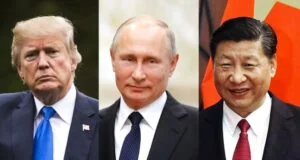

  \[caption id="attachment\_11606" align="aligncenter" width="582"\] Estos son los del viejo orden.\[/caption\] El Nuevo Orden del Mundo -sostenible y humanamente posible- solo será cierto si la generación de los **_Baby Boomers_** del mundo se unen para transformar las industrias en esta globalización con energías sostenibles. La paradoja, esta generación es la principal víctima del virus letal que recorre el mundo como un fantasma. **Es la principal reflexión de este 1° de Mayo con Covid-19.**

## Los muertos del Covid-19

¿Por qué los pobres del mundo son los primeros en morir cuando hay una guerra? ¿Por qué son los que caen cuando hay una pandemia como la del coronavirus? Hoy, **1° de Mayo Covid-19,** pese a este oscuro panorama, nos preguntamos ¿cómo será el Nuevo Orden Mundial (NOM) del que se comienza a hablar? ¿Lo hallaremos en el capitalismo bárbaro y despiadado que obliga a mover sus industrias para salvar su rentabilidad y su supervivencia sin importarle la vida humana? Cuando el sistema social está sumergido en el interés del mercado, la salud y, por tanto, la vida pende de la rentabilidad de los dueños del sistema. Pero **¿por qué el mayor número de muertos de la pandemia está en la población superior a los 55 años?** En la medida en que uno envejece crece la morbilidad y el Covid-19 afecta más a los pacientes con enfermedades preexistentes. **En España e Italia el personal médico debía decidir en ponerle el respirador mecánico al que tenía 75 o el de 85 años. Por supuesto, decidían por el de 75, porque por lo menos tenía la expectativa de 10 años de vida.** Hace más de 3 mil quinientos años, Moisés dijo que los días de nuestros años son 70 y si debido a poderío especial son 80 años. La esperanza de vida hoy ha llegado a indicadores que hace 50 años no teníamos ni la más remota idea que podía llegar a más de 80 años, dado a ese poderío especial mosaico. Mi abuela murió a los 65 años. Mi madre murió lúcida a los 87, pero mi padre a los 70 años. O sea, Teresa de Jesús Moreno vivió, con relación a su madre, 22 años más.

## El nuevo orden

**Henry Kissinger** -96 años-, en un artículo para **The** **Wall Street Journal**, precisó la necesidad de la formación de un NOM basado en un nuevo contrato social mundial como resultado del Covid-19. Considera que las naciones y las instituciones mundiales han fallado con relación a este virus y las consecuencias económicas y sociales son devastadoras. **Un nuevo orden implica un nuevo sistema económico basado en las necesidades colectivas y no individuales.** Pasaremos de las grandes corporaciones basadas en el lucro individualista de sus accionistas a corporaciones de mediano lucro, el cooperativismo, la solidaridad y la preservación de la humanidad. **Iremos de una sociedad ambiciosa individualista (Mc Clelland) a una sociedad solidaria y éticamente sostenible.** Ese nuevo orden también debe superar el **orden westfaliano dominante** hasta ahora. Este orden, basado en el equilibrio de poderes y el respeto de la soberanía nacional, fue concebido en el surgimiento de las naciones europeas modernas con el capitalismo naciente del siglo XVII para detener las guerras entre los estados. Sin embargo, el mundo repite, como si fuera una maldición, las guerras entre estados. Europa, epicentro de esta dinámica mundial, es azotada periódicamente por confrontaciones bélicas entre naciones. La guerra de los Balcanes dejó huellas imborrables para el siglo XXI. La enseñanza de la guerra de secesión de los Estados Unidos llevó a este país a construir una democracia liberal sólida apegada a la libertad y a la propiedad privada, núcleo del capitalismo salvaje.

## Trump, Putin y Jinping

**Ese nuevo orden no podría ser un acuerdo entre Trump, Putin y Jinping para repartirse el mundo.** No importa que presenten otras consideraciones de equilibrio de poderes y respeto de la soberanía de los estados del mundo. **El nuevo orden necesariamente debe proponer la superación del capitalismo basado en el modelo económico hegemónico**. Por ejemplo, el sistema económico mundial no debe estar cimentado sobre la **energía fósil**, la especulación financiera y la desigualdad social y económica. Si eso es así, **sería un imperativo categórico transformar las políticas públicas internacionales sobre el cambio climático.** El objetivo es favorecer la preservación del planeta y la explotación racional de los recursos naturales. **Esto es lo que nos puede salvar de grandes catástrofes ecuménicas, como las guerras, las pandemias y la pobreza mundial.** Según los científicos, virus como el Covid-19 vendrán para quedarse por mucho tiempo entre nosotros.

## ¿Estamos preparados?

El desprecio de Trump a los signos de alerta de la Organización Mundial de la Salud (OMS) sobre el virus, es el desprecio que el capitalismo salvaje hace a la amenaza del cambio climático. ¿Estamos preparados para nuevos ataques virulentos? Italia, España y Estados Unidos nos demostraron que no. El mundo capitalista dominante jamás podrá estar preparado para estos virus, porque su naturaleza está basada en la explotación de la energía fósil que degrada la naturaleza y modifica negativamente el clima. La científica **Carolien Van de Sandt** (Universidad de Melbourne) dijo a la BBC, hace dos años cuando se cumplieron los 100 años de la _Gripe Española_ (no había sospecha del Covid-19), que los virus y la gravedad de cualquier brote es el resultado de una interacción de factores virales, humanos y sociales. Y dijo algo que es preciso subrayar:

> _**“El cambio climático puede cambiar los patrones de migración de aves,** llevando virus pandémicos a nuevas ubicaciones y potencialmente a una gama más amplia de especies de aves_”.

¿Qué subyace de ese imperativo de transformar el uso de la energía fósil? **Encontrar nuevas fuentes energéticas para la industria en la Era Digital**. No puede ser el carbón, el petróleo y otros elementos que movieron la primera y segunda revolución industrial. A pesar de Trump, en Estados Unidos, 29 de los 50 estados confederados, según el sociólogo y economista **Jeremy Rifkin**, están dando pasos muy importantes para la transformación de los planes de desarrollo con energías renovables e integración de la energía solar.

## Reflexiones

¿Después de la **Primera Guerra Mundial** (1914-19) hubo una reflexión tan profunda como la que nos estamos planteando hoy con la Covid-19? Muchos intelectuales de los países involucrados se dejaron arrastrar por el chauvinismo y murieron por su patria. La Gran Bretaña se confirmó como la potencia dominante en el mundo capitalista. Y Estados Unidos empezaba a abrirse paso como una nueva potencia mundial con la expansión del **_capitalismo_** **_manchesteriano_**. La primera mortandad producida por la expansión del capitalismo salvaje con la Revolución Industrial nos dejó cerca o más de 30 millones de personas. Esto es, según datos oficiales, 9 millones de soldados, 7 millones de civiles y 6 millones por hambre y enfermedades. Mientras se libraban las últimas batallas de esa primera guerra internacional, la humanidad sintió el apretón de un virus que se conoció como la **“Gripe Española”**. De acuerdo con fuentes sanitarias, **más de 100 millones de personas sucumbieron en el mundo**. Más letal que la guerra. Y esto, probablemente, producto de ese cambio climático que empezaba a experimentar el mundo con el desarrollo de las industrias basadas en la quema del carbón y en la modificación del curso de las aguas naturales. Hecho que modifica el ecosistema de la naturaleza.

## El Nuevo Orden westfaliano

Los países triunfantes de la Primera Guerra Mundial doblegaron al imperio austro-alemán y crearon un Nuevo Orden Mundial pisando a sus trabajadores y a los países derrotados. **La esperanza de los líderes populares de Europa era que pudiese triunfar la revolución alemana para detener la guerra**. Por lo menos, esa era la visión que tenían **Rosa Luxemburgo**, **Karl Liebknecht** y otros líderes de la revolución frustrada de Berlín de 1919. Se opusieron a la guerra y cuestionaron la **Revolución de Octubre** como modelo mundial. Ellos fueron asesinados por grupos paramilitares desmovilizados de la guerra. El régimen alemán organizó estos grupos para combatir la revolución y asesinar a sus líderes. **Si hubiese triunfado la revolución alemana, dirigida por los espartaquistas, probablemente no hubiese existido el fenómeno del nacionalsocialismo alemán.** En Alemania, país derrotado, triunfó el Nacionalsocialismo. El pueblo alemán acogió sus ideas y se dejó someter masivamente debido al miedo y a las necesidades materiales que dejó la Primera Guerra Mundial. **La sociedad fue manipulada por un aparato ideológico construido desde el partido liderado por Adolf Hitler, quien propendía por la supremacía blanca alemana**.

## El nuevo orden y el cambio climático

Los 30 millones de muertos de la Primera Guerra Mundial no fue óbice para que el mundo capitalista, movido por el afán de lucro individualista, se expandiera y buscara nuevos mercados. Apareció la Segunda Guerra Mundial con sus 70 millones de muertos y el gran holocausto Nazi. Si bien es cierto que los descubrimientos científicos, la vacuna y el desarrollo sanitario han evitado que se repitan pestes como la bubónica que dejó 200 millones de muertos, **la humanidad debe estar alerta permanentemente por las pandemias que en el siglo XX** y comienzo del XXI se dieron con mayor frecuencia. **El cambio climático producto del sistema económico capitalista mundial que, a su vez se basa en la quema de energía fósil, nos lleva a una reflexión del futuro de la humanidad.**

## ¿Y después de la cuarentena?

Después de la cuarentena ¿regresaremos a un mundo normal? ¿Olvidaremos las reflexiones que hemos hecho en estos días de confinamiento y de **Huelga General forzada**? ¿Nos olvidaremos de este letal virus que recorre el mundo como cuando en la **Revolución Industrial del siglo XIX** los trabajadores comenzaron a cuestionar su papel en el desarrollo económico de la humanidad dominada por los dueños del capital? La lucha de los trabajadores del mundo no consiguió otra cosa que devolverle un **rostro humano a la explotación capitalista salvaje** y hacerla soportable y, por ende, prolongar su agonía en cada ciclo de su crisis mundial. El 1° de Mayo se conmemora esa lucha de los trabajadores por las conquistas laborales y sociales. Pero no basta. Se necesita un nuevo orden que proponga una relación humana con la naturaleza y entre los seres humanos. Las revoluciones sociales del siglo XX no resolvieron el problema del mundo, ni tampoco de sus naciones.

## La paradoja del nuevo orden

¿Solución? Existe una conciencia colectiva que se está abriendo paso a nivel mundial por la transformación del sistema económico dominante. Pasar de una economía manejada por las grandes corporaciones públicas que las apremia la alta rentabilidad a una economía de carácter social y colaboracionista, **es la solución para el futuro de la humanidad y del planeta**. Contrario a lo que algunos pensadores creen, **la gran paradoja del mundo es que la humanidad está en manos de una generación que fue atacada bárbaramente por el Covid-19, la generación de los _baby boomers_.** Esos hombres y mujeres que estamos entre los 55 y los 75 años, cuando la muerte la tenemos más cerca, daremos un vuelco a nuestras vidas salvando a la humanidad de la iniquidad del capitalismo oportunista y egoísta, fuente de los grandes males de la humanidad actual. Si sobrevive a este virus letal del Covid-19, **mi generación liderará la transformación del mundo**. Es una generación soñadora. ¡Somos los padres de los **_millennials_**! En su juventud, mi generación movió al mundo no capitalista. Dejó su impronta en Mayo Francés del 68, la resistencia contra la guerra de Vietnam y el respeto del medio ambiente en Estados Unidos, y las grandes luchas estudiantiles de América Latina a principio de la década del 70. **La clave: los seres humanos recurrimos a nuestra memoria para darle solución a los problemas presentes**. **¡_Baby boomers_ del mundo, uníos!** Te puede Interesar:

### [Covid—19: ¡Quédate en casa y muérete de hambre! (II)](/articulos/quedate-en-casa-y-muerete-de-hambre/)

### [El hambre y la discriminación tienen bandera en Colombia](/articulos/el-hambre-y-la-discriminacion-tienen-bandera-en-colombia/)