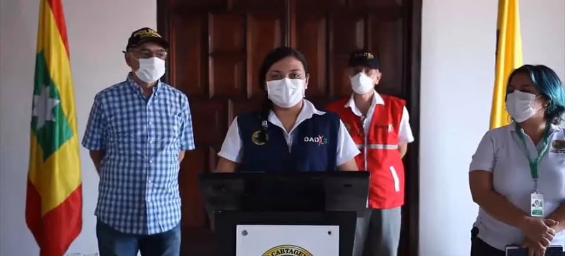
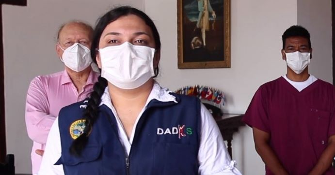

\[caption id="attachment\_11709" align="alignnone" width="960"\] **Álvaro Fortich duró 4 meses y 12 días en el Dadis**. Por dos días mantiene el récord su tocayo Álvaro Cárcamo. Johana Bueno lo reemplazó. En la gráfica, Dau Bueno, Fortich y Ana María González. Cortesía Prensa.\[/caption\] Mientras el alcalde de Cartagena William Dau se emrumba, la ciudad se derrumba. Comienza la renuncia de su equipo de gobierno mejor preparado para asumir la emergencia social. En medio de un caos social descubierto por el Covid—19 y un desbarajuste de la alcaldía de Cartagena, el director del Departamento Administrativo Distrital de Salud (DADIS), **Álvaro Fortich Revollo**, presentó renuncia irrevocable al alcalde **William Dau Chamat**. Pocas horas después, el burgomaestre encargó a **Johana Bueno Álvarez**, directora Operativa de Salud Pública de esa entidad. Entre tanto, la ciudad vive un caos. La tasa de letalidad del virus (4.2 por cada 100 mil habitantes) duplica a la de Bogotá. El sistema de salud no sirve. En los barrios populares la gente tiene hambre. Sale a la calle a rebuscarse y no a mamar gallo. Hoy, con la distribución de las raciones del PAE, la gente pobre de la ciudad se aglomeró sin medidas de bioseguridad.

## El detonante del Dadis

**La salida de Fortich Revollo estaba cantada desde hace varias semanas.** Todo comenzó a **principio de marzo** cuando le solicitó al alcalde Dau que tomara las medidas preventivas y de contención para evitar que se expandiera el Covid—19. Pero el alcalde hizo caso omiso de esta sugerencia. Siguieron llegando los barcos a la **Sociedad Portuaria Regional de Cartagena** y los aviones al aeropuerto Rafael Núñez. El festival de cine no fue suspendido sino hasta el último momento. Cuando Fortich llegó ayer al despacho, el alcalde estaba molesto. El personal médico lo había cuestionado por un video donde interrogaba a un menor de edad que había sido víctima de una bala disparada en una trifulca. Mientras atendían al menor en la urgencia, Dau lo acosaba y lo acusaba de estar pendejeando. Cosa que le violaba su derecho fundamental al buen nombre, la intimidad, entre otros. Conducta que está tipificada en el código penal. El vaso se rebosó cuando Fortich le manifestó que era preciso realizar un trabajo integral para evitar la propagación del Covid—19. Hubo un intercambio de palabras. Las cosas se pusieron color de hormigas. **_El Tractor_ usó su consabido lenguaje coprolálico, es decir, las mismas palabras que usó en la clausura de la sesión virtual del concejo de Cartagena**. La decencia de Fortich fue sin par. No le respondió y se quedó callado. Su cara se enrojeció, quizás, por toda la mierda que el alcalde le vomitó. Palabras dignas del finado Cuchilla.

## La carta de renuncia

A primera hora de la mañana, ya Fortich tenía la carta de renuncia redactada. Lo pensó. Quizás la redactó anoche. La carta de Fortich Revolledo fue elegante. Ignoró los choques directos que tuvo con el alcalde y le agradeció la confianza que depositó al nombrarlo director del Dadis. Usando un español ya ido y elegante, le dijo al alcalde:

> **_«Hoy, la Secretaría de Salud—Dadis es otra con mejores derroteros que despejarán las borrascas pretéritas hacia un mejor bienestar para la ciudad. En el día de hoy presento renuncia irrevocable del cargo y sepa que siempre estaré al servicio de mi ciudad»._**

La renuncia de Fortich nos hace recordar cuando **Álvaro Cárcamo lo hizo con Guillermo Paniza (1995)**. Cárcamo le presentó la renuncia en la Secretaría de Salud-Dadis cuando el alcalde le salió con una patanería. En aquella época Cárcamo se dedicó a atender la emergencia que se había presentado (1995) con el accidente de aviación donde murieron 52 personas. Solo se salvó la niña Erika Delgado. Algunos pensaban que Fortich no le iba a durar mucho a Dau, lo mismo que Cárcamo a Panizza. Cárcamo mantiene el récord de la brevedad de ser director del Dadis. Su período fue de 4 meses y 10 días. Fortich duró un poco más: 4 meses y 12 días.

## Bueno en el Dadis

\[caption id="attachment\_11708" align="alignnone" width="691"\] Johana Bueno Álvarez ¿algo bueno sucederá en el Dadis? Cortesía.\[/caption\] **Llega Johana Bueno Álvarez a la dirección del Dadis en estas circunstancias difíciles.** ¿Vendrá algo bueno para el Dadis? Es una joven preparada e inexperta, pero con ganas de trabajar. Actualmente dirige la Unidad de Salud Pública. **El gran reto es avanzar en la contención del Covid—19, organizar el equipo del Dadis.** A Fortich le paralizaron la contratación del talento humano. **Más del 40% del personal quedó sin contratar**. Las diferentes unidades trabajan a media máquina. No tienen funcionarios contratados. Una de las unidades donde casi tienen todo el personal es Salud Pública. Pero no sucede lo mismo con Aseguramiento, Vigilancia y Control y Prestación de Servicios. **El problema del Dadis es que el director estaba maniatado.** La contratación la hacían en el despacho del alcalde Dau, y Fortich se limitaba a supervisar la ejecución de los **contratos de dudosa ortografía**. Si la cabeza no sirve, hagan lo que hagan los secretarios, todo será inútil en la alcaldía de Cartagena. **¿Quien debe renunciar?** [¿Quién es el ladrón? Sobrecostos de Dau: Gel antiséptico 300%; Mascarillas 200%](/articulos/quien-es-el-ladron-sobrecostos-de-dau-gel-antiseptico-300-mascarilla-a-19-5-mil-200/)