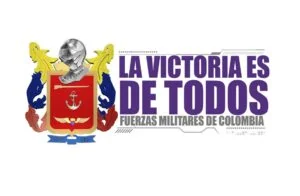

\[caption id="attachment\_11641" align="aligncenter" width="576"\] ¿Nueva imagen? Los hechos conducen a Uribe.\[/caption\] Todos los caminos conducen a Uribe. Cristina Lombana Velásquez, magistrada de la Corte Suprema de Justicia, había recibido en su correo corporativo, el 17 de diciembre de 2019, un dato raro pero significativo: **«información urgente... caso chuzadas-hacker-Álvaro Uribe»**. En forma inmediata, luego de evaluar la información, ordenó el allanamiento de una sede militar del complejo **Miguel Antonio Caro**, ubicado en Facatativá. Era la sede del Batallón de Ciberintenligencia. El caso del allanamiento lo reveló la revista Semana en el mes de enero de 2020. Y este viernes dio a conocer los secretos del seguimiento  que se hicieron a 130 personas y ongs del país. Más  que un escándalo de chuzadas del ejército, refleja el **dominio que el senador Álvaro Uribe ejerce sobre las fuerzas militares** para ponerla al servicio de la cúpula del Centro Democrático, el partido de gobierno. En fin, **los caminos de este escándalo conducen a Uribe.**

## Los hallazgos

Según la revista Semana, tiene en su poder decenas de **carpetas secretas** suministradas por sus fuentes. Probablemente son copias de los documentos hallados en ese allanamiento del cual estamos recordando en el día de hoy. Según indicó, consultó a muchas personas que participaron en esta operación de seguimiento y chuzadas o espionajes. **El objetivo de la operación de inteligencia fue levantar una información especial a 130 personas, entre periodistas,** exministros, funcionarios de Presidencia, generales, políticos y sindicalistas, entre otros. Se menciona, por ejemplo, a varios periodistas norteamericanos, corresponsales de medios de comunicación de Estados Unidos. Un dato a resaltar. Una agencia norteamericana le entregó a las fuerzas militares la suma de **$400 mil dólares** con el fin de invertirlos en aparatos de tecnología de punta para operaciones de ciberinteligencia y contrainteligencia. La revista, al respecto, entrevistó a uno de los militares que participó en esas operaciones que le dijo:

> «_A los norteamericanos no les va a gustar que parte de su propia plata, de los contribuyentes, como dicen ellos, se haya desviado de los fines legítimos para la que la entregaron, la lucha contra terrorismo y narcotráfico, y terminara usada para escarbar la vida de periodistas de importantes medios de su propio país. Eso va a ser un lío”, dijo a SEMANA uno de los uniformados que realizó estos trabajos y que pidió proteger su identidad_».

## Conducen a Uribe

Este escándalo militar —que nos hace recordar los 8 años del período de **Álvaro Uribe Vélez** cuando todos fuimos vigilados— tiene un hilo conductor. Es necesario descubrirlls. Es la finalidad de este análisis de [www.voxpopuli.digital](https://voxpopuli.digital). ¿Es claro que todos los caminos conducen a Uribe, el protector del **presidente Iván Duque**? La revista Semana no llega a esta conclusión, porque los hallazgos los presentó aislados. Los limitó a un escándalo de las fuerzas militares sin medir el verdadero impacto de los hechos. Estos tienen las mismas o peores consecuencias que los espionajes del DAS. El 2 de octubre de 2014, la Corte Suprema de Justicia **abrió una investigación preliminar contra el senador Uribe** una vez el conocido hacker Sepúlveda relatara a los investigadores que el expresidente Álvaro Uribe tenía información confidencial de los informes de espionaje sobre las negociaciones de paz de La Habana. Andrés Felipe Sepúlveda fue condenado por esos hechos. Ese caso quedó en manos del **magistrado José Luis Barceló**, quien ya no está en la Corporación. Cuando el expediente de Uribe lo amenazaban las cucarachas, al crearse la **Sala de Instrucción**, el proceso pasó al despacho de la magistrada **Cristina Lombana**. Esta magistrada conoce la vida y el código castrense. Es mayor retirada. La magistrada dio un fuerte golpe con la orden de allanamiento a la sede militar donde se originaba la operación de este ciberespionaje de las Fuerzas Militares.

## **El general sacrificado**

**¿Esta macro operación de espionaje fue ordenada sólamente por el general Nicacio?** ¿Chivo expiatorio? Los hechos sugieren que es otro chivo expiatorio. Igual que los escándalos del DAS, los falsos positivos, entre otros. Pero la realidad es que los hechos conducen a Uribe. El allanamiento de la Corte Suprema de Justicia se hizo donde la fuente le había revelado a la magistrada Lombana. La pista le hablaba de que los hallazgos le servirían para sustanciar la investigación que llevaba **contra el senador Uribe.** El mensaje llegado a su correo electrónico ubicó exactamente los sitios donde se originaba esa operación de chuzadas: «_... las unidades donde se realizan estas prácticas son unidades orgánicas de la Brigada de Inteligencia Militar N.º 1 (Brimi 1), el Batallón de Inteligencia Militar N.º 4 (Baime 4) y el Batallón de Ciberdefensa (Bacid)»._ Diez días después de ese allanamiento, el presidente Duque oficializó la salida del general Nicacio Martínez en una sorpresiva rueda de prensa:

> _«Él (Nicacio) me ha expresado sus motivos familiares para dejar la comandancia del Ejército. He acogido su solicitud con sentimiento de gratitud, él tiene 38 años de servicio al país. Mi admiración y amistad para el general Nicacio Martínez»._

Pero en realidad el **verdadero motivo de la salida de Nicacio Martínez Espinel**, como comandante del Ejército Nacional de Colombia, fue el resultado de ese allanamiento. Los documentos hallados confirmaron como víctimas de estos seguimientos a diferentes ciudadanos norteamericanos, algunos de los cuales trabajaban para medios importantes como The New York Times. Es el caso del periodista **Nick Casey**, quien reveló unos formatos militares para proyectar las bajas que podrían producirle al enemigo durante el año. El artículo publicado se denominó _[Las órdenes de letalidad del ejército colombiano ponen en riesgo a los civiles, según oficiales](/articulos/es/2019/05/18/espanol/america-latina/colombia-ejercito-falsos-positivos.html)._

## ¿A quién obedeció Nicacio?

Esta operación se hizo justamente durante el período de dirección del general Nicacio, quien había asumido ese cargo el 10 de diciembre de 2018, en ceremonia adelantada por el presidente de la República, Iván Duque Márquez. Pero es sabido que el Centro Democrático dirige políticamente el Ministerio de la Defensa. Puede suceder que Uribe nombró su **comisario político en la sombra** en las fuerzas militares y este podría ser Nieto Loaiza. Uno de los oficiales que participó en la operación espionaje le dijo a la revista Semana:

> «_La orden de los mandos del Bacib, Caimi y Caci, fue que, por instrucciones de mi general, había que conseguir todo lo que se pudiera sobre el periodista gringo (**Nick Casey**), especialmente porque consideraban que, por lo que publicó, estaba atacando a la institución y, en particular, a mi general Martínez. Había que averiguar con quién habló para eso y, además, conseguir elementos para tratar de desprestigiarlo a él y al medio. Eso se hizo con unos portales_.»

**El eslabón** https://youtu.be/q5w9BLUvmjw La magistrada Lombana le tomó la declaración a 8 oficiales del ejército. Solicitó el acompañamiento de la Sijin y de la Dirección de Investigaciones Especiales de la Procuraduría. También ofició al abogado de Álvaro Uribe Vélez, Jaime Granados para que asistiera en la toma de declaraciones de los oficiales detenidos en la diligencia. Granados no fue y mandó en su lugar al abogado suplente, Carlos Fernando Alarcón. Cabe destacar que Noticias Uno, en un informe dijo que la información recogida en esta operación espionaje tenía como destino a **Rafael Nieto Loaiza.** Este podría ser el eslabón entre las fuerzas militares y el senador Álvaro Uribe Vélez, quien era el destinatario final de la información. Y tiene sentido, porque Uribe es el máximo jefe del Centro Democrático y probablemente el cerebro de toda esta operación ilegal. Su presidencia se caracterizó por esta práctica Nieto Loaiza, en su cuenta de tuiter, dijo hoy: https://twitter.com/RafaNietoLoaiza/status/1256973271985250306?s=20 **Rafael Nieto Loaiza** fue Viceministro del Interior y de Justicia entre 2003 y 2004 del presidente Uribe, y pre-candidato presidencial por el partido Centro Democrático junto con Iván Duque Márquez. Sin duda, todos los caminos conducen a Uribe. Si lo miras por cualquier lado, llega al Centro  Democrático. Existen antecedentes lejanos y cercanos de este tipo de comportamiento del expresidente Uribe Vélez. El DAS fue un aparato de los paramilitares para perseguir a los opositores de su régimen. De las chuzadas del h**acker Sepúlveda** **recibió información privilegiada del proceso de paz con las Farc en La Habana**. Y ahora ¿recibió esa información de Nieto Loaiza?

### Te puede interesar:

[1° de Mayo: ¡Por un nuevo orden, Baby boomers del mundo, uníos!](/articulos/1-de-mayo-por-un-nuevo-orden-baby-boomers-del-mundo-unios/ "1° de Mayo: ¡Por un nuevo orden, Baby boomers del mundo, uníos!") [Tumbapobres del Covid—19: ¿Duque roba a los pobres para los ricos? (I)](/articulos/tumbapobres-del-covid-19-duque-roba-a-los-pobres-para-los-ricos-i/) [Los políticos irán al infierno, salvemos nuestra alma](/articulos/los-politicos-iran-al-infierno-salvemos-nuestra-alma/ "Los políticos irán al infierno, salvemos nuestra alma")