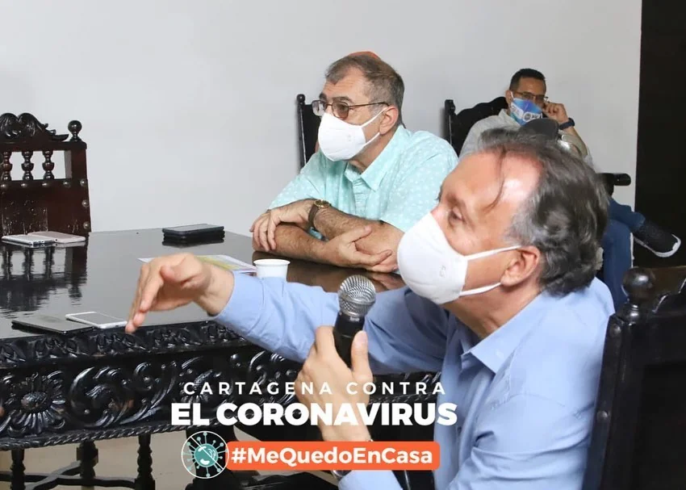

\[caption id="attachment\_11768" align="alignnone" width="787"\] El presidente Duque debió intervenir ante la incompetencia del alcalde William Dau. Aquí el viceministro de Salud, **Luis Alexander Moscoso** dando las instrucciones que deben seguir en la pandemia. Cortesía prensa alcaldía.\[/caption\] Son tres contratos que la Contraloría General de la República (CGR) tiene enfocados para detener la corrupción en Cartagena por presuntas irregularidades en la contratación del Covid-19. Tres contratos que mantienen atollados de maleza a alias **«Tractor» Dau**, alcalde de Cartagena. E**s un tractor que se encuentra atollado en la maleza que pretendía arrastrar.**

## Cartagena llena de malezas

Los gobernantes de Cartagena se parecen a la gente que los eligen. Está llena de resentimientos, pobreza mental y desesperanza.  Espera un salvador. La desesperanza aprendida por la falta de gobernanza y gobernabilidad de una clase política corrupta que le viene gobernando. El **«Tractor» confirmó este análisis que desde hace dos décadas hemos hecho de Cartagena.** De los tres contratos que lo mantienen atollado, dos convino con la firma barranquillera **Ventas Distribuciones y Marketing Ltda**. Uno para adquirir insumos químicos y tapabocas, y el otro obtener 10 mil pruebas rápidas. Los dos tienen sobrecostos. No fueron ejecutados debidamente y se hicieron con una entidad no idónea. La Heroica es la segunda ciudad con más muertos por Covid, después de Bogotá. La tercera con más contagiados. Pero si analizamos la proporción, la ciudad tiene la tasa más alta de muertos por cada 100 mil habitantes. Esta llega a 4.3%. Duplica a Bogotá. ¿Por qué razón? **Porque el «Tractor» está atollado por la maleza**.  Fue elegido para arrastrarla. Pero la maleza le cubrió hasta el techo. No actuó. No ejecutó las medidas de contención a tiempo. Careció de orientación. No tuvo tino. Fue errático. Se retractó una y otra vez. No siguió los lineamientos de salud y de contención social que le planteaba el director saliente del Dadis, **Álvaro Fortich**. Cartagena no solo es azotada por el rigor del Covid-19. También es golpeada por los niveles de corrupción en la contratación. Un ejemplo de ello son los tres contratos (No 07 y 08) y la APP que tienen atollado al «Tractor» William Dau Chamat.

## La maleza de la corrupción

Los cartageneros querían un gobernante que le diera duro a los corruptos que históricamente se venían robando el presupuesto público. Se presentó el autodenominado «Tractor». Teóricamente ganó las elecciones. Se lo cogió el Covid—19 y demostró su verdadera catadura: **un hombre de poca virtud integral y con una voracidad por el presupuesto público de los cartageneros. ¡Un buitre en busca de carroña!** Como botón de muestra, solo están tres contratos. El 20 de marzo contrata una APP fantasma por $150 millones para controlar el nuevo coronavirus. La contratista es Moca, una entidad que mantiene alianzas y convenio con **Soluta Inteligencie** que dirige Elías Dau, quien ha sido duramente cuestionado por varias contrataciones con entidades públicas. Los medios periodísticos digitales y algunos veedores lo advirtieron cuando pusimos el énfasis en la contratación de **Veneplast y Moca.** El primero porque es una empresa dedicada a la papelería y distribución de útiles escolares y de oficina. No podía ser contratada para adquirir los kits de alimentos. No era idónea. No estaba preparada para responder de forma inmediata. Los precios que Veneplast y Megatiendas difieren de los precios de referencia del Dane. El alcalde de Buesaco (Nariño) lo suspendieron por contratar a una empresa eléctrica para suministrar Kits alimenticios. Pues, Veneplast está en el negocio de la papelería y oficina y no sabe nada de suministrar alimentos. La App de Moca es un presunto detrimento patrimonial, porque ya el gobierno nacional había lanzado el 7 de marzo la app CoronApp. Esta es completa y reúne toda la información en tiempo real para prevenir el Covid—19.

## Acción preventiva por la faja

Posteriormente, el 30 de abril el procurador provincial **Guidobaldo Flórez Restrepo** generó una acción preventiva para detener la contratación de la App Cuidemonos. Pero el **«Tractor» siguió rodando**. No le paró bola. No le puso atención, porque se trataba de beneficiar a una entidad catalana que manejó a control remoto el proceso de contratación. La gente se pregunta ¿cómo firmó ese contrato **Maria Fernanda _González Gutiérrez,_** Ph.D.  y Ceo & Co-Founder at _MOCA_ Platform? ¿Cómo hicieron William Dau y Ana María González Forero para tramitar dicho contrato? Son dudas de presuntas irregularidades que se registraron en esa contratación, aparte de lo innecesaria y duplicidad de funciones ocasionando un detrimento patrimonial de $150 millones. Con este dinero podríamos adquirir más mercados para la gente pobre de Cartagena.

## Inminente suspensión de Dau

Vale decir, que ya la Procuraduría se pellizcó sobre el caso de Cartagena. Antes estaba muda. Parece que el procurador Fernando Carrillo le jaló las orejas al procurador provincial Guidobaldo Flórez. Le puso la lupa, además del contrato de la App Cuidemonos, a los dos contratos suscritos con **Ventas Distribuciones y Marketing Ltda.** En las últimas horas, le envió una comunicación al **«Tractor» Dau** mediante la cual le pedía evidencias sobre el cumplimiento de la firma para la entrega de las 10 mil pruebas rápidas. Dau y sus acólitos están corriendo para corregir lo incorregible. Pero es la Contraloría General de la República la que tiene más adelantada la investigación por las presuntas irregularidades del **«Tractor».** Son 5 graves irregularidades que cometió Dau y su equipo de contratación, como también los supervisores de dichos contratos. Estas irregularidades llevaría a una solicitud de suspensión por parte de la Contraloría por la **facultad** que tiene de "**verdad sabida y buena fe guardada**". Esta facultad, como se sabe, fue establecida por primera vez en la Constitución Política de 1991 como potestad del Contralor General de la República y procede como medida preventiva con el fin de separar temporalmente de sus cargos a los funcionarios que han sido vinculados a procesos fiscales.

## Las irregularidades del **«Tractor»**

Analicemos los dos contratos que mantienen enredado de malezas al **«Tractor». El contrato de gel a $49 mil el litro (el doble de lo que le costó a la gobernación de Bolívar) y de las pruebas rápidas a $75 mil, el doble de lo que le costó a las Eps de Cartagena.** Sobre los mercados comprados a Megatiendas y Veneplast, nos referiremos en otras entregas.

1.  **Sobrecosto**. El pecio pagado por el Distrito de Cartagena está muy por encima del precio de referencia, según el DANE. Sobrecosto calculado de 300% para el gel y 200% para las pruebas rápidas.
2.  **Viola el decreto 440 del 20 de marzo de 2020.** «Por el cual se adoptan medidas de urgencia en materia de contratación estatal, con ocasión del Estado de Emergencia Económica, Social y Ecológica derivada de la Pandemia COV/D-19». Este decreto exige la adquisición de elementos de precios de referencia tomando en cuenta la plataforma **Compra Eficiente**. El **«Tractor» lo desconoció.** Esto significa que debe ceñirse al acuerdo marco de precios y no lo hizo.
3.  **Calidad y marca**. No es lo mismo comprar atún Van Camp´s que atún Catalina, por ejemplo. Calidad. Una cosa es en aceite y otra en agua.
4.  Cantidad. ¿Entregaron los artículos comprados con las especificaciones requeridas? ¿Dónde están las evidencias. El contrato de las pruebas rápidas no lo cumplieron. El **«Tractor» parece que al verse lleno de malezas, para salir del atolladero, prescindió unilateralmente del contrato con** Ventas Distribuciones y Marketing ltda. **Álvaro Fortich**, exdirector del DADIS, que aparecía como supervisor de esos contratos, me manifiesta que, al parecer, esa fue la salida de la administración**. El 27 de mayo tiene audiencia con el contratista. Allí estaremos para transmitir en vivo** 
5.   **Entrega a la loca.** La entrega de los productos fue a la loca. Esto aplica para los mercados, pero también para los beneficiarios del gel.  Por ejemplo, en cuanto a los mercados, debieron entregarlos tomando en cuenta el sistema de información de familias vulnerables. Es decir el Registro Único de Damnificados y Afectados RUDA. Hay evidencias de que no lo cumplieron
6.  **Inmediatez.** ¿En qué momento entregaron los productos adquiridos? ¿Se conservó la inmediatez? Una contratación extraordinaria, como la que vemos en la emergencia del Covid—19, se produce por el principio de inmediatez. ¿Lo cumplieron? Existen evidencias que los mercados no fueron entregados a tiempo. Tampoco las pruebas rápidas.

**El «Tractor» Dau está trabado.** Atollado por la maleza de la contratación irregular. Son tres contratos que evidencian su corrupción. Su discurso anticorrupción es solo eso, discurso. Palabrería para engañar a un pueblo que anhelaba castigar a los corruptos de siempre. Cartagena no se dio un tiro en el pie con la elección de Dau. Se lanzó al precipicio, tal como lo predijimos en la campaña electoral. Pero —si hay justicia— los días del **«Tractor» están contados.** **Te puede interesar:** [SOS Cartagena: ¡Hoy, 10 muertos! Alcalde de rumba (II)](/articulos/sos-por-cartagena-hoy-10-muertos-la-mitad-del-pais/ "SOS Cartagena: ¡Hoy, 10 muertos! Alcalde de rumba (II)") [Covid-19: ¡Cartagena se derrumba, y el alcalde de rumba! (I)](/articulos/covid-19-cartagena-se-derrumba-y-el-alcalde-de-rumba-i/ "Covid-19: ¡Cartagena se derrumba, y el alcalde de rumba! (I)")

*   [¿Quién es el ladrón? Sobrecostos de Dau: Gel antiséptico 300%; Mascarillas 200%](/articulos/quien-es-el-ladron-sobrecostos-de-dau-gel-antiseptico-300-mascarilla-a-19-5-mil-200/)