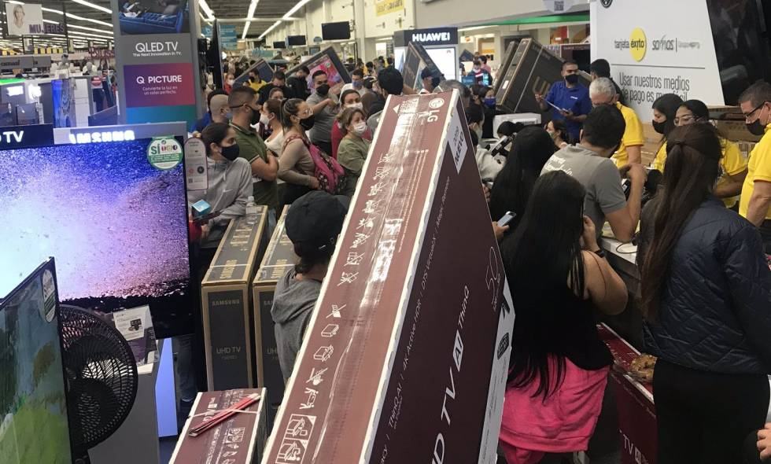

\[caption id="attachment\_11920" align="alignnone" width="980"\] ¡Covid Friday! Frenesí por aprovechar el Día sin IVa. Cortesía.\[/caption\] **Los días sin IVA son actos criminales que tienen su alto precio.** Mientras los centros comerciales recibían en masa a consumidores desesperados para aprovechar el «Covid Friday», el nuevo coronavirus se extendía a **567 municipios**. Además, se rompía la barrera de los 2 mil muertos y se presentaba el mayor número de contagiados y muertos por día: **86 muertos** (43 en Barranquilla y Atlántico), 15 en Bogotá, 9 en Valle del Cauca y 7 en Cartagena. Precisamente en las ciudades donde el Covid tiene mayor estragos, fue donde se produjeron las aglomeraciones para aprovechar las compras en lo que jocosamente se ha denominado **«Covid Friday».** **Pero todo ha sido una ilusión.** Tales compras no se tradujeron en una mejoría para el comprador, ya que dichos descuentos se registran en ciertos productos que mantuvieron sus precios pero en la mayoría no. Fue un gancho comercial. El comportamiento humano es complejo. Es mantenido en cuarentena, pero le dan tres días libres de IVA y se desbocan como ganado encerrado. Así se comportó la gran masa de consumidores. Una masa construida a través de un sistema de publicidad en la cual el gobierno jugó un papel central con su día sin IVA.

## ¿A quién beneficia el Covid Friday?

En realidad los que **salieron bien librados de esta primera jornada de Día sin IVA fueron los grandes comerciantes de superficies**. A esta hora tienen las alforjas llenas y los bancos realizaron las grandes transacciones para satisfacer el ánimo de compra de esta gran masa de personas que desprecia su propia salud y su dinero para gastarlo movido por falsas o reales promociones. En esta cuarentena los colombianos hemos aplicado una economía de guerra. El gasto lo limitamos a la supervivencia: comida, medicina, servicios. Nada de electrodomésticos, calzado, textiles, incluso, tecnología. La gente fue más a la comida natural: yuca, plátano, ñame, papa y legumbres. El sector aseo sacó la cara para beneficio de los comerciantes. En abril la caída de venta al minorista llegó al 42.9% (Dane) De las 19 líneas productivas, 17 sufrieron variaciones negativas. Calzado (-90%), textiles (-87%). Una encuesta de Fenalco llegó a la conclusión que el 28% de los comerciantes cerrarán definitivamente sus negocios. ¿Como reactivar la economía? El gobierno del presidente Duque se inventó el Día sin IVA: 19 de junio, 3 y 19 de julio. Y en realidad fue un rotundo éxito, sin conocer las cifras oficiales de Fenalco. Pero el solo hecho de que los centros comerciales y los grandes supermercados estaban atiborrados de compradores, indicaría que las ganancias fueron muy abultadas.

## El precio a pagar

¿Cuál es el precio que los consumidores debemos pagar por la reactivación del gran comercio? ¿Cuántos se contagiaron con coronavirus en las jornadas de hoy? ¿Cuántos muertos dejará el Covid Friday? Miremos las cifras actuales. Hace dos meses **el Covid estaba en un poco más de 200 municipios**. Hoy, el Ministerio de Salud nos dice que llegó a **567 de los 1.102 municipios de Colombia**. Es decir, el virus llegó a la mitad del país. Y se expandirá exponencialmente con estos actos de masas como los días sin IVA. ¿Cuanto deberá gastar el Estado ahora para atender a los nuevos contagiados de Covid Friday? **¿Cuántos morirán?** ¿Cuántos quedarán lisiados? ¿Cuál será el drama que se vivirá dentro de 4 ó 7 días, cuando los síntomas comiencen a aparecer? **El capitalismo salvaje estimula el comsumismo.** Acaba con las esperanzas de la sociedad. Le destruye sus ahorros. **Pero lo más grave, le destruye su vida**. El derecho a la vida de los consumidores no existe para la voracidad capitalista. Voracidad que es estimulada por gobiernos abyectos y sometidos a la dictadura de la alta rentabilidad.  El presidente Duque es fiel a esta política que no tiene ningún sentido humano. Los días sin IVA (Covid Friday) **serán días fatídicos para Colombia**. Ninguna medida de bioseguridad podrá contener la aglomeración. Detener los días sin IVA nos irá mejor a los colombianos. El presidente Duque debe detener esta inminente masacre de los Covid Friday.

### Te puede interesar:

## [Tumbapobres del Covid—19: ¿Duque roba a los pobres para los ricos? (I)](/articulos/tumbapobres-del-covid-19-duque-roba-a-los-pobres-para-los-ricos-i/)