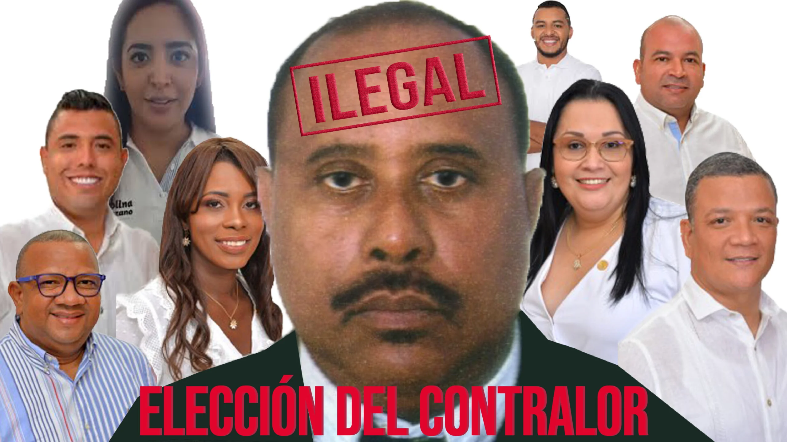

 **El ratón se quedó sin el queso**. Consuegra es un contralor ilegal. El **Tribunal Administrativo de Bolívar** admitió una demanda de revocatoria directa de la elección de **Héctor Consuegra Salinas** como Contralor Distrital y **decretó la suspensión cautelar de ese acto legislativo**. En tanto, la **Función Pública** **confirmó que es un contralor ilegal**, ya que su elección fue una grosera violación de la normativa vigente. Son dos hechos concretos que sepultarán a Consuegra Salinas como contralor ilegal. No podrá ser el contralor de bolsillo que pretendía custodiar la contratación pública ordenada por el alcalde Dau. Esos dos hecho detuvieron ese propósito. **Uno es jurídico**, emanado del Tribunal Administrativo. **El otro es consultivo**, que si bien no tiene fuerza vinculante, su desconocimiento se convertiría en una acción temeraria.

## Revocatoria directa

Por tanto, la junta directiva del concejo —atendiendo la consulta de la Función Pública— no lo puede posesionar. Si lo hace, se le agravaría la situación legal a los 8 concejales que votaron por Consuegra Salinas y a la misma dirección de la corporación. ¿Qué hacer? El presidente del concejo, **David Caballero**, deberá convocar con urgencia una sesión plenaria para declarar ilegal su elección y decretar una revocatoria directa. Por su parte, los 15 concejales que votaron por **Consuegra y Fredys Quintero**, podrían votar por un candidato diferente. En este caso, por **Érika Mendoza Gómez.** Es la única candidata que no tiene sospecha de infringir el **régimen de inhabilidades e incompatibilidades** establecido por el artículo 272 (C.N.), las leyes 136/94, 134/94, 142 de 1993 y 617 de 2000 y la resolución No. 303 del 24 de diciembre de 2019 del mismo Concejo Distrital.

## Concierto para delinquir y otros delitos

En el artículo [No aprenden. Alcalde y concejo podrían ir a la cárcel](/articulos/no-aprenden-alcalde-y-concejo-podrian-ir-a-la-carcel/), publicado el mismo día de la elección fraudulenta de Consuegra Salinas, advertimos que fue una elección ilegal. Además que fue una conducta dolosa, ya que sabían de antemano que el alcalde **William Dau Chamat** lo estaba promoviendo entre sus concejales allegados como el nuevo contralor. Dau pocos días ante de la elección dijo:

> _«Si eligen a la ficha de este mismo personaje nefasto como contralora (**Érika Mendoza Gómez)**, lo consideraré como **declaratoria de guerra, señores concejales»**_.

Esa frase que está grabada es una prueba fehaciente de que Dau probablemente constriñó a los concejales para presionar que votaran por Consuegra Salinas. Y resulta que Erika Mendoza era la única habilitada de la terna para ser seleccionada. Además, tiene el mejor puntaje de calificación.

## Conducta dolosa

La conducta de los 8 concejales que votaron por Consuegra Salinas es dolosa de todo punto de vista. Sabían perfectamente que su candidato había sido nombrado por Dau en el cargo de jefe de Control Interno del Edurbe. La prueba fue que la gerencia de esa entidad le envió la relación de los funcionarios de la entidad el 19 de febrero. En ese artículo, advertimos con claridad:

> _«Tanto los concejales de la coalición mayoritaria como el alcalde de Cartagena, **William Dau**, están **incurso en una clara falta gravísima a título de dolo**. Los concejales sabían que Consuegra estaba inhabilitado, tanto como su jefe político, **William Dau**, quien lo nombró. En este típico caso de corrupción, **desvela la verdadera catadura de esta administración distrital que se ha caracterizada por su doble moral, negligencia**, incompetencia y la más corrupta de las últimas administraciones de Cartagena de Indias»_.

Se comprueba una vez más que estamos enfrentado a una administración más corrupta que todas las administraciones anteriores. Por lo menos, los malandrines elegían a candidatos idóneos y no incurso en violación del régimen de incompatibilidades. Por ejemplo, la contralora Nubia Fontalvo cayó no por carecer de idoneidad.  La Fiscalía investiga al exalcalde Manolo Duque y a los concejales comprometidos por delitos de cohecho propio, interés indebido en celebración de contratos, entre otros.

## Contralor ilegal

Héctor Consuegra Salinas no solo es un contralor ilegal. **También pasará a la historia por falso**. Le mintió a la ciudadanía cartagenera que era un candidato apto e idóneo. Ninguna de las dos cosas. Demostró, por el contrario, que iba a ser el contralor para guardarle el queso a su amo político, **William Dau Chama****t**. El alcalde distrital, con este hecho, demostró que es **el capo de toda esta trama de corrupción** y concierto para delinquir. **Intimidó al concejo con su conducta belicosa y condujo al error, no solo a los 8 concejales,** que votaron por su protegido sino también a los 7 que votaron por **Fredys Quintero**. El miedo cundió en toda la corporación ante la advertencia de Dau. El mensaje era claro, si no elegían a su candidato, sería **«una declaratoria de guerra»**. Seguro que también sabía que Quintero estaba incurso en ilegalidad al someter su nombre como candidato a la contraloría.

## Renuncias sospechosas

En medio de la **guerra declarada públicamente por Dau Chamat a los concejales**, renunciaron —con grado sumo de sospecha— varios miembros de la lista que por derecho propio entraban en la terna. **Pero lo que realmente causó más sospecha fue la renuncia de uno de los ternados.** Esto permitió el ingreso igualmente sospechoso de Consuegra Salinas a la terna para disputarle el cargo a **Fredys Quintero,** igualmente inhabilitado. **Debemos rebobinar un poco el casette de nuestra memoria**. Inicialmente la terna para la elección de contralor distrital quedó integrada por **Neil Vanegas Palaci**o (80 puntos), **Érika Mendoza Gómez** (75), y **Freddy Quintero Morales** (68 puntos). Vanegas renunció en junio. Dijo que fue por motivos personales. Cosa que nadie le creyó. Se indicó extraoficialmente que recibió promesas de la administración para que tomara esa decisión. Tocaba reemplazar ese escaño de la terna. En el cuarto lugar había un **triple empate con 67 puntos:** **Héctor Consuegra, Manuel Ochoa Montes y Liliet Aguas Pol**o. En forma también sospechosa renunció Aguas Polo. Le quedó expedito la entrada de Consuegra Salinas, quien por orden alfabético, debía ser llamado para reemplazar a Vanegas. Probablemente, aquí se consolidó el concierto para delinquir orquestado desde la administración Distrital.

## Revocatoria directa

Ahora solo queda que el presidente **David Caballero** convoque a una plenaria del concejo para proponer la revocatoria directa de la elección de Consuegra Salinas. De igual manera, **iniciar la recomposición de la terna** para una nueva elección de contralor. Los que podrían integrar la terna serían Erika Mendoza, **Manuel Ochoa Montes y el que le sigue en calificación.**  El parágrafo del artículo 10 de la Resolución [728](/articulos/eva/gestornormativo/norma.php?i=104393#0728) de 2019, emitida por la Contraloría, dice:

> _«En caso de presentarse alguna circunstancia que conlleve el retiro o la falta absoluta de alguno de los integ**rantes de la terna,** deberá completarse con la persona que haya ocupado el cuarto lugar en el puntaje final, y así sucesivamente en estricto orden de mérito»._

Tres cosas quedaron claras con este hecho. (I) Hubo un concierto para delinquir dirigido desde la alcaldía de Cartagena. (II) Se demostró la ilegalidad de la elección de Consuegra Salinas. (III) Y finalmente, se evidenció una burda corrupción del alcalde Chamat y de los concejales que votaron por Consuegra y por Quintero. Nadie se salvó de este acto de corrupción que puyó el ojo a Cartagena. **Te puede interesar:**  /articulos/2011/11/quien-cuidara-mi-queso/ [No aprenden. Alcalde y concejo podrían ir a la cárcel](/articulos/no-aprenden-alcalde-y-concejo-podrian-ir-a-la-carcel/) (I) [Elección ilegal del contralor distrital (II)](/articulos/eleccion-ilegal-del-contralor-distrital/)