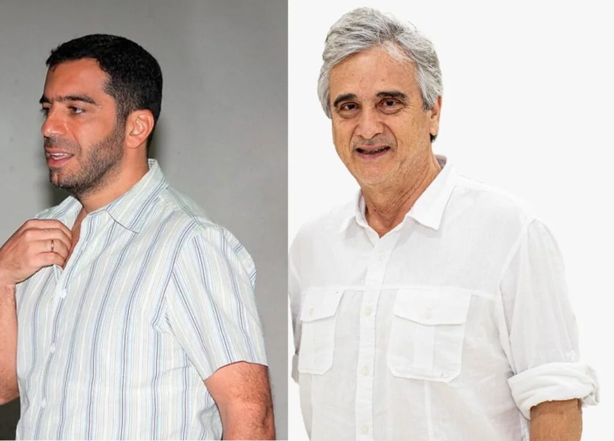

**¿Marulanda o Char?**  El Congreso de la República presenta hoy una encrucijada histórica: o hace un cambio de frente o sigue su ruta al despeñadero. Nunca antes la Corporación había vivido un período de desprestigio como en las dos últimas décadas. Los gobiernos del Centro Democrático **lo convirtieron en una cuenta de bolsillo**. 

Si. Es una encrucijada que la puede resolver el mismo congreso. ¿De quién depende? Sin duda, de la conciencia y el espíritu de cada congresista.

## Independencia o corrupción

El 20 de julio deben decidir entre la libertad y la esclavitud. Entre la independencia y la corrupción. **¿Quieren seguir dominados, maniatados y vilipendiados por un régimen que los somete con la burocracia y los contratos?** ¿Se resignarán por un gobierno que es la continuidad de una dictadura presidencialista basada en la corrupción y el populismo de extrema derecha?

No son preguntas retóricas. **Es una reflexión que va directa a la conciencia misma del congreso.** La respuesta a cada uno de esos interrogantes la dará individualmente los congresistas cuando lo llamen a votar. Deben responder a esta pregunta: **¿Marulanda o Char?** 

Para muchos congresistas será una decisión dura: ¿Marulanda o Char?  No es fácil desprenderse de las ofertas burocráticas del gobierno de Iván Duque, que cada día cae en la aceptación popular. **Duque necesita un congreso prosternado a la dictadura de la corrupción que mana del ejecutivo**. Y el computador secreto del sobornador estará disponible para que se digitalicen los compromisos con cada uno de los senadores de la coalición mayoritaria.

## Cambiar o caer

La encrucijada a la que se ve abocado el congreso de la República el Día de la Independencia **es un imperativo ético más que una decisión política**. Es un compromiso moral con una sociedad que considera esta rama del poder público como la más corrupta del Estado, según las encuestas de percepción de las diferentes encuestadoras.

Un estudio realizado por la Universidad de los Andes (2017 (documento no disponible)) llegó a la siguiente conclusión:

> _«Hoy solo una cuarta parte de los colombianos confía en el Congreso de la República. **Una mala gestión, nexos con los casos de corrupción** y poco interés en las preocupaciones de los ciudadanos son algunos de los factores que reafirman la poca confianza en el Legislativo»_.

En la **Décima edición del Barómetro Global de Corrupción** de Protransparencia (2019), las instituciones más corruptas de Colombia son: el congreso (64%), **el Presidente y funcionarios cercanos (55%), y los empleados públicos (48%).**  O sea, el congreso lleva la bandera en la vanguardia de la corrupción política

¿Marulanda o Char? Es la pregunta que resume la encrucijada del congreso. **Cambia o se cae en las profundidades del desprestigio.** Y la historia va a recordar a los congresistas que asumieron el cambio sin pensar en los beneficios directos y personales de su decisión ética más que política.

## ¿Marulanda o Char?

[voxpopuli.digital](https://soundcloud.com/voxpopulidigital "voxpopuli.digital") · [Iván Marulanda: Recuperaría el congreso de Colombia](https://voxpopuli.digital/ivan-marulanda "Iván Marulanda: Recuperaría el congreso de Colombia")

Para que los congresistas tomen una decisión inteligente en el **Día de la Independencia** no deben consultar con el computador de palacio sino con su conciencia. Sería una decisión donde política y ética estarían ligadas con guayas de buque.

Son dos candidatos. **Por un lado Iván Marulanda, senador de Alianza Verde. Y por el otro lado, Arturo Char Chaljub**. VoxPopuli.Digital quiso consultar a los dos candidatos. Fue fácil abordar a Marulanda. En la [entrevista a Iván Marulanda](https://voxpopuli.digital/ivan-marulanda) se notó la profundidad de su pensamiento.

## Iván Marulanda

El senador por Alianza Verde, Iván Marulanda Gómez, 74 años, es de la generación de la década del 60. Lo que a nivel mundial se conoció como la generación de los **_baby boomers_**. Nació en Pereira, justamente un años después de la Segunda Guerra Mundial y dos años antes del asesinato de **Jorge Eliécer Gaitán**.

> En los años 60, 70 y 80, Marulanda se destacó por sus ideas y su conducta rebelde, de acuerdo a la entrevista que con este texto se publica. Acompañó a **Luis Carlos Galán y Rodrigo Lara** en la disidencia del partido Liberal y **fundaron el Nuevo Liberalismo**. Tiene una larga trayectoria política que lo llevó a ser constituyente en 1991. Es un demócrata de carta cabal. Su acumulado político fue obtenido gracias a su capacidad y su experiencia en las lides sociales.

Pero si no hubiésemos localizado a Marulanda, podríamos saber de su pensamiento, su filosofía, su política, debido a que en el congreso viene desempeñando un papel destacado en el control político.

Para Iván Marulanda, las cosas no están claras en términos de números. Si se presenta un acuerdo entre los partidos Liberal, de la U, Alianza Verde, Polo Democrático y los movimientos Decentes, Mais y Aico, sumarían 48 votos, en el entendido de que todos asistieran a la plenaria.

Sin embargo, la esperanza de Marulanda es que **Colombia Justa y Libres** lo acompañen y le hagan el milagro. O que se presente **una crisis de conciencia en 7 senadores de la coalición de gobierno**. Si esto es así, Iván Marulanda sumaría 55 votos. **Sería un extraordinario hecho que marcaría el rumbo del congreso.**

## Arturo Char

**Arturo Char Chaljub**, 52 años, barranquillero, cuambiambero, cantante y músico. Siguió la vena artística de su tío paterno Farid Char. Es un bacan (un man chévere), como su hermano mayor, **Alex Char**, exalcalde de Barranquilla. Se visibilizó como presidente del Junior y de allí saltó al congreso sin ningún merito político, excepto que pertenece a una familia poderosa que es dueña de Barranquilla y el Atlántico.

No obstante, saber lo que piensa Char es muy difícil. Nadie lo ha escuchado en el congreso defendiendo o atacando una iniciativa legislativa. **La mudez de Arturo Char no la recoge del suelo**. Retomó el legado de su padre **Fuad Char**. Este magnate _—_en los cuatro períodos de senador: 1994, 1998, 2002 y 2010_—_ **ni siquiera dijo _«_esta boca es mía_»_**.

A pesar de todo es el virtual presidente del senado, según los grandes medios del país. Tiene el apoyo de **Centro Democrático** (19 escaños), **Cambio Radical** (16) y el partido **Conservador** (14). Los tres partidos reúnen 49 curules, o sea, **49 votos**. Probablemente voten por él los tres de **Mira** y los 3 de **Colombia Justa** **y Libres**. Sumaría un total de 55 votos, con lo cual sería elegido presidente.

Sin embargo, el pan se quema en la boca del horno. Si en las bancadas dominantes del congreso se produce una **crisis de conciencia en aquellos senadores** que desean cambiar, podrían inclinarse por Iván Marulanda. **Recordemos que el voto es secreto**. Si los senadores de Colombia Justa toman conciencia, indudablemente que ya no aseguraría la mayoría.

## Cara o sello

Cara: Iván Marulanda. Sello: Arturo Char. Las apuestas están listas en la coalición de gobierno. Aparentemente el gobierno de Iván Duque tiene asegurada la presidencia del congreso.

Empero, la historia se puede repetir. **En el 2004, el padre de Arturo, Fuad Char, era el virtual presidente del congreso**, según los acuerdos de la coalición mayoritaria. Pero el 20 de julio a las 5 de la tarde, en una reñida elección, **fue elegido como presidente Luis Alfredo Ramos**. El pan se le quemó en el horno.

El Día de la Independencia habrá cara o sello. ¿Marulanda o Char? **¿Cambio o caída?** ¿Podrá haber luz verde para el cambio con Arturo Char? **¿Habrá un cambio radical del congreso con Iván Marulanda?**

Sin especulaciones, lo que podría cambiar no solo la cara al congreso sino su posición frente al gobierno es un cambio de frente. Los expertos y la gente consciente de Colombia está segura que con Char el congreso profundizaría su caída libre al precipicio.

Contrario a ello, **la elección de Iván Marulanda no solo sería una bocanada de oxigeno para el alicaído congreso sino un hito en la historia**. Sería la ruta para un regreso del control político a un régimen presidencialista. Un régimen que tiene la capacidad de sobornar a un congreso sometido y esclavizado por la corrupción. ¿Marulanda o Char? La palabra la tienen los congresistas colombianos.

**Te puede interesar**:

[Galán: después de 4 años, «la marihuana es un regalo de Dios»](/articulos/galan-despues-de-4-anos-la-marihuana-es-un-regalo-de-dios/)

[Linchamiento político en la Farc](/articulos/linchamiento-politico-en-la-farc/)