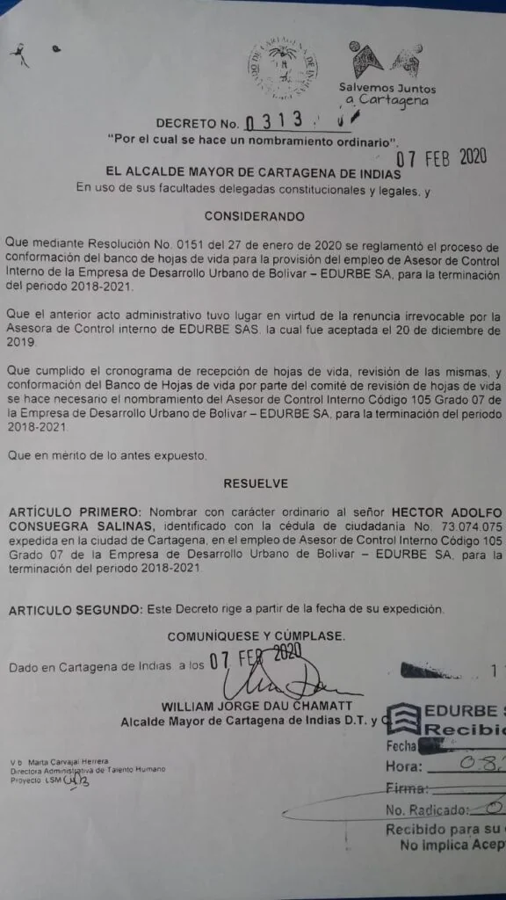

\[caption id="attachment\_12057" align="alignnone" width="744"\] Héctor Consuegra, el contralor distrital elegido que no será posesionado.\[/caption\]

La corrupción ciega hasta al más inteligente. Alcalde y concejo se la embarraron. Pero hoy fue más grave y doloso que hace 4 años. Eligieron como contralor Distrital  a **Héctor Consuegra Salinas**, actual **jefe de Control Interno de Edurb**e. Fue nombrado en este último cargo por el alcalde William Dau Chamat mediante el decreto 0313 del 7 de febrero de 2020.

Tanto los concejales de la coalición mayoritaria como el alcalde de Cartagena, William Dau, están **incurso en una clara falta gravísima a título de dolo**. Los concejales sabían que Consuegra estaba inhabilitado, tanto como su jefe político, William Dau, quien lo nombró. En este típico caso de corrupción, desvela la verdadera catadura de esta administración distrital que se ha caracterizada por su doble moral, negligencia, incompetencia y la más corrupta de las últimas administraciones de Cartagena de Indias.

## La prueba reina: El Decreto 0313 del 7 de febrero de 2020.

El Edurbe es una empresa estatal donde el Distrito tiene el 86% de las acciones. Encuadra en el **artículo 68 de la Ley 489 de 1998**. Como también en el inciso 5 del artículo 115 de la Constitución Nacional. Sentencia C-338 de 2011 de la Corte Constitucional. Por **tanto,** el Edurbe es objeto de control fiscal por parte de la Contraloría Distrital. O sea, _«_**yo con yo**_»_. **Esto se llama conflicto de intereses e incompatibilidad**es.

## La denuncia

Una vez fue elegido el contralor, el abogado y veedor ciudadano **Héctor Pérez Fernández**, emitió un video por redes sociales denunciando el caso. Por la tarde, el presidente del concejo, David Caballero, se vio forzado a manifestar que **_«_no posesionarán al contralor electo_»_**.

La coalición mayoritaria del concejo, leales a Dau, sabían perfectamente que Consuegra era jefe de Control Interno. El concejo ejerce el control político de Edurbe y es un cargo muy visible. El nombramiento aparece en el Secop. Esto indica que es irrisible la excusa de que **_«_no lo sabían**_»_.

## El candidato de Dau

En este sentido, **era vox populi en la alcaldía como en la corporación** que consuegra era el candidato de la administración y debían imponerlo a como fuera. Incluso, violando la ley y la decencia de la administración pública.

Tanto lo sabía que el propio William Dau hizo un video (escuchar el audio) constriñendo al concejo a no votar por una candidata de la terna. Se entiende a la única mujer: **Érika Mendoza Gómez**. Dau advirtió a los concejales:

> _«Si eligen a la ficha de este mismo personaje nefasto como contralora, lo consideré como declaratoria de guerra, señores concejales»_.

[voxpopuli.digital](https://soundcloud.com/voxpopulidigital "voxpopuli.digital") · [Declaraciones Dau](https://voxpopuli.digital/declaraciones-dau "Declaraciones Dau")

Pero la coalición mayoritaria del alcalde se salió con la suya. Los tres profesionales que se disputaban el cargo eran **Érika Mendoza Gómez** (75 puntos), **Freddys Quintero Morales** (68 puntos), y **Héctor Consuegra Salinas** (67 puntos).En la mañana de hoy eligieron a Consuegra Salinas pese a estar inhabilitado y tener el peor puntaje en la calificación de los miembros de la terna.

La coalición que cometió la falta está integrada por **Carolina del Carmen Lozano, Luder Miguel Ariza San Martín, Javier Julio Bejarano, Claudia Arboleda Torres, Sergio Andrés Mendoza Castro, Kattya M**aría Mendoza Saleme, Hernando Piña Elles, y Rodrigo Raúl Reyes Pereira.

## Los concejales serían destituidos o suspendidos

Los concejales que votaron por Héctor Consuegra Salinas, en la elección como contralor Distrital, están incurso en una **falta gravísima a título de dolo**. No necesita mayor investigación ni elucubración para llegar a esa conclusión. [El artículo 48 del Código Disciplinario Único](https://leyes.co/codigo_disciplinario_unico/48.htm), (CDU) Numeral 17, sentencia:

> _«Actuar u omitir, a pesar de la existencia de causales de incompatibilidad, inhabilidad y conflicto de intereses, de acuerdo con las previsiones constitucionales y legales. **Nombrar, designar, elegir, postular o intervenir en la postulación de una persona en quien concurra**_ **causal de inhabilidad, incompatibilidad, o conflicto de intereses**_»_.

Según el el exprocurador para la Moralidad Pública, **Fabio Castellanos Herrera,** en la elección de consuegra se tipifica una conducta que claramente encuadra dentro de las faltas gravísimas (art 48 CDU). Dijo que ahora se debe iniciar de nuevo el proceso, porque quedó viciado.

## El alcalde se la embarró

Por otra parte, el audio que se publica con este artículo es la prueba fehaciente de que el alcalde influyó negativamente para la elección de Consuegra Salinas al descalificar a una de las integrantes de la terna. No solo expresó s**u actuación misógina, sexista y machista**, sino que violó la ley y el CDU:

> _«Influir en otro servidor público, prevaliéndose de su cargo o de cualquier otra situación o relación derivada de su función o jerarquía para conseguir una actuación, concepto o decisión que le pueda generar directa o indirectamente beneficio de cualquier orden para sí o para un tercero. Igualmente, ofrecerse o acceder a realizar la conducta anteriormente descrita»_.

Dau Chamat, utilizando su lenguaje violento y de marihuanero traquetero, constriñó la libre actuación del concejo distrital para consolidar una coalición mayoritaria que le eligiera a un contralor de bolsillo, como Consuegra Salinas. Es una persona allegada al alcalde y, según informaciones confidenciales, es su asesor personal.

**Nuevamente el alcalde y sus concejales desfilarán por las pasarelas de la Fiscalía y la Procuraduría por la elección de un contralor.** Pero en esta oportunidad la falta gravísima es evidente y no da lugar a dudas. La Fiscalía y la Procuraduría tienen la palabra.

https://youtu.be/Q3DEZnlC-iw