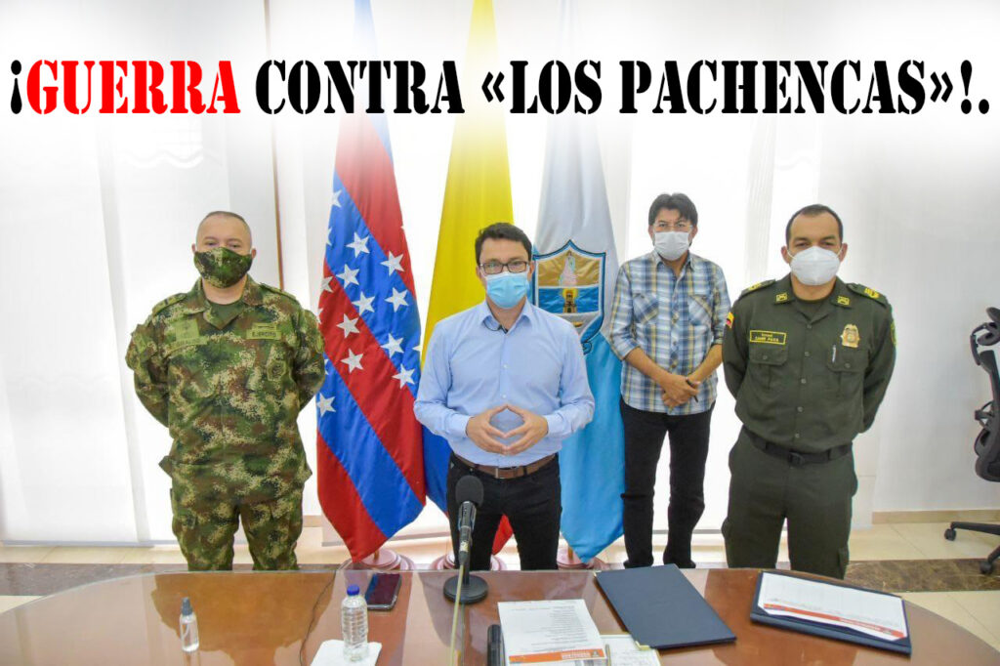
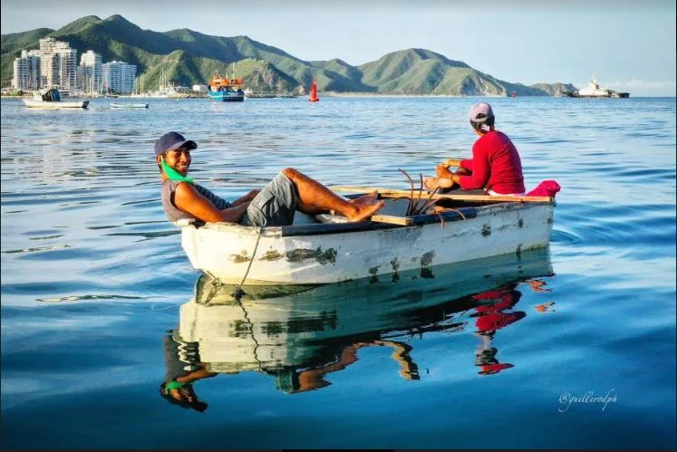
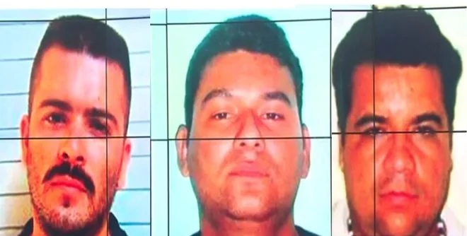

\[caption id="attachment\_12490" align="alignnone" width="702"\] "Tendremos resultados", **Carlos Caicedo** en compañía de los comandantes de las diferentes fuerzas y de su secretario del Interior, **José Humberto Torres**. Sigue la guerra contra **«Los pachenca»** Composición Villarreal.\[/caption\] Los grandes contrastes del Magdalena. Mientras la bahía amaneció con una dulce mañana disfrutada por pescadores artesanales, las autoridades se despertaron muy preocupadas por la posible incursión de **«Los pachenca»** en Carreto, corregimiento de El Piñón. Con esta acción, los herederos del paramilitarismo manifestarían que están vivos frente a la guerra total desatada por el gobernador y las autoridades militares y policivas. Independientemente de que esa incursión sea o no de Los Pachenca, debe haber claridad sobre las estrategias contra las bandas criminales que azotan al Magdalena. Como se predijo en nuestro libro «[**¿Adiós a la guerra? Cinco claves para la paz»**](/articulos/adiosalaguerra/), (2016) el conflicto armado colombiano no podía desaparecer con un mero acuerdo de paz entre el Estado y las Farc. El país necesita un cambio de sistema económico, social y cultural. \[caption id="attachment\_12492" align="aligncenter" width="747"\] La tranquilidad de la **Bahía de Santa Marta** contrasta con la inseguridad en muchas zonas del Magdalena. Cortesía @Guillerodph.\[/caption\] Cuando **Carlos Caicedo Omar** llegó a la gobernación del Magdalena le solicitó a las Fuerzas Militares, a la Policía Nacional y a la Fiscalía acciones efectivas y eficaces contra los sucesores del paramilitarismo. Eso mismo ratificó en el último Consejo de Seguridad como respuesta a la incursión armada presuntamente de **«Los pachenca».** Desde que Caicedo llegó a la gobernación del Magdalena, **«Los pachenca» vienen** sufriendo sentidos golpes. El último fue ayer 27 de agosto con la captura de alias **«Lucho Cartagena»**, el posible sucesor de **«Chucho Mercancía»**, el jefe de esa agrupación delincuencial. El hecho sucedió en Bogotá donde se fue a esconder de sus persecutores, tanto de las autoridades como de sus enemigos del bajo mundo del narcotráfico y la extorsión.

## Caicedo, objetivo militar

El mandatario es considerado objetivo militar por **«Los pachenca»**. Pero Caicedo se mantiene en su papel constitucional y legal de garantizarle la seguridad ciudadana en las zonas donde este grupo tiene su operatividad.  Así lo hizo sentir en el último Consejo de Seguridad celebrado ayer jueves 27 de agosto. /articulos/carlosecaicedo/status/1299127419455107075?s=20 Como se ha dicho, **«Los pachenca»** es una organización  que heredó la criminalidad del paramilitarismo. **Sus jefes militares se mueven _como peces en el agua_ en la Sierra Nevada.** Pero ningún mandatario se había amarrado bien los pantalones, o las faldas, para ponerle contención al desarrollo de estas bandas criminales del departamento. La anterior mandataria, **Rosa Cotes Vives**, fue contemplativa y, por ende, las autoridades estaban inactivas.

## La amenaza contra Caicedo

Al sentir **«Los pachencas»** la fuerza de la nueva administración que no iba a tolerar su accionar criminal, se propusieron atentar contra la vida del gobernador Caicedo Omar**.** En ese sentido, **Colombia Human Rights Network,** desde Washington, DC, le pidió al presidente de Colombia, Iván Duque, la protección de la vida del gobernador por las amenazas de muerte de las que había sido objeto por parte de la banda criminal **«Los pachenca».** De igual manera expresaron su preocupación por la vida del mandatario. Caicedo recibió el apoyo de diferentes sectores sociales y políticos una vez se conoció la denuncia de Colombia Human Rights Network. Los integrantes de su gabinete se unieron al unisono para protestar por ese hecho. Se les atribuyó de su autoría a las organizaciones vinculadas con el narcotráfico y los herederos del paramilitarismo, como **«Los pachenca» y la Oficina de Enigado**.

> «Si algo le llegara a suceder se confirmaría la falta de voluntad política del gobierno para garantizar la vida y seguridad de los sectores de oposición y para liderar un Estado social de derecho».

Esa fue la advertencia que le hizo **Colombia Human Rights Network,** luego de denunciar las amenazas contra el mandatario del magdalena.

## «Los pachenca» muertos en «machete pelao»

\[caption id="attachment\_12491" align="alignnone" width="660"\] Guerra contra Los Pachenca. Los jefes abatidos.\[/caption\] Y como efecto de esa operatividad militar y policiva solicitada por Caicedo Omar, fueron dados de baja sus jefes. El primero que cayó fue alias **«80».** Las inteligencia de las fuerzas militares y, en especial, del Gaula, habían detectado que su sucesor**,** **«Chucho Mercancía», tenía una reunión con narcotraficantes** en Machete Pelao, corregimiento de Guachaca, en Santa Marta. En medio de ese encuentro que se celebraba el 1 de julio, les cayó la perrera. En el acto murieron Jesús María Aguirre Gallego alias, **«Chucho Mercancía»** y otros líderes de la agrupación**.** El capo de **«Los pachenca», cayó abatido por el poder de fuego de las autoridades**. Asimismo 15 días antes, el pasado 16 de junio, también había sido muerto Deimer Patiño Giraldo, alias **«80», el capo mayor de la agrupación.** Este fue considerado un golpe estratégico contra la organización que opera en la Sierra Nevada de Santa Marta. Tiene sus ramificaciones que se extienden a Santa Marta y muchos municipios del Magdalena. En el operativo cayó el sobrino del otrora terror de la Sierra Nevada, Hernán Giraldo, alias **«el Taladro»**. Se trata de **Mario Giraldo**, quien iba a ser el sucesor de **«Chucho Mercancía»**, en el caso de que esta cayera. O sea, que ese día, no solo murió el capo sino también el heredero de Giraldo, quien, al parecer, había pedido que fuera segundo al mando de **«Los pachenca». En 2008,  «el Taladro» fue extraditado a Estados Unidos por delitos relacionados con narcotráfico y enviado a prisión. Terminará condena en 2033.**

## Paro por luto

**«Los pachencas»** ejercen un control territorial en importantes zonas que fueron dominios de los paramilitares. Los espacios dejados por estas organizaciones, luego del acuerdo político con el gobierno de Álvaro Uribe, fueron copados por sus herederos. Es así que cuando cayó **Deimer Patiño Giraldo**, alias **«80»**, esta banda decretó un paro armado como luto de su jefe. La zona donde operaba este jefe armado, quedó paralizada, luego de su muerte.

> «No queremos nada abierto. Absolutamente nadie, todo aquel que no cumpla será objetivo militar».

Así rezaba en un panfleto firmado por la organización «Nuevos Conquistadores de la Sierra», una variante de **«Los pachencas».** El papel se lo entregaron a tenderos, vendedores ambulantes, mototaxistas, trasnportadores, finqueros y comerciantes de Guachaca y las veredas ubicadas cerca de la Troncal del Caribe. Asimismo el paro era evidente desde Calabazo hasta Buritaca, pasando por el balneario del río Piedra, la entrada del Parque Tayrona, Quebrada Valencia, La Revuelta o El Trompito. Ni siquiera la orden de aislamiento por Covid surtió tanto efecto como lo hizo el panfleto de **«Los pachenca».** Todos y todas quedaron resguardados en sus casas. Los poblaciones eran pueblos fantasmagóricos. Ni siquiera el loco del pueblo se atrevió a salir a las calles polvorientas.

## Carreto y **«Los pachenca»**

Cuando los capos de **«Los pachencas» cayeron muertos, hubo un alivio entre la población del Magdalena**. Las autoridades creyeron que habían triunfado sobre esta banda criminal. Pero tal alivio se convirtió en una angustia para los mil habitantes de Carreto. En la noche del miércoles 26 de agosto, se despertaron sorpresivamente. Los disparos  de armas de fuego quebraron la tranquilidad nocturna del corregimiento. Un grupo armado portando armas de largo alcance intimidó a sus habitantes. No se limitaron a intimidar sino también a quitarles sus pertenencias. No hubo muertos, pero esta incursión fue considerada como una señal de que **«Los pachenca»** están vivos. Pero también expresa que están dispuestos a enfrentar la guerra que las autoridades desataron contra estas bandas criminales.

## Las capturas

En tanto que en los dos últimos meses el Gaula capturaron a 17 personas vinculadas presuntamente a **«Los pachencas». Cayó apresada la viuda de alias «80»,** Capturaron a Jefferson Gustavo García Arévalo, alias «Checheo», perteneciente a **«Los pachenca».** Este individuo había pasado a ejercer el control de las rutas de narcotráfico en zona del Caribe. Igualmente, el 12 de agosto el Gaula Militar Magdalena, a través de un operativo interinstitucional coordinado entre el Batallón de alta Montaña No 6, el CTI de la Fiscalía, la Sijin y la Sipol de la Policía Nacional, capturaron a diez personas, señaladas de integrar la banda delincuencial los ‘Papi Urbanos’. Los presuntos integrantes de  **«Los pachenca»** fueron identificados como **Jonathan Henríquez Sánchez, alias Juancho** o Caníbal, de 33 años. **Styven Michael Cárdenas Navarro**, alias Cárdenas, de 22 años. **José Alberto Álvarez Patiño**, de 28 años. I**ván Alfonso Vargas Pertuz**, de 22 años. **Eduardo José Yance Berna**l, de 20 años. **Marfe Viloria Pérez**, alias Cachetes, de 30 años. **Héctor Aníbal Ortiz Glem**, (alias Héctor Lavoe) de 22 años. **Jesús David Pabón Higuera**, alias el Grillo, de 21 años. Esos presuntos delincuentes fueron puestos a disposición de la Fiscalía 19 seccional de Santa Marta para su judicialización. Las autoridades y, muchos menos Carlos Caicedo Omar, gobernador del Magdalena, pueden estar tranquilos con los golpes estratégicos dados a **«Los pachenca».** Estos grupos armados crecen como la verdolaga El sistema económico, social y cultural sirve de marco estratégico para su nacimiento y crecimiento. Es una economía alimentada por el narcotráfico y la actividad ilegal.

### Les puede interesar:

## [¿Acoso judicial contra el único gobernador de izquierda? (I)](/articulos/acoso-judicial-contra-el-unico-gobernador-de-izquierda-i/)

## [El caimán de Tasajera reclama su territorio](/articulos/el-caiman-de-tasajera-reclama-su-territorio/)

## [Caicedo, ejemplo de cómo afrontar el Covid-19 en Colombia](/articulos/caicedo-ejemplo-de-como-afrontar-el-covid-19-en-colombia/)