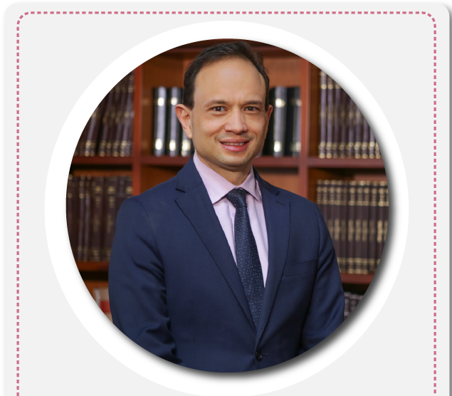

## LUCIO TE EXPLICA «EL CARTEL DE LA CONCILIACIÓN»

https://www.facebook.com/voxpopuli.digital/videos/634889520472490/?extid=9CaVHO2GwhQl0CvV&amp;d=null&amp;vh=e ¿Que tiene que ver la justicia con el **«Cartel de la conciliación»**? Así como hay exmagistrados que litigan después de renunciar de las altas investiduras, existen otros que litigan en cuerpo ajeno. **¿Qué es más grave?** Por lo menos el que renuncia tiene gallardía y dignidad, como el caso de **Carlos Bernal Pulido**. **Pero hay colegas de éste que litigan «en cuerpo ajeno» sin gallardía y sin dignidad.** \[caption id="attachment\_12391" align="aligncenter" width="635"\] **Carlos Bernal** renunció de la Corte Constitucional para litigar. Es más gravoso el «Cartel de la conciliación». Cortesía.\[/caption\]

## Orígenes del «Cartel de la conciliación»

Para mostrar el anterior hecho, analicemos un caso concreto. Consideren esta historia del gobierno **«antimalandrín»** de William Dau Chamat. Es una historia local. Pero refleja de lo que acontece a nivel nacional. **¿Cómo el ejecutivo captura la justicia para comprar impunidad o patentes de corso?** Dau es un ex veedor que vivió de la corrupción. Tiene cara de «**maricón»** (pendejo) pero se come a medio mundo. Sabe que si compra la justicia, se convertirá en una «hoja ajover», **¡nada le pasará!** **La jurídica se la entregó a protegidos de los tribunales que crearon el «Cartel de la conciliación».** Compró a la izquierda unida con dos o tres secretarías. A los grandes medios de comunicación con contratos millonarios. A los gremios económicos les nombró a **Mónica Fadul** como gerente de ciudad. Al procurador Fernando Carrillo le nombró a varios amigos en la administración. No se se sabe si fue con su consentimiento.

## ¿Un alcalde adicto?

William Dau Chamat se hizo inversionista de **Aguas de Cartagena S.A. ESP**. Siendo inversionista fue elegido alcalde de Cartagena y luego presidente de la asamblea de la empresa. Además de esto, **los hechos indicarían que sigue siendo adicto a sustancias alucinógenas**. Hasta ahora, no me ha respondido un derecho de petición en ese sentido. Esta situación le impide adoptar decisiones ciertas para defender los intereses colectivos de la ciudad. Como dicen los expertos, **un adicto tiene secuestrado el cerebro.** **Lo más grave. Dau Chamat tiene muchas investigaciones penales, disciplinarias, fiscales y administrativas en poco tiempo de gobierno.** Es que la conducta de Dau es reiterativa. Errática. Dubitativa. Mientras nos dicen que las finanzas distritales son precarias. concilian miles de millones de pesos para favorecer a terceros. ¿Contradictorio? No. Es coherente. Es un buitre con plumaje de paloma para saquear las arcas públicas. Lo dijimos el 18 de octubre de 2019 en (haz clic) [«Turco» Dau, un buitre ronda a Cartagena (IV).](/articulos/2019/10/turco-dau-un-buitre-ronda-a-cartagena/) ¿Será que este controvertido personaje es un protegido de la justicia? Ustedes sacarán sus propias conclusiones una vez lean las entregas de este informe periodístico.

## Litigar «en cuerpo ajeno»

Este 12 de agosto la jefe de jurídica del Distrito de Cartagena, **Mirna Elvira Martínez Mayorga**, dirigió una conciliación espectacular. **Le cedió a Urbaser —hoy, Veolia— la bicoca de $4.5 mil millones de un conflicto ejecutivo que estaría por resolver el Consejo de Estado** a favor del Distrito. Este desangre fue producto, probablemente, del **«Cartel de la conciliación»,** que pone entredicho a los altos tribunales de Bolívar. Bernal Pulido renunció de la Corte Constitucional para litigar. Luego de su intempestivo retiro, anunció que se uniría al cuerpo de jurisconsultos que litigará un negocio monumental de las EPM contra los constructores de Hidroituango. Si alguien que estuvo laborando en los altos tribunales se dedicara a litigar, tendría una gran ventaja sobre los litigantes que han labrado su camino a pulso. Aunque Bernal Pulido busca defender los intereses de una empresa estatal, el imperativo ético debe primar sobre el interés particular. Pero los magistrados que litigan en cuerpo ajeno deben ser doblemente cuestionados. Para mostrar un ejemplo claro de cómo el éxito le depara a los abogados que renuncian de los altos tribunales, traemos el **estudio de caso** de **Mirna Elvira Martínez Mayorga.** Pero, además, existe en la Jurídica del Distrito un _**cartelito**_ que constituye la élite de la defensa jurídica de los intereses públicos. Es el **«Cartel de los Esposos»**, como se conoce en los secretos más íntimos de la alcaldía distrital de Cartagena. Es un secreto a «_sotto voce»_. **El alcalde de Cartagena William Dau Chamat nombró a Martínez Mayorga como jefe de jurídica del Distrito.** Tenemos alguna idea de quién la recomendó. La quisieron presentar como producto de las falsas convocatorias públicas que Dau había anunciado.

## El salto de Mirna

La llegada de Mirna a la alcaldía podría ser una fachada para comprar la IMPUNIDAD de los actos corruptos de la administración distrital dirigida por Dau. No obstante, Mirna Martínez procede del **Tribunal Administrativo del Atlántico (2016—2019**). Previamente se encontraba como abogada auxiliar del **Tribunal Administrativo de Bolívar (2012—2016)**. Y les cuento esta gran curiosidad. Antes de irse para el Tribunal Administrativo de Bolívar, **fue la jefe de jurídica de Urbaser en Cartagena (2011—2012)**. ¿Te diste cuenta del carrusel o te lo explico con plastilina? Vamos, te voy a contar bien la historia. La actual jefe de jurídica **Martínez Mayorga, en este período, litigaba contra el Distrito a favor de los intereses de esa multinacional del aseo, Urbaser.** Puesto que Martínez, como jefe de Jurídica de esta empresa, debía diseñar y desarrollar las estrategias jurídicas de procesos que aún están vivo. Por tanto,  estaba en la obligación de declararse impedida para estas conciliaciones dudosas. En gracia de discusión, si hablamos en términos estrictamente legales, no habría un delito el hecho de que haya sido Jefe de Jurídica de Urbaser hace 8 años. En este caso, el delito prescribiría. Pero una reconocida abogada, me dijo que para ella el impedimento sería eterno. O sea, sería imprescriptible desde el punto de vista ético. **Máxime, es un proceso que data desde cuando ella le servía al Tribunal Administrativo de Bolívar que conoció el proceso ejecutivo en primera instancia.** Además, Mirna Martínez, destacada abogada —**egresada de la Universidad de Cartagena en 2009**— **pudo influenciar para que el Tribunal Administrativo de Bolívar fallara un millonario ejecutivo a favor de Urbaser y en contra del Distrito, en 2018.** Si bien, ella ya se encontraba en el Tribunal Administrativo del Atlántico —duramente cuestionado por fallos dudosos y comprometidos con la corrupción administrativa— cuando se produjo el fallo. Pero pudo incidir en el caso a favor de sus viejos empleadores.

## **El «Cartel de los Esposos»**

\[caption id="attachment\_12379" align="alignnone" width="959"\] La pareja de los servicios públicos del Distrito: **Heidy Villarroya y Francisco López**. Importantes para el «Cartel de la conciliación». Cortesía facebook.\[/caption\] Resulta que  **Mirna Martínez Mayorga** llevó a la Unidad de Servicios Públicos del Distrito de Cartagena a **Heidy Paola Villarroya Salgado, quien también es una destacada abogada.**  Heidy, a su vez, llevó a su esposo **Francisco López Ramos** a la oficina Jurídica que dirige **Mirna Martínez**. Y López Ramos es un abogado activo que proyecta muchas decisiones jurídicas de esa dependencia. Los López—Villarroya constituyen una pareja de peso específico en el poder jurídico y de servicios públicos del Distrito. Casi todo lo que se produce en esas dependencias, tiene que ver con ellos. Fíjense lo que sucede en el gobierno del «**antimalandrín**» de Dau Chamat. «El Cartel de los Esposos» le sirve al **«Cartel de la conciliación».** **Esta pareja está inserta en servicios públicos domiciliarios y jurídica. Por ende, debe resolver cualquier tipo de reclamación con Veolia que compró Urbaser**. Ellos no entienden de ética. Tampoco de conflicto de intereses. Nada. Otra pareja, de la cual hablaremos ampliamente en otra entrega, es la que forman **Antony Sampayo y María Rojas Morales.** Sampayo fue el abogado que le decía a William Dau que no le hiciera caso a la Procuraduría sobre el tema de tumbar el edificio Aquarela. Claro, lo hacen porque previamente tienen comprada la impunidad.

## El «Cartel de la conciliación» de cara bonita

\[caption id="attachment\_12380" align="aligncenter" width="500"\] La jefe de Jurídica ¿en el «**Cartel de la Conciliación»**? Y se ríe. Cortesia.\[/caption\] **Si Mirna Martínez llevó a la Unidad de Servicios Públicos a Heidy Villarroya no lo hizo para hacerle un favor personal.** Debía poner una persona de su confianza en esa unidad con el fin, quizás, de preservar los intereses no del Distrito sino de sus jefes. Por el contrario, esas chicas expertas en derecho administrativo y en contratación pública, están para litigar contra los intereses de los cartageneros. **Prueba irrefutable es esta conciliación que le entrega a Veolia la suma de $ 4.5 mil millones.**

> **Con los $4.5 mil millones el Distrito podría comprar 50 mil mercados para repartirlos en los barrios extramurales en medio de las dificultades económicas de la alcaldia y de la ciudad.** Podría pagar todas las órdenes de servicios que le debe a profesionales que cumplieron a cabalidad con su trabajo.

El proceso que está en el Consejo de Estado (Dele Clic para ver su estado) [13001333300020170004001](/articulos/testmaster/nue_actua.asp?numero=13001333300020170004001) que conciliaron está para fallo desde el 13 de diciembre de 2019. Es decir, que en cualquier momento revienta. Es probable que sea a favor del Distrito. Por eso fue el afán de Mirna Martínez de realizar la conciliación con Urbaser (Veolia). Como tienen relación con el poder judicial, obtienen privilegiada información. Entrevisté a varios miembros del Comité de Conciliación. **Uno me dijo que como en la reunión del 12 de agosto presentaron varios casos, no analizaron detenidamente la conciliación con Urbaser.** Se supone que todos los casos que llevan para estudio previamente son acordados con William Dau. Sin embargo, si las conciliaciones no se ajustan a las necesidades del Distrito sino a las de la contraparte, es justo y necesario que las autoridades las investiguen. ¿Quién le pone el cascabel al gato? Especialmente, las conciliaciones del último período de la administración que el **Libro Blanco de Dau** omitió. En este período se han cometido más casos sospechosos que en todo el período del «**último malandrín**».

## Dau y su **«Cartel de la conciliación»**

Este martes 18 de agosto, cada uno de los que integran el Comité de Conciliación **debe firmar el acta del 12 de agosto**. Pero antes de firmar debería consultar con su conciencia y con un abogado especialista en la materia que esté por fuera de este cartel.

La secretaria técnica del Comité de Conciliación, **Gina Río**, ya debe tener listo el acta donde se conciliará la suma de $4.5 mil millones. **Es como si Urbaser se ganara la Lotería del Valle pero sin comprar el billete**. ¿Para qué? Allí tiene el personal técnico que le arma las bolas de la lotería encabezado por su exempleada Mirna Martínez. Ésta juega a tres bandas. Representa al Distrito. ¿Es protegida del Tribunal Administrativo de Bolívar? Y sus exjefes están en Urbaser, hoy Veolia.

**Gina fue llevada a Jurídica por Heidy Villarroya.** Y ésta a la Unidad de Servicios Públicos por Mirna Martínez, quién viene del poder judicial de Alto Turmequé. Ésta fue nombrada por Dau a petición de unos pesos pesados del sector judicial que descubriremos. ¿Comprendes la esencia de este cartel?

Literal. **Es un verdadero torniquete de los «expertos jurisconsultos»**. Estos podrían tener relación con un supuesto y nuevo «**Cartel de la Toga»** anidado en el Tribunal Administrativo de Bolívar y en el Tribunal Superior de Cartagena. Un cartel de altos quilates, que por la vía de la conciliación, desangran las ya precarias finanzas del distrito.

En las próximas entregas detallaremos la esencia de estos neocarteles que la nueva élite de la corrupción utiliza para cabalgar sobre la impunidad. Compran patentes de corso en cuerpo ajeno.

**¿Comprendes ahora porque Dau no se ha caído?** Quinto duró 14 días en la alcaldía. Manolo Duque un año. Pedrito Pereira duró más de un año sostenido por la vicepresidente Martha Lucía Ramírez. A diferencia de «los malandrines», **el neomalandrín tiene empleado a los protegidos de la justicia, y de los altos tribunales, que no es lo mismo.** El «Cartel de la conciliación», es un ejemplo de la pulcritud del Tractor.

## Te puede interesar:

##  **[«El «Turco» Dau y](/articulos/2019/10/el-turco-dau-y-lets-save-cartagena-instrumentos-de-los-buitres-iii/)** _**[Let´s Save Cartagena](/articulos/2019/10/el-turco-dau-y-lets-save-cartagena-instrumentos-de-los-buitres-iii/)**_**[, instrumentos de los «Buitres» (III)](/articulos/2019/10/el-turco-dau-y-lets-save-cartagena-instrumentos-de-los-buitres-iii/)**

## [El entuerto administrativo del «perro hambriento» en el concejo de Cartagena (I)](/articulos/el-entuerto-administrativo-del-perro-hambriento-en-el-concejo-de-cartagena/ "El entuerto administrativo del «perro hambriento» en el concejo de Cartagena (I)")

## [UdeC en pleno se levanta contra ataque injurioso del alcalde](/articulos/udec-en-pleno-se-levanta-contra-ataque-injurioso-del-alcalde/ "UdeC en pleno se levanta contra ataque injurioso del alcalde")