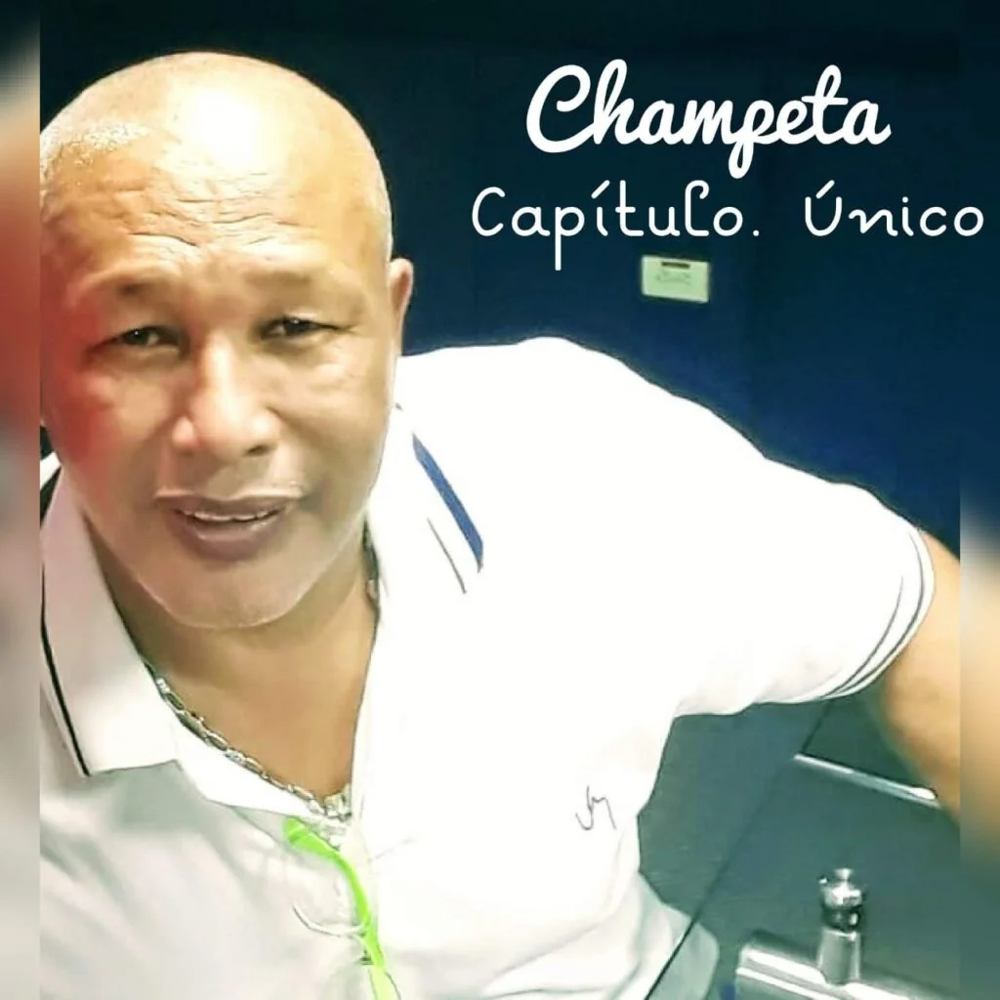
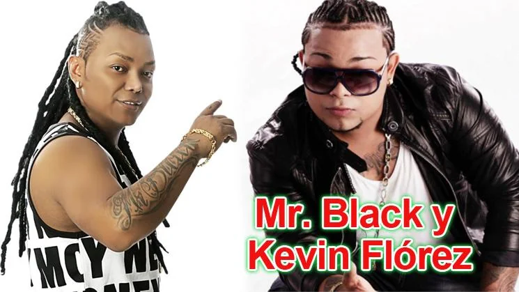

\[caption id="attachment\_12459" align="alignnone" width="702"\] **Moisés de la Cruz**, uno de los precursores de la champeta, la hija de la **«mala madre»** con Viaviano de **Anne Swing**. Cortesía.\[/caption\] **¿Es la champeta hija de «mala madre»?** Sin duda. Fue parida en los barrios extramuros de Cartagena. Pero su madre no ha tenido nada que ver con ella. La aborreció y la abandonó. Y cuando ya estaba adulta, la prohibió y la confinó a los recodos de la pobreza y al olvido de una ciudad caótica, desigual y discriminatoria. A esta conclusión se puede llegar luego de la entrevista con el gestor y promotor musical y cultural, **Moisés de la Cruz,** quien prepara un libro sobre la champeta. Es una conclusión problemática, si se quiere. La entrevista con uno de los protagonistas del movimiento champeta nos permite clarificar sus orígenes. También los alcances de la historia de este movimiento cultural. No como músico, sino como ideador y autor intelectual. Pero muy a pesar de que la madre la abandonó, la champeta ha tenido tres momentos históricos decisivos. Aquellos tiempos de sus orígenes se le llamaba la **«terapia criolla»**. Y allí estaba **Anne Swing** que le dio un toque a los aires musicales de la cuenca del Caribe. **Luego vino la explosión de los champetúos**. Y el momento actual con el **Imperio y el Rey de Rocha.** Estas son dos máquinas del sonido champetúo que imponen su dictadura sobre los artistas.

## «La mala madre»

La conclusión que se propone no podría ser de otra manera. En realidad, el movimiento champeta es la expresión espontánea de la segregación racial y social.  **La abyecta pobreza provoca resistencia que son contraculturas**. Se diseñan fluidamente nuevos códigos contra—culturales. De esta forma se construyen otras convenciones sociales y culturales que no podríamos entender si no entramos —como observador— en ese mundo. Un mundo a veces sórdido. Lleno de pobreza. A veces violento. Otras veces atrapado por el sexo, el alcohol y la droga. Surgió como una válvula de escape de unas masas olvidadas y segregadas. Y «la mala madre» que la parió, sola la abandonó. La dejó a la deriva, como la barcaza sin timonel en medio del mar Caribe.  Y ¿por qué se llega a esa conclusión? Moisés de la Cruz manifiesta:

> «_La investigadora bogotana, **Heidy Martinez**, elaboró una tesis laureada sobre la champeta. Podemos decir que este movimiento musical es un revitalizador de las energías y del sueño de los pueblos pobres del Caribe. Los pueblos por sus propios medios la difundieron. Cartagena es la madre de la champeta que una vez parió a su hijo y lo abandonó. **Cartagena ha sido la última en aceptar que es champetúa**_**»**.

Luego de hacer un recorrido exitoso por el país, **Moisés de la Cruz** —apoderado de Anne Swing en la década de los 80— manifiesta que al regresar a Cartagena, la «mala madre» no entendió lo que estaba surgiendo. **Viviano Torres** llegó a vender 40 mil discos. Esta venta fue certificada por Codisco, el sello que le dio la oportunidad a la terapia criolla para incursionar en el acetato.

## Un desahogo

La champeta fue el resultado de un desahogo contra «la mala madre». Es una válvula de escape de esa pobreza que rodea a los marginados de la Costa Caribe. Y en este punto, de la Cruz es más crudo en la descripción del problema.

> «_En el hogar cartagenero (de los barrios pobres) no hay un comedor donde se pueda dilucidar los problemas de las familias. El cartagenero no hace colonia en ninguna parte. El cartagenero cuando habla parece que estuviera peleando. La champeta en los barrios es un desahogo para compartir cuando hay música. Porque el cartagenero no se junta sino alrededor de la música. Es la expresión de su sentir y de su vivir. Un medio a través del cual el pueblo se desahoga. Es eterna. El género musical genuino de Colombia, porque nació en el corazón del pueblo»_.

Cuando se trata del origen de un género, un ritmo o un fenómeno musical, no se podría establecer una fecha o un año exacto. Tampoco una persona o un ente determinado. Sabemos que surgió en los barrios marginados de «la mala madre». Las élites sociales y política de Cartagena no aceptan que son champetúas.

## Lo prohibido

\[caption id="attachment\_12464" align="aligncenter" width="745"\] **Mr Black y Kevin Flórez**, dos exponentes de la champeta. Cortesía Tuiter.\[/caption\] En el 2015 tramitaron un acuerdo en el concejo de Cartagena para prohibir la champeta como baile plebe o erótico. Y aunque le quisieron dar un concepto cuasi—científico de erotismo temprano, no dejó de ser la visión prohibicionista, segregacionista y discriminatoria de la historia cultural de Cartagena.  (Ver el artículo que publicamos en diciembre de 2015: [**De la prohibición del fandango a la champeta**](./)). En noviembre de 2014 estuve involucrado en un debate público sobre la champeta. En aquella ocasión denuncié a Raimundo Angulo por discriminador. Y fue una denuncia penal. Ya que es una conducta tipificada como delito. **El zar del Concurso Nacional de Belleza, bajó del escenario a Mr Black.** En su repertorio, que presentaría en el evento central del concurso, estaba el tema **«Bandida»**. Fue una ofensa para Angulo. La champeta se vestiría de etiqueta. Era su entrada oficial a la gran sociedad. Entrada a regaña dientes. Angulo solo quería las canciones que pasara el tamiz de su censura discriminatoria. Y no los temas que libremente el artista quería interpretar. La champeta, más que un aporte a la música, lo hizo a la cultura colombiana. A veces sobredimensionada. Otras veces subestimada. La champeta como el reguetón, son géneros que surgieron de la marginalidad del ser humano en suburbios de la América Caribe. Así sucedió con el **hip hop, el rap**, entre otros, que salieron de las barriadas de ciudades norteamericanas.

## Los precursores

\[caption id="attachment\_12460" align="alignnone" width="720"\] **Anne Swing**, el primer LP del surgimiento de la champeta, hija de **«mala madre».** Cortesía. **Aparece como productor colombiano, Moisés de la Cruz.**\[/caption\] Pero en la década de los 80s estaba sucediendo algo en la **expresión musical de los de abajo** que no había sido identificado por sociólogos ni por investigadores académicos. Tampoco **los de arriba** —las élites cartageneras— entendían lo que sucedía más allá de las murallas. Pero los picós nos decían que una muchedumbre les seguía para bailar una música rara. Era la terapia criolla. De otro lado, la industria discográfica comenzaba a descubrir aires musicales distintos. Aires que se encontraban escondidos en la cotidianidad de las urbes caribeñas. Para esa industria, había sido un éxito comercial haber descubierto a viejas cantadoras de bullerengue de los pueblos abandonados de la sabana de Bolívar. Ahora se trataba de ver qué sucedía en las barriadas de Barranquilla, Cartagena o Magangué. Moisés me dice que la historia data cuando Discolombia de **Felix Butrón de Magangué,** en el almacén de Barranquilla, invitó a grabar a Son Palenque con Justo Valdés. En el grupo estaba Viviano Torres, quien le propuso a Justo la oportunidad de grabar música áfricana que se escuchaba en los picós. Justo no se la dio. Se la dio el grabador de **Felito Record**. Este hecho dio para que Viviano creara Anne Swing.

> «Conocí a Viviano en junio del año 85 en el marco de las Fiestas del Pescador de la Boquilla. Era un evento de Tres Esquinas. Luego me visitó a mi oficina. Se me puso a la orden. Me propuso que fuera su _**manager**_ . Yo era Manager, a nivel de Sudamérica, de la compañía **Kubaney Publishing Corp** de los Estados Unidos.  Con este sello Viviano Torres firmó y lanzó su primer disco».

Se formó **Anne Swing**. Los músicos eran empíricos y otros con poca experiencia. No sabían leer música. Los instrumentos que utilizaban eran alquilados.

## «Una mala madre» pare la champeta

En los años 80s se escuchaba mucho la música terapia (africana) en las casetas barriales, al son de los picós. Era parte de la contracultura. En tanto, en las emisoras se programaba la salsa, música tropical, merengue y la música disco. Apenas empezaban a programar el vallenato. Olímpica, por ejemplo, inició con el Binomio de Oro. Y allí se disparó el vallenato. Especializaron una emisora para este aire musical.

> «_Comenzamos los talleres para hacer el repertorio de **Anne Swing**. Los músicos de Cartagena me decían que era música zurda. Me decían que era un grupo donde no había música. Todos me daban lengua, pero yo decía ‹aquí hay algo›. En ese año **Dolores** (la mujer de Viviano) se ganó el premio a la mejor dulcera del **Festival de Dulce**. Con ese dinero compramos el equipo de guitarra. Teníamos dos guitarristas. Comenzamos a trabajar._

Moisés de la Cruz precisa un momento interesante para analizar la génesis de la champeta.

> _Conocí al hijo de **Felix Butrón** (Felix Jr.) amigo de **Humberto Castill**o, seguidor de la música africana. La de Tchico Tchicaya, Pepe Kalle, Mbilia Bel_. Me entregaron los discos para que yo hiciera _cover_ con el grupo Anne Swing. De ahí Viviano comenzó a interpretar toda la música africana. El el grupo se pegó en todo el país. Cuando Vivíano graba el primer disco, se pega Minakalele.  Con el tema Permiso es cuando la gente se convence de este hecho.

## **Nace el nombre champeta**

El programa **Caribe Alegre y Tropical,** Humberto Castillo Geminis Music, y Viviano Torres —con la dirección de Moisés de la Cruz— **se escucha por primera vez el vocablo champeta** para denotar un estilo musical surgido de las barriadas champetúas de la ciudad de Cartagena. El vocablo champetúo se decía de las personas ordinarias de la ciudad.

> «Humberto Castillo me dijo, «será que resiste este cd, un variado de champeta, resiste›. Le dije, ‹lo peor que puede suceder es que no lo compren›. El CD fue aceptado y comprado».

Y en ese CD estaban canciones que marcaron el origen de la champeta: «Permiso» (Viviano), «El pato», «Juan el guapo».

> _«**Yamiro Marín**, está en el grupo de pioneros. **Wilfrido Hincapie** consiguió un local en el mercado de Bazurto. Luego Yamiro con Elio Boom hacen ‹La turbina›. Ya Anne Swing era Anne Swing. En aquella época vendí tres eventos con La monumental, y La perla y Anne Swing. William Simancas era bajista de la orquesta La monumental. Por lo tanto, Simancas no puede ser pionero»._

## Tres momentos de la champeta

**Moisés de la Cruz está inmerso en el mundo de la champete.** Fue uno de los protagonistas de su origen. La historia de la música champeta comienza con la pelea entre Viviano y Justo Valdez, dueño de Son Palenque. A raíz de esta pelea, Viviano conformó **The Anne Swing con Charles King, Melchor, Cecilio El Turco, Tomás Pérez y Moisés Orozco,** Le pedí a Moisés que me definiera tres momentos de esa historia.

> «_Viviano fue un primer mom_ento. Con Codisco vendimos 40 mil discos y estuvimos en seis países. Ese es el momento de los pioneros».

Allí estaban esas canciones «Permiso» (Viviano), «El pato», «Juan el guapo». Son canciones que dispararon el inicio de este gran movimiento cultural.

> «_Luego vino el momento de esplendor de la champeta. Cusima, Afinao, Sayayin, Mr black, Melchor, Sony Music_».

¿Y el momento actual? ¿Como podemos definir este momento dominado por el Imperio y el Rey? ¿Es el regreso de la champeta a ser el patio trasero de los picós? Lo peor. Son solo dos picós que ejercen un monopolio en el mundo sórdido de la champeta.

> «_El momento de hoy: tiene unas de cal y otras de arena. Kevin Flórez con Champetizate. Mr Black es una tremenda persona. Tranquilo, serio, honesto. Hay otros buenos como, El Rasta, Charles King_, El Imperio y el Rey de Rocha: difusión extorsión»

**«La mala madre», sin embargo, acoge a su hija por la puerta trasera de la casa.** Ya la aceptó. Y hoy se escucha la champeta, no solo en la Costa Caribe, sino más allá de nuestras fronteras patrias. Dejó de ser «música para bandidos». Pero ahora esta siendo sometida a una dura dictadura ejercida por el Imperio y el Rey de Rocha. **Dictadura que Moisés de la Cruz llama** **«difusión extorsióin»**. Te puede interesar [Taka-taka «música para bandidos» (I)](/articulos/ito-el-intocable-de-la-champeta-ataca-de-nuevo/) [¿Una champeta por los mártires de la invasión extranjera?](/articulos/una-champeta-por-los-martires-de-la-invasion-extranjera/) [Monomaster en el Beat: «La champeta debe ser libre»](/articulos/monomaster-en-el-beat-la-champeta-debe-ser-libre/)