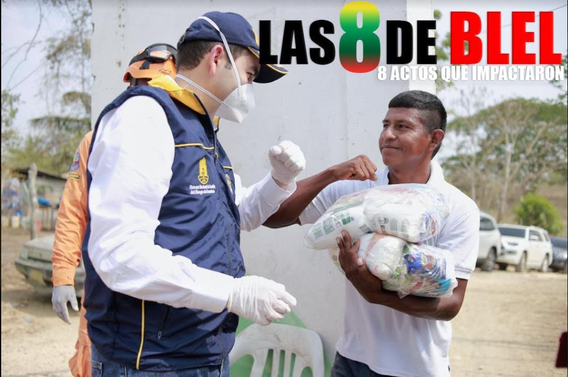
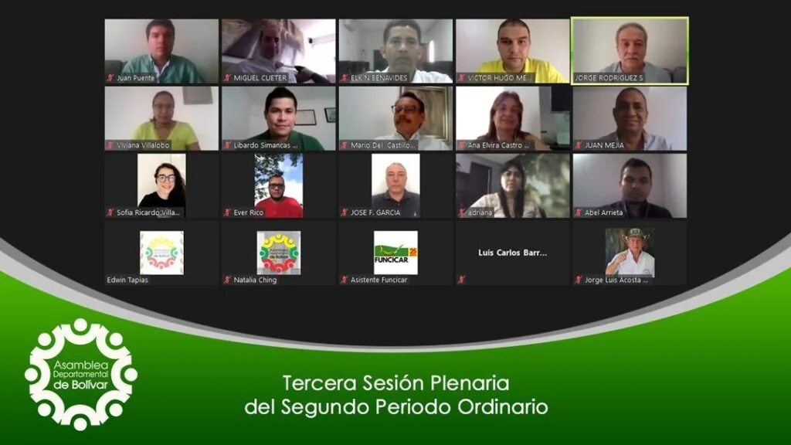

\[caption id="attachment\_12626" align="aligncenter" width="971"\] Las 8 de Blel. El gobernador respondió al desafío del Covid-19. (Diseño Melisa Villarreal).\[/caption\] **Las 8 de Blel impactaron a Bolívar.** Durante estos primeros ocho meses de gobierno, todas las semanas vemos al gobernador de Bolívar, **Vicente Blel Escaf,** visitando municipios y veredas con su equipo de gobierno. Y no son visitas protocolarias y **«promeseras»**. Siempre deja algo. Por esta razón, es extremadamente difícil resaltar las ocho acciones de Blel en sus ocho meses de gobierno saturados de **Covid—19**. Pues, son muchas. Con esta entrega **VoxPopuli.Digita**l  inicia un análisis de los actos administrativos desarrollados por algunos mandatarios del país. Resaltaremos sus realizaciones públicas, más allá de los anuncios de prensa. Como se sabe, muchas veces los comunicados oficiales se convierten en productos propagandísticos para crear una falsa—buena imagen de los gobernantes. Como paréntesis, anunciamos que próximamente publicaremos una serie sobre los presuntos 80 casos de corrupción administrativa del alcalde del Distrito de Cartagena, **William Dau Chamat**. Se denominará **Las 80 de Dau**. En este caso la tarea fue fácil para seleccionar esos 80 casos de corrupción. Pero difícil para escoger las 8 acciones de gobierno más relevantes. ¿Son muchas? No, fue difícil por su escasez.

## La herencia de Gossaín

\[caption id="attachment\_12627" align="alignnone" width="858"\] **Juan Carlos Gossaín y Dumek Turbay,** los predecesores de **Vicente Blel**, cuando se morían de risas.\[/caption\] En el caso de Bolívar debemos decir que desde la administración de **Juan Carlos Gossaín**, la gobernación ha experimentado **un avance en los procesos de gestión pública, las finanzas, y la capacidad de gestión de grandes proyectos con el gobierno nacional.** Antes de Gossaín, estaban intervenidas la salud, las finanzas públicas y sancionadas la educación por falta de gestión. Con Gossaín se consiguió una estabilidad institucional, gobernabilidad y capacidad de gestión de los procesos administrativos. **Estos avances fueron heredados por Dumek Turbay Paz**, quien continuó con su **Bolívar Sí Avanza**. Fueron mandatarios eficientes y eficaces dentro del sistema político dominante. **La nota discordante de los dos exmandatarios fue su temperamentalidad.** Quizás la falta de inteligencia emocional de los dos les impidió alcanzar mejores resultados. Esto implica que la administración pública moderna parte del **liderazgo integral** y de la inteligencia múltiple. Así lo señalan algunos tratadistas internacionales como **Stephen Covey, Brian Tracy y John Maxwell**. Son mis autores favoritos en materia de liderazgo. Estos tratadistas se apartan un poco del concepto de liderazgo de la Universidad de Harvard.

## Las 8 de Blel impactan

Siguiendo la línea argumental de este análisis, se puede decir que el gobernador **Vicente Blel Escaf es el heredero de Gossaín y Dumek Paz**. Pero hay que resaltar un hecho que pudimos descubrir: no es temperamental. Uno dialoga con él sin prisa. Pero también existe la percepción de que cumple lo que promete. Es decir, no es un charlatán. En los 8 meses de gobierno, Blel demostró que no es un _**pelaito**_ sin experiencia y que tampoco es el **malandrín** como lo acusó el hoy alcalde Cartagena, William Dau Chamat. Un botón de muestra de esta aseveración fue la contratación extraordinaria amparada por las excepciones de la emergencia sanitaria y ambiental. El alcalde de Cartagena **_peló el cobre_**. En tanto que Blel se ajustó a la norma y a la sindéresis de la discrecionalidad del mandatario. **Dau, por el contrario, fue como el cerdo, no se sacia con nada.**

## Las 8 de Blel

¿Cuáles son las 8 de Blel? En los 8 meses de gobierno —desde el 1 de enero al 2 de septiembre— podemos destacar ocho acciones gubernamentales de impacto. **1**. Matrícula gratis para estudiantes de la Universidad de Cartagena y Universidad de Bellas Artes. **2.** Plan de Acción por la Vida para detener el re-encauche de la violencia en el departamento. **3**. Puesta en marcha de pisos adicionales del Hospital Universitario del Caribe (HUC) **4**. Internet para Santa Cruz del Islote. **5**. Plan de Atención a Víctimas del Conflicto por $507 mil millones. **6**. Puesta en marcha de plan para dotar de luz  las veredas de El Carmen de Bolívar: Santo Domingo de Mesas y Mesitas. **7.** Recursos para rehabilitar el Malecón de Regidor **8**. Ruta comercial aérea a Mompox. ¿Cuál de esas acciones es la más importante? ¿Las que quedaron por fuera son más sobresalientes que las relacionadas? Ciertamente, seleccionar las acciones gubernamentales, como actos de gobierno, no es fácil. No todos pueden quedar contentos. Depende del angulo que se vea. Por ejemplo, los habitantes de Regidor podrán decir que la obra del Malecón de esa población es el acto más importante de Vicente Blel. Lo mismo dirían los de Santa Cruz del Islote con la conectividad dotada a ese corregimiento. Y podrían tener razón.

## **El Plan de Gobierno de Blel**

\[caption id="attachment\_12601" align="aligncenter" width="702"\] Cuando fue aprobado el Plan de Desarrollo **Bolívar Primero**. Una de las 8 de Blel.\[/caption\] Podríamos resaltar que el acto de gobierno más importante de Blel es su (haz clic) [**Plan de Desarrollo BOLÍVAR PRIMERO**](/articulos/servicios/2020/proyecto-de-ordenanza-plan-de-desarrollo-bolivar-2020-2023). Pero esto amerita un análisis más profundo. Necesitaríamos hacer una comparación conceptual con el plan de desarrollo del gobernador anterior **Dumek Turbay Paz**. Así sabremos si es progresivo o regresivo en comparación con sus predecesores: Turbay Paz y Juan Carlos Gossaín. También nos permite conocer sus ejes estratégicos y saber si las metas más importante son financiables o no. Es decir, si corresponden a un marco fiscal sano. Igualmente debemos entender que este tipo de ejercicio periodístico también nos permitirá establecer **si Vicente Blel está respondiendo a las expectativas despertada durante su campaña electoral** por su programa de gobierno. O, por el contrario, fueron promesas vanas que se las lleva el viento. **La orientación política de una administración está determinada por su programa de gobierno**. Éste orienta las estrategias programáticas del plan de desarrollo. Recordemos que cuando se elige a un mandatario, también estamos eligiendo un **programa de gobierno**. Por tanto, **Vicente Blel** debe reflejar, en su actuación programática, lo que prometió en su campaña electoral y en su **programa de gobierno**.

## El covid, ¿un handicap?

Cabe resaltar que el Covid, lejos de ser una limitante (un handicap, como dicen los gringos) para los gobernantes, debió ser un desafío. En las dificultades se demuestra la capacidad de liderazgo de un gobernante. Si las circunstancias son adversas, el gobernante debe ser creativo y resolutivo. **Las 8 de Blel** se dieron en medio de una pandemia que sorprendió al mundo. En términos generales, el plan de acción para controlar la expansión del coronavirus fue bien atendido por **Vicente Blel**, de acuerdo con la percepción de los conocedores de salud pública en el departamento. ¿Quién estaba manejando ese plan emergente? Blel designó como responsable a **Willy Simancas**, su asesor. Simancas dejó un buen rastro cuando fue gerente de la Ese Maternidad. En este período también lo hizo bien, no solamente porque conoce el tema de salud pública, sino también porque el gobernador lo escuchaba. Sobre esa contingencia, Blel reconoció que fue un desafío que lo puso a prueba. Así lo señala en la presentación del plan de desarrollo:

> _«Esta crisis en la salud, originada por el Covid-19, ha venido a remover los cimientos de nuestra institucionalidad **poniendo a prueba nuestra capacidad como Estado de resolver un problema estructural** que además de poner en grave peligro la vida de las personas, que se contagian con un virus que aún no tiene un tratamiento definido ni mucho menos una vacuna que permita prevenir y curar sus efectos, pone en alto riesgo la productividad y la sostenibilidad económica de todo el país_». (Subrayado por el periodista).

## Las 8 de Blel para priorizar

**El Plan de Desarrollo Departamental Primero Bolívar 2020—2023** es una herramienta fundamental para realizar una gestión bien planificada y controlada. Los indicadores de resultados producto de procesos de gestión pública de calidad y de control social, deberán ser analizados por cada uno de los ciudadanos de Bolívar. En ese sentido, las 8 de Blel es un ejercicio intelectual, participativo y pedagógico que le servirá de herramienta a los dirigentes sociales para ejercer un mejor control social. También facilitará que la participación sea efectiva y eficaz, derecho fundamental que tiene la ciudadanía. A partir de la próxima entrega profundizaremos cada una de **las 8 de Blel**. Son acciones. Son hechos de gobierno. **No** _**bla—bla—bla—bla**._  No hay dudas. Quizás ninguno de los electores tampoco: **Vicente Blel nos sorprendió**. En campaña **William Dau acusó a Blel de ser malandrín.** Pero los hechos de gobierno nos dicen que el **malandrín de 7 suelas es Dau**. Esto no quiere decir que **_Vicentico sea un santico_** a quien hay que prenderle una vela. No. Si bien su padre fue condenado por la parapoplítica, nunca ha estado metido en el bajo mundo ni tampoco tiene antecedentes judiciales. Pero la práctica gubernamental de _**Vicentico**_ —como dicen sus amigos— nos indica que ha sido un gobernante decente, diligente, eficiente y prestante. Es mejor que las obras de un gobernante hablen por sí solas que una tonelada de reconocimientos. **Estas son las 8 de Blel.**

#### Te puede interesar:

### [Covid-19: ¡Cartagena se derrumba, y el alcalde de rumba! (I)](/articulos/covid-19-cartagena-se-derrumba-y-el-alcalde-de-rumba-i/)