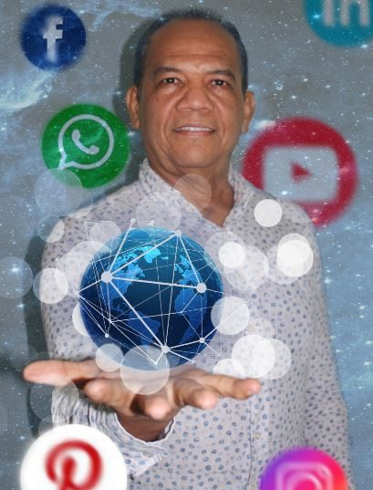

\[caption id="attachment\_12715" align="aligncenter" width="702"\] El mundo en tus manos. En la Era Virtual podemos construir el mejor de los mundos.\[/caption\] El mundo experimenta una transformación sustantiva. **Se reacomodan las placas tectónicas de la economía.** **Irrumpe con fuerza la Era Virtual.** La Era Industrial está agonizando. Pero algo diferente está sucediendo. La cuarentena por la Covid—19 puso al descubierto lo que ya sabíamos. Que la humanidad está cambiando de Era. El encierro de **2.5 mil millones de personas,** por el miedo al coronavirus, causó un gran impacto en la economía mundial. También en la cultura, en la Salud y en la vida. En fin, en las relaciones sociales y políticas. Una investigación realizada por el **Deutsche Bank** indica que estamos asistiendo a un cambio profundo. Es decir, a la aparición de una nueva Era que en los 10 años venideros se caracterizará por el imperio del desorden.

## ¿Por qué una Era Virtual?

Desde hace varios años hemos pensado en cómo denominar a este cambio que está siendo marcado por la desvalorización de los activos del capitalismo mundial. A este cambio profundo le estamos denominando la Era Virtual. **No es un calificativo esnobist**a. No. La investigación de los alemanes viene a confirmar lo que muchos analistas están hablando desde hace más de una década. ¿Por qué Era Virtual? Aumentará el teletrabajo. Crecerá la telemedicina. El sistema médico cambiará estructuralmente. Se impulsará la economía en red. El colaboracionismo se convertirá en una necesidad económica. El copy right se volverá añicos. Las naciones y las empresas deberán adaptarse al desarrollo sostenible. Desarrollo sostenible que implica un menor consumo de la energía fósil y respeto de los recursos naturales. La aplicación de las nuevas tecnologías en todos los procesos productivos y en la comercialización será un imperativo categórico. El sistema financiero tradicional sufrirá una transformación revolucionaria con el **_block chaing_** y la **criptomoneda**. Después de 200 años, tendremos un nuevo modelo de la educación.

## ¿Un nuevo sistema?

¿Quiénes son los del sistema? La educación no va a volver atrás. **Tendremos un nuevo modelo educativo que usará otras estrategias pedagógicas.** Muchas de éstas ya conocidas desde hace tiempo. Las universidades —aisladas de los gobiernos y de la democracia— han estado a la vanguardia de este cambio . **¿Te suena la educación virtual?** Surgió (1991) como una necesidad de las universidades de interconectarse**.** Pues, hoy, la educación virtual llegó para quedarse. Pero ahora los que más están sufriendo son los que carecen de una mente abierta. Los científicos de la **neuroplasticidad** nos dicen que el cerebro se puede moldear con los nuevos acontecimientos. El problema es que tú estés dispuesto a cambiar. Es tu consciencia. ¿Decides consciente o inconscientemente? Ese es el verdadero problema. No es la globalización. No es el sistema. El sistema es resultado de tu decisión individual que provoca una acción colectiva. Tú eres el sistema. En la medida que he cambiado, ha cambiado la organización que hemos querido construir. Pero para tener el resultado de hoy, hace 5 años decidí actuar conscientemente en mis actividades personales, profesionales y empresariales.

## El Coronavirus y la Era Virtual

**La Covid—19 no causó la Era Virtual, pero si la aceleró**. La acercó  más a nuestra realidad sin que estuviésemos preparados. Al mismo tiempo, tomó de sorpresa a líderes y organismos internacionales. **¿Las empresas estaban capacitadas para el teletrabajo?** Muy pocas. Entidades públicas o privadas tuvieron que improvisar para introducir cambios en sus procesos de gestión. Sin embargo, el teletrabajo existía desde que apareció la internet. El tema es que no ves lo que debes ver, porque estás entretenido viendo cosas que no son esenciales para tu crecimiento en el ser. Son distractores de tu desarrollo personal y empresarial. Y si tu creces, crecerá la sociedad. Podrás decidir conscientemente. La democracia se robustecerá y tendremos un sistema económico y político semejante. Es decir, democráticos.

## El Know How del Cambio

¿Cómo producir el cambio? ¿Cómo hacerlo? ¿Quién es el sujeto de este cambio? Si **Pablo Escobar** fue lo que fue**.** Si **Trump** es el presidente de Norteamerica, como **Hitler** para la Alemania nazi, y Stalin para la Rusia Soviética. Si **Chávez y Uribe, líderes autocríticos, surgieron** como «salvadores» de una sociedad decadente, se debió a que sus electores fueron educados con la ideología dominante y ungidos por la misma sociedad. Son electores que esperan pasivamente a salvadores supremos. El **pueblo ignorante los elige, porque carece de conciencia política**. No sabe lo que hace. No hay consciencia del ser. Decide por sus emociones, desesperado por las circunstancias. Es esa la razón por la cual muchos de los seguidores de estos líderes se convierten en fanáticos y aduladores. No deciden conscientemente. Si me dicen que la solución de nuestros problemas en Colombia está en manos de lo que decida Uribe o Petro, estamos liquidados de antemano. **Uribe ni Petro,** ni tampoco Fajardo, Robledo, o cualquiera de los líderes que hoy suenan del sistema político (izquierda o derecha), resolverán nuestros problemas esenciales**.** Primero, porque **son líderes formados con la ideologías de la Era Industrial.** **Segundo**, porque ellos —como la oposición en su conjunto— no buscan derribar el sistema dominante sino acomodarse en él. La oposición de izquierda actúa para legitimar al eje dominante. Solo quiere participar para seguir haciendo lo mismo que hacen los representantes de la hegemonía dominante. Ni siquiera **la Farc** armada estuvo por un proyecto de cambio del sistema.

## El cretinismo parlamentario

Los cambios son posibles si hay líderes que lo hagan posible**. Pero más que los líderes, este cambio lo hacen posible las personas conscientes que eligen a líderes conscientes.** Por esta razón, **León Trotsky**, (líder de la Revolución de Octubre asesinado por Stalin) dijo en 1938 que la crisis de la humanidad es una crisis de dirección revolucionaria. Esta crisis fue la causa del triunfo de un proyecto político totalitario como lo fue el nacional—socialismo de Hitler. En estos tiempos, la crisis de la humanidad es la crisis de liderazgo para llevar los cambios hacia la emancipación, no de una clase social, sino de toda la humanidad. Es eliminar todo tipo de dictaduras. Incluso, la dictadura del mercado global sobre el ser humano. En tanto que la política es el arte de hacer lo imposible, los líderes exitosos deben tener resultados más allá de una victoria electoral. ¿Para qué están los representantes de izquierda en el congreso? Desde 1991, nada significativo ha hecho la izquierda parlamentaria.

## Una oposición alienada

Tomemos un ejemplo. Como es caso del opositor más paradigmático de la izquierda progresista colombiana. **Gustavo Petro,** en sus 40 años de vida pública, vive del presupuesto público. Desde ser personero en Zipaquirá (1980), concejal, parlamentario, alcalde hasta nuevamente ser senador. Nunca ha construido una organización política. Tampoco una empresa. Sin duda, Petro es un teórico brillante de la economía y de la política. ¡Lo admiro! Razón tiene la senadora **Angela Lozano** cuando dice que el exalcalde de Bogotá y senador es un pésimo dirigente. La «Bogotá Humana» es un ejemplo diciente. Fue una propuesta muy progresista, desde el punto de vista programático. Pero careció de corporalidad en los 4 años de gobierno petrista. Al final no hubo liderazgo ni movimiento político que capitalizara los avances obtenidos en su administración.

## La grandeza del nuevo liderazgo

El nuevo liderazgo inspira el surgimiento de nuevos lideres. No crea seguidores. Crea líderes. Los seguidores se esfuman con la derrota electoral y se multiplican  con el poder o cuando una victoria parece inminente. A los 6 meses de haber dejado la alcaldía, **Gustavo Petro se quejó porque en la reunión nacional de «Colombia  Humana» solo llegaron 70 _gaticos_. Cincuenta de los cuales eran de la Costa Caribe.** **Todo eso hizo posible el regreso de Peñalosa.** Que no lo dejaron gobernar, es un concepto baladí. Si un opositor llega al gobierno ¿qué va a esperar de sus opositores políticos? La grandeza de un gobernante es sortear todo los problemas posibles para llegar a un buen puerto político y social. ¿Qué se han hecho los 8 millones de personas que votaron por Petro? ¿Son seguidores de Petro? Esos 8 millones o más, son ciudadanos que quieren un cambio. No tienen la impronta de nadie. Siguen a líderes que interpreten sus deseos y emociones.

## El foso del cretinismo parlamentario

¿Qué pasa con la mayoría de los parlamentarios de la oposición de izquierda? Está absorbida por el Establecimiento político. Vive de los impuestos que nosotros pagamos al Estado. Los políticos de izquierda no saben lo que es trabajar para ganarse el _pan de cada día_ como lo hace la ciudadanía común. **Cayeron en el foso profundo del cretinismo parlamentario**.  Hacen parte de la estructura que debemos cambiar.

## La hegemonía dominante y la oposición

Oponerse no es necesariamente luchar por el cambio. Los líderes de izquierda están cargados de una ideología donde convierten a sus seguidores en fanáticos, aduladores y fundamentalistas. Están alienados por el mismo poder. Llega el momento en que la oposición de izquierda se convierte en talanquera del verdadero cambio. ¿Dónde está la rendición de cuentas de **Gustavo Bolivar, Gustavo Petro, Jorge Enrique Robledo, Iván Cepeda, Antonio Sanguino, Angélica Lozano** y toda la pléyade de líderes que tiene la izquierda tradicional, progresista y/o alternativa? Es obvio que los parlamentarios de la derecha no son transparentes con el manejo de los recursos públicos. ¿Y los de la izquierda?

## ¿Gestión pública de izquierda?

La gestión pública del sistema político dominante tiene sus particularidades. Es un sistema hecho para la corrupción y la exclusión. ¿Qué puede hacer un administrador de izquierda en ese sistema? Para entender a los líderes de izquierda o populares es necesario estudiarlo en el hábitat político de dónde proceden o donde se encuentran insertos. **¿Qué hacen los líderes, partidos y movimientos políticos alternativos con el dinero de la reposición de votos?** ¿Quiénes se quedan con ese dinero? ¿Cómo lo administran? ¿Qué hizo _**Mais**_ con la reposición de los 8 millones de votos que recibió Gustavo Petro en las anteriores elecciones presidenciales? Lo mismo debemos preguntarle a los líderes de Alianza Verde, Polo Democrático y otros. En tanto que en medio de la ignorancia inconsciente, las sociedades paren a sus propios verdugos. Los individuos se deben a sus circunstancias, dijeron los filósofos de la [Ilustración](https://luciotorres.local/wiki/Ilustraci%C3%B3n). Sentencia que fue retomada por los filósofos del siglo XIX. La neurociencia —ciencia contemporánea—nos confirmó la certeza de muchas sentencias de la Biblia, de [filósofos socráticos](https://luciotorres.local/wiki/S%C3%B3crates#Legado) y de la Ilustración. **Pero también nos desmitificó muchas «verdades» de los siglos pasados.** No obstante, hoy te digo con mucha sencillez, los individuos conscientes pueden modificar sus circunstancias**.** **Aún mejor: los individuos conscientes y que han alcanzado una mejor versión de su ser, modificarán las circunstancias para crear (no un «mundo posible») un mundo mejor.** Crearán una verdadera democracia, una economía para la vida, la libertad material y espiritual de los individuos. **La Era Virtual nos dará esa oportunidad.**

## La crisis de la economía mundial

La Covid—19 no era **«la gripita» de Trump**. Millones de empleados fueron compelidos a asumir el **teletrabajo**. La economía de la industrialización perdió millones de empleos. En solo Estados Unidos la pérdida fue de **20,5 millones hasta el mes de abril.** ¿Qué harán los desocupados? Será una bomba social y política. ¿Y los muertos? Trump se tuvo que callar. Las cifras indican que en Estados Unidos sobrepasó los **200 mil muertos**. ([Comportamiento en tiempo real de la Covid—19](https://www.google.com/search?sxsrf=ALeKk00mlAGJLZOj-cRlad05rcWqw8MULA%3A1600271702340&ei=VjViX52fFOWg5wKgtb2wCQ&q=Los+muertos+por+el+coronavirus+en+Estados+Unidos+a+septiembre+2020&oq=Los+muertos+por+el+coronavirus+en+Estados+Unidos+a+septiembre+2020&gs_lcp=CgZwc3ktYWIQAzoECCMQJzoFCAAQsQM6CAgAELEDEIMBOgIIADoFCC4QsQM6AgguOgYIABAWEB46CAghEBYQHRAeOgUIIRCgAToHCCEQChCgAVDumRdYgaEYYP-jGGgBcAB4AYABgQOIAZhRkgEIMC42Mi40LjGYAQCgAQGqAQdnd3Mtd2l6wAEB&sclient=psy-ab&ved=0ahUKEwidovLShO7rAhVl0FkKHaBaD5YQ4dUDCA0&uact=5)). En América Latina y, en particular, Colombia, en este primer semestre, la economía sufrió una caída que la regresó a los indicadores de 2010. Es decir, **una década perdida en solo 4 meses de cuarentena.** Tendremos el mismo nivel del Producto Interno Bruto (PIB) _per cápita_ que en 2010, según cálculo de la Comisión Económica para **América Latina** y el Caribe (CEPAL). La caída de la economía en Colombia fue del 15,7%, de acuerdo al Dane. O sea, se esfumaron **$33,7 billones** con respecto al mismo período del año anterior. Al tiempo que esto sucede, los gobiernos se harán más inestables y los movimientos sociales se agitarán. **Lo vivido en Bogotá la semana pasada es la cuota inicial de lo que sucederá en 2021.** Y también las protestas sociales en los Estados Unidos se multiplicarán.

## ¿Era Virtual?

Estamos _ad portas_ del nacimiento de la Era Virtual como modo económico, social y cultural del comportamiento humano. Los próximos 10 años serán convulsivos. Inestables. Paralizantes para muchos. Inciertos para otros. Pero nacerá la esperanza para la inmensa mayoría de la humanidad. La globalización hizo a esa mayoría más pobre y esclava de una pequeña élite que se enriqueció con el aumento del valor de sus activos. ¿Se impondrá una economía colaboracionista en contraposición a la actual economía de la competitividad? ¿Se desvalorizará la acumulación desmedida y la degradación del ser humano y la naturaleza? En términos generales, podría prevalecer una economía para la vida, como lo señala **Franz Josef Hinkelammert** (1931). Una economía basada en el desarrollo sostenible. Una economía, por tanto, que tenga como centro al ser humano y al planeta. Sería lo mejor que le pueda suceder a la humanidad. ¿Acaso estamos en el tránsito de la Era Industrial a la Era Virtual? ¿Enterraremos —en los próximos 10 años— la Era Industrial que nació con el invento de la maquina a vapor? ¿Y que pasará con el capitalismo? ¿Cómo se resolverán las contradicciones nacionales e internacionales? ¿La globalización? ¿Se profundizará la riqueza individual y pobreza generalizada? La respuesta la tienes tú. ¿Qué vas a hacer en los próximos 10 años? ¿Qué estás haciendo ahora? En el caso particular, estamos construyendo la universidad virtual. Formará a los profesionales del mañana con un modelo educativo consciente y aplicando los descubrimientos de la neuroeducación. ¿Te suena? Si bien era un proyecto que teníamos hace más de 10 años, el Coronavirus nos lo hizo acelerar. Mi corazón me hace _tip top_. Me suena. Es señal de que andamos por caminos desconocidos.

## El superciclo estructural

La investigación del [Deutsche Bank](/articulos/servlet/reweb2.ReWEB?rwnode=RPS_EN-PROD%24PROD0000000000464258&rwsite=RPS_EN-PROD&rwobj=ReDisplay.Start.class&document=PROD0000000000511857) pronostica que este 2020 marcará el comienzo de un nuevo **«superciclo estructural»**. Este ciclo determinará una transformación total que . . .

> «(...) dará forma a todo, desde las economías hasta los precios de los activos, la política y nuestra forma de vida en general».

El estudio dirigido por el director de investigaciones estratégicas, [Jim Reid](/articulos/servlet/reweb2.ReWEB?ColumnViewRwd=0&ColumnViewRwdFree=AT%2CDU2%2CDA%2CTI%2CT3%2CT1%2CT2%2CPE%2CNR%2CTE%2CDU1&ColumnViewRwdStyle=gmlist4&DocumentLayout=%24%2BSTFI%2C-SHEO%2CMEKL%2CMPEK%2CSTTL&ElementKey=RPS_EN_DOC_HIT_TOPIC_SECONDARY&Hits=12&LayoutTypeResult=rpsResultPage&LayoutTypeResult2=rpsFilter&NoStandardPage=ON&ProdCollection=+&Property=7&Topics2=JIM.REID&dateColumnFormat=7&rfAjaxResult=false&rfAjaxUserFiltersView=TI%2CT3%2CT1%2CT2%2CPE&rfDocumentType=DOCU&rfGaleryPictureSource=AT%2CPE&rwnode=ANALYSTS&rwobj=ReFIND.ReFindSearch.class&rwsite=RPS_EN-PROD), señala que el mundo está en la cúspide de una nueva era. Esta se caracterizará por el desorden, la inestabilidad. Por tanto, **habrá un probable debilitamiento de la globalización** que creó el rápido crecimiento económico y de los precios de los activos en los últimos 40 años.

## La revolución de la opinión

Hoy, puedo confesar esto: mi vida ha girado en dos acciones profesionales. La comunicación social y, en particular, el periodismo. La segunda acción: la educación. En un cambio de era, la comunicación y la educación serán los dos pilares que podrían conducir una transformación mental de la humanidad. Dominar la educación y la comunicación social, incluyendo el periodismo, será posible, porque el futuro de la economía es la colaboración y no la competencia. Los líderes empresariales y políticos serán menos corruptos, porque la ciudadanía tiene mayor acceso a los nuevos canales de comunicación para ejercer en forma directa su poder constituyente. Un periodista consciente será libre. Libre será porque asumirá un nuevo emprendimiento independiente del monopolio de los medios de comunicación. Hace 5 años me decidí a construir este medio digital. Desde 2005 tenía un blog. Pero no había entendido la importancia del periodismo digital hasta cuando las circunstancias me hicieron cambiar. Podemos construir una opinión consciente basada en una educación consciente. El día en que la humanidad logre armonizar estas dos áreas de las ciencias sociales hacia un objetivo común de crear una consciencia mundial, ese día será libre y asegurará un mejor porvenir a las nuevas generaciones. [Tumbapobres del Covid—19: ¿Duque roba a los pobres para los ricos? (I)](/articulos/tumbapobres-del-covid-19-duque-roba-a-los-pobres-para-los-ricos-i/) /articulos/presidente-duque-cual-fue-el-lujo-de-china-de-controlar-el-coronavirus/