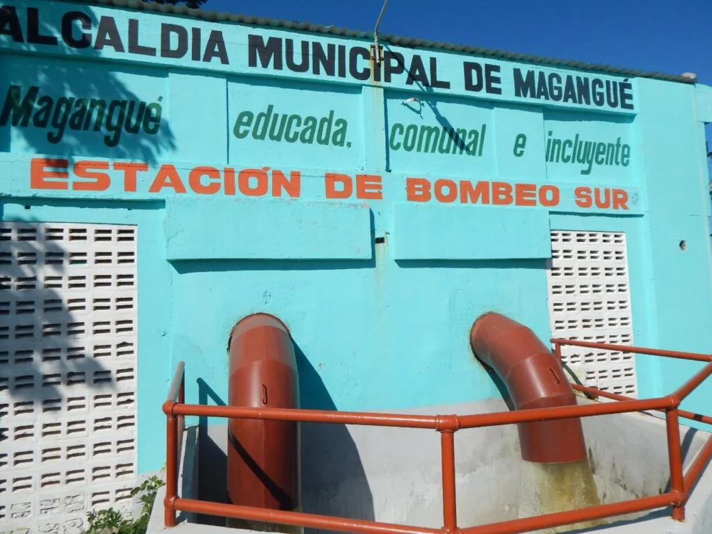
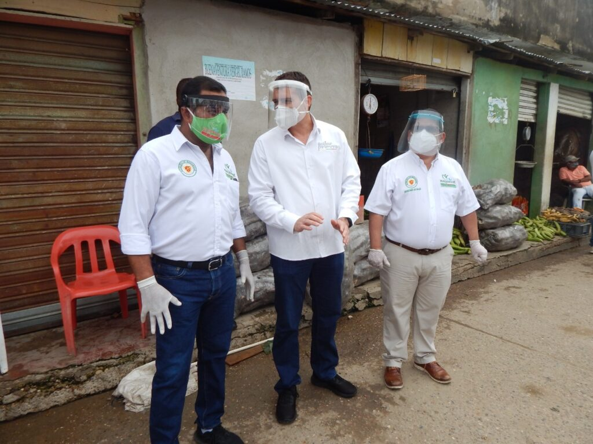
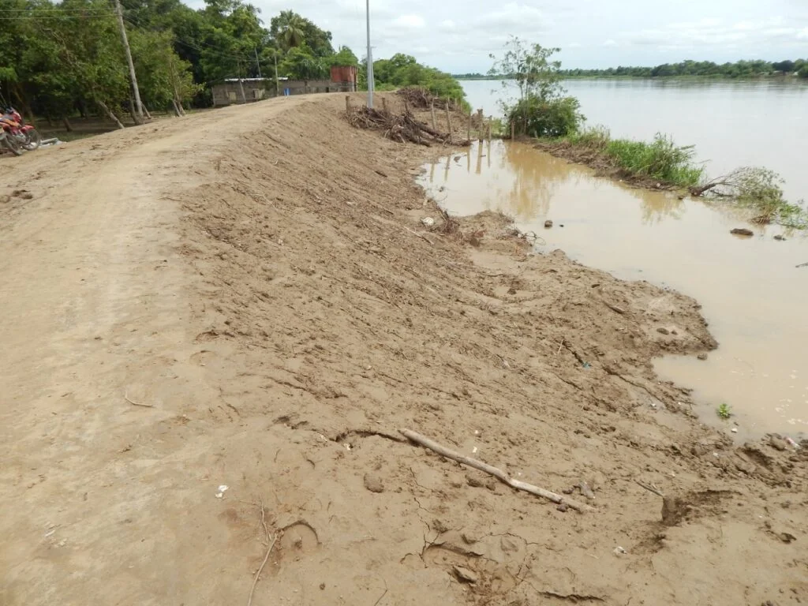

\[caption id="attachment\_12564" align="aligncenter" width="702"\] Una bomba con transformador de 400 KVA y de 25 KVA en las estaciones Sur y Norte.\[/caption\] Antes de que los holandeses trajeran una bomba inmensa a Magangué, mi tío Mingo Meza nos llevaba a pescar a la **Ciénaga Grande de Versalles**. Recuerdo que, de repente, nos hacía señal de que estuviésemos  en silencio y quietos. Luego, como si fuera un indio guerrero, con una lanza aferrada en la parte inferior del asta, la hacía volar con fuerza. Y de pronto, con alta precisión, se incrustaba en el lomo negro del bocachico que solo él veía. Al final de la pesca, la canoa de madera estaba repleta de bocachicos tan grandes como yo. Pero eso es solo recuerdo. Hoy, Magangué adolece de pobreza, desigualdad y hambre. Antes de que construyeran los jarillones, nadie se dormía sin probar un **_bocao'e comía._** En los patios de las casas las hornillas estaban activas. Siempre había pescado frito, en viuda y con yuca. Hoy, la pobreza es inmensa_._  Para mantener esa gran bomba de agua, el municipio de Magangué invierte en mantenimiento **$250 millones**. Me aclara el alcalde **Carlos Cabrales Isaac**. O sea, no es una motobomba cualquiera. Ni tampoco ese contrato sea la «garrapata en el oído».

> _«Esta inversión contempló, limpieza de maleza, fumigación interna y alrededores de la sub estación eléctrica que alimenta las estaciones de bombeo Norte y Sur. Mantenimiento correctivo y adecuación general del pórtico de entrada de la sub estación eléctrica»._

Cabrales Isaac sustenta con una revelación que me hizo recordar una historia de 47 años que viví. En aquella época, 1973, cuando instalaban la bomba, los pelaos nos montábamos en los grandes tubos para correr sobre sus lomos. Eran inmensos.

## Pobreza, hambre y destrucción ecológica

Sin embargo, esas obras de ingeniería quebraron el equilibrio ecológico de Magangué y sus ciénagas y el empobrecimiento de su población. Y eso se explica porque entre 1993 y 97 (OCC, 97 (documento no disponible)) tuvo la **mayor tasa de crecimiento poblacional con 6.14%,** la más alta de todas las áreas urbanas de más de 100 mil habitantes. Duplicó a Cartagena que tuvo un 3%. **¿Donde metieron tantas gentes en Magangué?** Le robaron tierras a la Ciénaga Grande. Construyeron los jarillones y trajeron una bomba inmensa. Pero el crecimiento poblacional estuvo aparejado con la destrucción de un ecosistema de ciénagas y humedales ricos en aves, peces, flora, y un ejército de pescadores que surtían a Magangué y ciudades como Barranquilla y Cartagena. Todo esto trajo mucha pobreza. Las Necesidades Básicas Insatisfechas (NBI), que para el mismo período alcanzó **54.8 % de los hogares de Magangué** (índice sólo superado por Quibdó, con 73%, Lorica, con 55.5%, y Turbo, con 55.1%). Según ese estudio, la miseria en ese período llegó al 31.7% de los hogares de Magangué, superado sólo por Lorica, con 32.3%2. O sea, los jarillones no solo destruyeron la ciénaga sino que profundizaron la pobreza en el puerto de Magangué.

## Los jarillones y una bomba

\[caption id="attachment\_12566" align="aligncenter" width="702"\] **Cabrales** quiere que Magangué sea educada.\[/caption\] Unas largas puñaladas directas al corazón de la Ciénaga de Versalles se han convertido los jarillones. Al final de la década de los 60 le dieron la primera puñalada mortal. En esa oportunidad construyeron el _Trinche_ que unió la Calle de Los Turcos con Versalles. Se formaron varios barrios: Rasquiñol, «Alfonso López» y el Trinche. Rasquiñol fue absorbido por «Alfonso López». **La Ciénaga del barrio Baracoa** quedó ciega. Los tubos que instalaron para que intercambiaran las aguas con la Ciénaga Grande fueron insuficientes.  Hoy ese espejo de agua es una cloaca a cielo abierto. Los jarillones —que construyeron por recomendación de la Misión Holandesa— fueron la sentencia de muerte para la Ciénaga de Versalles. Y para que las aguas del Río Grande de la Magdalena —que entraban por el _Chorro_, al sur del barrio Sur— no recuperaran sus territorios robados, instalaron **una bomba de 400 KVA y de 25 KVA**. Es una bomba alimentada por una subestación eléctrica que produce 13,200V  en las estaciones de bombeo Norte y Sur. Mensualmente la alcaldía paga a Electricaribe $60 millones, según las cuentas del secretario de Hacienda del municipio, **Gabriel Gándara**. Si eso no se hace, las aguas de la Ciénaga Grande de Magangué, alimentada por el Río Magdalena, arrasarían con una docena de barrios. Una bomba, como esa, evita que los barrios formados con la muerte de la Ciénaga de Versalles se ahoguen.

## La riqueza ambiental

\[caption id="attachment\_12572" align="aligncenter" width="600"\] Los bocachicos de la Ciénaga Grande de Magangué **eran tres veces más grande que éste**. Cortesía.\[/caption\] Si, la Ciénaga Grande de Versalles producía enormes bocachicos como los que arponeaba Mingo Meza. Eran tan grandes que Minguito (hijo de Mingo) y yo teníamos que cargar un bocachico entre los dos.  Pareciera que esta historia fuera fábula. Pero es la **_purita verdad_** vista desde los ojos de un niño de 6 años. En mis primeros años de vida vi la opulencia y la decadencia económica de Magangué. Una prosperidad que reflejaba el bullicio de las tardes febriles del puerto cienaguero de la **«Punta del Padre**» con la llegada de los pescadores de Versalles. Sus manos grandes, blancuzcas y arrugadas por el agua, clasificaban, por su tamaño, bocachicos, bagres, pacoras. Las mojarras peñitas, barbules (barbudos), blanquillo y doradas las regalaban o vendían a precios irrisorios a las mujeres que llegaban con sus inmensas poncheras que decían Imusa. En aquella época no había tilapia lora. Pero nadie se acostaba sin comer. Recuerdo que cuando mi mamá T**eresa Moreno Martínez** llegaba tarde por el trabajo, me arrimaba a la casa de **Dilia Aguilera**. Vivía diagonal. En esa casa todas las tardes armaban una fritanga de pescados. Su marido **Mingo Lengua** y sus hijos llegaban con sus atarrayas y latas llenas de peces de todas las especies. Y un pescado frito con yuca me comía. Sin embargo, después de que los holandeses construyeran los jarillones e hicieran el montaje de una bomba inmensa, llegó la pobreza a Versalles. Gran parte de la ciénaga comenzó a secarse. Las aves de paso, las migratorias, ya no llegaban. Pisingos y carraos que cazaba Tranquilino con su escopeta y se los vendía a mi madre para hacer un sabroso pebre, desaparecieron. Las  aves playeras, chorlitos, garzas y patos que cubrían los arboles como si fueran arbolillos de navidad, ya no estaban.

## La nostalgia

\[caption id="attachment\_12567" align="alignnone" width="702"\] Los jarillones son puñaladas mortales contra la Ciénaga Grande de Magangué\[/caption\] Al regresar a Versalles y ver que donde quedaba el puerto de la _**Punta del Padre**_ hoy está reducida a casas míseras. No solo siento dolor sino un sentimiento de culpabilidad de haber salido sin poder hacer lo necesario para recuperar aquella ciénaga inmensa. Pero salí (1977) amenazado de muerte después de liderar —con otros jóvenes—  luchas estudiantiles por una mejor educación. En esa ciénaga aprendí a nadar desde que empecé a caminar. También aprendí a pescar. Allí mi imaginación y creatividad se despertaron con los mitos del Mohan, el Hombre Caimán y tantos otros cuentos que nos relataba por las noches Gladys de Hernández, la mujer de Nahún. Cuando parte de la ciénaga se secaba, se convertía en un gran parque natural tapizado de verdolagas, altamisas y otras plantas que aromatizaban el ambiente. Caminábamos por caminos que hacíamos con nuestros pasos, **a pie pelao.** Vencíamos culebras y otros bichos raros que se escondían en las piedras o en las ramas de los arbustos. Eramos niños alegres, felices. Niños que no conocíamos el hambre. Niños que en la creciente nos alegrábamos porque la Calle Caldas se convertía en nuestra piscina natural. Aquí aprendí que las mujeres me atraían mucho. Jugando al _palo de coco_ con las otras niñas, los cuerpos rosaban y se erotizaban. Pienso eso hoy. Es la nostalgia.

## Una bomba social

https://youtu.be/5l62R9SHs1M   Hoy, en esos lugares, habita la miseria, la pobreza en pasta, el hambre y la promiscuidad. La inseguridad. Es el imperio de la desigualdad y de la falta de oportunidades para una juventud víctima de la adición de las drogas y de un porvenir incierto. Pero también la música, el baile y el vacile. (Antes de cuarentena, en la Calle Caldas me recibieron con el Watussi y me puse a bailar salsa). Ya no se puede ver la luna llena a bordo de una canoa amarrada en el puerto de la _**Punta del Padre**_. Tampoco las 70 canoas de **Tiburcio** quien las entrelazaba con una cadena de hierro para asegurarla. Eran las canoas que alquilaban los pescadores para sus faenas de pesca. Tampoco se escuchan las aves migratorias. Mucho menos el bullicio de los pescadores y de los compradores. La bulla de los camioneros que llegaban con su hielo picado para que sus camiones fueran llenados con bocachicos que transportaban al mercado de Cartagena o Barranquilla. El alcalde **Carlos Cabrales** me dice que quiere una **Magangué Educada**. Y yo le dije, s**olo la educación consciente nos enseña que nacimos para transformar la sociedad donde nos encontramos.** Pero hay otros que solo quieren seguir con pavimento y obras de ingeniería como los jarillones. Estos son puñaladas mortales que producen más pobreza y miseria. Y no podremos pescar los bocachicos que arponeaba Mingo Meza como si fuera un indio guerrero de la tribu Malibú.

### Te puede interesar:

## [Se fue Zalo, el príncipe de la salsa, a cantar desde el Cielo](/articulos/se-fue-zalo-el-principe-de-la-salsa-a-cantar-desde-el-cielo/)