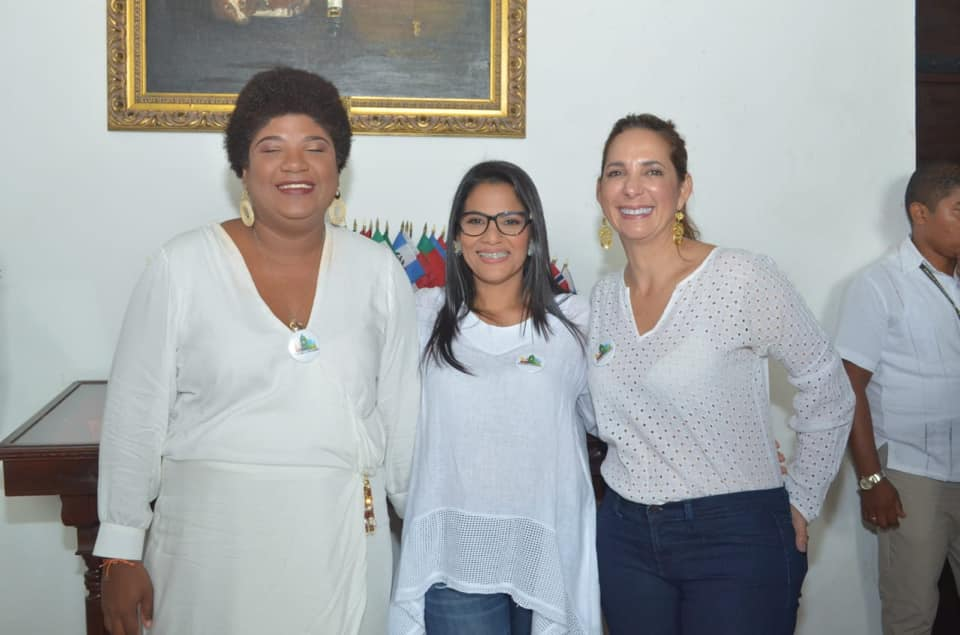

 **El «Caso Cynthia Amador»** le permita al analista descubrir **tres claves para delatar a un gobernante malandro**. ¿Cuáles son esas claves? **(I)** El arte de engañar a los más pendejos de la sociedad. **(II)** Hacer creer que gobierna, pero no gobierna. **(II)** Y robarse el dinero como si fuera un acto humanitario para con los pobres y marginados. El estudio del **«Caso Cynthia» es revelador. «El Reculador» echó para atrás el contrato. Lo liquidó.** Más allá de una noticia cualquiera, corrobora unos patrones de conducta corrupta que son usuales en el alcalde William Dau Chamat. Pero también puede ser una conducta patológica que no lo puede desinhibir de su responsabilidad fiscal, disciplinaria y penal que lo hace un verdadero malandro de 7 suelas. Es el mejor actor bufón de la lucha contra la corrupción. Sabe engañar y distraer a las masas empobrecidas o alienadas. Engaña a personas realmente indignadas por los actos corruptos de los que han gobernado a Cartagena a lo largo de estos últimos 30 años.

## **Clave No 1. Engañar**

Los políticos profesionales cuando están en campaña _prometen el oro y el moro_. Pero la promesa de políticos corruptos, con antelación, se sabe que jamás cumplirán. Es decir, que engañan con alevosía. Engañan con su hecho pensado, decía mi madre. **«El Reculador»** maneja con destreza el arte de engañar. Su conducta díscola entra dentro del patrón del _**trastorno histriónico de la personalidad (PHP)**_. Como la ciudad estaba pensando votar contra los corruptos, su discurso político tenía que centrarse en el tema como si fuera una obsesión. Dau no tenía más nada que decir. Como candidato engañó a una ciudad siendo accionista de Aguas de Cartagena. Y regresó de Nueva York como el pobre pensionado que se viene a gastar la plata de su pensión en una campaña salvadora. En su programa de gobierno compuesto de tres hojas solo habló de corrupción. Lo demás fue plagio de [Wikipedia](https://luciotorres.local/wiki/Cartagena_de_Indias#:~:text=Cartagena%20de%20Indias%2C%20oficialmente%20Distrito,Bol%C3%ADvar%2C%20al%20norte%20de%20Colombia.&text=%E2%80%8B%20Desde%201991%20Cartagena%20es,a%20orillas%20del%20mar%20Caribe.), como lo demostramos en el artículo [**«**Dau sin programa de gobierno. Es un descarado plagio a Wikipedia](/articulos/dau-sin-programa-de-gobierno-es-un-descarado-plagio-a-wikipedia/)**».** Lo que Dau dijo en el documento titulado **«[Programa de gobierno Salvemos a Cartagena](/wp-content/uploads/2020/10/PROGRAMA-DE-GOBIERNO-DE-DAU.pdf)»** está plagado de falacias o de inocentadas.

## Clave No 2. Hacerse el pendejo

Hacer creer que gobierna, pero no gobierna. Lo mismo que hace el presidente Ivan Duque. William Dau se hace el pendejo cuando queda al descubierto. Con el **«Caso Cynthia»** le atribuyó el problema a «los periodistas y veedores de estomago». Y cuando ya estaba perdido, la culpa era del contralor Distrital, **Fredys Quintero**. Dau fabricó una cortina de humo: el concurso **«Abajo los corruptos»** y se lanzó contra el contralor. Claro, hay algunos pendejos que le creen. Y eso es explicable en una sociedad de pendejos que eligen mandatarios como Iván Duque y Willíam Dau.

## La cortina de humo del pendejo

El alcalde con esta cortina de humo para esconder su extrema corrupción, está haciendo como el  «pendejo del pueblo». En un establecimiento público había un grupo de personas. Sobre la mesa ponían dos monedas. La grande era de $500 y la pequeña de $1000. La diversión de ellos era poner al pendejo a escoger una moneda. Por supuesto, el bobo escogía la de $500. Y enseguida, los que se consideraban avivatos, se morían de la risa por la estupidez del bobo. Una persona que lo observaba, le quiso advertir que estaba seleccionado mal la moneda: Ante esa advertencia, el bobo le dijo:

> \-—_Lo sé, no soy tan bobo..., vale la mitad, pero el día que escoja la otra,  el jueguito se acaba y no voy a ganar más mi moneda de $500_.

Ea es la misma respuesta de William Dau cuando tomó la decisión de liquidar el contrato de Cynthia Amador:

> _«Es importante hacer claridad que esta investigación versa es (Sic) **sobre los honorarios**, **no sobre la presunta falsedad en un certificado que aparece en la hoja de vida de Cynthia**, hechos cuya competencia es de las autoridades penales y serán ellos si se tipifica o no una conducta delictiva»._

Sabemos que Cynthia no tiene esos alcances de crear una trama para engañar al fisco distrital. Tampoco de incurrir en el delito de falsedad material para defraudar al Estado. De hecho, no maneja ninguna teoría de la contratación pública ni tiene experiencia en administración pública. Probablemente el determinador de este delito es el _«pendejo del pueblo_», que oficia de alcalde. Pero más pendejos son los funcionarios que le están siguiendo ese jueguito al _«pendejo del pueblo_». Al oído de David Múnera.

## Clave No 3. Robar como si fuera un acto humanitario

Para William Dau —quien actúa como un malandro de barrio— el problema no es robar sino que lo descubran. Cuando queda al descubierto —como en el **«Caso Cynthia»—** nos presenta el robo descarado como un acto humanitario**.** Quiere hacer creer que es un acto humanitario. Respecto al **«Caso Cynthia», en uno de sus videos grabado en Playa Azul, dijo**: _«Se la han montado a Cynthia porque es una negra, pobre y gorda que ahora es la Primera Dama y que tiene un buen ingreso. No hay nada ilegal. No le daré gusto a los que me critican»._ O sea, pobrecita Cynthia también tiene derecho a robar ¿no ves que es un acto humanitario con los pobres? Nos la presenta como el mayor trofeo para la superación de la pobreza. Pero _**«El Reculador»**_ se tragó esas palabras. Reculó. Dijo en un último video que liquidará el contrato de $7.200.000 mensuales que percibía Cynthia Amador. Él sabe que lo tienen cogido por punta y punta. No tiene salida, aunque recule.

## **«Caso Cynthia»: s**in argumentos

Carece de argumento legal en el **«Caso Cynthia»**. Actúa como actúan los malandros. Y se expresan como lo hace Álvaro Uribe para no explicar sobre su mala conducta. La mejor defensa es atacar la dignidad del contrario cuando le quitan la careta.

> _«_¿_Es razonable que la Contraloría Distrital ordene la suspensión de la secretaria general Diana Martínez con ocasión de este contrato aduciendo que ella puede obstaculizar la investigación fiscal? ¡Mamola! ¡Tú estás representando a los malandrines, los huérfanos de poder, aquellos a quienes le quitamos el oxigeno para no dejarlos robar»._

¿Qué argumentos presentó en esa declaración? ¿Malandrines contra malandros? Aquí está resumida la esencia de **William Dau Chamat, el fiasco más grande que nos hemos llevado en la alcaldía de Cartagena**. No tiene un solo acto anticorrupción. ¿El concurso? ¿El libro blanco? ¿Sus verborreas anticorrupción? **«El Turco Dau» es más peligroso que «el Turco Hilsaca»**. Con Alfonso Hilsaca —quien fue su caballito de batalla— uno sabe a que atenerse. Pero con William Dau, no. La capacidad bufonesca lo hace más peligroso porque tiene el bolígrafo para hacerle daño a miles de personas. En realidad lo que padece «El Turco Dau» es un trastorno de la personalidad histriónica (TPH). ¿Por qué? Actúa de una manera muy emocional y dramática que atrae la atención hacia él. ​ Según los expertos en psiquiatría, personas como Dau tienen una gran necesidad de atención, realizan apariciones inapropiadas y llamativas, expresan sus emociones de forma intensa o excesiva y pueden ser fácilmente influenciadas por otras personas. Esta es la personalidad de William Dau, nuestro alcalde. ¡Auxilio!

#### Te puede interesar:

## [Cynthia, «La Negrita Puloy» del alcalde racista (I)](/articulos/cynthia-la-negrita-puloy-del-alcalde-racista-i/)

## [¿Por qué se cayó Diana? la escudera del alcalde «Reculador»](/articulos/por-que-se-cayo-diana-la-escudera-del-alcalde-reculador/)