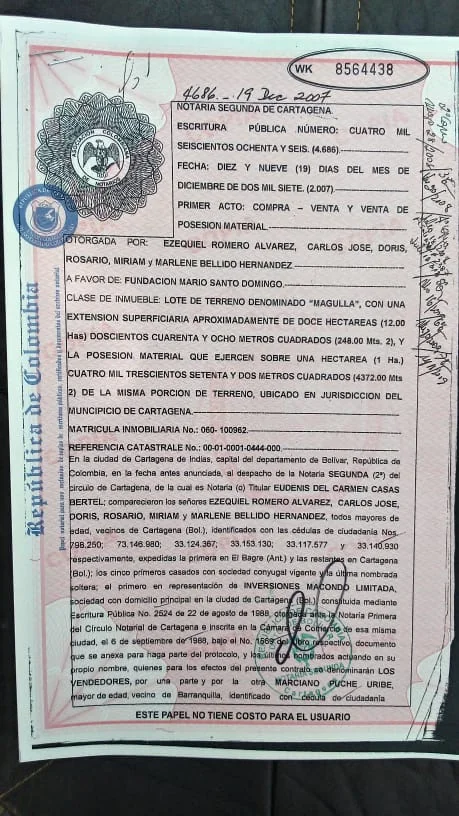
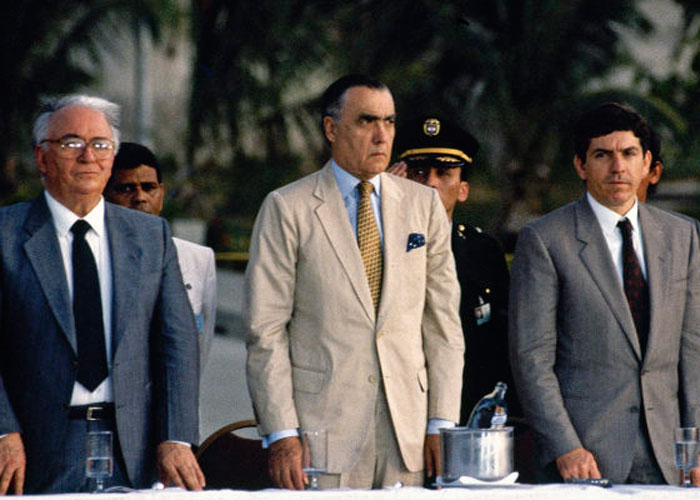

\[caption id="attachment\_13092" align="alignnone" width="539"\] El 11 de noviembre de 2010 se oficializó el despojo de los Santo Domingo. Pablo Obregón, junto al presidente Uribe y la alcaldesa Judith Pinedo lanzaron el proyecto Bicentenario construido en tierra de los Hernández.\[/caption\] Muchos ricos se hacen más ricos despojando a los más débiles. Este modelo de enriquecimiento ilícito es el _modus operandi_ del despojo de los **Santo Domingo,** por lo menos, en dos casos documentados en **www.voxpopuli.digital.** Los casos de los [**Hernández Vergara**](/articulos/historia-del-infame-despojo-de-los-santo-domingo-a-familias-afros-i/) y de los **[Meza Marimón](/articulos/2018/06/duque-la-estirpe-de-un-despojador-que-consolidara-un-pacto-criminal-i/).** (Dele clic). Las víctimas del despojo de los Santo Domingo, son —casi siempre— familias afros que luchan por demostrar que **tienen los títulos legítimos de sus tierras despojadas**. Pero ¿cómo se produjo el despojo de los Santo Domingo en el caso de la familia Hernández Vergara?

## El despojo de los Santo Domingo, cadena de delitos

Como lo dijimos en la primera entrega de esta nueva serie titulada **«Historia infame de un despojo»**, en el Caso de los Hernández hubo un entramado de delitos diversos y concurrentes. El único objetivo era quedarse con las tierras de sus víctimas. Es el mismo _modus operandi_ de 33 empresas del país que se aliaron al paramilitarismo. A diferencia del despojo de los Santo Domingo, [Grupo Argos](https://luciotorres.local/wiki/Grupo_Argos) tiene varias sentencias judiciales en su contra. ([Lea la sentencia del Tribunal de Antioquia aquí).](https://verdadabierta.com/com-docman?file=1401-sentencia-4-argos-tribunal-de-antioquia&category_slug=tierras&Itemid=267) ARGOS —como los Santo Domingo—  creó una fundación para que sus fechorías tuvieran el rostro de humanitaria. Se trata de «**Crecer en Paz»**, a la cual «donó» las tierras que «compró» (año 2010 ) a los despojadores materiales en el municipio de **Carmen de Bolívar**, para realizar **Villa Paz**. El proyecto lo calificaron como **«visionario»**. Vincularon a ese proyecto a varias agencias estatales que —más para ayudar a las víctimas— en la práctica existen para legitimar el despojo. Si el proceso que se le sigue a **Pablo Obregón Santo Domingo**, y a los funcionarios públicos (inspectores de policía del Distrito de Cartagena) sería el primer caso donde esta distinguida familia estaría comprometida por el delito de despojo y desplazamiento forzado. Existe una serie de hechos delictuosos que constituyen una conducta típica de despojo por parte de los Santo Domingo a los afros. Tal conducta indicaría que los delitos son varios. **Desplazamiento forzado.** Falsedad de documentos públicos con la complicidad de altos funcionarios del Estado. Se incluye a registradores, notarios, jueces, alcaldes e inspectores de policía. De igual manera, podrían existir delitos como prevaricato por acción u omisión, falsedad ideológica de documento privado, falsedad material de documento privado, y fraude procesal. Se entiende, entonces, que el delito de lesa humanidad, desplazamiento forzado, en este caso tiene como determinadores a los Santo Domingo.

## La tradición es de los Hernández

**El patriarca de los Hernández, Pedro Hernández Altamar**, compró (1895) por $200 la hacienda Los Arenales. Esta compra se protocolizó con la escritura **No. 382 del 11 de diciembre de 1895.** Está anexada al proceso. Hernández Altamar murió en 1939. Luego de un proceso herencial (**Sentencia de 4 abril de 1940 del Juzgado Primero Civil Del Circuito de Cartagena)**, dejó sus propiedades a sus hijos naturales. **Ana Teresa, Carlos Manuel, Pabla Bienvenida, María, Fidel, Nicasio, Marcial y José Ángel****.** **Marcial Hernández Díaz (**hijo de Pedro Hernández**)** es papá de Pedro Hernández de Horta**.**  Éste es padre de **Manuel Hernández Vergara,** la persona que reclama directamente las propiedades despojadas**.** Es decir, tiene su condición de heredero y propietario en comunidad de su finca «**Magulla, Arenales y Membrillal»**. Son tres franjas de terrenos compradas por Pedro Hernández. Una (Los Arenales) a **Ángela Ferril De Cabarcas**, mediante la **Escritura No. 382 del 11 de diciembre de 1895**, registrada en el libro del P.P, perteneciente al año de 1896 fajos 90 y bajo el número 23 de la oficina de Registro de Instrumentos públicos de Cartagena. Otro lote de terreno comprado por **Pedro Hernández** a **Rita Estrada de Herazo** en Escritura **No. 693** del 28 de diciembre de 1903. Y la tercera comprada a **María De Jesús Guifo Batista** por medio de la **Escritura No 66** del 13/02/1899 de la Notaria Primera de Cartagena.

## El origen del despojo de los Santo Domingo

\[caption id="attachment\_13085" align="aligncenter" width="459"\] Así legalizaron el despojo los Santo Domingo. La escritura **No 4686** de 2007 a favor de la **Fundación**, ¡falsa!\[/caption\] La legalización del despojo de los Santo Domingo se pudo materializar con la alteración del libro de protocolo de la Oficina de Registro**. Esta falsedad se configuró después de 1970**, año en el cual empezó el nuevo sistema escritural y de registro. La hipótesis quedó demostrada con una serie de análisis grafológicos y técnicos de expertos. Los estudios los anexaron a los expedientes probatorios de que las tierras en disputas no son de los Santo Domingo sino de los Hernández. Dentro de esa falsedad, **Alfredo del Campo de Castro**, capataz de **Pedro Hernández Altamar**, una vez murió éste (1939), manifestó que le compró (1940) el derecho herencial a **Fidel Hernández** y a otros familiares. Pero, según los peritos contratados por la parte demandante, se pudo establecer que eran escrituras y registros espurios. Es decir, falsos. **En el año de 1940,** como lo habíamos dicho, los legítimos herederos del finado **Pedro Hernández** iniciaron un proceso de división, partición y adjudicación en sucesión, ante el **Juzgado Primero Civil del Circuito de Cartagena.** Este concluyó con la escritura madre **No. 060-54391.** Y desde entonces han mantenido un dominio pacifico e ininterrumpido de su propiedad, salvo el caso que hace parte de este expediente.

## ¿Demanda de prescripción?

¿Existió alguna demanda de prescripción? Tal pregunta cabe en el supuesto caso de que algunos predios vengan siendo poseídos por personas diferentes a los herederos directos. Existe una sentencia de prescripción adquisitiva de dominio del **31 de enero de 1949** a favor de Alfredo del Campo de Castro. Asimismo, es necesario señalar que se encuentra en la Oficina de Registro de Instrumentos Públicos una supuesta sentencia. En en sus libros está el registro de la sentencia de prescripción adquisitiva de dominio del **31 de enero de 1949**. Diligencia 396 folios 217/8 del libro 1 tomo 2 de 1949, afectando ilegalmente la  tradición de los Hernández. En el libro se sostiene que mediante escritura **743 de oct 1942** de la Notaria Primera de Cartagena, Alfredo del Campo de Castro adquirió por compra a **Carmelo Saladen** 137 hectáreas y media.

## Escrituras falsas en el despojo de los Santo Domingo

\[caption id="attachment\_13084" align="aligncenter" width="700"\] Los Santo Domingo siempre han estado en el poder. Aquí con Belisario Betancur y César Gaviria. Cortesía.\[/caption\] ¡Sorpresa! Cuando se verificó dicha escritura (No 743) de octubre de 1942, se constató que  es la compra que hizo la señora **Nicolasa Paz** de un solar y una casa en el barrio **Torices** y no la compra de las 137 hectáreas pertenecientes a los Hernández. O sea, que la escritura anexada y registrada es falsa. **La misma pirueta que los Quiroz hicieron para construir sus edificios y engañar a la gente**. Sin embargo, a juzgar por el razonamiento lógico de las víctimas, en el hipotético caso que existan prescripciones de dominios sobre lotes de terrenos pertenecientes a los Hernández, estas no son oponibles. En tanto que la matricula inmobiliaria **060-54391** de su propiedad, no se registra anotación alguna de demanda de Prescripción adquisitiva de dominio. De igual manera, no existe sentencia de prescripción adquisitiva de dominio. Por tanto, el abogado Ángel Carrillo, representante de los Hernández, manifiesta que no son oponibles a su representado, **por mandato del Código Civil y de Ley 1579 de 2012 y específicamente en su artículo 56.**

## Pacifica e ininterrumpida

Por tanto, Hernández Vergara mantiene una posesión pública, pacífica e ininterrumpida. Estas tierras se encuentran situadas en el corregimiento de Bayunca de Cartagena de Indias. ¿Cómo lo comprueba? El certificado de registro de instrumentos públicos de Cartagena. La matricula inmobiliaria **No. 060-54391,** la cual anexó al proceso de la referencia**.** En la tercera entrega de esta serie sobre el despojo de los Santo Domingo a la familia Hernández Vergara, miraremos cómo alteraron el libro de protocolo. Se trataba de legitimar una falsedad comprobada por los peritos de la parte demandante.

#### Te puede interesar:

## [Historia del infame despojo de los Santo Domingo a familias afros (I)](/articulos/historia-del-infame-despojo-de-los-santo-domingo-a-familias-afros-i/)

## [Duque, el niño mimado de la mafia](/articulos/2018/05/opinion-duque-el-nino-mimado-de-la-mafia/)

## [¿Asistirá Shakira a audiencia judicial por despojo de tierras?](/articulos/asistira-shakira-a-audiencia-judicial-por-despojo-de-tierras-contra-santo-domingo/)