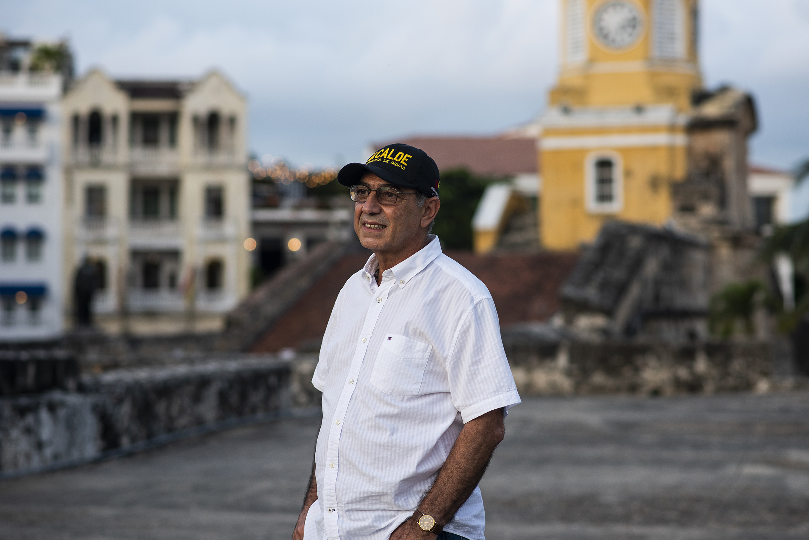

\[caption id="attachment\_13376" align="alignleft" width="2200"\](imagen no disponible) Reportaje de William Dau a Bloomberg confirmó lo que denunciamos el 16 de octubre de 2019. «El Buitre» Dau vino por Cartagena disfrazado de salvador para hacer un negocio con los fondos buitres. Cortesía. (Charlie Cordero/Bloomberg).\[/caption\]   «El Buitre» Dau descubrió sus garras con Bloomberg, la prestigiosa publicación sobre el mundo financiero. **Anunció la creación de un fondo especial con los llamados «fondos buitres» para invertir en Cartagena**. En medio de una sarta de mentiras y de anuncios, confirmó lo que desafortunadamente predijimos el 16 de octubre antes de las elecciones de 2019 cuando se lanzó a la alcaldía de Cartagena. Ahora Cartagena es un buen negocio para los piratas contemporáneos: **los «fondos buitres».** **William «El Buitre» Dau Chamat** le dijo a Bloomberg ([Business: Ex-Blackstone VP Elected Cartagena Mayor Plans $1 Billion Fund](/articulos/news/articles/2020-11-27/ex-blackstone-vp-elected-cartagena-mayor-plans-1-billion-fund)) que conformarán un **fondo de mil millones de dólares** para hacer negocios con los recursos turísticos y urbanísticos de Cartagena. ¿Será el fondo nacional para la superación de la pobreza? ¿Cómo será el negocio? ¿Nuevos corsarios que invaden a Cartagena? Con razón Dau no se ha caído con tanta mediocridad y corrupción que ha demostrado en 11 meses de gobierno. Lo **sostiene el poder financiero de Wall Street y del gobierno de Iván Duque.**

## «El Buitre» Dau se destapa

La ciudad —si no hacemos lo necesario para revertirlo— será tomada por el fondo buitre **Blacktone**, tal como lo denunciamos. Frente a estás denuncias, Dau litigó contra mí. El Tribunal Administrativo de Bolívar desestimó la demanda de tutela. **William Dau Chamat, a** través de su intimo amigo **Oswaldo Burgos Valets,** la instauró contra mí ante la juez **Esther María Meza Camera** del Juzgado Primero Administrativo del Circuito de Cartagena. Ella le tuteló el derecho al buen nombre y a la presunción de inocencia. Pero todo se le cayó. El Tribunal concluyó que la información suministrada estaba basada en hechos investigados y no en suposiciones. **Una vez publicado los artículos del Buitre (una serie de 4) recibí amenazas de muerte en varias ocasiones.** Me cerraron las redes sociales y se tomaron mi cuenta de Facebook. Sufrí ataques de las bodegas digitales pagadas con dinero, presuntamente, del fondo buitre Blacktone. Curiosamente cuando hoy sufro más los ataques de «**El Buitre» Dau, la UNP** me reduce el esquema de seguridad. Pero estos buitres del poder financiero suelen cometer crimines silenciosos como la del principal testigo del **Caso de Odebrecht, Jorge Enrique Pizano, interventor de la obra. El** Fiscal Néstor **Humberto Martínez fue incapaz de investigar el hecho.** Todo lo que dijimos en el mes de octubre fue una advertencia del gran negocio que buscaba el **«El Buitre Dau»** con la alcaldía de Cartagena. El miércoles 23 de octubre de 2019 fue (por la mañana) a Nueva York,  y regresó el mismo día (por la tarde) a Cartagena. Fuentes periodísticas allegadas a su campaña me indicaron que el **viaje tenía como objetivo buscar la tula (la bolsa de dinero) que necesitaba para voltear los resultados de las elecciones que daban como ganador a William García**. Esa misma semana **Álvaro Uribe Vélez, del Centro Democrático llegó a Cartagena**. Se reunió en el Hotel San Lázaro con los líderes de su movimiento a pesar de que su candidato **Fernando Aráujo** no había despegado en las encuestas. Se indicó que la decisión de Uribe era hacerle todas las apuestas a William Dau, incluso, con la misma Registraduría. Al final, Fernando Araújo se quedó solo.

## El reportaje de Bloomberg, una sarta de mentiras

\[caption id="attachment\_13377" align="alignnone" width="1366"\] Este reportaje parece pagado. Una mezcla de mentiras y verdades. Es prueba fehaciente de las denuncias que hicimos en 2019.\[/caption\] El reportaje de **Ezra Fieser y Andrea Jaramillo** es una sarta de mentiras. Lo que dijo el procurador Fernando Carrillo es la purita verdad: un gobierno mediocre y corrupto. Pero hay más: Dau es CEO mediocre y vicioso. La periodista que hizo el reportaje tuvo como fuente a **Ana María González,** la que define los grandes y pequeños contratos del Distrito de Cartagena. Fue la que orientó la contratación en la cuarentena del Covid. La misma del gel a $49 mil el litro. Es la que manda, entre bambalinas, en la contratación. Tácticamente se ha hecho menos visible. Es la que determina la contratación pública de la administración del Buitre Dau. Ella mantiene la conexión con el fondo buitre Blacktone y las otras agencias internacionales. **Ana María González**, le dijo a Bloomberg:

> «Él (Dau) ve su estilo de gestión como el de un CEO que delega tareas a sus vicepresidentes y les da seguimiento a sus resultados”, dijo Ana María González, consultora del alcalde sobre cooperación internacional y ex becaria de la Fundación Obama».

CEO (¡jajajaja!) que delega tarea a sus vicepresidentes. ¿De qué administración está hablando Ana María González? Si lo de Dau es un CEO, lo de Manolo Duque ¿qué fue? William Dau es un gobernante con resultados mediocres: gestión presupuestal para inversión social del 35%. En una ciudad llena de pobreza y desigualdad social y económica es un crimen de lesa humanidad. ¿Por qué? **En la pandemia murieron por inanición muchos niños de barrios pobres. Murieron por hambre y no por Covid**. Si se comprueba que por negligencia murieron decenas de personas (falla en el servicio) **¿debe ser procesado William Dau por criminal y corrupto?** **Despilfarraron el dinero del Covid**. No invirtieron un solo peso para la expansión de la red hospitalaria. El Hospital Universitario del Caribe (HUC) se quedó esperando. Se rifaron el dinero de la salud. No le pagaron la deuda a hospitales como la Clínica Maternidad. Pero sí lo hicieron con Ips de garaje. Frente esa baja gestión presupuestal, el procurador Fernando Carillo Flórez dijo:

> _«Estamos muy preocupados por la ejecución presupuestal de la ciudad. Ejecutar los presupuestos es gobernar. Los recursos públicos son para gastarlos en beneficio de la sociedad y **frente a una inacción pues hay que prender las alertas. Por omisión y negligencia también se incurre en corrupción**, porque se dejan de hacer las cosas»._

El CEO es el máximo ejecutivo de la empresa y sobre él recaen grandes responsabilidades, como tomar las decisiones más importantes y dirigir las estrategias que llevarán a la empresa a conseguir sus objetivos. Dau está muy lejos de ser eso. ¿Por qué las periodistas de Blomberg no dijeron eso?

## ¿Qué dijimos de «El Buitre» Dau?

> _En realidad **la expedición salvadora del «Turco» Dau no es filantrópica**. No tiene ninguna diferencia con la motivación que mueve al **«Turco» Hilsaca,** objeto de sus dardos: el dinero. No es por amor a Cartagena. Es por amor al dinero, madre de toda corrupción. El ropaje del **«Turco» Dau** es impecable. Un discurso anticorrupción. Una campaña autofinanciada con dineros supuestamente de su pensión. Y un aire de mesías, de salvador. ¡Perfecto! Sin duda, toda una empresa bien concebida basada en su experiencia como subalterno de los **buitres**._

Y agregamos:

> _Al «Turco» Dau no le interesa plan de desarrollo, plan de ordenamiento territorial, desarrollo humano y ambiental, pobreza extrema, participación ciudadana, paseo de la muerte, debacle del sector salud. No. **Lo que le importa es combatir la corrupción con los fondos buitres**. Este es su verdadero negocio. ¿Es eso lo que buscamos de un alcalde? Perseguir a los corruptos es un buen discurso. Pero no es la función de un alcalde. La corrupción es una consecuencia. Debe garantizar que sus acciones sean transparentes. ¿Un mago del engaño, del oportunismo, puede ser un alcalde anticorrupción?_

## Comida para los buitres

También advertimos:

> «_Como abogado de contrato que fuera de una oficina jurídica, adscrita a un **fondo buitre**, y como buen sirio-libanés, el «Turco» conoce la intríngulis del negocio financiero que se mueve **detrás de nobles misiones de salvamento procedente de Nueva York**. Este fue el caso de los bonos oficiales argentinos. Los poseedores de estos bonos (acreedores) tenían prácticamente perdido su dinero»._

Y agregué:

> _Los buitres_ llegaron en plan de salvamento (¿te recuerda algo **_Let´s Save Cartagena?_**) y compraron los bonos a los acreedores argentinos con un descuento del 80%. Cuando el juez neoyorkino, **Thomas Griesa, falló contra Argentina**, _los buitres_ se llevaron de _ganancia más de «$1 mil millones de dólares»_. La asociación de acreedores de Argentina, que les llevó el negocio, recibió de _los buitres_ la maravillosa comisión de 30 millones de dólares.

## La comisión de El «Buitre» Dau

El 16 de octubre publiqué el segundo artículo dónde hicimos la denuncia. Dau, con su fondo buitre, viene por el dinero de los cartageneros.

> **«La cifra de la corrupción, que William Dau Chamat maneja, es de $5 billones.** Si es elegido como alcalde, suscribiría el contrato con los buitres para que rescaten ese dinero. Solo por eso recibiría la mitad de la comisión que es del 1.5%. El otro 1.5% lo recibiría una vez dé resultado el litigio de la deuda de la corrupción».

Por este negocio, si se consolida, le dejaría a Dau cerca del 3% del fondo. Así lo señalamos.

> **Los buitres suelen** entregar una comisión que va del 2 a 3%. Todo depende del grado de seguridad que un contrato le puede brindar. Si es el alcalde quien se lo entrega, ¿será seguro? De hecho, lo sería. P**or esta razón su comisión sería la máxima.**

Por atreverme a denunciar al «Buitre» Dau, sufrí un ataque masivo. Calumnias, injurias, agresiones. Pero nos mantuvimos firmes a pesar de que conocidos y supuestos amigos nuestros  nos quisieron vapulear. Ojalá nos hubiéramos equivocado con la predicción sobre Dau. Pero, en lo personal, no escribo para satisfacer mi ego. Ni el ego de mis lectores. Nuestro periodismo es de investigación y hacemos nuestra propia interpretación con el nivel de conciencia que tenemos. Ojalá nos hubiésemos equivocado. Cartagena **no estaría** _ad portas_ **de ser tomada por las garras de un fondo buitre radicado en Nueva York.** Con esto, «El Buitre» Dau demostró que, además de vicioso y mitómano, es un traidor que pretende vender nuestra ciudad a los corsarios, probablemente a Blacktone.

#### Estos artículos fueron publicados en octubre de 2019.

## [El «Turco» Dau y Let´s Save Cartagena, instrumentos de los «Buitres» (III)](./)

## [«Turco» Dau, un buitre ronda a Cartagena (IV)](./)

## _([¿Por quién votar? Dau, el pequeño malandrín de Maquiavelo](./),_