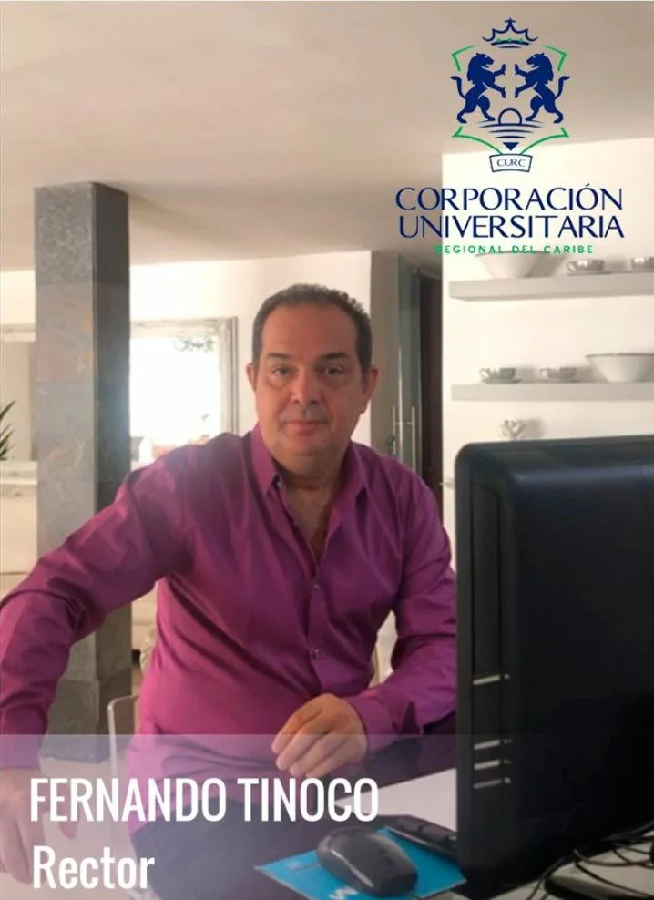
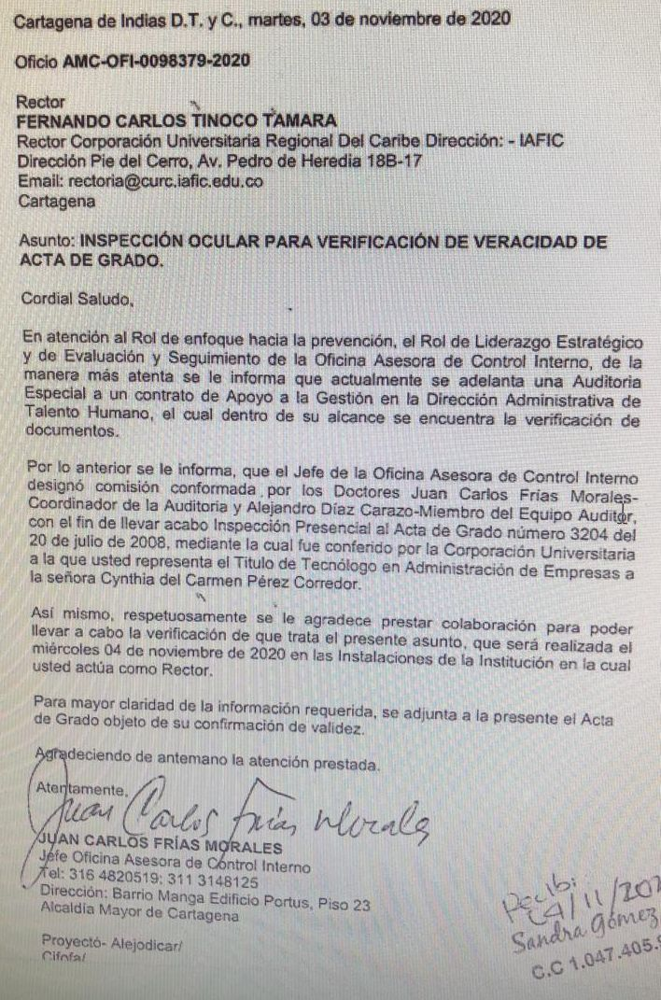

\[caption id="attachment\_13291" align="alignnone" width="718"\] **Fernando Tinoco**, Rector de IAFIC presentará denuncia penal.\[/caption\] La Corporación Universitaria IAFIC denunciará por falsedad de acta de grado a Cynthia. **Una bola de estiércol amenaza derrumbar el vuelo putrefacto del alcalde «buitre» que se posó en Cartagena como un incorruptible salvador.** Pero cada vez que se escudriña su administración, se descubre una nueva malandrinada. La hoja de vida de Cynthia Pérez Amador está plagada de falsedad. **Tanto como la misma elección de William Dau fue un fraude y un engaño colectivo**. A Cynthia parecería que la hubiesen graduado en el **Parque de Las Flórez de Cartagena**. Sitio emblemático para crear certificados chimbos de toda clase. Pero todo hace indicar que el determinador de este delito de defraudar las arcas del Distrito de Cartagena es el propio alcalde William Dau. Cuando fue candidato ocultó que era accionista de Aguas de Cartagena. Siendo alcalde promovió la candidatura del contralor electo Héctor Consuegra, quien estaba inhabilitado. Ocultó que era el auditor de Edurbe. Engañó a sus concejales aliados que votaron por su candidato.

## Dau es el capo

Todas las evidencias que se viene destapando en el Caso de Cynthia indican que el capo de este engaño es el propio alcalde. Este tema se abordará en la próxima entrega. Como lo dijimos en el artículo  titulado [«**Caso Cynthia»: Las claves para descubrir a un gobernante malandro,**](/articulos/caso-cynthia-las-claves-para-descubrir-a-un-gobernante-malandro/ "«Caso Cynthia»: Las claves para descubrir a un gobernante malandro") la Cruz de Cynthia sirvió para construir el patrón del gobernante corrupto. **(I)** El arte de engañar a los más pendejos de la sociedad. **(II)** Hacer creer que gobierna, pero no gobierna. **(III)** Y robarse el dinero como si fuera un acto humanitario para con los pobres y marginados. Sin duda, el Caso Cynthia es una bola de estiércol que viene cuesta abajo. En la medida que baja, la bola se hace más grande. Sin duda, cuando termine de bajar, toda la administración distrital y sus aliados quedarán empapados de olores nauseabundos. ¿Pero es Cynthia el cordero para expiar los pecados de su jefe que la exhibe como la Negrita Puloy de su administracion? El capo de esta defraudación aparece como un alcalde incorruptible. Pero sus acciones y sus engaños demuestran que el jefe de los ladrones está en la cabeza de la administración pública. ¿Quieren ejemplos? Fue empleado del Fondo Buitre BlackTon. **Engañó a los cartageneros con el caso de Aguas de Cartagena.** Está en duda de que haya donado sus acciones a una fundación de caridad. Dijo que no iba a asumir la presidencia de esa empresa, y después lo vimos sentado en una de sus juntas tomando decisiones decisivas. Engañó  a la ciudad con el contralor ilegal, **Héctor Consuegra.** Dilapidó los recursos del Covid 19 durante la cuarentena. Le robó a los pobres para dárselo a los ricos contratistas con caros mercados. Gel litro a $49 mil mientras la gobernación lo compró a $28 mil. **Huevos a $ 2.500** del PAE cuando en la tienda de la esquina lo venden a $350. Igualmente, Alibadau, como ahora le dicen, dijo que iba a devolver los $36 millones que Cynthia cobró fraudulentamente, pero todavía no lo ha reportado a la Contraloría que efectivamente lo ha hecho. También dijo que iba a liquidar esa OPS pero tampoco lo ha hecho. ¡Es embustero! Peor, mitómano. Miente compulsivamente. Es un adicto... a la mentira.

## ¿Dónde está el ladrón?

La pregunta del millón**. ¿Dónde está el ladrón?** ¿Dónde está el cerebro de este engaño? No es creíble que Cynthia haya diseñado este plan de concierto para defraudar al Distrito. **A ella le dijeron que se buscara certificaciones para justificar una OPS de $7.200.000**. La misma cantidad que recibe una élite de amigotes del alcalde que se chupan la mayor parte del porcentaje de las OPS del Distrito. Si los **malandrines** despedazaban el presupuesto con Ops de $2 millones, **los malandros de Alibadau** no se bajan de $5 millones. No obstante, la cadena se rompe por el eslabón más débil. Demostramos que el marido de la **Procuradora Agraria y Ambiental Mayelis Chamorro**, fácticamente no justificó en los estudios previos una OPS de $7.2 millones (lo mismo que Cynthia). **Orlando Ortiz Llanos,** el marido, declinó el contrato y el **director del EPA Javier Mouthón** lo liquidó. Pero el **magistrado Moisés Rodríguez Pérez , del Tribunal Administrativo de Bolívar,** no vio está flagrante irregularidad de un conflicto de intereses y de un posible detrimento patrimonial de $15 millones que cobró demás. El magistrado, con una tesis peregrina y prevaricadora, censuró al periodista como si le hiciese un favor al marido de la Procuradora. ¿Por qué no han sacrificado al marido de la Procuradora? Él también recibió $7.2 mensuales sin justificación alguna? En el anterior gobierno le pagaban $4.2 millones. Pero con el malandro de William Dau dió el salto del canguro. Señor Magistrado **Moisés Rodríguez Pérez**, todo indica que usted no leyó la tercera entrega de la serie _**«Patente de Corso».**_ Léala: [EPA liquida contrato del marido de la Procuradora (III) - voxpopuli.digital.](/articulos/epa-liquida-contrato-del-marido-de-la-procuradora-iii/) Dau es el capo. No lo dude. Debe estar en la cárcel. Es experto en el engaño. No tiene límites morales ni éticos. Carece de sindéresis. Creó un patrón de corrupción con las OPS para enriquecer a sus amigos y cómplices mientras decía que le estaba qjuitando las OPS a los malandrines. **Si, definitivamente, Dau es el capo.**

## IAFIC presentará denuncia penal

**Fernando Tinoco**, rector de la Corporación Universitaria Regional —AFIC— consultado por VoxPopuli Digital, dijo que un equipo jurídico estudió esta situación y tomó la decisión de presentar la denuncia penal este 22 de noviembre. Consideró que —ante todo— tiene un compromiso con la verdad y la ética y por eso se ve obligado a presentar la denuncia ante la Fiscalía.

> «Para nuestra comunidad universitaria es doloroso lo que está sucediendo con el caso de **Cynthia Pérez Amador**. Sobre todo, porque ella cursó los 6 semestres y se graduó como **Técnico Profesional y no como tecnóloga** en nuestra universidad. No vi la necesidad de que alteraran y falsificaran la certificación que legalmente expidió IAFIC. **Ella salió como técnica y no como tecnóloga».**

Aparte de ser un problema ético y moral, asistimos a un problema penal por la comisión del delito de falsedad en documento privado para defraudar al Distrito de Cartagena. En efecto, la defraudación se tasó en $36 millones como lo comprobó la Contraloría Distrital en el proceso de control fiscal. Este proceso permitió la suspensión provisional de la Secretaria General, **Diana Martínez Berrocal**. En tanto la Procuraduría Provincial citó a la ex jefe de Talento Humano del Distrito de Cartagena, **Martha Carvajal** para que explique las circunstancias, tiempo y condiciones en que se produjo la contratación de Cynthia Pérez Amador. Por su parte, la Fiscalía inició la respectiva investigación. Esta entidad pidió a la Contraloría copia del expediente. Se espera que en los próximos días haya un pronunciamiento de la Fiscalía sobre el sonado Caso de Cynthia Pérez Amador.

## Inspección ocular

\[caption id="attachment\_13296" align="aligncenter" width="708"\] Esta es la solicitud de inspección ocular.\[/caption\] LaAuditoría Distrital el pasado 4 de noviembre conformó una comisión  conformada por el jefe de la oficina Juan **Carlos Frías Morales** y del auditor **Alejandro Diaz** para  realizar una inspección ocular en los archivos de Iafic. Esta acción administrativa tenía como fin verificar si el acta de grado anexado por la Primera Dama en su hoja de vida que presentó en Talento Humano era real. Sin embargo, el rector de la institución se opuso a la inspección por razones de proteger los derechos fundamentales de su egresada. Lo hizo por razones legales, puesto que el derecho al **Habeas Data solo puede disponerlo un juez**. Sin embargo, por petición de la misma oficina de auditoría, debió certificar si era cierto que copia del Acta de Grado que Cynthia presentó en su hoja de vida, fue expedido por esa institución universitaria.

## Acta de Grado falsa

Ante esa petición, **Fernando Tinoco** y su equipo examinaron el documento. Y a _prima facia_ concluyeron que nunca habían expedido ese certificado. Se pudo verificar cuatro cosas. **La primera.** Para esa época (2008) de expedición de la mentada acta de grado, solo se ofrecía el programa **Técnico Profesional en Administración de Empresa**. **Segundo.** La firma de la Secretaria General que aparece en el Acta de Grado **no corresponde a la de** **Nayzlam Tinoco**, la titular. Ni ninguna de las firmas, que se encuentran estampadas en ese documento, corresponden a funcionarios de IAFIC. **Tercer hallazgo.** El Acta de **Grado No 3204** corresponde al título de **Técnico Profesional en Administración de Empresa** obtenido por Cynthia del Carmen Pérez Amador en julio de 2008. La Primera Dama del Distrito de Cartagena si bien es cierto que terminó y se graduó en IAFIC lo hizo como técnica y no como tecnóloga. **Cuarto.** Lo que se ve, a simple vista, es que falsificaron el **Acta de** **Grado No 3204** que corresponde al diploma **No 2165** otorgado a Cynthia del Carmen Pérez Amador como Técnico Profesional en Administración de Empresas. Por otra parte, se pudo establecer en el proceso que también aparece el diploma como Tecnóloga en Administración Pública. Desde luego esto es coherente con las declaraciones a diferentes medios sobre su hoja de vida. En un reportaje con El Universal dijo que «había estudiado Administración en Iafic». (Vea [La historia de lucha de Cynthia Pérez, la ‘Primera Dama’ de Cartagena](/articulos/suplementos/facetas/la-historia-de-lucha-de-cynthia-perez-la-primera-dama-de-cartagena-DA2013423)). Pobre Cynthia. Su sueño de tener una mansión tan grande como la de un reguetonero exitoso se quedará en eso, sueños. Cuando despierte habrá pasado una de las peores pesadillas de su vida. Su quimera dejará una impronta para la historia. Pues su bola de estiércol arrastrará a toda una administración dirigida por un individuo que supo engañar a una ciudad que esperaba a un salvador. Pero se encontró con un buitre hambriento y rapaz. Dau nos hace recordar a aquel pastor que solo le interesa las lucas de sus fieles seguidores.

#### Te puede interesar:

## [«La Cruz de Cynthia» hizo llorar al arzobispo de Cartagena](/articulos/la-cruz-de-cynthia-hizo-llorar-al-arzobispo-de-cartagena/)

## [La cruz de Cynthia la carga el padre Cristian y su iglesia (I)](/articulos/la-cruz-de-cynthia-la-carga-el-padre-cristian-y-su-iglesia/)

## [«La Cruz de Cynthia y del alcalde malandro» (II)](/articulos/la-cruz-de-cynthia-y-del-alcalde-malandro-ii/)

## [Cynthia, «La Negrita Puloy» del alcalde racista (I)](/articulos/cynthia-la-negrita-puloy-del-alcalde-racista-i/)