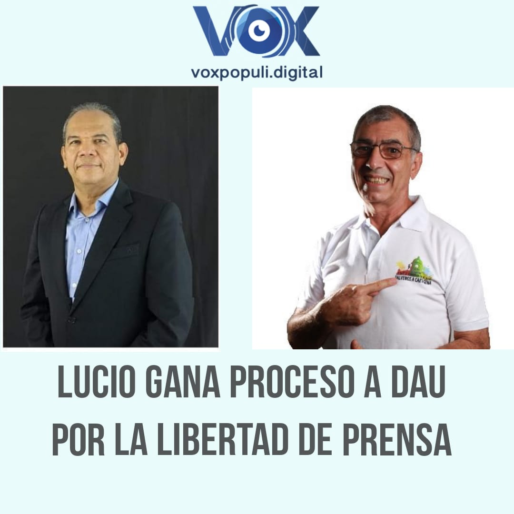

\[caption id="attachment\_13250" align="aligncenter" width="1080"\] **El Tribunal Administrativo de Bolívar** revocó decisión de la **Jueza María Esther Meza Camara,** Primero Administrativo de Cartagena. Ella había censurado la información publicada sobre William Dau.\[/caption\] **El Tribunal Administrativo de Bolívar** —con ponencia de **José Rafael Guerrero Leal**— llegó a una tesis certera que **favorece la libertad de prensa**. Declaró que no hay pruebas para censurar  las publicaciones de **VoxPopuli.Digital** sobre las actuación del alcalde de Cartagena **William Dau Chamat**. Revocó, por tanto, la decisión de primera instancia de la juez 1° Administrativo del Circuito  Cartagena, **Esther María Meza Camera**, quien tuteló los derechos al buen nombre del burgomaestre. **Edison Lucio Torres Moreno** no le violó el derecho al buen nombre del alcalde **William Dau.** Por ejemplo, cuando le hizo la siguiente pregunta. **«Alcalde Dau, ¿usted es adicto al bazuco?»** Esta crónica se basa en hechos ponderados, analizados por el periodista. El fallo fue proferido por la Sala Primera del Tribunal Administrativo compuesta, además  del ponente, **Luis Miguel Villalobo Álvarez y Roberto Mario Chavarro Colpas**. (Lea la sentencia: WILLIAM DAU VS LUCIO TORRES -VOXPOPULI (Revoca - improcedente) (documento no disponible).

## Análisis Vs. opinión

En materia de periodismo es clave estudiar tres conceptos. **La información, el análisis y la opinión.** El periodismo de VoxPopuli.Digital navega entre la información y el análisis. La opinión es netamente subjetiva. En **tanto el análisis, si bien es cierto que es un proceso subjetivo, se basa en hechos concretos ponderados por el analista.** Pero el Tribunal analizó que no está clara la frontera entre información (hechos) y opinión de las publicaciones, observa que el accionante (Dau) no demostró que el periodista le violó sus derechos al buen nombre y a la presunción de inocencia.

> _«Esta Colegiatura observa, que en el libelo el accionante bajo gravedad de juramento **afirma que las publicaciones son falsas**, anexa pruebas documentales de las publicaciones, no obstante, **dichas pruebas resultan insuficientes para asumir como probado los requerimientos constitucionales para restringir las expresiones en virtud del derecho de la libertad de expresión**»_.

Por esa razón, el Tribunal se vio en la necesidad de revocar la decisión de primera instancia de la Jueza Primero Administrativo del Circuito de Cartagena, **Esther María Meza Camera**, quien le tuteló los derechos fundamentales al buen nombre del alcalde **William Dau Chamat**. El alcalde actuó mediante el apoderado **Oswaldo Burgos Valet**.

> _«Dado las anotaciones anteriores, no se hace necesario llevar este análisis más allá de lo expuesto, pues **no reposa en el acervo probatorio,** material suficiente para determinar en concordancia con la jurisprudencia constitucional, una limitación o restricción al ejercicio de la libertad de expresión. Y en ese **s**entido, **se impone revocar el fallo impugnado**, lo cual se dejará anotado en la parte resolutiva de este proveído»._

De tal suerte, que las aseveraciones de Dau sobre la violación de sus derechos fueron subjetivas. No presentó pruebas que le permitiera al juez censurar las publicaciones por violentar derechos fundamentales del alcalde.

## El fallo del Tribunal Administrativo

La sentencia del Tribunal Administrativo de Bolívar **No 232/2020** es clara. Se basa en consideraciones jurisprudenciales tomando en cuenta que el periodismo es reflejo de una sociedad democrática. En tanto la libertad de expresión es la base de la democracia. Destaca el Tribunal que el periodista ejerce un control social de la actuación administrativa del mandatario y que se basa en hechos e informaciones interpretadas. Por esa razón para que un juez censure a un periodista se debe sustentar con pruebas que demuestre la validez constitucional de las limitaciones a imponer. En este sentido se deben tener cuatro elementos. El Tribunal Administrativo de Bolívar, lo señaló. Veamos esos cuatro elementos que un juez debe analizar para saber si hay una transgresión al derecho a la libertad de prensa y los límites permisibles constitucionalmente.

## Quién Comunica

Aquí se define el sujeto comunicador, esto es, el periodista.

> **Edison Lucio Torres Moren**o es un particular, director de medio digital de comunicación **Vox Populi Digital.** Es comunicador social, periodista en temas de corrupción y relevancia pública. El accionado publicó a nombre propio, sin indicios de anonimato. Con esto, esta Colegiatura debe precisar que **el accionado cumple, habitualmente, el rol de informar a su comunidad.**

## De qué o de quién se comunica:

> «Los reportajes publicados contienen expresiones sobre la campaña política y elección del alcalde William Jorge Dau Chamatt, así como lo atinente a su gestión administrativa, cuyo contenido es detallado. En el sentido de que es posible evidenciar fechas, información y actuaciones. Sin embargo, **aunque estos tienen expresiones como “ladrón”, “malandrín” y “peligro ambulante**”, **éstas corresponden a afirmaciones apreciativas que parten de la información verificable**. En otras palabras, son la interpretación subjetiva que hace el **accionado del actuar público y de la gestión administrativa del alcalde William Dau.** Individualizado así, el sujeto sobre el que se comunica, la Sala debe precisar que las publicaciones son un vehículo para difundir el descontento del accionado frente a la gestiónpública del tutelante, en contraste del control social que desempeña el accionado».

Y precisa el Tribunal sobre este punto del objeto de la comunicación:

> «Por esa razón, son un vehículo para reprochar, debatir y criticar su gestión pública. En consecuencia, están cobijados por los discursos protegidos, ya que las publicaciones versan sobre asuntos políticos, de elección popular y de interés público, como también de un funcionario público en ejercicio de sus funciones.De acuerdo a lo anterior, **observa la Sala que, no se evidencia que las publicaciones hagan parte de los discursos prohibidos a los que se hizo mención en el marco normativo**».

Además, el Tribunal hace una precisión muy importante sobre la condición de **autoridad pública de William Dau** que debe soportar el control social que el periodismo le ejerce.

> _«Por otro lado, el tutelante ostenta un cargo público de elección popular, y alega el agravio en sus derechos fundamentales, que en su caso gozan de menores garantías que en el caso de un particular que no ostenta la condición de figura pública, ya que como primera autoridad administrativa le **asiste el deber de soportar las críticas y el rechazo,** así como afrontar y debatir las acciones tendientes a materializar el control democrático, político y social de los administrados_».

## A quién se comunica

El tercer elemento que el juez de tutela debe tomar en cuenta para imponer limitaciones al periodista es a quién se comunica.

> _«_Los reportajes se publicaron en el sitio web de noticias y opinión **Vox Populi Digital**, el blog **“la palabra hecha verdad**”, y la plataforma de videos YouTube, mismas que tuvieron despliegue en las redes sociales Facebook y Twitter. En esa medida, **se trata de una audiencia indeterminada**, con cobertura a todo tipo de público, c**on un amplio margen de difusión de la información»**.

## Cuál es el canal o medio por el que se comunica

Aquí el Tribunal reconoce que **VoxPopuli.Digita**l es un medio digital idóneo y de fácil acceso.

> _«Los medios empleados son de uso exclusivo de internet, el portal web www.voxpopuli.digital, el blog “la palabra hecha verdad”, la plataforma de videos YouTube, Facebook y Twitter.Estas plataformas, en su estructuración, **proveen un espacio idóneo, de fácil acceso, y público, para el alto y libre flujo de la expresión**. Las facultades de compartir, comentar, reaccionar, retwittear y la permanencia_».

## La conclusión

Dado a los anteriores criterios ponderados por el Tribunal Administrativo de Bolívar, a **William Dau no se le violó el derecho al buen nombre.**

> «Según lo expuesto en el marco normativo y jurisprudencial, en contraste con los hechos probados, **esta Corporación estima que no se configura una afectación en los derechos fundamentales de William Jorge Dau Chamatt en su calidad de alcalde de Cartagena de Indias** por las publicaciones acusadas realizadas por Edison Lucio Torres Moreno, periodista de la ciudad de Cartagena, contrario a lo esgrimido por el A-quo...» (de la jueza Primero Administrativo del Circuito de Cartagena, **Esther María Meza Camara**).

Por otra parte, la censura que le impuso al periodista, por ejemplo, en el caso del pastor Miguel Arrázola, viola la constitución y la línea jurisprudencial. De hecho, la Corte Constitucional deberá revocar el fallo del **Juzgado Octavo Penal Municipal de Cartagena. Este juez decidió eliminar el contenido publicado por el periodista Lucio Torres. La Fundación para la Libertad de Prensa consideró las medidas del juez como innecesarias, desproporcionadas y atentan seriamente contra la libertad de expresión y de prensa.** Por el contrario, la decisión del Tribunal reivindica uno de los valores más preciados de una democracia, la libertad de prensa. Que no es la libertad de insultar y denigrar de las personas, como se podría creer. Lucio Torres nunca ha insultado u ofendido a Dau, aunque use expresiones semióticas duras. Lo que se ejerce es la libertad de ejercer control social sobre la autoridad pública. Pero más cuando un mandatario como William Dau, cuya conducta es inapropiada. ------------

#### Te puede interesar algunos artículos que la juez María Esther Meza quiso censurar a favor de Dau:

## [Señor alcalde ¿es usted adicto?](/articulos/senor-alcalde-es-usted-adicto/)

## [¿Un alcalde adicto, bufón o psiquiátrico? El top secret de la victoria de Dau (II)](/articulos/un-alcalde-adicto-bufon-o-psiquiatrico/)

## [Historia de un alcalde fumador de bazuco](/articulos/historia-de-un-alcalde-fumador-de-bazuco/)

## [Las 4 causas que provocarían la caída del alcalde Dau (II)](/articulos/las-4-causas-que-provocarian-la-caida-del-alcalde-dau-ii/)

## [Dau peligro ambulante: Lanza cortina de humo para esconder su corrupción](/articulos/dau-peligro-ambulante-lanza-cortina-de-humo-para-esconder-su-corrupcion/)

## [Lluvia de tarjetones sin doblar: el megafraude electoral se habría consolidado después de los escrutinios (II)](/articulos/lluvia-de-tarjetones-sin-doblar-el-megafraude-electoral-se-habria-consolidado-despues-de-los-escrutiniosii/)