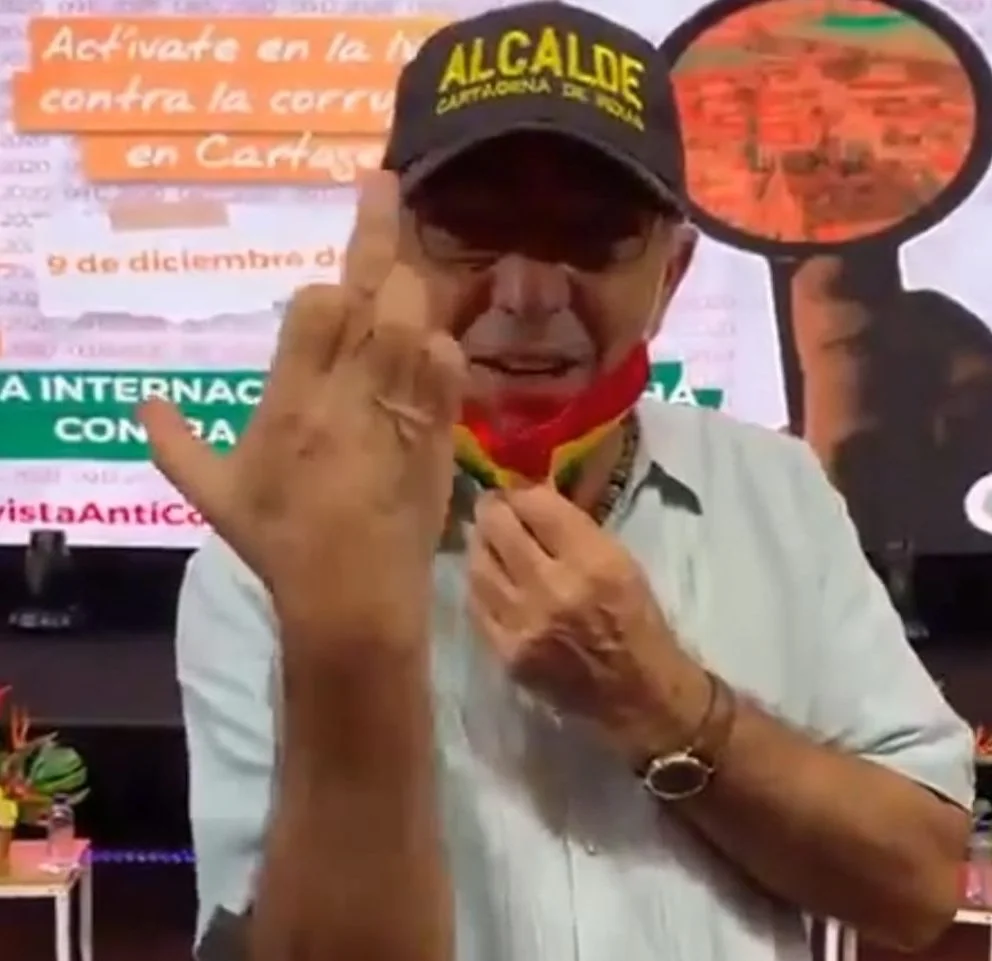

\[caption id="attachment\_13572" align="aligncenter" width="992"\] El alcalde le hizo pistola a Cartagena. Una conducta lumpesca atraída por el falo.\[/caption\] En un año de gestión, **el alcalde le hizo pistola a Cartagena.** Nos engañó con su discurso anticorrupción. La conducta corrupta de William Dau es macondiana. La contratación del Covid, la Ops de Cynthia Pérez Amador, su negligencia administrativa, las multimillonarias conciliaciones, el pago a clínicas de garajes y el costosísimo Libro Blanco, son botones de muestra de este mediocre año de gestión administrativa del incorruptible Buitre venido de Nueva York. El retroceso de Cartagena en este año 2020 es tan evidente que se refleja en los **altos niveles de inseguridad ciudadana y alimentaria.** La política de salvamento implementada por el alcalde William Dau no dio resultado. Su administración fue negligente y caótica en estos primeros meses. No aprovechó las herramientas que el concejo Distrital le suministró ni el respaldo de los gremios económicos. **Tres fantasmas acechan al alcalde William Dau para el próximo año**. Muy temprano, una inminente suspensión por parte de la Procuraduría debido a su conducta irrespetuosa que viola el Código Disciplinario Único. El fallo se conocerá el 28 de enero de 2021. Pero tiene varios procesos que podrán explotar en el primer trimestre del próximo año. **El segundo fantasma es el proceso de revocatoria.** Si se incrementa el inconformismo y si los diferentes sectores de la ciudadanía se organizan, el alcalde tendrá que enfrentar un proceso de revocatoria ciudadana. William Dau quiso disuadir a los dirigentes comunales repartiéndoles cheques de $5 millones a 35 Juntas de Acción Comunal de la Ciudad. Como la teoría del alcalde Dau es que los dirigentes comunales son comprables, la medida de repartir esos cheques —so pretexto de hacer cultura ciudadana— es asimilable a una vulgar compra de la voluntad ciudadana. ¿Cómo se llama eso? Corrupción. El tercer fantasma que debe afrontar, **es su propia negligencia.** Es un aprendiz que no aprende con los errores. Es Errático. Caótico. Vicioso: le gusta mentir y engañar. De hecho, sus mentiras son patológicas. ¿Por qué lo soportamos?

## ¿El concejo le concedió las herramientas al alcalde Dau?

\[caption id="attachment\_13566" align="aligncenter" width="1024"\] La directiva del concejo de Cartagena:, **David Caballero, Gloría Estrada y Luis Cassiani,** le dieron las herramientas. Pero el alcalde le hizo pistola a Cartagena.\[/caption\] \[audio ogg="/wp-content/uploads/2020/12/david-caballero.ogg"\]\[/audio\] El concejo lo apoyó durante 2020. Especialmente le entregó cuatro herramientas fundamentales: **tres incorporaciones presupuestales con más de $135 mil millones y el plan de desarrollo «Salvemos juntos a Cartagena».** Contrario a lo que se podría pensar, el concejo le brindó todo su apoyo al burgomaestre **William Dau**. De los proyectos que presentó la administración, le aprobó el 95%, como lo manifestó a **VoxPopuli.Digital** su presidente, **David Caballero**. Por otra parte, los gremios económicos como **Andi, Fenalco y el Intergremial**, por unanimidad, respaldaron al mandatario. Contó con el apoyo del gobierno nacional, especialmente durante la cuarentena. Los organismos de control se abstuvieron de pronunciarse frente a las evidentes irregularidades cometidas en la contratación de los recursos del Covid—19. Los grandes medios de comunicación (El Universal, Caracol, RCN y los medios nacionales) respaldaron a William Dau, salvo algunas críticas. William Dau Chamat, **cuya victoria fue dudosa y en el Tribunal Administrativo cursan varias demandas**, se encontró de sopetón la administración. A pesar de que es abogado y de que en una época ejerció la veeduría ciudadana, el alcalde demostró que de administración pública, **_pocón—pocón_**. Su desconocimiento fue tan evidente en los procesos de administración que no fue capaz de constituir un equipo administrativo sólido. Su gabinete se fue desmoronando paulatinamente. Al tiempo que los escándalos por corrupción comenzaron a menguar su ya dudosa imagen.

## El alcalde le hizo pistola a un pueblo hambriento

Después de la cuarentena, fue triste caminar por las playas y la ciudad histórica. Las playas sucias, calles llenas de huecos, acumulación de basuras. Los andenes de ciudad antigua descuidados. Las tapas de los registros destruidas. Se convirtieron en trampas humanas para los transeúntes. Según [**Cartagena Cómo Vamos**](/articulos/nuevo/resultados-encuesta-mi-voz-mi-ciudad/), la encuesta de percepción sobre la calidad de vida, indica que el retroceso de Cartagena fue muy evidente. Está pasando más hambre en la recuperación económica que en la cuarentena.

> _«Aumentó la proporción de hogares donde algún miembro **pasó hambre**, llegando al **31% en Cartagena**, mientras que durante la cuarentena fue el **26%.** Aún más crítica en la situación en Barú, **llegando al 44% de los encuestados»**._

De igual manera se evidencia otros retrocesos, solo comparándolo con el período de la cuarentena:

*   En Cartagena no se observa una recuperación del empleo con relación a la cuarentena. Pero en la Isla de Barú el porcentaje de encuestados que reportó pérdidas de empleo se redujo.
*   Más del **75%** de los encuestados que reportaron haber perdido el empleo en la cuarentena, a**ún está desempleados.**
*   En Cartagena no se observa una recuperación de la **capacidad adquisitiva** para suplir las necesidades mínimas luego de la puesta en marcha de la reactivación; en Barú, hubo una reducción de más de 10 puntos porcentuales, aun así, el 66% de los encuestados en la isla y el 54% de los cartageneros, no tienen ingresos suficientes.

## Le hizo pistola a la salud

El concejo del Distrito le autorizó los recursos para ponerse al día con las deudas a entidades de salud. Pero no fue capaz de pagarles a entidades del sector público que más lo necesitan, pues allí atienden a la gente más pobres de la ciudad. Es el caso de la **ESE Maternidad Rafael Calvo.** El distrito solo le abonó el 5% de los $10 mil millones que le debe. En tanto que a clínicas privadas de garage, les pagó hasta $5 mil millones. ¿Por qué no hizo lo contrario? Es sospechoso. Entre tanto la **ESE Cartagena de Indias** sigue en la misma o peor situación que antes de que entrara a despechar el alcalde Dau. El mismo esquema de contratación. Los mismos proveedores. La misma dinámica. La situación de esta entidad es tan caótica como el propio DADIS. El primer director que tuvo, Álvaro Fortich, no pudo seguir por la falta de respaldo de su alcalde. **Lo reemplazó una aprendiz, Johana Bueno**. De otra parte, la encuesta de percepción de Cartagena Como Vamos, que hace un comparativo entre la cuarentena y la reactivación, señala:

*   Aumentó en 3 puntos porcentuales el porcentaje de encuestados en Cartagena que requirió servicios de salud en comparación con el periodo de cuarentena, se pasó del 79% al 82%. Por su parte en Barú también pasando del 57% al 66%, casi 10 puntos porcentuales.
*   Se pasó del 28% al 36% de encuestados satisfechos.
*   Aumentó en 3 puntos porcentuales el porcentaje de encuestados en Cartagena que requirió servicios de salud en comparación con el periodo de cuarentena, se pasó del 79% al 82%.

Sin embargo, debemos anotar que en las últimas semanas se ha incrementado el número de contagiados y los hospitales presentan un nivel alto de camas ocupadas. Por ejemplo, Ruben Sabogal de la Mesa Local por la Salud, dijo recientemente a la prensa:

> **«_El porcentaje de ocupación de las camas de Unidades de Cuidados Intensivos_** _actualmente es del 80%, ya que, de las 355 camas, **51 están siendo utilizadas por pacientes contagiados con COVID-19**, 24 por pacientes sospechosos por el virus y 150 por personas que tienen otras patologías»_.

## Pistola a la anticorrupción

El alcalde le hizo pistola a la anticorrupción. Su caballito de batalla fue la **anticorrupción**. Para esto nombró a la Zarina **Lidys Ramírez**. Pero no terminó de nombrarla, cuando de inmediato fue cuestionada por los títulos que presentó al momento de su posesión. La jefe de Talento Humano de la época, **Martha Carvajal**, se vio en la necesidad de manifestarle al alcalde que los documentos presentados no reúnen los requisitos que exige el perfil de asesora de despacho. Ramírez debió ser retirada de la administración. En los 12 meses de administración, **el alcalde no presentó un solo acto anticorrupción**. Un decreto, una resolución, mucho menos un proyecto de acuerdo para crear un dique a la corrupción galopante del Distrito. Se limitó a presentar el **Libro Blanco.** El documento es una recopilación poco rigurosa de los contratos suscritos en administraciones anteriores. Sin ninguna investigación fáctica o teórica de la trazabilidad de cada contrato cuestionado. Tan poco rigurosa fue la investigación que no se percataron de sus contradicciones y falta de coherencia. En el Libro Blanco se hablaba del acto de corrupción de la consultora ambiental **Norma Badrán Arrieta.** Pero pocos meses antes el mismo **William Dau Chamat la había hecho nombrar** como **Subdirectora Técnica y Desarrollo Sostenible del Establecimiento Público Ambiental -EPA – de Cartagena**.

## El Libro Blanco de la corrupción: pistola a la verdad

**La doble moral de William Dau Chamat puya al ojo**. Su mitomanía —miente patológicamente— le permite justificar lo injustificable. Por ejemplo, el **_Libro Blanco_** fue un acto de corrupción en sí mismo. Costó más de $100 millones. A **Irina Saer** Saker —quien fuera la jefe de la Comisión de Empalme— le pagó $79 millones. La sola empastada costó $3 millones. A **Ramón Sanguinete**, reconocido empastador de Cartagena, le pagué $75 mil por la empastada de 5 ejemplares de mi libro **«¿Adiós a la guerra'»**. Cada ejemplar tiene 350 páginas. ¿Cuánto costó el lanzamiento del libro donde trajeron a invitados especiales con todos los gastos pagados el pasado 9 de diciembre? La Contraloría debe intervenir en este caso. Ahora bien. Si Dau nos dice que el Libro Blanco fue redactado por un destacado escritor o investigador, entenderíamos que su costo puede llegar hasta donde llegue la buena pluma del investigador o escritor contratado. No tiene punto de comparación el **Libro Blanco** de Dau con _**Cartagena en la Olla Podrida,**_ de Oscar Collazos. En esa época la Contraloría General contrató al maestro Collazos para desvelar 80 casos de corrupción.  La investigación fue rigurosa. _**Cartagena en la Olla Podrida** fue un éxito editorial**. El Libro Blanco**_ pasará a la historia por ser un acto de corrupción del administrador de turno, expresión de su doble moral. Su mediocridad refleja lo que es esta administración.

## Pistola a Cartagena con un aprendiz

Es claro que **William Dau es el peor alcalde que ha tenido Cartagena**. Es un aprendiz. Así lo reconoció en una entrevista concedida a El Universal, el periódico cuasi vocero de la administración distrital.

> _«Ha sido una curva de aprendizaje bastante pronunciada. (...) como nunca había sido político ni funcionario, yo decía ‘cuando sea alcalde voy a arreglar esto, voy a hacer este proyecto, todos estos proyectos bonitos’. Y desde el primer día fue estrellarme contra un muro: que no hay presupuesto, que los requerimientos, **que no hay plata**, es la locura. Lo que es la contratación, con lo lento que es, fue un choque muy duro»_.

Dau es un aprendiz. Él lo reconoce. Pero es un mal aprendiz. Sus actos erráticos son reiterativos. Su negligencia es diciente. Un pueblo con hambre, y teniendo en las arcas $88 mil millones, no se concibe ni siquiera en un aprendiz. Una cosa es aprender y otra es improvisar con ignorancia supina. Pero lo que es peor, la prepotencia de saberlo todo y no saber nada so pena de contagiarse con los malandrines. ¿Cómo se llama esto? El mismo procurador **Fernando Carrillo** calificó esta negligencia de corrupción.

## Le hizo pistola a la moral

Mientras atacaba a los malandrines, el mismo alcalde se convertía en un malandro con la contratación del Covid—19. Esto no es aprendizaje. **Esto se llama robo descarado**. Si la gobernación compró el litro de gel con las mismas características a $28 mil, ¿por qué Dau lo compró a $49 mil? ¿Cómo se llama esto? Corrupción. Si cambiaron una lata de atún que cuesta $4.500 por dos huevos que cuestan $700 en el PAE, ¿cómo se llama esto? Corrupción. Ni siquiera en la administración de **Campo Elías Terán Dix** se vio tanta negligencia que en los 12 meses de Dau. Pero nuestro alcalde se parece a la ciudad que lo soporta. Muchos tienen los ojos vendados. Sin embargo, son pocos los que creen en el aprendiz de alcalde. Otros lo respaldan por conveniencia. Es un oportunismo y arribismo que se nota al interior de esta administración que cuenta con el apoyo de la izquierda. Algunas organizaciones como **Alianza Verde y Mais** le quitaron el respaldo. El concejal **Javier Julio Bejarano** le quitó el apoyo y lo cuestionó por su negligencia y corrupción. Le criticó duramente por entregarle el poder a los gremios económicos, a los Araújo y a los Char. Perdimos un año con aprendices negligentes. Improvisación. Caos. Desidia. Y peleas continuas. Peleas para distraer a la opinión pública. Peleas sin ton ni son. Puro shows para alimentar a las redes sociales de la alcaldía distrital. En realidad este ha sido un año de pesadilla. El alcalde le hizo pistola a Cartagena. No hay dudas.

#### **Te puede interesar:**

### [«El Buitre» Dau se destapó con mentiras y verdades a Bloomberg](/articulos/el-buitre-dau-se-destapo-con-mentiras-y-verdades-a-bloomberg/)