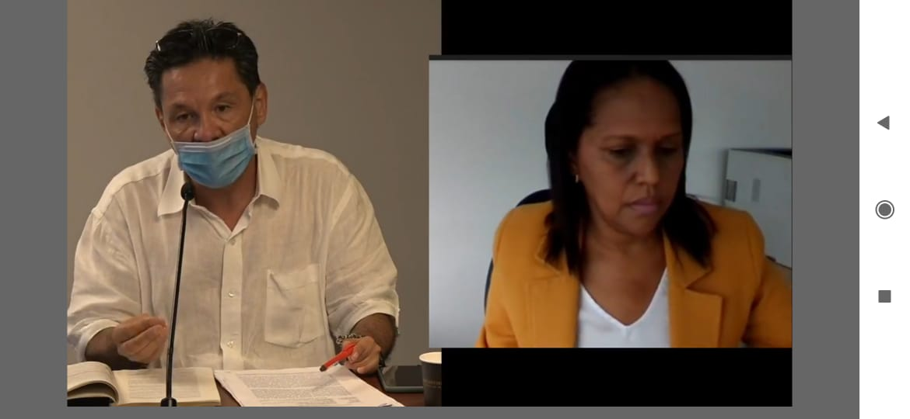

\[caption id="attachment\_13542" align="aligncenter" width="1170"\] La suerte de Dau se define en Enero. El 14 de enero se reanudará la audiencia. El 28 del mismo mes se conocerá su suerte. (A la derecha, la procuradora delegada Ligia Morales Amarís.  A la izquierda el abogado Gustavo Quintero Navas).\[/caption\] **En enero se define la suerte de Dau. De nuevo fue aplazada la audiencia disciplinaria contra Dau**. En una accidentada sesión, se fijó para el **14 de enero de 2021** su reanudación. Pero solo el 28 de enero se presentará la audiencia de decisión del fallo. En esta sesión se deberá definir si el alcalde de Cartagena, se va o se queda. El abogado del alcalde, **Gustavo Quintero Navas**, usó todos los recursos de ley para dilatar el proceso. Su verdadera intención era lograr que la audiencia se prolongara más allá de la terminación del período de **Fernando Carrillo Flórez**. Su defensa no fue técnica. Tampoco bien argumentada. Sin embargo, **a William Dau no lo salvaría ni Mandrake**. Todos los caminos de la audiencia conducen a un fallo adverso. Tanto que el abogado quedó sin argumentos jurídicos para pedir un fallo favorable.

## **«Gato patas arriba»**

El abogado hizo una defensa **_suigeneris_**. Como «gato patas arriba». Su actuación fue poco ortodoxa, desde el punto de vista jurídico. Así se lo hizo saber la propia Procuradora **Ligia Morales Amarís**, quien en la audiencia dijo:

> _«Debo velar que el procesado tenga una defensa técnica adecuada. En la solicitud de nulidad por falta de control de convencionalidad **usted no hizo una sustentación técnica ni tampoco la argumentó»**._

Ante esa advertencia, el abogado Quintero Navas, manifestó:

> _«Doctora, usted me ha afectado en mi integridad humana. Estoy francamente afectado. Le solicito que me pida disculpa_».

La procuradora Morales Amarís, ripostó:

> «_No le voy a pedir disculpa, porque realmente usted careció de sustentación jurídica y de argumentación en las solicitudes de nulidad que ha hecho en esta audiencia, por lo menos en la última nulidad presentada_».

## **La suerte de Dau**

**La suerte de Dau se prolongó.** Luego de que el abogado de Dau tomara la palabra y reiterara que se encontraba profundamente afectado —y de verdad que lo estaba— por las palabras de la procuradora, solicitó que **se archivara la diligencia**. La presidenta de la audiencia, luego de escuchar al abogado,  tomó la decisión de decretar el tercer receso de la sesión. Se pudo observar —en la transmisión de la Procuraduría— cómo el alcalde le cuchicheaba (le decía al oído) a su abogado. Acto seguido, la audiencia se reanudó después de las 6:00  de la tarde. La procuradora le solicitó al abogado que presentara la petición de su nuevo recurso. Ante eso el abogado Quintero Navas le pidió a la procuradora que recibiera las **pruebas testimoniales** de varias personas que vienen cuestionando a las directivas de la Universidad de Cartagena. Entre otros, el abogado solicitó que se escuchara a **Luther Larios Cardoz**o, representante de los egresados de la Universidad de Cartagena. También a **William Pére**z, presidente del Asociación de Profesores Universitarios—**ASPU**. Igualmente se citará a **Galo Torres** y a **Jackson Brochero**. Esa petición, si bien es «pataleo de ahogado», se le debe dar curso en un acto generoso de la procuradora con el procesado, **William Dau Chamat.** De esa manera, lleva el proceso a un extremo de las garantías procesales, tomando en cuenta la fundamentación de los derechos humanos.

## El 28 de enero, **la suerte de Dau**

La procuradora Morales Amarís fijó para el 5, 6 y 7 de enero las sesiones de la audiencia. Ante esto el abogado defensor manifestó que en esa semana estaría de vacaciones. Ante eso, la procuradora le propuso que fuera la semana subsiguiente. Entonces Morales le dijo que para los días 12, 13 y 14 de enero de 2021. Pero el jurista dijo que tenía la agenda ocupada. Ante eso la procuradora le presentó otras fechas: **14, 21 y 28 de enero**. Finalmente, las aceptó **La suerte del alcalde William Dau Chamat solo se definirá dentro de un mes**. Es decir, el 28 de enero, fecha en la cual se debe conocer el fallo. ¿En qué consistirá? Si la falta disciplinaria se califica como gravísima a título de dolo, por lo menos lo suspenderían un año de su cargo. Pero todo hace indicar que la suspensión sería de 3 meses, siempre y cuando la falta sea calificada como grave a título de dolo. **Conclusión. La agonía de Dau Chamat se prolongará**. La estrategia dilatoria del abogado defensor Gustavo Quintero surtió efecto. Si para eso fue contratado, **_El Tractor_** debe sentirse bien servido. Pero indudablemente, a la luz del derecho disciplinario fue una defensa débil y carente de argumentación. ¿Por qué? Objetivamente la situación de Dau Chamat es indefendible. **Todos los caminos conducen a una inevitable suspensión.**

#### Te puede interesar:

## [UdeC en pleno se levanta contra ataque injurioso del alcalde](/articulos/udec-en-pleno-se-levanta-contra-ataque-injurioso-del-alcalde/)