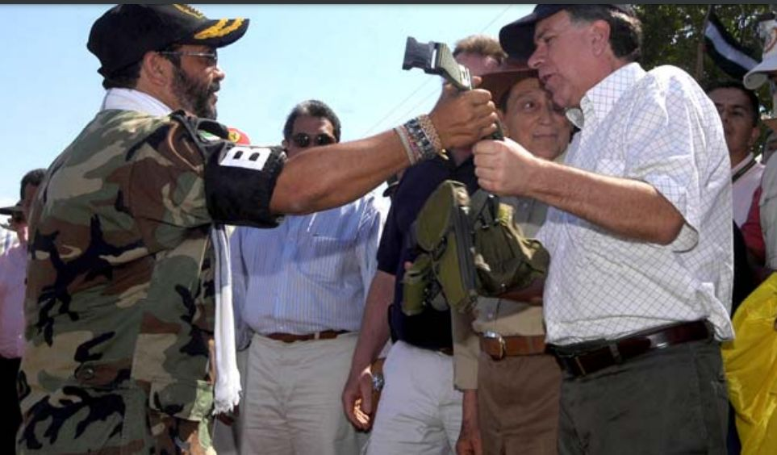
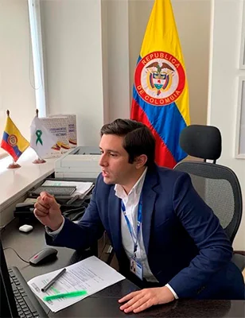
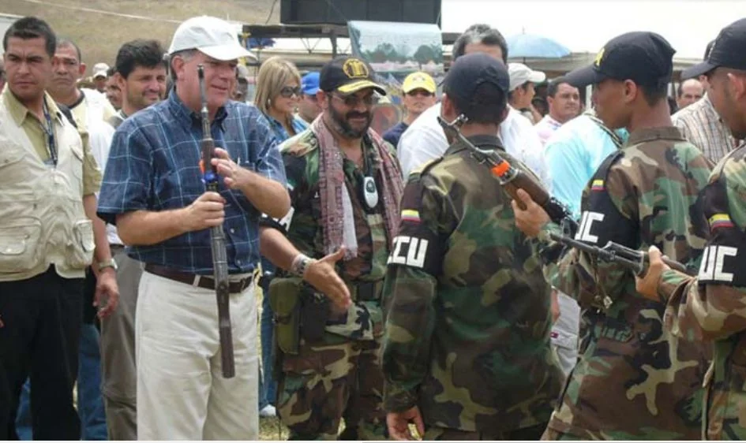
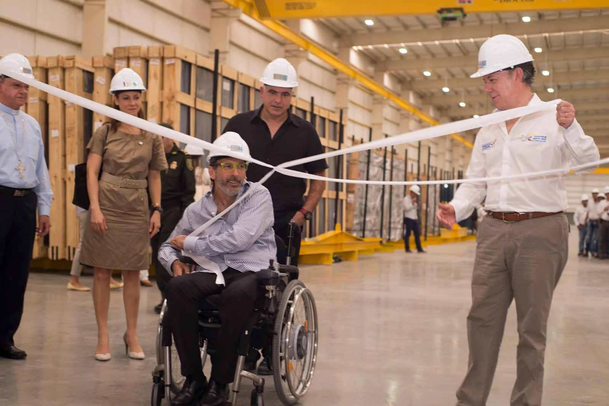

\[caption id="attachment\_13684" align="alignnone" width="963"\] Así como "Jorge 40" entregó su reata y su pistola (marzo 2004), debería entregar la verdad de la narcoeconomía. Le acompaña **Trino Luna**, el gobernador del Cesar **Hernando Molina Araújo**. Recibe la reata el Consejero de Paz, **Luis Carlos Restrepo**. Todos ellos procesados por la justicia.\[/caption\] El atentado a **José Manuel «Yuyo» Daes** y el asesinato de Eduardo José Losada Manotas, gerente de Datos y Sistemas  (2004) como del que lavaba el dinero en esa firma, son tres claves que explicarían el oscuro período del paramilitarismo. **Esto explicaría la segunda ola de la narcoeconomía barranquillera**. Más perversa y sangrienta que la primera ola. Es la economía que domina en la Región Caribe. Quien esto narra, es un sobreviviente de las órdenes de exterminio de **«Jorge 40».** No tengo espíritu de víctima**.** Tampoco resentimiento ni sed de venganza. Escribo desde el observador objetivo de la realidad para entender qué pasó y cómo enderezar el camino. El discurso de Estado y de los que resisten su poder está permeado de lo mismo. Lo que predican no lo practican. El mismo hecho de que el Estado nos encasille con la **etiqueta de «víctima»** y de que nos organizamos y actuamos como tal, indica que estamos sometidos por la misma lógica del victimizador. La sed de justicia se convierte en sed de venganza. ¿Cómo detener esta lógica viciosa? Es imprescindible observar los hechos sin ideologías y sin que nuestras emociones interfieran la observación. Solo así rompemos ese círculo vicioso que nos mantiene esclavos del dolor y del pasado. A la manera como nos enseñó el psiquiatra **Victor Frankl**, sobreviviente del holocausto nazi. Aunque su cuerpo exterior era sometido a la peor vejación, su cuerpo interior se proyectaba dictando clases ante numerosos estudiantes. Y eso fue lo que ocurrió una vez se recuperó del dolor. Sus escritos están libres de venganza y de otros sentimientos que contaminan el espíritu. Lejos de perseguir a sus victimarios, dedicó su tiempo a promover otra visión de la conducta humana basada en la proactividad.

## La «narcoeconomía»

\[caption id="attachment\_13686" align="aligncenter" width="308"\] Este es **Jorge Rodrigo Tovar, el hijo de Jorge 40** en su despacho de director de Víctimas de Minterior. Su bienestar se logró con la narcoeconomía. El delito de sangre no existe, pero el solo hecho de estar en el gobierno es la prueba de que su familia apetece el poder. ¿Para qué?\[/caption\] La dinámica actual de víctima—victimizador es un hecho que se prolonga más allá de la confrontación armada. La ejerce el mismo Estado con viejos o nuevos actores. Pero su rol es el mismo. Ello indica que quienes ejercen el poder actual son los que ayer capturaron al Estado para seguir la misma guerra, **pero en una prolongación política y económica**. El general **Carl Von Clausewitz** consideró que la guerra es un **«acto político»**. Pero en realidad es un **acto económico**. Los actores de la guerra en Colombia existen y se expanden por la economía del narcotráfico. Los actores armados —guerrilla o paramilitares y fuerzas militares— sirven para garantizar las fuentes económicas extractivistas o del narcotráfico. El control político obedece a un control de las economías. En mi libro _**¿Adiós a la guerra? Cinco claves para la paz**_ demuestro que los picos económicos coinciden con los picos de la violencia política en Colombia. En tanto que el surgimiento de las economías de enclave exacerbaron más la guerra. Vale decir, las zonas bananeras del Magdalena y Urabá. Fueron dos momentos de violencias soportadas por el país. El hecho de que el hijo de **«Jorge 40»** —Jorge Rodrigo Tovar Vélez— haya sido Coordinador del Grupo de Articulación Interna para la Política de Víctimas del Conflicto refleja el poder heredado de su padre. En tanto que la guerra como **«acto político» se convierte en un «acto económico» expresado en «botín de guerra».** En una sociedad vertical y jerarquizada como la nuestra, los poderes se heredan, incluso, el poder político. Ese **«acto político», que** el establecimiento lo disfraza como **«acto solidario y de reconciliación»** con las víctimas cuando éstas no tienen posibilidades de participar en la repartición de los beneficios de la nueva economía. Entonces, solo queda un **acto de reparación material y simbólica efímero**, el cual nos lo vende como una «reparación integral y de no repetición».

## La verdad de la «narcoeconomía»

\[caption id="attachment\_13685" align="aligncenter" width="945"\] El paramilitarismo fue un proyecto contrainsurgente sustentado por la narcoeconomía y la corrupción del Estado. **Esa es la gran verdad**. Lo demás son comentarios.\[/caption\] Sin embargo, para tener la plena garantía de la no repetición de esos hechos que destruyeron la felicidad de muchas personas y de una región pacífica, no se consigue con un mero acto político de reparación. Tampoco con los actos públicos de reconciliación de los actores armados condenados. Sean guerrilleros o paramilitares. Necesitamos saber la verdad de la participación de los actores económicos de la guerra. ¿Quienes dieron las órdenes? ¿**Dónde está invertido el «botín de guerra»?** ¿Quiénes se beneficiaron con los despojos y desplazamientos forzados? ¿Dónde están los capitales lavados? ¿Cuántas ventanillas siniestras abrió la banca comercial a lo largo de estos años de guerra? Si existen varias condenas para que los inversores antioqueños de **Argos** regresen las tierras despojadas a las víctimas de los Montes de María ¿por qué la restitución de tierra no ha sido efectiva? ¿Dónde están los grandes empresarios, contratistas del Estado y banqueros que lavaron los capitales de la guerra? ¿Por qué no han sido procesados? La respuestas a estas preguntas sería el comienzo para conocer la gran verdad. ¿Quién tiene esa verdad? ¿Las Fuerzas Militares? ¿Los presidentes? ¿Los jefes del paramilitarismo, el narcotráfico y de la guerrilla? ¿**«Jorge 40»? ¿Timochenko? ¿Mancuso? ¿Cuco Vanoy? ¿Gordo Lindo? ¿«Los Mellizos» Mejía Múnera? ¿Don Berna? Si son crímenes de Estado ¿cuál es el camino para conocer esa verdad?** El Estado y la sociedad deben prepararse para impulsar la verdad de la «narcoeconomía». En Barranquilla y en la Costa Caribe los empresarios que se beneficiaron con el narcotráfico y su relación con el Estado deben decir la verdad. En general, debe haber una confesión de parte de grandes grupos económicos del país. La JEP es una gran oportunidad para negociar y resolver sus cuentas con el pasado. Así como algunos grandes lavadores negociaron con la justicia de los Estados Unidos, de la misma manera se debe negociar con la justicia colombiana. Si la **Chiquita Brand** pagó a la justicia norteamericana, también debe reparar el daño causado al invertir en la financiación de los escuadrones de la muerte en Colombia.

## Matar al **«Yuyo»**

\[caption id="attachment\_5932" align="aligncenter" width="1600"\] "Yuyo" Daes, fue uno de los aliados de Juan Manuel Santos en la Costa Caribe. Y ahora de Iván Duque. Cortesía.\[/caption\] Matar a **José Manuel «Yuyo» Daes Abuchaibe** fue uno de los último grandes atentados ordenado por **«Jorge 40».** En marzo de 2004 Tovar Pupo ya se había desmovilizado en la zona rural de Chimila. Pero antes de confinarse en Santa Fe de Ralito, dentro del proceso de **Justicia y Paz,** **dejó organizada su estructura parapolítica.** Y desde allá la manejaba. En este proceso surgieron los verdaderos líderes políticos del paramilitarismo: **los condenados por la Corte Suprema de justicia.** El 26 de octubre de 2004 «Yuyo» sobrevivió milagrosamente al atentado criminal. Los dos sicarios lo dejaron mortalmente herido. **«El Sayayín»**, sicario de **«Jorge 40» le tiró directo a la cabeza, según contó.** Pero providencialmente la víctima se agachó y el tiro se alojó en la cervical. Quedó parapléjico. Pero vivió. Fue una acción sanguinaria de la locura de **Tovar Pupo.** Matar al **«Yuyo»** fue una decisión tomada desde Santa Fe de Ralito. Allí se encontraba confinado Tovar Pupo junto con los demás jefes paramilitares**.** Esa decisión fue una respuesta al atentado y muerte de su testaferro **Eduardo Losada Manotas**, representante legal de la empresa **Datos & Sistemas,** ocurrida en junio. ¿Quienes visitaron a **«Jorge 40»** en Ralito? Divulguen los acuerdos de esas visitas. Cuenten la historia. Respecto a las investigaciones sobre el atentado contra **«Yuyo»** Daes solo se vino a saber en el proceso de Justicia y Paz que fue orden de **«Jorge 40».**  Ricardo César Rodríguez Barros, alias «Palito» o **«El Sayayín»,** fue sentenciado cuando se sometió a Justicia y Paz junto con otros miembros de los escuadrones de la muerte de Rodrigo Tovar Pupo. Pero las razones del atentado contra Daes no están todavía explicadas. ¿Quién tiene esta verdad? **«Jorge 40» debe responder.**

## **La «narcoeconomía» y su aceptación social**

La guerra desatada por la muerte de Losada nos debe llevar a desenvolver los hilos de la verdad y descubrir **la clave de la «narcoeconomía»** de Barranquilla.  La misma sociedad barranquillera aceptó la economía del narcotráfico como algo normal. Quizás necesario. Los marimberos incentivaron artificialmente la economía en la década de los 70 y comienzo del 80. Ellos, hoy, son los reyes de la economía. La sociedad los aceptó, porque capturaron el Estado, la cultura, el periodismo y la educación. El periodismo fue su principal cómplice. Luego vino el dinero de la cocaína en la década de los 90 y los hijos de las élites barranquilleras se metieron en el negocio. El mismo esposo de la actual gobernadora del Atlántico, **Elsa Noguera de la Espriella** hizo parte de esa camada de narcos al servicio del Mellizo. (Lea: **El primer beso**). Losada Manotas fue un _traqueto_ de narco en los años 90. Pero se había legalizado junto con su dinero amasado en el inmediato pasado. Losada en el gobierno de Hoenigsber pasó a ser empresario. En realidad, era un testaferro del paramilitarismo y el narcotráfico. Y fue la conexión directa con **«Jorge 40».** Rodrigo Tovar Pupo le ganó la guerra a Hernán Giraldo en Santa Marta. En Barranquilla desplazó a las bandas armadas que dejó el narcotráfico. En 1999 dominaba el grupo de **Dino Meza**. Este individuo fue citado por los hombres del exmayor del ejército **José Pablo Díaz,** punta de lanza de **«Jorge 40».** Dino Meza terminó como alimento de los caimanes en el criadero de la finca Los Techos Rojos, de acuerdo a información policiva. En la segunda década de los 90, fue uno de los bandidos dueño de las calles de Barranquilla. Especialmente cuando el Mellizo salió de Barranquilla, según la misma policía.

## Losada, un narcoempresario

Para explicar un poco las razones de la guerra desatada con el asesinato de Losada, podemos citar como prueba la nota del archivo de El [Tiempo](/articulos/archivo/documento/MAM-2377829) de esa época cuando Losada Manotas fue capturado en la **Operación  Ciclón o Tormenta**. En aquella época la misma policía dijo que **Barranquilla era el epicentro financiero de algunos narcos del Valle del Cauca.** La operación de la Policía Nacional la hizo al mismo tiempo en el norte del Valle del Cauca, San Andrés, Medellín, el Eje Cafetero y la Costa Caribe. Se trataba de **«neutralizar la estructura financiera de la mafia y capturar a los principales cabecillas y testaferros»**:

> «_El oficial dijo que la captura se produjo en el marco de la Operación Ciclón , León Sánchez, dijo Montenegro, es conocido con el alias de El Angelito y Changue y tiene vigente una orden de captura por narcotráfico, expedida por la Fiscalía Regional de Barranquilla._ _Los otros capturados fueron identificados como Jairo García Lozano, Rafael Pérez Torres, **Eduardo José Losada Manotas** y Hugo Javier Castillo Guerrero, a quienes se les incautaron cuatro pistolas calibres 9 milímetros y 7.65, cuatro teléfonos celulares, un buscapersonas y un radio Handy»._

Para asegurarse de que Hoenisgberg cumpliera –dijo "Antonio"– el propio Losada puso como garantía un lote de 22 hectáreas, con un valor comercial de 10.000 millones de pesos, en la isla de la Loma 3 en Barranquilla, a orillas del río Magdalena. (Ver una de las sentencias: [Sentencia contra paramilitares).](/articulos/colombia/wp-content/uploads/2019-12-16-Ricardo-Cesar-Rodriguez.pdf) Según la Operación Tormenta o Ciclón, Barranquilla era el corazón financiero de esta poderosa red, que al parecer dirigía el hermano del representante legal de **Datos & Sistemas**, **Jorge Enrique Losada Manotas**, alias **«El Arquitecto»**. Estas eran las clases de socios que tuvo Hoenigsber. Así como él, muchos políticos y empresarios se asociaron con el poder económico corruptor. Con la muerte de Losada Manotas, Luis Humberto Silva Nupia, esposo de una prima de  «Jorge 40» asumió la asesoría de Métodos y Sistemas. Todo quedó en familia como el hecho de que su hijo Tovar Vélez asumiera la dirección de víctimas de Minterior. Esto le permitió tener información privilegiada de antiguos condenados a muerte por su padre . También tuviera influencia en el CRREM de la Unidad Nacional de Protección que define los esquemas de seguridad de los amenazados a muerte.

## ¿Vendettas de la narcoeconomía?

Las fuerzas de **«Jorge 40» se impusieron en forma sangrienta. Hernán Giraldo** debió negociar con el mismo Tovar Pupo. Por eso hay mucho temor en la región, ya que los dos están de retorno. Santa Marta fue sometida al rigor de esas vendettas. Dos sujetos que estuvieron bajo las órdenes de Giraldo, **Carlos Mario García**, alias de "El Médico" o "Gonzalo", y **José Gelves Albarracín**, alias ‘El Canoso’, se sometieron a **«Jorge 40».**  Fueron sus relacionistas políticos. Ellos fueron los que se encargaron de hacer los acuerdos políticos. De la misma manera, Tovar tenía empresarios para lavar el dinero del narcotráfico y la corrupción. **"El Médico" fue el responsable de hacer el acuerdo y llevarle la tula a Guillermo Hoenigsber.** El asesinato de Losada, (2004) desató una guerra a muerte entre Tovar Pupo (el **Cartel de la Costa**) y el **Cartel de Cali**. Cuando los sicarios procedentes del Valle del Cauca asesinaron a Losada, éste estaba acompañado de su socio David **Dame Therán**, gran contratista del Estado y tío del senador **Name Cardoso,** según información de prensa. De esa tormenta se originó el atentado criminal que casi le cuesta la vida a Daes, hermano del CEO de Tegnoglass, Cristian Daes. En febrero del 2001, la revista Cambio (antes de caer en manos de los Nule, socios de Alex Char) recogió testimonios que aseguraban que Daes era el alcalde real de la administración del padre Hoyos, porque pese a estar detenido en la Cárcel Modelo, investigado por supuestos nexos con el Cartel de Cali, era el que definía la contratación del Distrito. **«El botín de guerra»** de la narcoeconomía era la alcaldía de Barranquilla. Daes estaba bien posicionado como contratista. Incluso, más que los contratistas tradicionales de Barranquilla **Name, Gerleín, Vengal**, etc. Eran los empresarios que financiaban las campañas políticas. El caso de **Julio Gerleín** con relación a **Aida Merlano** es un botón de muestra. **Lo mismo podemos citar los grandes contratistas de Alex Char.** Pero es un tema que abordaremos próximamente. Diez meses antes de la vendetta, **Guillermo Hoenigsber Bornacelly**, le había recibido **$2.5 mil millones** a **«Jorge 40»** para financiar su campaña electoral. Con ese dinero, ganó la alcaldía. ¿Y cuál fue el precio?

## Ejecuciones extrajudiciales

Entre 1998 y 2006, en Barranquilla, se había impuesto de facto la **pena de muerte**. Un periodista capaz de decirle la verdad al establecimiento era condenado a la pena capital. Los jefes paramilitares eran los verdugos que el Estado tenía a su disposición. A finales de 1999 salí a las volandas de mi querida Barranquilla. En septiembre de ese año, hombres de Tovar Pupo y de las fuerzas militares asesinaron en Valledupar a nuestro amigo y colega **Guzmán Quintero Torres**. Unos días después, me encontré con el abogado **José Humberto Torres,** defensor de los derechos humanos. Me dijo:

> _«Estás en una lista. Allí están profesores, sindicalistas, periodistas y líderes sociales que la AUC condenó a muerte»_.

De inmediato le solicité a la Policía Nacional, a la Segunda Brigada y al Vicepresidente de la República **Gustavo Bell Lemus** protección de mi vida y garantías para ejercer el periodismo. Recuerdo que aproveché un evento para entregarle la carta al **vicepresidente Gustavo Bell Lemus**. Hice que me firmara la copia del recibido. Allí la tengo como prueba. Para ese entonces, ya había salido de Barranquilla. De la lista de sentenciados a muerte —donde los paramilitares me incluyeron— en el 2000 habían ejecutado casi a la mitad de líderes de diferentes sectores sociales. Extraoficialmente se sabía que esos asesinatos eran **crímenes de Estado**. Instituciones oficiales, especialmente organismos de inteligencia, estaban al servicio del paramilitarismo al final y comienzo del siglo. Cuando triunfó **Álvaro Uribe Vélez**, (2002) el presidente le entregó el DAS a **«Jorge 40».** La bancada política propuso a **Jorge Noguera Cote** como director. En el año de 2011, Noguera Cote fue sentenciado por ser el determinador del asesinato del profesor Alfredo Correa de Andreís. La Corte Suprema de Justicia halló penalmente responsable al ex funcionario por los delitos de homicidio, concierto para delinquir agravado, revelación de asuntos sometidos a reserva y falsedad por destrucción y ocultamiento. Él determinó el homicidio de Alfredo Correa. Fue ejecutado el 17 de septiembre de 2004 por los escuadrones de la muerte de Rodrigo Tovar Pupo. Recuerdo que unos días antes conversé con el profesor Correa en la sede la Defensoría del Pueblo de Bolívar. Y me contó sus temores. El proyecto político paramilitar era **«refundar al país»**, pero desde la perspectiva mezquina del clientelismo armado. Por eso buscaron aliados políticos ambiciosos, sin principios morales ni éticos, para expandirse por toda la región mediante el imperio del terror y la captura del poder formal del Estado por la vía electoral. De facto, ya ejercían un poder real.

## El precio que pagó Hoenigsber

No obstante, Hoenigsberg perdió todo. Perdió su tranquilidad, su familia, su felicidad y sus verdaderos amigos. Perdió su conciencia que es su esencia. La victoria de octubre de 2003 fue su derrota y la muerte de muchas personas. El pensar que los fines justifican los medios, es como concebir que la conciencia no está relacionada con cada una de las cosas que hacemos, por muy ínfimas que aparentan. Los tiempos de las luchas estudiantiles de la Universidad del Atlántico (UdeA) quedaron en el recuerdo de Hoenigsber. El paliar el hambre con los mangos biches que parían los árboles de la UdeA para seguir una jornada estudiantil que solo prometía sacrificios, quizás lo hizo que se torciera del camino. Era un camino de justicia y paz que pregonaba en sus discursos juveniles. El tiempo de escasez era motivo para aprovechar el **«cuarto de hora»** que se le presentó. Había que aprovechar su íntima amistad con el **padre Bernardo Hoyos Montoya**. Había que aprovechar todo. ¿Oportunismo? ¿Arribismo? ¿Los males del pequeño burgués? Que va. Lo importante era escalar en una competencia loca por ganar la bendición del padre Hoyos. Y se atragantó con el poder. ¿Cuál era la clave para ganarlo? Deponer sus ideales, principios y valores. Primero depuso esos principios personales para no contradecir al padre Bernardo. Hoenigsber sabía que, si hacía eso, lograba tener su bendición y podía ser alcalde. Si **Edgar George** lo hizo ¿por qué no yo? Pudo ser el razonamiento de Hoenigsber.

## Hoenigsber le vendió el alma al diablo

En el 2000, Guillermo Hoenigsber había conseguido la tan anhelada bendición del padre Hoyos para que lo candidatizara a la alcaldía. Siendo candidato, perdió las elecciones frente al neurólogo **Humberto Caiaffa**. Y vino la debacle. Su debacle interior. Y no lo entendió. La derrota se la atribuyó a cosas externas y no a su propia causa. En el 2004 no era un alcalde libre. Estaba domesticado por el poder y por el dinero podrido. (Lea la segunda entrega sobre este triste y significativo período de nuestra querida Barranquilla). Fue un alcalde esclavo de sus ambiciones personales. Las consecuencias del clientelismo armado de **Rodrigo Tovar Pupo —12 años después—** todavía pervive en la Región Caribe. Tenemos su herencia en el campo y en la ciudad. Los niveles de inseguridad ciudadana se mantienen. La violencia se recicla en cada período. Nuevos nombres reemplazan a los viejos. Y en estos 20 años de **_neobopartismo uribista_** la guerra sigue intacta. Nuevos actores. Viejos motivos. La guerra continúa. Y está condenada al fracaso. Como fracasó la guerra de Uribe contra las FARC.

En este eterno retorno, Rodrigo Tovar Pupo y Hernán Giraldo jugarán un papel muy importante para conocer la verdad. Sus muertos están allí. Pero también sus herederos. Ahora reciclados con nuevos tipos de violencia. ¿Pero el poder de Tovar Pupo se esfumó o lo ha mantenido en estos 12 años de ausencia? Si el hijo de Mancuso reclamó "la propiedad" de su padre a los testaferros que lo tenían, ¿qué hizo el hijo de  **«Jorge 40»? Tomar el botín de guerra como acto político. ¿**No ven que estamos en el régimen neobonapartista liderado por **Álvaro Uribe Vélez**?

El hijo de **«Jorge 40»** el haber sido director de Víctimas del Ministerio del Interior refleja la posición dominante del antiguo paramilitarismo en el régimen. ¿Qué pensarían sus defensores si ponen al hijo de Timochenco director de la Unidad Nacional de Protección (UNP)? ¿Reconciliación con los amenazados de muerte? Este informe periodístico no es para atizar el fogón. Tampoco echarle limón y sal a las heridas que siguen intactas. Se trata de precisar una ruta real para la reconciliación. Pero ésta es imposible de concebirse si el **régimen neobonapartista** que la concibió sigue intacto. Y para deshacer ese régimen debemos empezar por conocer la verdad de los determinadores de cada crimen de lesa humanidad. Especialmente de lo que financiaron y recibieron beneficios de las diferentes facciones armadas.

### Te puede interesar la serie del retorno de "Jorge 40"

*   [«Plan Caribe» de «Jorge 40», sangre y fuego en Barranquilla (III)](/articulos/sangre-y-fuego-en-barranquilla-el-plan-caribe-de-jorge-40/)
*   [Los Char, «Jorge 40» y la guerra que perdió Barranquilla (II)](/articulos/los-char-jorge-40-y-la-guerra-que-perdio-barranquilla/)
*   [El retorno de «Jorge 40», sus aliados y sus muertos (I)](/articulos/el-retorno-de-jorge-40-sus-aliados-y-sus-muertos/)