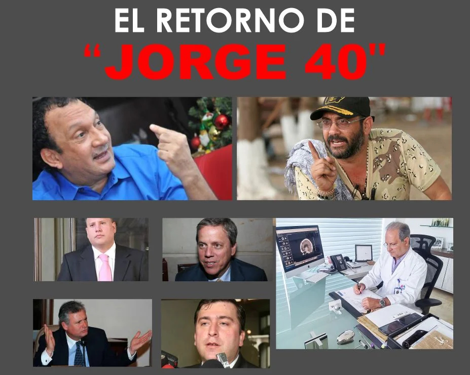
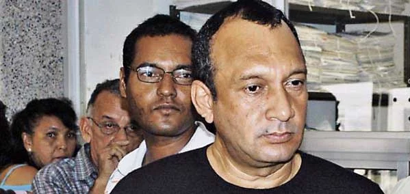

\[caption id="attachment\_13648" align="aligncenter" width="927"\]  **El retorno de «Jorge 40»**, sus aliados y sus muertos . Arriba Guillermo Hoenigsber, exalcalde de Barranquilla. Abajo, sus otros aliados: Jorge Luis Caballero Caballero, Dieb Nicolás Maloof Cuse (de bata blanca), Alfonso Antonio Campo Escobar y Mauricio Pimiento Barrera. (Laura Botet).\[/caption\] **«Jorge 40»** y sus 500 muertos hablan. **Rodrigo Tovar Pupo** está de regreso en Colombia. Pronto se le unirá **Hernán Giraldo Serna, el «Patrón»**. El eterno retorno. ¿Estamos condenados a repetir los mismos hechos en el tiempo extendido, el tiempo psicológico? ¿O será una segunda oportunidad para conocer la verdad? **«Jorge 40» y s****us 500 muertos** **de Barranquilla, Santa Marta y Valledupar** hablan por intermedio de sus familiares. Y surge la esperanza de conocer la verdad como condición de no repetición. De hecho, se espera que en **este año 2021 aflore la verdad** sobre el paramilitarismo y la parapolítica en la Región Caribe. ¿Por qué? **Álvaro Uribe (2008)** los extraditó a Estados Unidos con el fin de esconder gran parte de la verdad de su fenómeno. Por esta razón el regreso de los jefes extraditados descongelaría un proceso que —contrario a lo que esperaban los gestores de la desmovilización— estaba destapando a los determinadores de los crímenes del paramilitarismo.

## **¿Los crímenes de lesa humanidad?**

Con excepción de **Álvaro García Romero**, los congresistas y políticos condenados por la parapolítica tienen responsabilidad por un solo crimen: **concierto para delinqui**r. Los testimonios y pruebas de los jefes de los escuadrones de la muerte servirán para esclarecer masacres y homicidios selectivos. Si se logra comprobar su participación, muchos de los actuales congresistas deberán responder ante las autoridades correspondientes. Algunos regresarán a la cárcel y a otros se les desempolvará sus procesos. Así lo dejó claro la **Corte Suprema de Justicia (CSJ)** en las diferentes condenas de la parapolítica. Esa aclaración la hizo cuando los organismos de derechos humanos y la comunidad internacional pedían condena por los delitos cometido por los paramilitares. El país solo recibió los testimonios de los mandos medios de la autodenominada Autodefensas Unidas de Colombia, AUC. O sea, una verdad a medias. **Esto promete que 2021 y 2022 sean dos años decisivos para conocer la verdad de esa locura colectiva** que significó azuzar el paramilitarismo desde las grandes esferas del poder y de la economía nacional. Aunque el Estado colombiano olvidó a hombres y mujeres víctimas de los **escuadrones de la muerte**, la dinámica de los acontecimientos determinará la reanudación de un proceso que pondrá al descubierto a otros victimarios, especialmente a empresarios, comerciantes y políticos de la Región. Es un año para conocer la verdad de este genocidio que se produjo so pretexto de **acabar con la guerrilla, la extorsión y el secuestro**.

## La CSJ

En cuanto a los aliados de Jorge, en 2015 la Corte Suprema de Justicia hizo una aclaración de la sentencia condenatoria en su contra.

> “_Tras una pertinente e importante actividad de verificación, **no se hallaron pruebas concretas de la participación** de Jorge de Jesús Castro Pacheco, José Rosario Gamarra Sierra, Luis Eduardo Vives Lacouture, Salomón de Jesús Saade Abdala, Jorge Luis Caballero Caballero, Dieb Nicolás Maloof Cuse, Mauricio Pimiento Barrera y Alfonso Antonio Campo Escobar en **crímenes de lesa humanidad** o delitos contra la vida y la dignidad humana atribuidos al Bloque Norte de las AUC_»

Sin embargo, con el regreso de **Rodrigo Tovar Pupo y Hernán Giraldo Serna** se podrá establecer la verdad sobre la determinación de importantes **crímenes de lesa humanidad** cometidos por las autodefensas. ¿Quiénes determinaron esos crímenes? Los dos jefes paramilitares deberán aclarar esa verdad. Si consideran que algunos de sus aliados lo hicieron, éstos deberán responder a la justicia. Así lo indica la misma aclaración de la Corte Suprema de Justicia.

## El retorno de **«Jorge 40»**

Con el regreso de los jefes paramilitares —después de pagar sus respectivas condenas en Estados Unidos por narcotráfico— dos hechos relevantes se podrían desencadenar en este año pre—electoral. Por un lado, los jefes paramilitares deben confesar ante las autoridades judiciales sobre el apoyo financiero y logístico de grandes empresarios de la Región Caribe que se beneficiaron con su actuación criminal. Por otro lado, los políticos que ya se encuentran mencionados en los procesos de Justicia y Paz y, especialmente, en las sentencias condenatorias de los jefes de las autodefensas. En la Costa Caribe, se debe estar atento con las confesiones de **Rodrigo Tovar Pupo y Salvatore Mancuso** como máximos jefes regionales. En el Magdalena y La Guajira deben responder **Hernán Giraldo y Martín Peñaranda**, alias **El Burro**, del frente Resistencia Tayrona de las AUC. A Tovar Pupo le esperan muchos procesos judiciales por sus crímenes. Por ejemplo, las masacres de **Bahía Portete** (La Guajira) y **Sitio Nueve**, Magdalena. Esas masacres y asesinatos produjeron el desplazamiento forzado de la población. Según sentencias judiciales de la Corte Suprema de Justicia, tiene la responsabilidad del **desplazamiento de más de 700 mil personas.** Es así que en las sentencias de la parapolítica se encuentran sustentados esos crímenes.

## Hoenigsber y **«Jorge 40»**

\[caption id="attachment\_13651" align="aligncenter" width="599"\] **Guillermo Hoenigsberg, exalcalde de Barranquilla**, fue aliado del paramilitarismo. Antes de ser del Movimiento Ciudadano, fue líder del partido Comunista. **«Jorge 40» y «Don Berna»** lo confirman.\[/caption\] Este es un hecho que merece un libro. El exalcalde de Barranquilla, **Guillermo Hoenigsber Bornacelly**, será uno de los primeros que deberá responder por haberse aliado con **«Jorge 40».** Está documentado que recibió dinero del paramilitarismo y del narcotráfico para la financiación de su campaña electoral en 2003. En 2004 — en el primer año de gobierno de Hoenigsber— se desató una guerra a muerte entre **«Jorge 40» y el Cartel de Cali.** En esa guerra murieron varias personas. El muerto más sobresaliente fue **Eduardo Lozada Manotas**, narco y testaferro de **Rodrigo Tovar Pupo** y representante legal de **Métodos & Sistemas.** En tanto que una de las víctimas que sobrevivió a un atentado criminal, ordenado por Tovar Pupo, fue **José Manuel «Yuyo» Daes Abuchaibe,** primo de la ministra **Mintic Karen Abudinen Abuchaibe.** Veremos en la segunda entrega de este seriado detalles del atentado y de la guerra de los dos carteles que cobrará vigencia este año. En los primeros días de enero de 2007, el exalcalde de Barranquilla padre **Bernardo Hoyos Montoya** hizo una denuncia explosiva. Dijo haberse entrevistado con **Rodrigo Tovar Pupo** en **San José de Ralito** y éste le confesó que **le había entregado $2.5 mil millones para la elección de Guillermo Hoenigsberg.** Y le dio pruebas. La «vuelta» la hicieron a través Eduardo Lozada Manotas, quien finalmente fue asesinado en 2004, siendo representante legal de **Datos & Sistema** una firma contratista para gestionar los impuestos del Distrito de Barranquilla..

## La memoria colectiva

¿Se recordará la inconciencia colectiva de la década de los 90 y comienzo de la del 20 cuando los paramilitares exterminaban a quienes pretendían detenerlos o denunciarlos? El problema no es recordar. Es de memoria histórica. **Conocer la verdad como garantía de no repetición**. Aunque esto podría ser una falacia. Los que están en el poder son una prolongación del paramilitarismo de la primera generación que legalizaron sus capitales. Ahora pretenderán que todo quedo sepultado. Si bien, muchos de los crímenes del paramilitarismo se han esclarecido, existen otros que es urgente clarificar. Por ejemplo, los asesinatos de representantes de la comunidad académica de la **Universidad del Atlántico.** ¿Quiénes se beneficiaron con esos asesinatos? Se debe individualizar la responsabilidad de las masacres cometidas por las estructuras de **«Jorge 40»** ¿Qué responsabilidad  tienen los que se beneficiaron con ese proyecto paramilitar? Recordemos que muchas empresas se fortalecieron con la compra de tierra a bajo precio bajo el acoso paramilitar. Así sucedió en los Montes de María. El **Grupo Argos** compró grandes extensiones de tierra después de que los paramilitares ejecutaron sus delitos de lesa humanidad. Lo mismo sucedió en proyectos económicos que se asentaron en el **Puerto de Palermo**. La masacre de **Sitio Nuevo** y los muertos de Palermo demostrarían estos hechos. ¿A quiénes beneficiaron? ¿Quiénes están usufructuando esas iniciativas económicas?

## Legalización de capitales

Y el Estado olvida a esas víctimas. Los que capturaron el poder lo pusieron al servicio de la legalización de sus **capitales** **_malhabidos_**. ¿Quién puede negar que la actual administración de Barranquilla y el Atlántico no está al servicio de la legalización de los capitales de los supuestos victoriosos de la guerra paramilitar? ¿Acaso la misma gobernadora del Atlántico, **Elsa Noguera de la Espriella**, no está casada con un narco que pagó condena? Muchos parlamentarios (30%), gobernadores y alcaldes se pusieron al servicio del proyecto de las autodefensas. **Ese fue un proyecto mafioso triunfante**. Hicieron alianza con los carteles del narcotráfico. También se aliaron con  terratenientes, ganaderos, industriales y comerciantes que solo querían las tierras de sus víctimas para instalar ambiciosos proyectos maderables, mineros, aceite de palma, entre otros. Estos proyectos se consolidaron durante los ocho años de gobierno de Álvaro Uribe. En ese sentido, **«Jorge 40»** y sus 500 muertos retornan en la memoria colectiva de una región que había tenido un comportamiento pacífico a lo largo de 170 años. **La nueva colonización armada** que inició en la década del 80 la guerrilla de las Farc y el Eln en la Sierra Nevada, Serranía del Perijá y el sur de Bolívar se consolidó en la primera mitad de los 90s. La guerrilla se expandió por todo el territorio caribe. Fue una prolongación de la colonización armada realizada por las Farc en el sur de Colombia, luego de la **«Operación Marquetalia»**.

## La esperanza

Pero en medio de ese olvido, **surge la esperanza** de miles de víctimas de conocer quiénes dieron la orden de agonía. Sabemos —por los testimonios judiciales de sus lugartenientes— que fue **«Jorge 40» y sus esbirros** encargados de ejecutar cada orden. ¿Al servicio de quien estaba Tovar Pupo? ¿De sí mismo? ¿O representaba un conglomerado que se beneficiaba de cada muerte y de cada territorio capturado? No hay duda, **las élites de Barranquilla, Santa Marta, Riohacha y Valledupar** fueron las que realmente dieron la orden. Esa élite hoy es más rica que ayer. Determinaron y señalaron a quién exterminar. ¿Por qué ninguno de los miembros de esas élites esta siendo procesados por estos delitos? He aquí la razón de ser del gran temor que le tienen al tribunal Justicia Especial de Paz (JEP). Esas mismas élites triunfan en cada elección. De hecho, la «**Ñeñepolítica»** y el mismo escándalo de la condenada senadora **Aida Merlano,** muestran la miseria del quehacer político nacional**.** Son ejemplos dicientes donde se involucra la economía formal con las economías del bajo mundo. Una economía que se arropa con los detentadores del poder.

## ¿ Y la JEP?

¿Cuál sería el papel de la JEP con respecto a **«Jorge 40»**? Sin duda, la JEP lo llamaría no para procesarlo. Esperaría que declare y confiese la verdad de sus crímenes que involucran a terceros. Vale decir, políticos, empresarios y militares. En tanto que la JEP tiene como objetivo conocer delitos asociados a la guerra:

> _«Pueden ser graves violaciones a los derechos humanos, por ejemplo: el genocidio, la desaparición forzada, la tortura, las ejecuciones extrajudiciales y el desplazamiento forzado. Haya de 1899 y 1997, normas que comprenden al derecho internacional humanitario. Estas solo ocurren en el marco de un conflicto armado»._

Sin embargo, el testimonio de **«Jorge 40» es clave.** Los magistrados podrían hacerle una sola pregunta, según el caso. Por ejemplo:  **¿Quiénes son los financiadores, los que determinaron su entrada a Barranquilla en 1998?** Como suele suceder, aquí contó con el apoyo de industriales, grandes comerciantes, altos oficiales y líderes políticos que se sintieron amenazados por la actividad de la guerrilla. La lista debe ser grande. No olvidemos que **«Jorge 40»** mandó a comandar sus operaciones militares a un  exoficial de las fuerzas militares, **mayor José Pablo Diaz**. Este paramilitar fue asesinado en 2003 por las FARC en una emboscada cuando se dirigía a Ciénaga. Contó con el apoyo de todos los sectores, incluso del narcotráfico. Regresó **«Jorge 40»** y con él **la esperanza de encontrar la verdad** de los determinadores de sus crímenes. Es una segunda oportunidad de descubrir a los verdaderos causantes de esta tragedia. Álvaro Uribe la pretendió esconder. Pero la verdad florecerá. **Próxima entrega:** _La guerra que perdió Barranquilla. El atentado a "Yuyo" Daes Abuchaibe._ https://twitter.com/ComisionadoPaz/status/1310636858456637458?s=20 **Te puede interesar:**

### [¿Arturo Char tendría la misma suerte de Aída Merlano? (I)](/articulos/arturo-char-tendria-la-misma-suerte-de-aida-merlano-i/)

### [La cloaca del poder, Aida y un nuevo amanecer (I)](/articulos/la-cloaca-del-poder-aida-y-un-nuevo-amanecer/)

### [¿Caerá el imperio Char-Gerleín-«Yuyo» Daes con las confesiones de Aida Merlano? (I)](/articulos/caera-el-imperio-char-gerlein-yuyo-daes-con-las-confesiones-de-aida-merlano-i/)