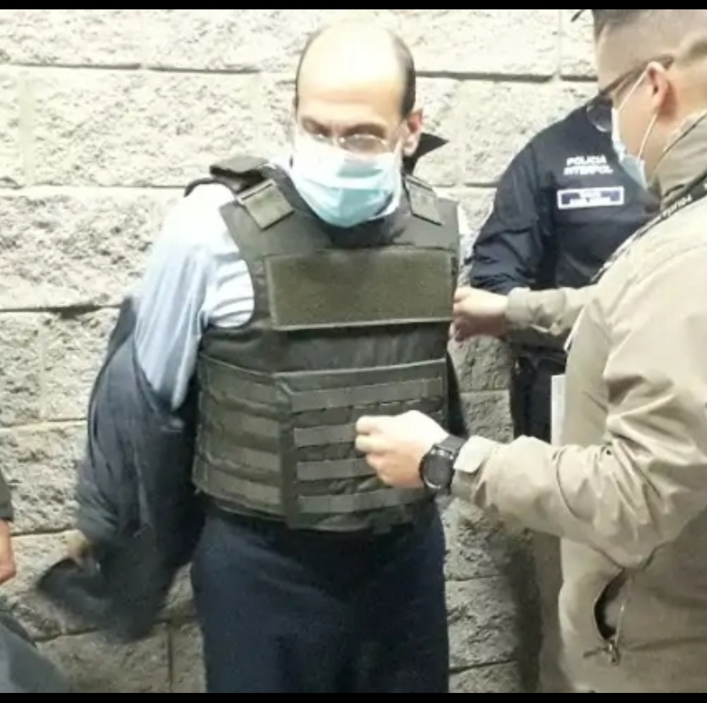

\[caption id="attachment\_13667" align="aligncenter" width="624"\] **«Plan Caribe» de «Jorge 40», Rodrigo Tovar Puppo**, de la alta sociedad de Valledupar. Antes de la guerra le decían el Papa, por ser mamador de gallo. Foto BBC.\[/caption\] ¿Sabías que en Barranquilla y Soledad el paramilitarismo tuvo **«casas de pique»** para desmembrar los cadáveres de sus victimas a fin de que la Policía Metropolitana no las incluyeran en sus estadísticas diarias? ¿Sabías que empresarios, autoridades civiles y militares lo sabían y callaban? ¿Eran cómplices? Así fue la «colonización armada» de Barranquilla por parte del paramilitarismo que llamó  **«Plan Caribe».** Sangre y fuego fueron los ingredientes del **«Plan Caribe». Carlos Mario García,** alias **«Gonzalo**», comandante político de los escuadrones de la muerte en Barranquilla, es un médico egresado de la **Universidad del Norte** y líder de las juventudes del que fuera senador **Dieb Maloof.** Aseguró en Justicia y Paz de que fue la persona que contactó a uno de los líderes financieros de la campaña a la alcaldía de **Guilllermo Hoenigsber**, **Eduardo Losada Manotas**, quien le dijo:

> «Médico, busque el respaldo de las autodefensas y nos ganamos de una vez esta Alcaldía (de Barranquilla)».

## La sangre que cubre a los nuevos ricos

Si. Con mucha sangre y fuego, crímenes de lesa humanidad, se consolidó el dominio político paramilitar en la Costa Caribe al tomarse a Barranquilla y el Atlántico. **«**El patrón**»** llegó (2002) con el triunfo del presidente **Álvaro Uribe Vélez**. Éste le puso orden y propuso su desmovilización. Ahora era el comandante en jefe de las Fuerzas Militares. No necesitaba a los escuadrones de la muerte para imponer su dominio en todo el país. El país era de ellos. En la región, las fuerzas de **Rodrigo Tovar Puppo**, alias **«Jorge 40»** dirigieron este plan de dominio político y económico que denominó **«Plan Caribe»**. Pero había un pequeño detalle. En el Atlántico y Bolívar ejercía su dominio la famosa empresaria **Enilse del Rosario López Romero, la popular Gata**. Barranquilla era la piedra filosofal. También el Cartel de la Costa y el Cartel de Cali tenían sus dominios. Los Char y sus aliados se movían en esas turbulentas aguas como peces. Eran como tiburones  dueños de Bocas de Cenizas. En ese bonche estaba Enilse López, un pez duro de pescar. Todos ellos tenían el poder de convertir los metales en oro y plata. **A Fuad Char le decían el «Rey Midas», porque todo lo que tocaba lo transformaba en oro**. El padre **Bernardo Hoyos Montoya** a veces estaba con los Char y otras veces los repudiaba. Su situación era incómoda, ya que tenía amigos que eran, a su vez, amigos de los Char. Por ejemplo, los Daes. Estos eran los que decidían los grandes negocios en la segunda administración del padre Hoyos.

## La conquista de Barranquilla y Soledad

Pero todo indica que los comandantes de los **escuadrones de la muerte** del Frente Norte no se pusieron de acuerdo o algunos de ellos rompieron el pacto inicial. De todas maneras, habían divido a la Costa Caribe en dos distritos. Desde La Guajira hasta Magdalena estaría dirigido por **Rodrigo Tovar Pupo**, alias **«Jorge 40»** y sus aliados**.** De Córdoba a Bolívar la dirección estaría a cargo de **Salvatore Mancuso Gómez**, alias **«Triple Cero»** y sus aliados. ¿Y Atlántico? Conquistar a Barranquilla era una tarea dura para Rodrigo Tovar Puppo. Pero dos meses antes de las elecciones a la alcaldía del 2003, le entregaron $2.5 miles de millones a Guillermo Hoenigsber. Con eso sellaron el acuerdo. Hoenigsber y Los pelícanos debían votar al senado por **Dieb Maloof** y **Mauricio Pimiento**, los candidatos de **«Jorge 40».** En tanto que en Soledad sucedía una situación particular. Rodrigo Tovar Puppo mandó a matar a **José Luis Castillo Bolívar** exdirigente de Ad-M19 y virtual alcalde de ese municipio que estaba en poder de la clase política tradicional. El 1 de octubre de 2003 lo asesinaron sicarios del paramilitarismo.  En ese tiempo el alcalde era **Alfredo Arrauth**, quien ya había hecho acuerdos con el paramilitarismo a cambio de que lo dejarán robar. Una semana después, la esposa del candidato asesinado, **Rosa stella Ibañez**, comenzó a levantar las banderas políticas de su esposo. Pero ella fue compelida **a reunirse con Edgar Ignacio Fierro**, comandante del frente **«José Pablo Díaz»**, en un apartamento que este tenía en El Rodadero de Santa Marta, según confirmó Fierro en una de sus comparecencias ante Justicia y Paz. Mucho después (2006), en ese mismo apartamento Fierro fue apresado por el CTI, después que su jefe se fue para Ralito. La pregunta ¿por qué antes no lo habían apresado si sabían que ese era el bunker de **«Jorge 40»** desde que se tomó a Santa Marta**?** Pero en cuanto a **Rosa Stella Ibañez,** en su comparecencia ante «Don Antonio», su novio Riveros le dijo a la Fiscalía que entró en shock. Pero simplemente buscaron atenuar su actuación ante la justicia**. Ibañez siguió el ejemplo de Hoenigsber.** Hizo acuerdo con los asesinos de su esposo que no cedió a las pretensiones de los «paracos» que ya tenían el poder político de Soledad. Así se cumplió la consabida amenaza de acordar con la viuda. **Edgar Antonio Fierro** dijo que ella se comprometió a entregarle la Secretaría de Salud, la ESE Hospital y todo el rubro asignado para la salud pública del municipio de Soledad. Y así se cumplió dicho acuerdo. Además los paramilitares tuvieron una significativa participación burocrática en ese gobierno.

## Los primeros condenados

Se demostró en los estrados judiciales que los alcaldes Arrauth e Ibáñez recibían coimas de los contratos de la salud manejados por los «paracos». Por ejemplo, en el computador de «Jorge 40» había una carpeta con la contratación de Soledad. **De un contrato de $3 mil millones, $300 millones era para Ibáñez, otros $300 millones para el contratista y $150 millones para los «paracos»**. Pero el objeto del contrato no se cumplía. Y no había organismo fiscalizador que pudiese detener estás prácticas corruptas. ¿Por qué? También estaban capturados por el clientelismo armado de los «paracos». Y, además, recibían lo suyo de la putrefacción pública. En consecuencia, la juez **Josefina Congote de Llanos**, condenó a **Rosa Estela Ibañez Alonso, al contratista Alfredo Noya Zabaleta** y al novio de la exalcaldesa, **Edgar Riveros Rey,** a 9 años más cinco meses de prisión. Le demostraron los delitos de contrato sin cumplimiento de requisitos legales, peculado por apropiación y concierto para **delinquir simple**. La juez también fue complaciente con la pena. La Corte Suprema de Justicia califico ese mismo delito de **concierto para delinquir agravado a los parapoliticos**. Así sucedió con Álvaro Araujo, Mauricio Pimiento, Dieb Maloof, Trino Luna y otros. Asimismo condenaron al contratista **Juan Carlos Méndez Gutiérrez** a ocho años de prisión y al exalcalde **Alfredo Arraut Varelo** a siete años y cinco meses por los delitos de peculado por apropiación y concierto para delinquir simple. Los «paracos» aplicaron el mismo esquema de **clientelismo armado en Barranquilla.** Hoenigsber tiene varios procesos penales vigentes por su concierto criminal. Como su gobierno se entregó al uribismo y al paramilitarismo, le ayudaron para dilatar esos procesos. Pero ninguno de los contratistas de Hoenigsber está condenado. El exgobernador del Atlántico **Espinosa Meola** hizo sus acuerdos con Enilse López. No se le siguió  ningún proceso por concierto para delinquir. En tanto que los comandantes paramilitares **dijeron que se reunieron con Fuad Char y Alex Char**, estos no fueron involucrados en ningún proceso por concierto para delinquir. Excepto, David Char. De hecho, Tovar Puppo podría referirse a los empresarios y a los exgobernadores y exalcaldes ante la JEP, ya que él sabe perfectamente quiénes **son los determinadores de los crímenes de lesa humanidad**. De Fierro para abajo, solo obedecían órdenes que venían de arriba.

## Antecedentes del **«Plan Caribe»**

\[caption id="attachment\_13670" align="aligncenter" width="1054"\] Así  lució Jorge 40 en su retorno, el paraco que ejecutó a sangre y fuego el «Plan Caribe»\[/caption\] En el 2000, **«Jorge 40»** y sus compinches ya habían consolidado su poder político y económico en La Guajira, Cesar y Magdalena. En 2003, aún con los cueros puestos, desalojó a la empresaria del chance **Enilse López Romero** de Santa Marta. López Romero, conocida como La Gata, debió ceder y retirarse al Atlántico y Bolívar. Salvatore Mancuso era su socio. Entre los dos jefes paramilitares hubo una guerra por sus posesiones. Con la elección de **Rodolfo Espinosa Meola** gobernador del Atlántico (1998 - 2000) creó la oportunidad para consolidar el poder político de Enilse López. Ella le ayudó a financiar su campaña. Espinosa le concedió el juego del chance como contraprestación. El locutor Ventura Diaz y el ingeniero Alex Char, quienes compartieron período en la gobernación, le mantuvieron su cuota en la gobernación. El poder de Enilse López era sobresaliente en el 2000. Tanto que en las elecciones presidenciales y a congreso del 2002 llevó candidatos y le hizo un aporte significativo a la campaña de Álvaro Uribe Vélez. El presidente dijo algo poco credible. Que solo recibió $100 millones de López. Este poder creó rivalidades con Rodrigo Tovar Pupo. Y las tensiones entre ellos produjo una estela de muertes en Santa Marta y Magdalena. Igualmente, en Barranquilla y el Atlántico.

## Matar al **«**Gatico**»**

Prueba de lo dicho sucedió un hecho que no trascendió a los medios. En el 2002 **«Jorge 40»** quiso matar al hijo mayor de Enilse López, **Jorge Luis Alfonso López**, quien se encontraba en Santa Marta. En uno de los tres encuentros que tuve con Alfonso López ante la Fiscalía de Sabanalarga, me dijo:

> _«Yo estaba dirigiendo los negocios de la familia en Santa Marta y Magdalena. Tuvimos problemas con Rodrigo Tovar Pupo. **Ordenó matarme**. Por eso mi mamá me propuso que me regresara a Magangué para hacerme elegir alcalde y salvar mi vida»._

En el 2003 Jorge Luis Alfonso fue elegido alcalde de Magangué con el apoyo de casi todos los sectores políticos tradicionales, excepto de los Arana y la izquierda. Desafortunadamente para Alfonso López y Magangué, no le fue bien en la alcaldía. Su propio ego lo llevó a cometer algunas irregularidades y crímenes, por los cuales está pagando una condena. Se le halló responsable por el homicidio de **Rafael Prins**, familiar de este periodista. Era un comunicador y líder comunitario que dirigía el periódico comunal **«**Apocalipsis**»**.

## El criminal **«Plan Caribe»**

En realidad, el **«Plan Caribe»** fue la toma del **botín de guerra** por parte de los paramilitares que habían llevado a la presidencia a una persona de sus entrañas. De hecho, nada de lo que hicieron los comandantes de las Autodefensas Unidas estuvo por fuera de decisiones estratégicas de sus líderes nacionales. Estos no actuaron como facilitadores, sino como determinadores de crímenes de lesa humanidad cometidos a lo largo y ancho del país. Por tanto, el **«Plan Caribe»** fue resultado de un **triunfo del paramilitarismo sobre la sociedad civil**. Porque su guerra fue contra la supuesta base social y política de la guerrilla. Todo lo que era diferente a los partidos tradicionales, olía a insurgencia. Debían ser asesinados o desplazados de los lugares estratégicos del poder político y económico. ¿Cómo se hizo realidad ese **«Plan Caribe»?** Lo fundamental era tomarse las ciudades capitales y las gobernaciones. En el Magdalena bastó convocar a todas las fuerzas políticas para que quedaran arrodilladas frente a **«Jorge 40»**. Y así se concretó el **Pacto de Chivolo** (2000 y 2001) y **Pacto de Pivijay** en 2003.

## El **«Plan Caribe» en Atlántico**

Para Rodrigo Tovar Pupo tomarse al Atlántico no era fácil. **El poder real de Enilse López se convertía en una muralla que podía impedir su penetración**. Pero eso no le importó al comandante paramilitar. **Le declaró la guerra**. El ataque fue por todos los flancos. Usó el poder nacional que tenía. Si bien López Romero y Salvatore Mancuso tenían influencia nacional y contaban con la amistad de Uribe Vélez, la fuerza política de Tovar Pupo era mayor. Tenía a los parlamentarios, ganaderos y narcos de La Guajira, Cesar y Magdalena La detención de López Romero (2006) por el **delito de lavado de activo y homicidio** fue resultado de sus disputas con Rodrigo Tovar Pupo. El poder del paramilitarismo no es monolítico. Ni siquiera la presidencia de Uribe podía detener las disputas que los diferentes jefes paramilitares tuvieron después de su desmovilización. Como la situación se le había salido de las manos y amenazaba su propia estabilidad, Uribe Vélez no vio otra salida que extraditar a los 13 excomandantes paramilitares que tienen gran parte de la verdad del genocidio paramilitar. Entre ellos Rodrigo Tovar Pupo. Cuando eso ocurrió (2008), Enilse López respiró un poco mejor. Ya tenía un enemigo menos. **En el Atlántico se tomaron la capital y el segundo municipio de ese departamento vía financiación de campañas electorales**. Barranquilla y Soledad pasaron a ser baluarte del paramilitarismo. Penetraron a la Fiscalía y a casi todos los organismos de control del departamento. Tenían en la nómina a altos oficiales del ejército y de la Policía nacional. Y todo con el apoyo de grandes empresarios. El recientemente fallecido, **Simón Char Abdala,** hermano de Fuad, fue en esa época de la Policía Cívica. Se sentaba con los comandantes de la Policía Nacional de Barranquilla en los consejos de seguridad. **Simón Char ayudó a maquillar las estadísticas de homicidios en la época sangrienta de Barranquilla.** El periodista **Helman Hincapié** reveló que las cifras publicadas eran el 50% de las reales. Por esta razón Simón Char ordenó el retiro del periodista de Emisora Atlántico. Así lo pudo establecer Hincapié, ya que el periodista **Jorge Cura** se lo había dicho**:**

> **«Simón Char pidió tu cabeza del noticiero».**

## Hoenigsber, puntal del **«Plan Caribe»**

**Guillermo Hoenigsberg** le abrió las puertas al paramilitarismo sangriento de **«Jorge 40»,** quien con sus 500 muertos ya era reconocido como un criminal de guerra. ¿Cómo un hombre de izquierda, líder del P**artido Comunista y de la UP**, cuyos compañeros fueron víctimas del genocidio, llegó a tan tamaño crimen político? Hoenigsber estaba cegado por su ego. Quería ser alcalde a toda costa. El precio, su propia alma. **José Gélvez Albarracín, «el Canoso»**, conocedor de los secretos de **Rodrigo Tovar Pupo y Hernán Giraldo**, en declaraciones a la Corte Suprema de Justicia, corroboró lo denunciado por el **padre Bernardo Hoyos**. Dijo que dos meses antes de las elecciones de octubre de 2003 le entregaron 1 millón de dólares a Hoenigsber:

> «_Como le faltaba dinero, a través de Eduardo Losada, dueño de la firma Métodos y Sistemas, le prestó un millón de dólares. Se fijaron **acuerdos del 5% de la contratación de los negocios grandes** como el Dagma (Departamento Administrativo de Gestión del Medio Ambiente_)»-

Fíjense bien. Un acuerdo económico para explotar las arcas del Distrito de Barranquilla. El paramilitarismo ejercía en ese momento su demencia colectiva en el departamento del Atlántico y Sitio Nuevo, Magdalena, colindando con los frentes **«William Rivas»** y **«Tomás Freyle Guillén»**. En Bolívar, inicialmente actuó con el **«Grupo de El Guamo»** y posteriormente con el Frente **«Héroes Canal del Dique»** del Bloque Montes de María.

## «Jorge 40» y «Simón Trinidad», dos caras de la misma moneda

En la estela de muerte que dejó el transitar criminal de Tovar Puppo se incluye el diseño y ejecución de masacres, torturas y homicidios selectivos. Masacres que fueron ejecutadas con la intención deliberada de provocar desplazamientos forzados. **Es el caso de los indígenas wayuú de Bahía Portete**. **Tovar Puppo, 70 años,** de la élite de Valledupar, multiplicó su poder violento en contraposición a su archirrival y jefe guerrillero **Juvenal Ovidio Ricardo Palmera Pineda alias «Simón Trinidad».** Los dos fueron exponentes de la degradación del ser humano. Uno era de extrema derecha. El otro de extrema izquierda. Dos caras de la misma moneda. La alta sociedad de Valledupar es muy especial. Su crecimiento económico está asociado a la delincuencia. Ayer fue el contrabando y la marimba. Luego vino el narcotráfico y el paramilitarismo. Hoy, esa economía se ha reciclado con la captura del Estado por parte de los grupos armados dominantes. **Su élite votó por Iván Duque, y de allá es el Ñeñe.** Esto explica que de esa misma sociedad putrefacta hayan nacido dos líderes de la alta criminalidad: **«Jorge 40» y «Simón Trinidad».** ¿Quién es más criminal? **Es una demencia colectiva** influida por grandes egos que, a su vez, son seguidos de pequeños egos individuales. Pequeños egos que se matriculan según su ideología o conveniencia. Los dos expandieron su locura colectiva por toda la Costa Caribe. Sus ideologías simplemente fueron pretextos para conseguir apoyo. Usaron los peores medios de la criminalidad humana para justificar supuestos fines altruistas o de seguridad. En realidad se mueven por el poder. Se incluye el control de la economía del bajo mundo y del narcotráfico. **Tovar Pupo no podía hacer nada distinto.** Fue fiel a la degradación de unas élites económicas y políticas que se enriquecieron con el contrabando a mediados del siglo XX. Y luego, cuando fue creado el departamento del César, asumieron el poder político heredado de las élites dominantes del liberalismo y el conservatismo. **La diferencia es que Tovar Puppo introdujo a sangre y fuego su clientelismo armado a través de su proyecto «Plan Caribe».** Barranquilla y Atlántico fueron unas de sus víctimas colectivas. ¿Pueden ser reparadas? **Próxima entrega**: **_El atentado a Yuyo Daes y la guerra de los carteles_**.

#### Te puede interesar

## [El retorno de «Jorge 40», sus aliados y sus muertos (I)](/articulos/el-retorno-de-jorge-40-sus-aliados-y-sus-muertos/ "El retorno de «Jorge 40», sus aliados y sus muertos (I)")

## [Los Char, «Jorge 40» y la guerra que perdió Barranquilla (II)](/articulos/los-char-jorge-40-y-la-guerra-que-perdio-barranquilla/ "Los Char, «Jorge 40» y la guerra que perdió Barranquilla (II)")