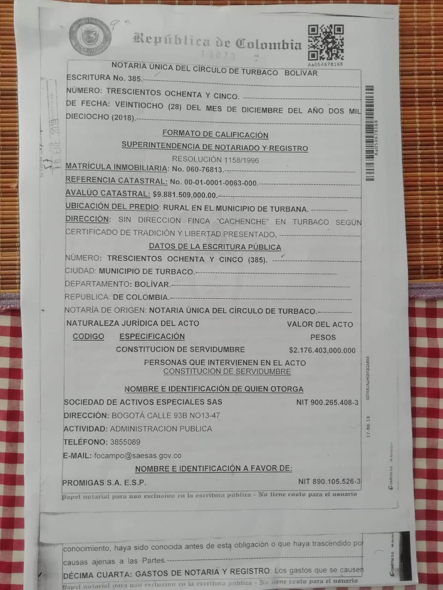

\[caption id="attachment\_13961" align="aligncenter" width="1080"\] **Eric Flesch,** presidente de Promigas. En el mismo año de su posesión, se firmó la escritura de la servidumbre por $2 mil millones con **errores garrafales**.\[/caption\] **Una servidumbre por $2 mil millones acordó la Sociedad de Activos Especiales SAE con Promigas** para enterrar un tubo de gas. En la escritura se habla de dos hectáreas de uso de la finca Cachenche (Turbana-Bolivar). Pero en realidad el tubo se extiende por casi toda la propiedad, de acuerdo con testimonios de los mismos campesinos. \[caption id="attachment\_13960" align="aligncenter" width="611"\] La escritura de la **servidumbre por $2 mil millones** firmada por Promigas y SAE **puede ser ilegal.**\[/caption\] Probablemente la concesión de la servidumbre a la empresa Promigas se hizo sin guardar los preceptos legales. El análisis de la escritura pública que surgió para sellar ese convenio así lo indica.

## Servidumbre por $2 mil millones

Esta servidumbre se plasmó en la **escritura 385 del 28 de diciembre 2018** en el numeral 5° aparece un área de 170 hectáreas +5.614 metros cuadrados. Pero la Oficina de Registro de Instrumentos Públicos devolvió el documento por cuanto halló una incongruencia en el área objeto dela servidumbre. Sin embargo, nuevamente cometieron otro error al citar la escritura **No 5210** por medio del cual dieron apertura al folio. Debieron tener en cuenta la **escritura No 792** del 9 de abril 2001, la cual declaraba la parte restante y la cabida y linderos actuales del predio, cuya número de **matrícula es 060-76823.** Dos años mas tarde realizaron una simple aclaratoria acogiéndose a lo que dice la **escritura No 5210**. Cometieron nuevamente el mismo error garrafal. Es decir, citaron la **escritura No 5210**. Pasaron dos años para solo decir —en una cláusula— que se subsana la nota devolutiva. Nota que,  entre otras cosas, debe decir que el tiempo estipulado para subsanar no es otro que **90 días**.

## Promigas enterró el tubo sin firmar

La servidumbre por $2 mil millones se ejecutó antes de que se corrigiera el error de la escritura No 385 de la Notaría Única de Turbaco del 28 de diciembre 2018. **La corrección** se hizo mediante **escritura No 3645 del 20 de octubre de 2020** en la Notaría Tercera de Barranquilla.  Aunque el registro de las dos escrituras solo se se hizo el 17 de diciembre de 2020. Aparecen en las anotaciones 18 y 19 de la matrícula 060-76823. Las obras se realizaron como si PROMIGAS S.A.E.S.P. fuera ya la propietaria del derecho de servidumbre. Esto es, enterraron el tubo sin que estuviera corregidas y registradas las escrituras. ¿Es una irregularidad? Y si se hubiese presentado un accidente, ¿quién hubiese sido el responsable? El predio está en administración de la SAE. Pero la entidad no es su propietaria, en tanto solo lo pueden hacer sus titulares. ¿La extinción de dominio le puede permitir a la SAE realizar estos tipos de transacciones que afecta la propiedad? Como se sabe, una servidumbre afecta al predio de una u otra forma. Limita la propiedad, especialmente cuando se trata de esta clase de tubos que transportan gas a determinadas partes. Por tanto, se puede establecer —que en la concesión de esta servidumbre por $2 mil millones a Promigas— es probable que se configuren varias irregularidades. Esto comprometería la transparencia a la que está obligada la SAE. El Estado debe responder por estos bienes que administra temporalmente hasta cuando se produzca la extinción de dominio. Pero también Promigas ESP está obligada con la transparencia de sus actos. **Te puede interesar**: [Defensoría del Pueblo coadyuva tutela de campesinos de Cachenche](/articulos/defensoria-del-pueblo-coadyuva-tutela-de-campesinos-de-cachenche/)

## [¿Para qué la SAE quiere a Cachenche? ¿Nueva Zona Franca?](/articulos/para-que-la-sae-quiere-a-cachenche-nueva-zona-franca/)